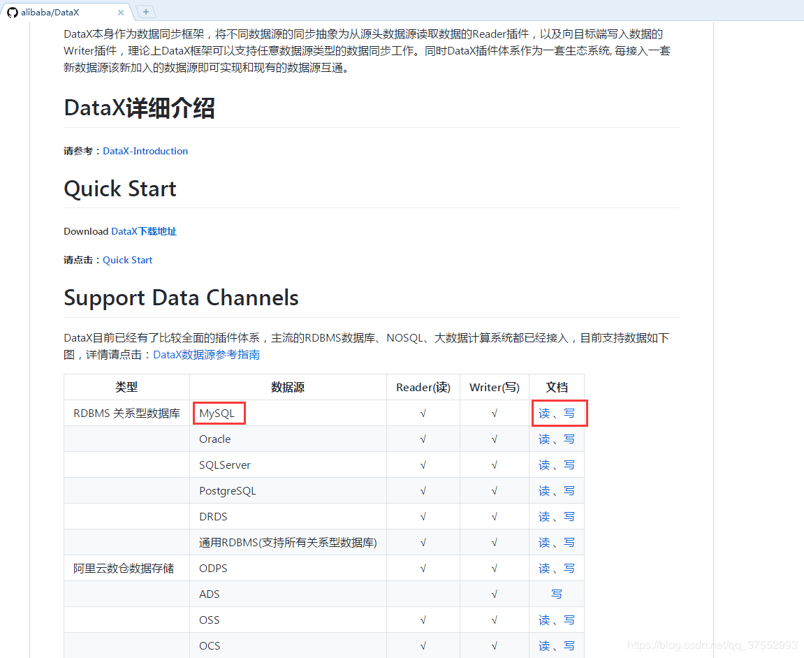

### 获取作业配置文件模板

- **通过命令行查看配置模板**

```sh
python datax.py -r {YOUR_READER} -w {YOUR_WRITER}
```

-  **通过 Github 获取配置模板**

Github 项目地址：<https://github.com/alibaba/DataX>



### 启动 DataX

启动命令：

```sh
python datax.py {配置文件}
```

