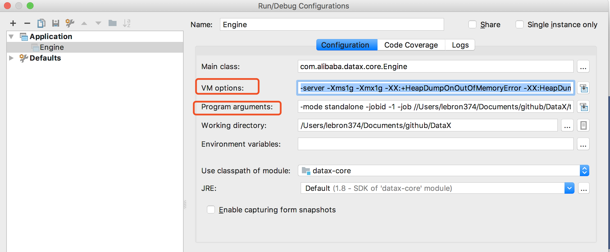

整个 Debug 过程的步骤如下：

1. Github 下载 DataX 源码并通过以下命令进行编译【注：如果遇到依赖包无法下载可以省去部分 writer 或 reader 插件，不影响 debug】
   1. 下载 DataX 源码：`git clone git@github.com:alibaba/DataX.git`
   2. 通过 maven 打包：`mvn -U clean package assembly:assembly -Dmaven.test.skip=true`
   3. 打包成功后的 DataX 包位于 `{DataX_source_code_home}/target/datax/datax`，结构如下：`bin     conf        job     lib     log     log_perf    plugin      script      tmp`


2. 由于 DataX 是通过 python 脚本进行启动的，所以在 python 脚本中把启动参数打印出来，获取启动命令参数

   ```python
   if __name__ == "__main__":
       printCopyright()
       parser = getOptionParser()
       options, args = parser.parse_args(sys.argv[1:])
       if options.reader is not None and options.writer is not None:
           generateJobConfigTemplate(options.reader,options.writer)
           sys.exit(RET_STATE['OK'])
       if len(args) != 1:
           parser.print_help()
           sys.exit(RET_STATE['FAIL'])
   
       startCommand = buildStartCommand(options, args)
       print startCommand
   
       child_process = subprocess.Popen(startCommand, shell=True)
       register_signal()
       (stdout, stderr) = child_process.communicate()
   
       sys.exit(child_process.returncode)
   ```

3. 获取启动 DataX 的启动命令

   ```sh
   java -server -Xms1g -Xmx1g -XX:+HeapDumpOnOutOfMemoryError
   
   -XX:HeapDumpPath=<设置堆栈日志的路径，如：//Users/lebron374/Documents/github/DataX/target/datax/datax/log>
   
   -Dloglevel=info -Dfile.encoding=UTF-8 
   -Dlogback.statusListenerClass=ch.qos.logback.core.status.NopStatusListener 
   # 这个参数不知道干啥的，省略也没什么问题
   -Djava.security.egd=file:///dev/urandom 
   -Ddatax.home=//Users/lebron374/Documents/github/DataX/target/datax/datax 
   -Dlogback.configurationFile=//Users/lebron374/Documents/github/DataX/target/datax/datax/conf/logback.xml 
   # windows 下多个环境用 ; 分割，Linux 下用 : 分割
   -classpath //Users/lebron374/Documents/github/DataX/target/datax/datax/lib/*;.
   -Dlog.file.name=s_datax_job_job_json 
   
   com.alibaba.datax.core.Engine 
   
   -mode standalone -jobid -1 
   -job //Users/lebron374/Documents/github/DataX/target/datax/datax/job/job.json
   ```

4. 配置 Idea 启动脚本

   

   ```
   =============================以下配置在VM options当中=======================================
   -server  -Xms1g -Xmx1g -XX:+HeapDumpOnOutOfMemoryError 
   -XX:HeapDumpPath=//Users/lebron374/Documents/github/DataX/target/datax/datax/log 
   -Dloglevel=info -Dfile.encoding=UTF-8 
   -Dlogback.statusListenerClass=ch.qos.logback.core.status.NopStatusListener 
   -Djava.security.egd=file:///dev/urandom -Ddatax.home=//Users/lebron374/Documents/github/DataX/target/datax/datax 
   -Dlogback.configurationFile=//Users/lebron374/Documents/github/DataX/target/datax/datax/conf/logback.xml 
   -classpath //Users/lebron374/Documents/github/DataX/target/datax/datax/lib/*:.
   -Dlog.file.name=s_datax_job_job_json 
   com.alibaba.datax.core.Engine 
   
   ==============================以下配置在Program arguments当中==================================
   -mode standalone -jobid -1 
   -job //Users/lebron374/Documents/github/DataX/target/datax/datax/job/job.json
   ```

   

