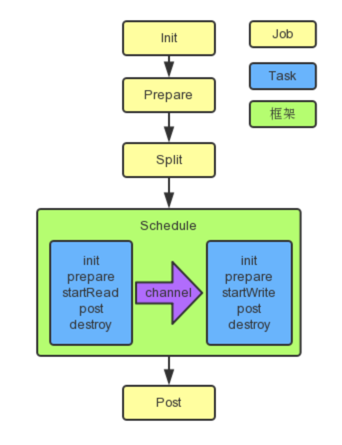

## 启动过程



**说明**:

上图中，黄色表示 `Job` 部分的执行阶段，蓝色表示 `Task` 部分的执行阶段，绿色表示框架执行阶段


DataX 的执行入口程序是 `com.alibaba.datax.core.Engine`，该程序位于 core 项目下。

Engine 类负责初始化 Job 或者 Task 的运行容器，并运行插件的 Job 或者 Task 逻辑。

根据 `core.container.model` 配置来初始化 container 的具体类型，实例化对应的 `JobContainer` 或 `TaskGroupContainer` ，启动对应的 `start()` 方法。

相关的精简代码如下：

```java
public static void main(String[] args) throws Exception {
    int exitCode = 0;
    Engine.entry(args);
    System.exit(exitCode);
}

public static void entry(final String[] args) throws Throwable {
    Options options = new Options();
    options.addOption("job", true, "Job config.");
    options.addOption("jobid", true, "Job unique id.");
    options.addOption("mode", true, "Job runtime mode.");

    BasicParser parser = new BasicParser();
    CommandLine cl = parser.parse(options, args);

    String jobPath = cl.getOptionValue("job");

    // 如果用户没有明确指定jobid, 则 datax.py 会指定 jobid 默认值为-1
    String jobIdString = cl.getOptionValue("jobid");
    RUNTIME_MODE = cl.getOptionValue("mode");

    Configuration configuration = ConfigParser.parse(jobPath);

    long jobId;
    if (!"-1".equalsIgnoreCase(jobIdString)) {
        jobId = Long.parseLong(jobIdString);
    } else {
        // only for dsc & ds & datax 3 update
        String dscJobUrlPatternString = "/instance/(\\d{1,})/config.xml";
        String dsJobUrlPatternString = "/inner/job/(\\d{1,})/config";
        String dsTaskGroupUrlPatternString = "/inner/job/(\\d{1,})/taskGroup/";
        List<String> patternStringList = Arrays.asList(dscJobUrlPatternString,
                                                       dsJobUrlPatternString, dsTaskGroupUrlPatternString);
        jobId = parseJobIdFromUrl(patternStringList, jobPath);
    }

    boolean isStandAloneMode = "standalone".equalsIgnoreCase(RUNTIME_MODE);
    if (!isStandAloneMode && jobId == -1) {
        // 如果不是 standalone 模式，那么 jobId 一定不能为-1
        throw DataXException.asDataXException(FrameworkErrorCode.CONFIG_ERROR, "非 standalone 模式必须在 URL 中提供有效的 jobId.");
    }
    configuration.set(CoreConstant.DATAX_CORE_CONTAINER_JOB_ID, jobId);

    //打印vmInfo
    VMInfo vmInfo = VMInfo.getVmInfo();
    if (vmInfo != null) {
        LOG.info(vmInfo.toString());
    }

    LOG.info("\n" + Engine.filterJobConfiguration(configuration) + "\n");

    LOG.debug(configuration.toJSON());

    ConfigurationValidate.doValidate(configuration);
    Engine engine = new Engine();
    engine.start(configuration);
}


/* check job model (job/task) first */
public void start(Configuration allConf) {

    // 绑定column转换信息
    ColumnCast.bind(allConf);

    /**
        * 初始化PluginLoader，可以获取各种插件配置
        */
    LoadUtil.bind(allConf);

    boolean isJob = !("taskGroup".equalsIgnoreCase(allConf
                                                   .getString(CoreConstant.DATAX_CORE_CONTAINER_MODEL)));
    //JobContainer会在schedule后再行进行设置和调整值
    int channelNumber =0;
    AbstractContainer container;
    long instanceId;
    int taskGroupId = -1;
    if (isJob) {
        allConf.set(CoreConstant.DATAX_CORE_CONTAINER_JOB_MODE, RUNTIME_MODE);
        container = new JobContainer(allConf);
        instanceId = allConf.getLong(
            CoreConstant.DATAX_CORE_CONTAINER_JOB_ID, 0);

    } else {
        container = new TaskGroupContainer(allConf);
        instanceId = allConf.getLong(
            CoreConstant.DATAX_CORE_CONTAINER_JOB_ID);
        taskGroupId = allConf.getInt(
            CoreConstant.DATAX_CORE_CONTAINER_TASKGROUP_ID);
        channelNumber = allConf.getInt(
            CoreConstant.DATAX_CORE_CONTAINER_TASKGROUP_CHANNEL);
    }

    //缺省打开perfTrace
    boolean traceEnable = allConf.getBool(CoreConstant.DATAX_CORE_CONTAINER_TRACE_ENABLE, true);
    boolean perfReportEnable = allConf.getBool(CoreConstant.DATAX_CORE_REPORT_DATAX_PERFLOG, true);

    //standlone模式的datax shell任务不进行汇报
    if(instanceId == -1){
        perfReportEnable = false;
    }

    int priority = 0;
    try {
        priority = Integer.parseInt(System.getenv("SKYNET_PRIORITY"));
    }catch (NumberFormatException e){
        LOG.warn("prioriy set to 0, because NumberFormatException, the value is: "+System.getProperty("PROIORY"));
    }

    Configuration jobInfoConfig = allConf.getConfiguration(CoreConstant.DATAX_JOB_JOBINFO);
    //初始化PerfTrace
    PerfTrace perfTrace = PerfTrace.getInstance(isJob, instanceId, taskGroupId, priority, traceEnable);
    perfTrace.setJobInfo(jobInfoConfig,perfReportEnable,channelNumber);
    container.start();
}
```


