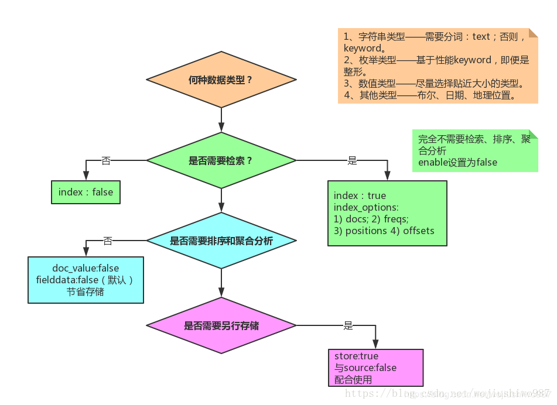

# Elasticsearch 映射的操作

Elasticsearch 中的映射（Mapping）是用来定义一个文档的，可以定义所包含的字段以及字段类型、分词器及属性等等。

映射可以分为动态映射和静态映射：

- 动态映射

  > Elasticsearch 中可以不事先定义映射（Mapping），文档写入 Elasticsearch 时，会根据文档字段自动识别类型，这种机制称之为动态映射

- 静态映射

  > Elasticsearch 中也可以事先定义好映射，包含文档的各个字段及其类型等，这种方式称之为静态映射

## 映射类型

### 字符串类型

#### keyword

`keyword` 用于索引结构化内容的字段。它们通常用于过滤，排序，和聚合。`keyword` 字段只能按其确切值进行搜索。

#### text

`text` 用于索引全文值的字段。这些字段是被分词的，它们通过分词器传递，以在被索引之前将字符串转换为单个术语的列表。分析过程允许 Elasticsearch 搜索单个单词中每个完整的文本字段。文本字段不用于排序，很少用于聚合。

### 整数类型

|  类型   |        取值范围         |
| :-----: | :---------------------: |
|  byte   |        $-128\sim127$         |
|  short  |      $-32768\sim32767$       |
| integer | $-2^{31}\sim2^{31}-1$ |
|  long   |       $-2^{63}\sim2^{63}-1$        |

> 在满足需求的情况下，尽可能选择范围小的数据类型。因为字段的长度越短，索引和搜索的效率越高。

### 浮点类型

|     类型     |          取值范围          |
| :----------: | :------------------------: |
|    doule     | 64位双精度IEEE 754浮点类型 |
|    float     | 32位单精度IEEE 754浮点类型 |
|  half_float  | 16位半精度IEEE 754浮点类型 |
| scaled_float |     缩放类型的的浮点数     |

### 逻辑类型

逻辑类型（布尔类型）可以接受 `true/false`、`"true"/"false"`

### 日期类型

日期类型表示格式可以是以下几种：

- 日期格式的字符串，比如"2020-05-22"或"2020-05-22 12：10：30"
- long类型的毫秒数( milliseconds-since-the-epoch，epoch就是指UNIX诞生的UTC时间1970年1月1日0时0分0秒)
- integer的秒数(seconds-since-the-epoch)

在 Elasticsearch 内部，日期类型会被转换为 UTC（如果指定了时区）并存储为 long 类型表示的毫秒时间戳。

日期类型可以使用 `format` 自定义，默认缺省值：`"strict_date_optional_time||epoch_millis"`，示例：

```json
{
    "field_date":{
        "type":"date",
        "format":"yyyy-MM-dd HH:mm:ss||yyyy-MM-dd||epoch_millis"
    }
}
```

`format` 不仅可以自定义日期格式，如 `yyyyMMdd`，也有很多内置类型，如下：

| 名称 | 格式 |
| --- | --- |
| epoch_millis | 时间戳（单位：毫秒） |
| epoch_second | 时间戳（单位：秒） |
| date\_optional\_time |  |
| basic_date | yyyyMMdd |
| basic\_date\_time | yyyyMMdd’T’HHmmss.SSSZ |
| basic\_date\_time\_no\_millis | yyyyMMdd’T’HHmmssZ |
| basic\_ordinal\_date | yyyyDDD |
| basic\_ordinal\_date_time | yyyyDDD’T’HHmmss.SSSZ |
| basic\_ordinal\_date\_time\_no_millis | yyyyDDD’T’HHmmssZ |
| basic_time | HHmmss.SSSZ |
| basic\_time\_no_millis | HHmmssZ |
| basic\_t\_time | ‘T’HHmmss.SSSZ |
| basic\_t\_time\_no\_millis | ‘T’HHmmssZ |

*上述名称加上 `strict_` 开头表示严格的日期格式，这意味着，年、月、日部分必须具有前置 0*。

**注**：如果新文档的字段的值与format里设置的类型不兼容，ES会返回失败。

### 范围类型

范围类型表示值是一个范围，而不是一个具体的值。

integer_range、float_range、long_range、double_range、date_range

### 二进制类型

二进制字段是指用 base64 来表示索引中存储的二进制数据，可用来存储二进制形式的数据，例如图像，音频，视频。

默认情况下，该类型的字段只存储不索引。

二进制类型只支持 index_name 属性。

### 数组类型

在 Elasticsearch 中，没有专门的数组（Array）数据类型，但是，在默认情况下，任意一个字段都可以包含零个或多个值，这意味着每个字段默认都是数组类型，只不过，数组类型的各个元素值的数据类型必须相同。在 Elasticsearch 中，数组是开箱即用的，不需要进行任何配置，就可以直接使用。

在同一个数组中，数组元素的数据类型是相同的，Elasticsearch 不支持元素为多个数据类型：`[10, "some string"]`，常用的数组类型是：

- 字符数组: `["one", "two"]`
- 整数数组: `"productid":[ 1, 2 ]`
- 对象（文档）数组: `"user":[ { "name": "Mary", "age": 12 }, { "name": "John", "age": 10 }]`，ElasticSearch内部把对象数组展开为 `{"user.name": ["Mary", "John"], "user.age": [12,10]}`

### 对象类型

JSON天生具有层级关系，文档会包含嵌套的对象

### 嵌套类型

nested 类型是一种对象类型的特殊版本，它允许索引对象数组，独立地索引每个对象。

### 地理位置类型

geo_point，geo_shape

### 专用类型

- **IP类型**

  > ip类型的字段用于存储IPv4或者IPv6的地址

- **completion类型**

  > 实现自动补全

- **token_count类型**

  > 记录分词数

- **attachment类型**

## 动态映射自动识别规则

Elasticsearch 通过 Json 文档的字段类型来实现自动识别字段类型，识别规则如下：

| JSON数据    | 自动推测的类型         |
| ----------- | ---------------------- |
| null        | 没有字段被添加         |
| true或false | boolean型              |
| 小数        | float型                |
| 数字        | long型                 |
| 日期        | date或text             |
| 字符串      | text                   |
| 数组        | 由数组第一个非空值决定 |
| JSON对象    | object类型             |

## Mapping 各字段的选型流程

> 不要使用默认的 Mapping，默认的 Mapping 的字段类型是系统自动识别的。根据业务需要选择合适的类型，有利于节省空间和提升精度。



## 实战示例

### 查看映射

```http
GET /<index_name>/_mapping
```

### 创建映射

```http
PUT /<index_name>
{
	"mappings":{
		"dynamic":false, //是否允许自动新增字段，默认是true
		"properties":{
			"title":{
				"type":"text"
			},
			"name":{
				"type":"keyword",
				"index":false
			},
			"field_copy_to":{
				"type":"text",
				"copy_to":"full_all"
			},
			"full_all":{
				"type":"text"
			}
			...
		}
	}
}
```

**`copy_to`参数说明**：

在6.0版本以后，`_all`字段被废弃了，推荐使用 `copy_to` 参数，该参数的作用是将字段的值复制到目标字段，实现类似 `_all` 的作用，不会出现在 `_source` 中，只能被用来搜索。

**`index`参数**

`index` 参数作用是控制当前字段是否被索引，默认为 true，false 表示不记录，也就是不可被搜索到。

注：若字段的映射的 `index` 参数被设置为 false，对该字段进行搜索的话，会返回报错信息。

### 更新映射

对于已经添加了的索引，可以使用 `/_mapping` 为已存在的索引增加映射。

**注**：尽管可以增加一个已存在的索引的字段映射，**但不能修改索引中已经存在的字段映射**。如果一个字段的映射已经存在，那么该字段的数据可能已经被索引，如果意图修改这个字段的映射，索引的数据可能会出错，不能被正常的搜索。

```http
PUT /<index_name>/_mapping/_doc
{
  "properties": {
    "id": {
      "type": "integer"
    },
    "content": {
      "type": "text"
    },
    "created": {
      "type": "date",
      "format": "strict_date_optional_time||epoch_millis"
    }
  }
}
```

