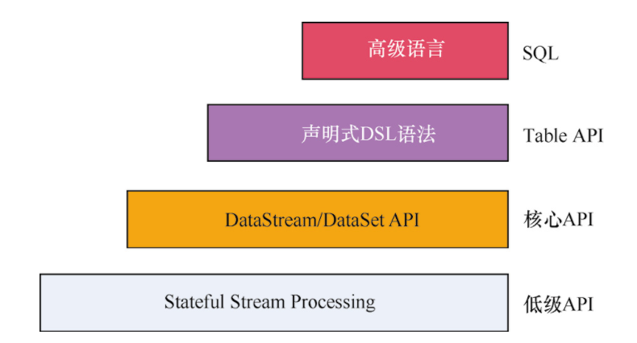

# Flink API

如上图所示，Flink 中提供了 4 种不同层次的 API，每种 API 在简洁和易用之间有自己的权衡，适用于不同的场景。目前其中的 3 种 API 用得比较多，下面自下向上介绍这 4 种 API。

- 低级 API：提供了对时间和状态的细粒度控制，简洁性和易用性较差，主要应用在对一些复杂事件的处理逻辑上。
- 核心 API：主要提供了针对流数据和离线数据的处理，对低级 API 进行了一些封装，提供了 filter、sum、max、min 等高级函数，简单且易用，所以在工作中应用比较广泛。
- Table API：一般与 DataSet 或者 DataStream 紧密关联，首先通过一个 DataSet 或 DataStream 创建出一个 Table；然后用类似于 filter、join 或者 select 关系型转化操作来转化为一个新的 Table 对象；最后将一个 Table 对象转回一个 DataSet 或 DataStream。与 SQL 不同的是，Table API 的查询不是一个指定的 SQL 字符串，而是调用指定的 API 方法。
- SQL：Flink 的 SQL 集成是基于 Apache Calcite 的，Apache Calcite 实现了标准的 SQL，使用起来比其他 API 更加灵活，因为可以直接使用 SQL 语句。Table API 和 SQL 可以很容易地结合在一块使用，它们都返回 Table 对象。

