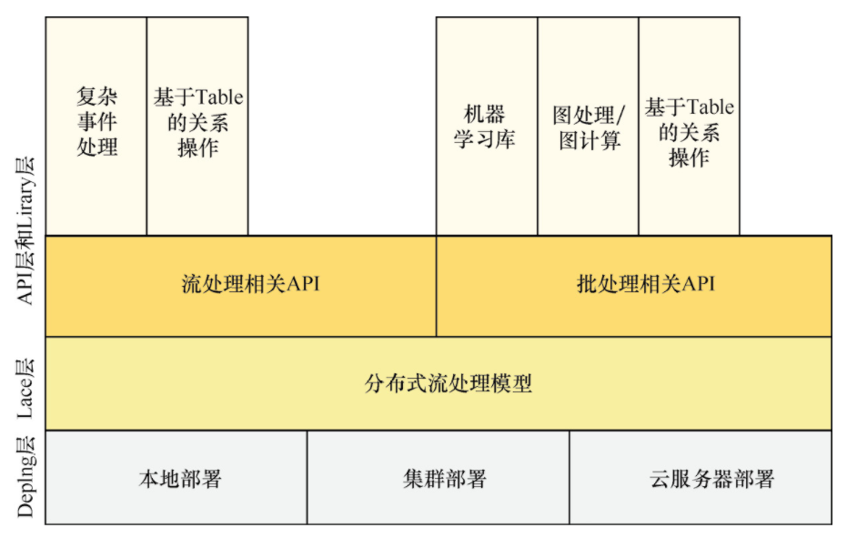
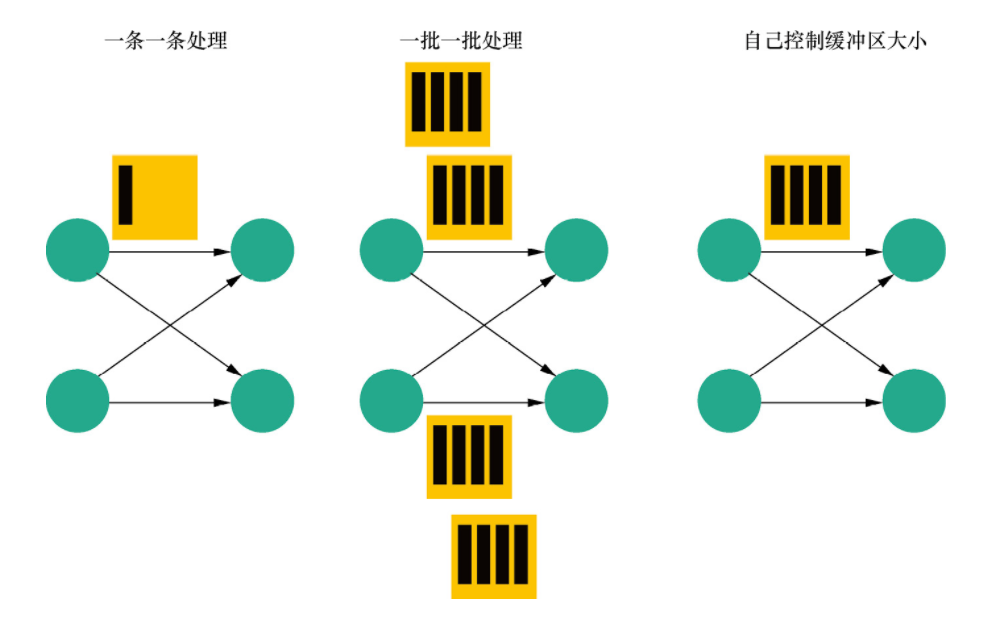
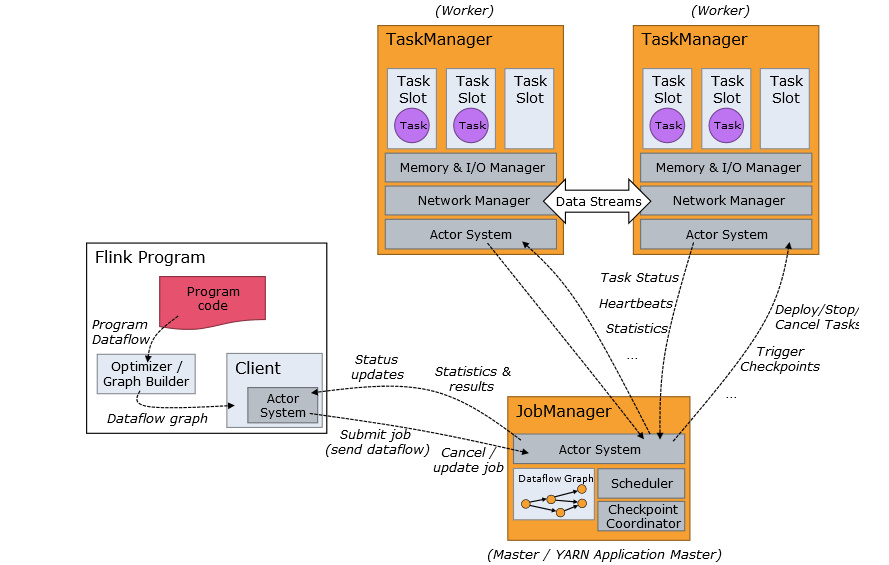

# Flink

> Flink 项目的理念：
> 
> Apache Flink 是为分布式、高性能、随时可用以及准确的流处理应用程序打造的开源流处理框架。

Flink 不仅能提供同时支持高吞吐和 exactly-once 语义的实时计算，还能提供批量数据处理。

## 架构模型



由上图可知，Flink 架构可以分为 4 层，包括 Deploy 层、Core 层、API 层和 Library 层。

- Deploy 层：该层主要涉及 Flink 的部署模式，Flink 支持多种部署模式——本地、集群（Standalone/YARN）和云服务器（GCE/EC2）。
- Core 层：该层提供了支持 Flink 计算的全部核心实现，为 API 层提供基础服务。
- API 层：该层主要实现了面向无界 Stream 的流处理和面向 Batch 的批处理 API，其中流处理对应 DataStream API，批处理对应 DataSet API。
- Library 层：该层也被称为 Flink 应用框架层，根据 API 层的划分，在 API 层之上构建的满足特定应用的实现计算框架，也分别对应于面向流处理和面向批处理两类。面向流处理支持 CEP（复杂事件处理）、基于 SQL-like 的操作（基于 Table 的关系操作）；面向批处理支持 FlinkML（机器学习库）、Gelly（图处理）、Table 操作。

## 基本编程模型


上图是来自 Flink 官网的运行流程图，由上图可知，一个 Flink Job 需要如下 3 个部分组成：

```
Flink Job = Source + Transformation + Sink
```

- Source：表示数据源组件，主要用来接收数据，目前官网提供了 readTextFile、socketTextStream、fromCollection 以及一些第三方的 Source。
- Transformation：表示算子，主要用来对数据进行处理，比如 Map、FlatMap、Filter、Reduce、Aggregation 等。
- Sink：表示输出组件，主要用来把计算的结果输出到其他存储介质中，比如 writeAsText 以及 Kafka、Redis、Elasticsearch 等第三方 Sink 组件。

## 流处理与批处理模型

通过灵活的执行引擎，Flink 能够同时支持批处理任务与流处理任务。在执行引擎层级，流处理系统与批处理系统最大的不同在于节点间的数据传输方式。



如上图所示，对于一个流处理系统，其节点间数据传输的标准模型是，在处理完成一条数据后，将其序列化到缓存中，并立刻通过网络传输到下一个节点，由下一个节点继续处理。而对于一个批处理系统，其节点间数据传输的标准模型是，在处理完成一条数据后，将其序列化到缓存中，当缓存写满时，就持久化到本地硬盘上；在所有数据都被处理完成后，才开始将其通过网络传输到下一个节点。

这两种数据传输模式是两个极端，对应的是流处理系统对低延迟和批处理系统对高吞吐的要求。Flink 的执行引擎采用了一种十分灵活的方式，同时支持了这两种数据传输模型。

Flink 以固定的缓存块为单位进行网络数据传输，用户可以通过设置缓存块超时值指定缓存块的传输时机。如果缓存块的超时值为 0，则 Flink 的数据传输方式类似于前面所提到的流处理系统的标准模型，此时系统可以获得最低的处理延迟；如果缓存块的超时值为无限大，则 Flink 的数据传输方式类似于前面所提到的批处理系统的标准模型，此时系统可以获得最高的吞吐量。

缓存块的超时值也可以设置为 0 到无限大之间的任意值，缓存块的超时阈值越小，Flink 流处理执行引擎的数据处理延迟就越低，但吞吐量也会降低，反之亦然。通过调整缓存块的超时阈值，用户可根据需求灵活地权衡系统延迟和吞吐量。

## 作业提交架构流程



Program Code：用户编写的 Flink 应用程序代码

Client：Client 是 Flink 程序提交的客户端，当用户提交一个 Flink 程序时，会首先创建一个 Client，该 Client 首先会对用户提交的 Flink 程序进行预处理，并提交到 Flink 集群中处理，所以 Client 需要从用户提交的 Flink 程序配置中获取 JobManager 的地址，并建立到 JobManager 的连接，将 Flink Job 提交给 JobManager。

JobManager：主进程（也称为作业管理器）协调和管理程序的执行。 它的主要职责包括安排任务，管理 Checkpoint ，故障恢复等。机器集群中至少要有一个 master，master 负责调度 task，协调 Checkpoints 和容灾，高可用设置的话可以有多个 master，但要保证一个是 leader, 其他是 standby; JobManager 包含 Actor system、Scheduler、Check pointing 三个重要的组件

TaskManager：从 JobManager 处接收需要部署的 Task。TaskManager 是在 JVM 中的一个或多个线程中执行任务的工作节点。任务执行的并行性由每个 TaskManager 上可用的任务槽决定。 每个任务代表分配给任务槽的一组资源。 例如，如果 TaskManager 有四个插槽，那么它将为每个插槽分配 25％ 的内存。 可以在任务槽中运行一个或多个线程。 同一插槽中的线程共享相同的 JVM。 同一 JVM 中的任务共享 TCP 连接和心跳消息。TaskManager 的一个 Slot 代表一个可用线程，该线程具有固定的内存，注意 Slot 只对内存隔离，没有对 CPU 隔离。默认情况下，Flink 允许子任务共享 Slot，即使它们是不同 task 的 subtask，只要它们来自相同的 job。这种共享可以有更好的资源利用率。
