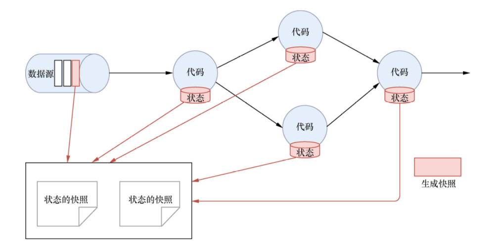
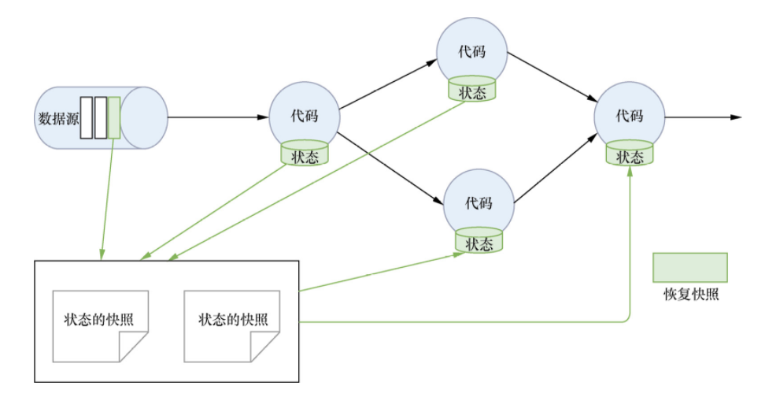

# State

只有在每一个单独的事件上进行转换操作的应用才不需要状态，换言之，每一个具有一定复杂度的流处理应用都是有状态的。任何运行基本业务逻辑的流处理应用都需要在一定时间内存储所接收的事件或中间结果，以供后续的某个时间点（例如收到下一个事件或者经过一段特定时间）进行访问并进行后续处理。


应用状态是 Flink 中的一等公民，Flink 提供了许多状态管理相关的特性支持，其中包括：

- 多种状态基础类型：Flink 为多种不同的数据结构提供了相对应的状态基础类型，例如原子值（value），列表（list）以及映射（map）。开发者可以基于处理函数对状态的访问方式，选择最高效、最适合的状态基础类型。
- 插件化的State Backend：State Backend 负责管理应用程序状态，并在需要的时候进行 checkpoint。Flink 支持多种 state backend，可以将状态存在内存或者 RocksDB。RocksDB 是一种高效的嵌入式、持久化键值存储引擎。Flink 也支持插件式的自定义 state backend 进行状态存储。
- 精确一次语义：Flink 的 checkpoint 和故障恢复算法保证了故障发生后应用状态的一致性。因此，Flink 能够在应用程序发生故障时，对应用程序透明，不造成正确性的影响。
- 超大数据量状态：Flink 能够利用其异步以及增量式的 checkpoint 算法，存储数 TB 级别的应用状态。
- 可弹性伸缩的应用：Flink 能够通过在更多或更少的工作节点上对状态进行重新分布，支持有状态应用的分布式的横向伸缩。
时间

## 状态类型

在 Flink 中根据数据集是否根据 Key 进行分区，将状态分为 Keyed State 和 Operator State（Non-keyed State）两种类型。

State可以被记录，在失败的情况下数据还可以恢复。Flink中有以下两种基本类型的State：

- Keyed State
- Operator State

Keyed State和Operator State以两种形式存在：

- 原始状态（Raw State）：由用户自行管理状态具体的数据结构，框架在做CheckPoint的时候，使用byte[]读写状态内容，对其内部数据结构一无所知。
- 托管状态（Managed State）：由Flink框架管理的状态。

通常在DataStream上推荐使用托管状态，当实现一个用户自定义的Operator时使用到原始状态。

## Keyed State

Keyed State，顾名思义就是基于 KeyedStream 上的状态，这个状态是跟特定的 Key 绑定的。KeyedStream 流上的每一个 Key，都对应一个 State。

`dss.keyBy(……)` 这个代码会返回一个 KeyedStream 对象。

Flink 针对 Keyed State 提供了以下可以保存 State 的数据结构。

- `ValueState<T>`：类型为 T 的单值状态，这个状态与对应的 Key 绑定，是最简单的状态。它可以通过 update 方法更新状态值，通过 `value()` 方法获取状态值。
- `ListState<T>`：Key 上的状态值为一个列表，这个列表可以通过 add 方法往列表中附加值，也可以通过 `get()` 方法返回一个 `Iterable<T>` 来遍历状态值。
- `ReducingState<T>`：每次调用 add 方法添加值的时候，会调用用户传入的 reduceFunction，最后合并到一个单一的状态值。
- `MapState<UK, UV>`：状态值为一个 Map，用户通过 put 或 putAll 方法添加元素。

需要注意的是，以上所述的 State 对象，仅仅用于与状态进行交互（更新、删除、清空等），而真正的状态值有可能存在于内存、磁盘或者其他分布式存储系统中，相当于我们只是持有了这个状态的句柄。

## Operator State

Operator State 与 Key 无关，而是与 Operator 绑定，整个 Operator 只对应一个 State。

Flink 针对 Operator State 提供了以下可以保存 State 的数据结构。

```java
ListState<T>
```

## 容错

当程序出现问题需要恢复Sate数据的时候，只有程序提供支持才可以实现State的容错。

State的容错需要依靠CheckPoint机制，这样才可以保证Exactly-once这种语义，但是注意，它只能保证Flink系统内的Exactly-once，比如Flink内置支持的算子。

针对Source和Sink组件，如果想要保证Exactly-once的话，则这些组件本身应支持这种语义。

**State容错中的CheckPoint机制**

*生成快照*

Flink通过CheckPoint机制可以实现对Source中的数据和Task中的State数据进行存储。如下图所示：



*恢复快照*

Flink还可以通过Restore机制来恢复之前CheckPoint快照中保存的Source数据和Task中的State数据。如下图所示：

