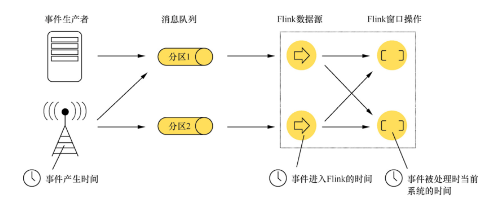
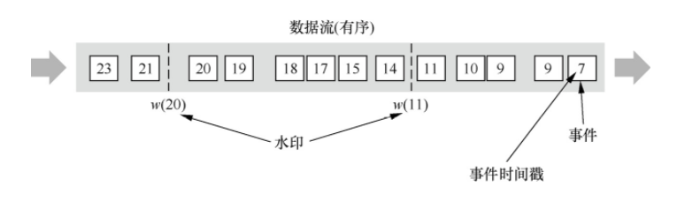
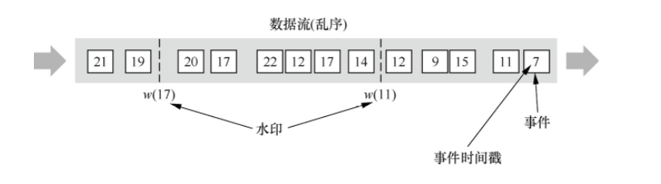
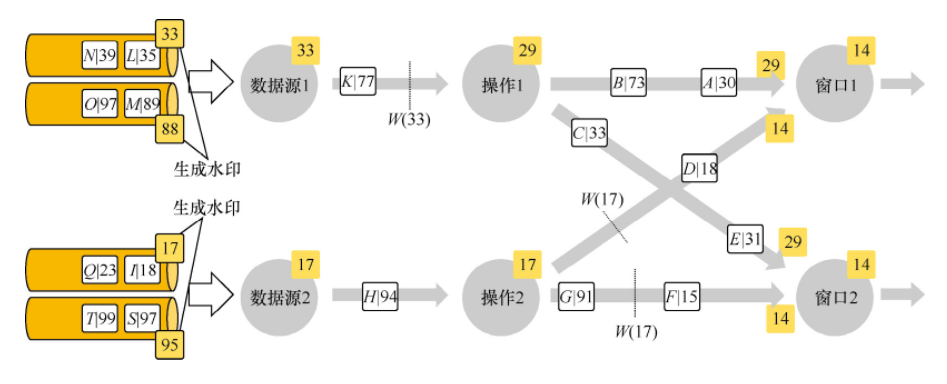

# Time

Flink 在流程序中支持不同的 Time 概念，有如下 3 种：

- Event Time：事件产生的时间，它通常由事件中的时间戳描述
- Ingestion Time：事件进入 Flink 的时间
- Processing Time：事件被处理时当前系统的时间

这几种时间的对应关系如下图所示：



## Event Time

Event Time 是事件发生的时间，一般就是数据本身携带的时间。这个时间通常是在事件到达 Flink 之前就确定的，并且可以从每个事件中获取到事件时间戳。在 Event Time 中，时间取决于数据，而跟其他没什么关系。Event Time 程序必须指定如何生成 Event Time 水印，这是表示 Event Time 进度的机制。

完美的说，无论事件什么时候到达或者其怎么排序，最后处理 Event Time 将产生完全一致和确定的结果。但是，除非事件按照已知顺序（按照事件的时间）到达，否则处理 Event Time 时将会因为要等待一些无序事件而产生一些延迟。由于只能等待一段有限的时间，因此就难以保证处理 Event Time 将产生完全一致和确定的结果。

假设所有数据都已到达， Event Time 操作将按照预期运行，即使在处理无序事件、延迟事件、重新处理历史数据时也会产生正确且一致的结果。 例如，每小时事件时间窗口将包含带有落入该小时的事件时间戳的所有记录，无论它们到达的顺序如何。

请注意，有时当 Event Time 程序实时处理实时数据时，它们将使用一些 Processing Time 操作，以确保它们及时进行。

## Ingestion Time

Ingestion Time 是事件进入 Flink 的时间。 在源操作处，每个事件将源的当前时间作为时间戳，并且基于时间的操作（如时间窗口）会利用这个时间戳。

Ingestion Time 在概念上位于 Event Time 和 Processing Time 之间。 与 Processing Time 相比，它稍微贵一些，但结果更可预测。因为 Ingestion Time 使用稳定的时间戳（在源处分配一次），所以对事件的不同窗口操作将引用相同的时间戳，而在 Processing Time 中，每个窗口操作符可以将事件分配给不同的窗口（基于机器系统时间和到达延迟）。

与 Event Time 相比，Ingestion Time 程序无法处理任何无序事件或延迟数据，但程序不必指定如何生成水印。

在 Flink 中，，Ingestion Time 与 Event Time 非常相似，但 Ingestion Time 具有自动分配时间戳和自动生成水印功能。

## Processing Time

Processing Time 是指事件被处理时机器的系统时间。

当流程序在 Processing Time 上运行时，所有基于时间的操作(如时间窗口)将使用当时机器的系统时间。每小时 Processing Time 窗口将包括在系统时钟指示整个小时之间到达特定操作的所有事件。

例如，如果应用程序在上午 9:15 开始运行，则第一个每小时 Processing Time 窗口将包括在上午 9:15 到上午 10:00 之间处理的事件，下一个窗口将包括在上午 10:00 到 11:00 之间处理的事件。

Processing Time 是最简单的 “Time” 概念，不需要流和机器之间的协调，它提供了最好的性能和最低的延迟。但是，在分布式和异步的环境下，Processing Time 不能提供确定性，因为它容易受到事件到达系统的速度（例如从消息队列）、事件在系统内操作流动的速度以及中断的影响。

## 设定时间特定

在 Flink 的 Stream 程序中处理数据时，默认情况下，Flink 在 Stream 程序中处理数据使用的时间是 ProcessingTime，想要修改使用时间可以使用  `setStreamTimeCharacteristic()`，代码如下：

```java
StreamExecutionEnvironment env = StreamExecutionEnvironment.getExecutionEnvironment();

env.setStreamTimeCharacteristic(TimeCharacteristic.ProcessingTime);
// env.setStreamTimeCharacteristic(TimeCharacteristic.IngestionTime);
// env.setStreamTimeCharacteristic(TimeCharacteristic.EventTime);
```

## Watermark

在使用 EventTime 处理 Stream 数据的时候会遇到数据乱序的问题，流处理从 Event（事件）产生，流经 Source，再到 Operator，这中间需要一定的时间。虽然大部分情况下，传输到 Operator 的数据都是按照事件产生的时间顺序来的，但是也不排除由于网络延迟等原因而导致乱序的产生，特别是使用 Kafka 的时候，多个分区之间的数据无法保证有序。因此，在进行 Window 计算的时候，不能无限期地等下去，必须要有个机制来保证在特定的时间后，必须触发 Window 进行计算，这个特别的机制就是 Watermark。

Watermark 作为数据流的一部分流动并带有时间戳 t。 `Watermark(t)` 声明 Event Time 已到达该流中的时间 t，这意味着流中不应再有具有时间戳 `t'<= t` 的元素（即时间戳大于或等于水印的事件）

Watermark 是用于处理乱序事件的。

Watermark 可以翻译为水位线，有3种应用场景：

- 有序的 Stream 中的 Watermark

  

- 无序的 Stream 中的 Watermark

  

- 多并行度 Stream 中的 Watermark

  

  注意：在多并行度的情况下，Watermark会有一个对齐机制，这个对齐机制会取所有Channel中最小的Watermark，上图中的14和29这两个Watermark的最终取值为14

### Watermark的生成方式

通常情况下，在接收到Source的数据后，应该立刻生成Watermark，但是也可以在应用简单的Map或者Filter操作后再生成Watermark。

注意：如果指定多次Watermark，后面指定的值会覆盖前面的值。

Watermark的生成方式有两种：

1. With Periodic Watermarks
   - 周期性地触发Watermark的生成和发送，默认是100ms
   - 每隔N秒自动向流里注入一个Watermark，时间间隔由ExecutionConfig.setAutoWatermarkInterval决定。每次调用getCurrentWatermark方法，如果得到的Watermark不为空并且比之前的大，就注入流中
   - 可以定义一个最大允许乱序的时间，这种比较常用
   - 实现AssignerWithPeriodicWatermarks接口
2. With Punctuated Watermarks
   - 基于某些事件触发Watermark的生成和发送
   - 基于事件向流里注入一个Watermark，每一个元素都有机会判断是否生成一个Watermark。如果得到的Watermark不为空并且比之前的大，就注入流中
   - 实现AssignerWithPunctuatedWatermarks接口

