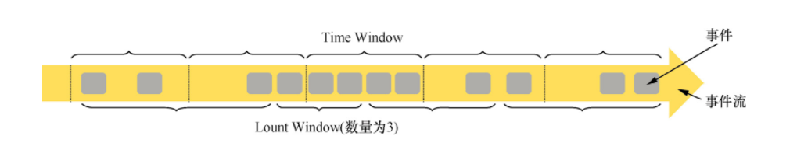
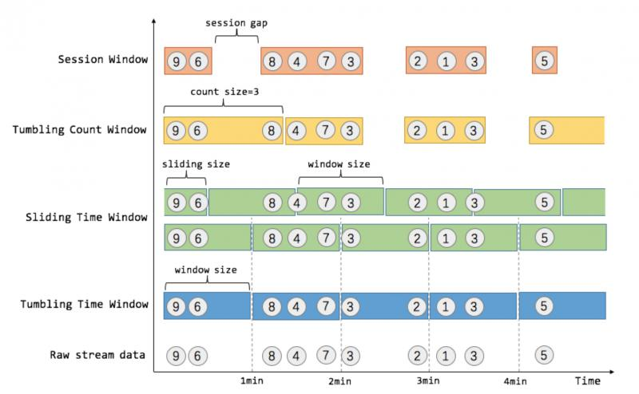
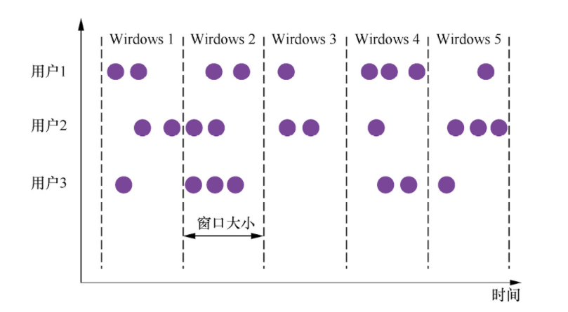
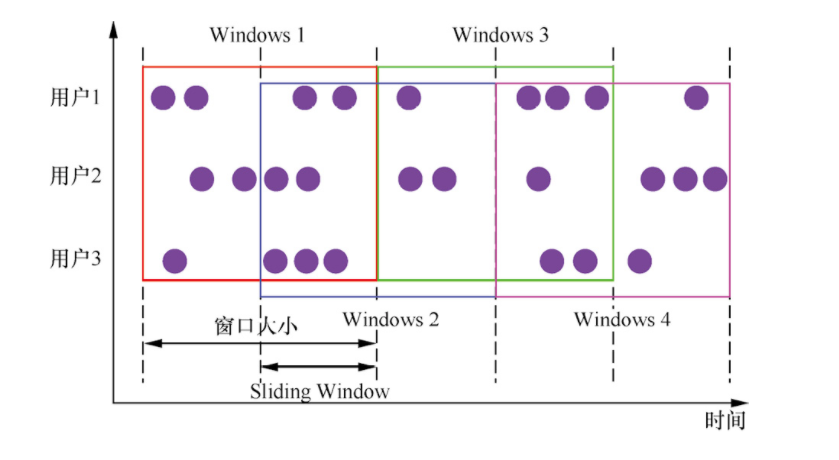
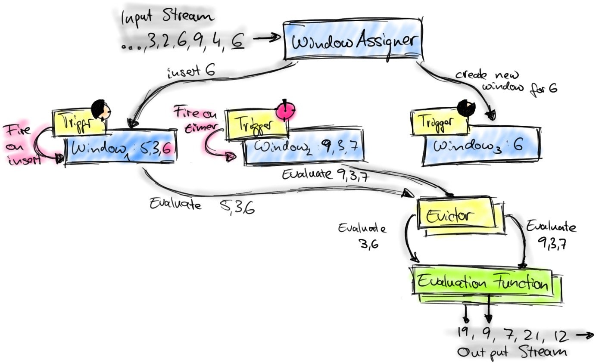

# Window

Flink 认为 Batch 是 Streaming 的一个特例，因此 Flink 底层引擎是一个流式引擎，在上面实现了流处理和批处理。而 Window 就是从 Streaming 到 Batch 的桥梁。

通常来讲，**Window 就是用来对一个无限的流设置一个有限的集合，从而在有界的数据集上进行操作的一种机制**。

Window 可以由时间（Time Window）（如每30s）或者数据（Count Window）（如每100个元素）驱动。DataStream API 提供了 Time 和 Count 的 Window。同时，由于某些特殊的需要，DataStream API 也提供了定制化的 Window 操作，供用户自定义 Window。如下图所示：

~~~~

## 窗口类型

窗口的所有类型如下图所示：



Window 根据类型可以分为两种：

- Tumbling Window：滚动窗口，表示窗口内的数据没有重叠

  ~~~~

- Sliding Window：滑动窗口，表示窗口内的数据有重叠

  ~~~~

## Time Window

> Time Window 是根据时间对数据流进行分组的

- tumbling time windows(翻滚时间窗口)
  ```java
  data.keyBy(1)
	.timeWindow(Time.minutes(1)) //tumbling time window 每分钟统计一次数量和
	.sum(1);
  ```
- sliding time windows(滑动时间窗口)
  ```java
  data.keyBy(1)
	.timeWindow(Time.minutes(1), Time.seconds(30)) //sliding time window 每隔 30s 统计过去一分钟的数量和
	.sum(1);
  ```

## Count Window

> Count Window 是根据元素个数对数据流进行分组的

- tumbling count window
  ```java
  data.keyBy(1)
	.countWindow(100) //统计每 100 个元素的数量之和
	.sum(1);
  ```
- sliding count window
  ```java
  data.keyBy(1) 
	.countWindow(100, 10) //每 10 个元素统计过去 100 个元素的数量之和
	.sum(1);
  ```

## 自定义 Window

自定义 Window 可以分为两种：

- 一种是基于 Key 的 Window
  `.keyBy(...).widow(...)`：属于基于 Key 的 Window，会先对窗口中的数据进行分组，然后再聚合
- 一种是不基于 Key 的 Window
  `.windowAll(...)`：属于不基于 Key 的 Window，会对窗口所有数据进行聚合

## 窗口机制

窗口机制如下图所示：



所涉及到的组件：

到达窗口操作符的元素被传递给 WindowAssigner。WindowAssigner 将元素分配给一个或多个窗口，可能会创建新的窗口。

窗口本身只是元素列表的标识符，它可能提供一些可选的元信息，例如 TimeWindow 中的开始和结束时间。注意，元素可以被添加到多个窗口，这也意味着一个元素可以同时在多个窗口存在。

每个窗口都拥有一个 Trigger(触发器)，该 Trigger(触发器) 决定何时计算和清除窗口。当先前注册的计时器超时时，将为插入窗口的每个元素调用触发器。在每个事件上，触发器都可以决定触发(即、清除(删除窗口并丢弃其内容)，或者启动并清除窗口。一个窗口可以被求值多次，并且在被清除之前一直存在。注意，在清除窗口之前，窗口将一直消耗内存。

当 Trigger(触发器) 触发时，可以将窗口元素列表提供给可选的 Evictor，Evictor 可以遍历窗口元素列表，并可以决定从列表的开头删除首先进入窗口的一些元素。然后其余的元素被赋给一个计算函数，如果没有定义 Evictor，触发器直接将所有窗口元素交给计算函数。

计算函数接收 Evictor 过滤后的窗口元素，并计算窗口的一个或多个元素的结果。 DataStream API 接受不同类型的计算函数，包括预定义的聚合函数，如 `sum()`，`min()`，`max()`，以及 ReduceFunction，FoldFunction 或 WindowFunction。

## 基于 Key 的自定义 Window 详解

**0. 获取数据并进行分组**

```java
SingleOutputStreamOperator<xxx> data = env.addSource(...);
data.keyBy(...)
```

**1. WindowAssigner 定义**

WindowAssigner 负责将元素分配到不同的 window

Window API 提供了自定义的 WindowAssigner 接口，可以实现 WindowAssigner 的 `assignWindows` 方法。

**2. Trigger 定义**

Trigger 即触发器，定义何时或什么情况下移除 window

**3. Evictor 定义【可选】**

Evictor 保留上一 window 留下的某些元素

**4. 通过 apply WindowFunction 来返回 DataStream 类型数据**

