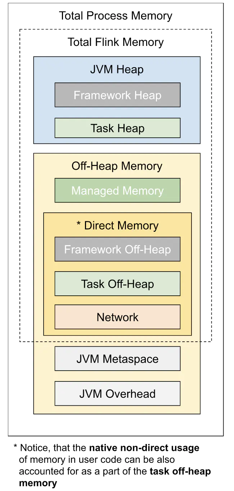
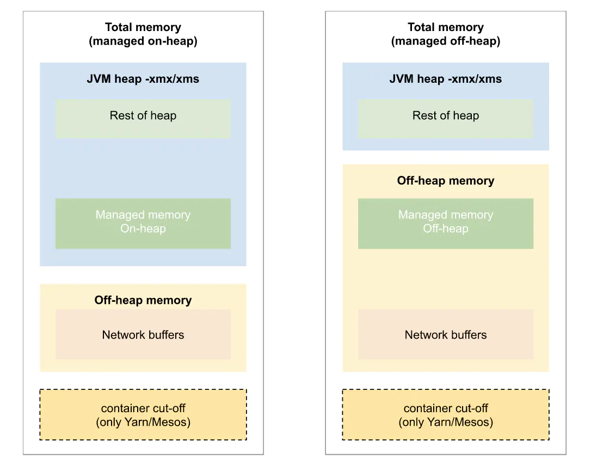

# Flink 内存模型

> 注：Flink1.10 之前的内存模型和 Flink1.10 之后的内存模型是不同的

## Flink1.10 及以后的内存模型

### TaskManager 内存参数

|                    参数                    |                  默认值                   | 描述   |
| :----------------------------------------: | :---------------------------------------: | ------ |
|     `taskmanager.memory.process.size`      |         Total Process Memory大小          |        |
|      `taskmanager.memory.flink.size`       |          Total Flink Memory大小           |        |
|    `taskmanager.memory.task.heap.size`     |            Task Heap 内存大小             |        |
|     `taskmanager.memory.managed.size`      |             Managed 内存大小              |        |
|  `taskmanager.memory.jvm-metaspace.size`   | jvm-metaspace大小，主要存储类的元数据信息 | 256MB  |
|   `taskmanager.memory.jvm-overhead.min`    |         jvm-overhead区域的最小值          | 192 MB |
|   `taskmanager.memory.jvm-overhead.max`    |         jvm-overhead区域的最大值          | 1GB    |
| `taskmanager.memory.jvm-overhead.fraction` |          jvm-overhead占内存比例           | 0.1    |

## Flink1.10 前的内存模型

