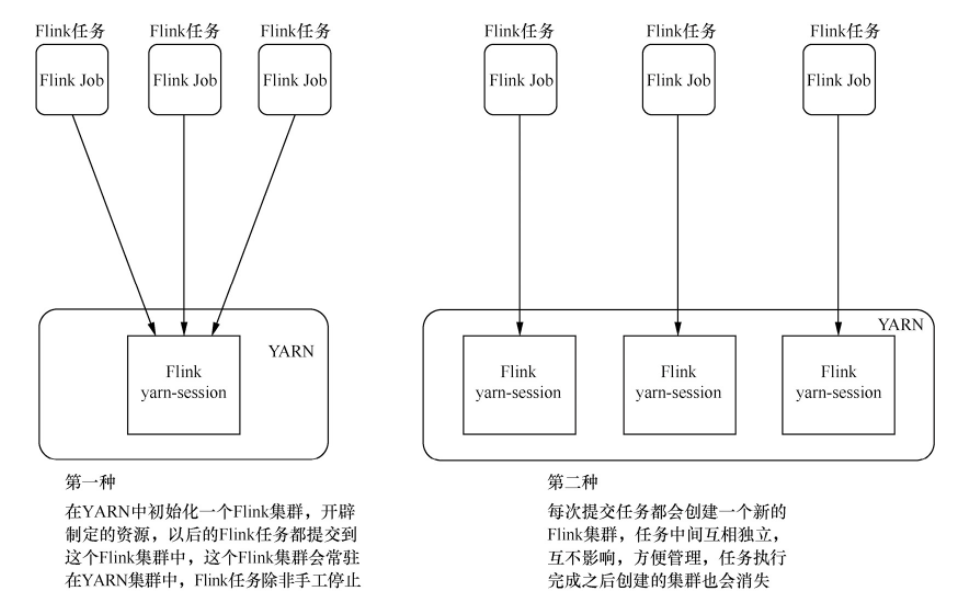
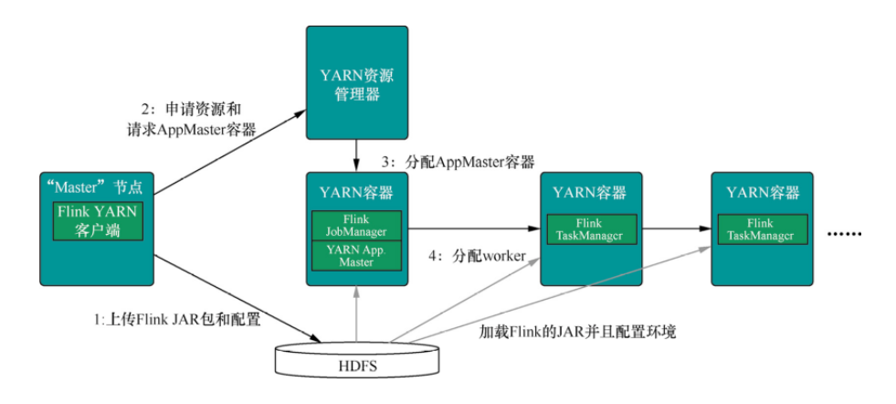

# Flink on Yarn 模式

Flink on Yarn 模式的原理是依靠 YARN 来调度 Flink 任务，这种模式的好处是可以充分利用集群资源，提高集群机器的利用率，并且只需要 1 套 Hadoop 集群，就可以执行 MapReduce 和 Spark 任务，还可以执行 Flink 任务等，操作非常方便，不需要维护多套集群，运维方面也很轻松。

Flink on Yarn 模式在使用的时候又可以分为两种，如下图所示：



- 第 1 种模式，是在 YARN 中提前初始化一个 Flink 集群(称为 Flink yarn-session)，开辟指定的资源，以后的 Flink 任务都提交到这里。这个 Flink 集群会常驻在 YARN 集群中，除非手工停止。这种方式创建的 Flink 集群会独占资源，不管有没有 Flink 任务在执行，YARN 上面的其他任务都无法使用这些资源。
- 第 2 种模式，每次提交 Flink 任务都会创建一个新的 Flink 集群，每个 Flink 任务之间相互独立、互不影响，管理方便。任务执行完成之后创建的 Flink 集群也会消失，不会额外占用资源，按需使用，这使资源利用率达到最大，在工作中推荐使用这种模式。

## 第 1 种模式

1. 创建一个一直运行的 Flink 集群(也可以称为 Flink yarn-session)
    ```bash
    # 参数最后面的-d参数是可选项，表示是否在后台独立运行
    ${FLINK_HOME}/bin/yarn-session.sh -n 2 -jm 1024 -tm 1024 -d
    ```
    执行以后可以到任务界面确认是否有 Flink 任务成功运行
2. 附着到一个已存在的Flink集群中
   ```bash
   # 参数最后面的applicationId是一个变量，需要获取第1步创建的Flink集群对应的applicationId信息。
   ${FLINK_HOME}/bin/yarn-session.sh -id ${applicationId}
   ```
3. 执行Flink任务
   ```bash
   ${FLINK_HOME}/bin/flink run ${FLINK_HOME}/example/batch/WordCount.jar
   ```

## 第 2 种模式

提交 Flink 任务的同时创建 Flink 集群：

```bash
${FLINK_HOME}/bin/flink run -m yarn-cluster -yn 2 -yjm 1024 -ytm 1024 ${FLINK_HOME}/example/batch/WordCount.jar
```

Flink on Yarn 的内部实现如下图所示：



1. 当启动一个新的 Flink YARN Client 会话时，客户端首先会检查所请求的资源（容器和内存）是否可用。之后，它会上传 Flink 配置和 JAR 文件到 HDFS。
2. 客户端的下一步是请求一个 YARN 容器启动 ApplicationMaster。JobManager 和 ApplicationMaster(AM) 运行在同一个容器中，一旦它们成功地启动了，AM 就能够知道 JobManager 的地址，它会为 TaskManager 生成一个新的 Flink 配置文件（这样它才能连上 JobManager），该文件也同样会被上传到 HDFS。另外，AM 容器还提供了 Flink 的 Web 界面服务。Flink 用来提供服务的端口是由用户和应用程序 ID 作为偏移配置的，这使得用户能够并行执行多个 YARN 会话。
3. 之后，AM 开始为 Flink 的 TaskManager 分配容器，从 HDFS 下载 JAR 文件和修改过的配置文件。一旦这些步骤完成了，Flink 就安装完成并准备接受任务了。