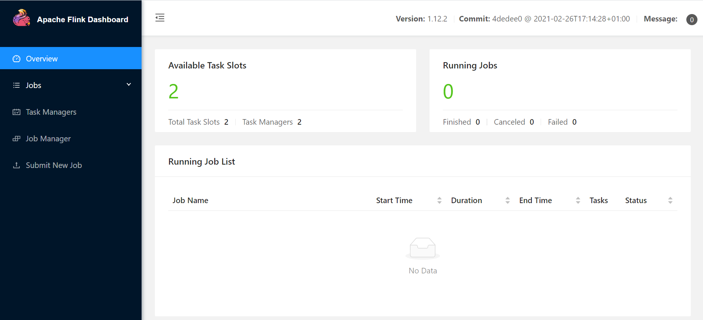

# Standalone 模式

> Standalone 是 Flink 的独立部署模式，它不依赖其他平台。如果想搭建一套独立的 Flink 集群，可以考虑使用这种模式。

## 0. 前提

3 台 Linux 服务器，如下：

```
Master 节点，主机名 flink1，JDK1.8
Slave1 节点，主机名 flink2，JDK1.8
Slave2 节点，主机名 flink3，JDK1.8
```

**注意**：这 3 台 Linux 服务器都配置了 `JAVA_HOME`，并且也实现了节点之间的 ssh 免密码登录，防火墙也都关闭了。

## 1. 下载解压

**下载**

本地下载 `flink-1.12.2-bin-scala_2.11.tgz` 安装包，将该安装包上传到三台服务器的 `/opt` 文件夹中

**解压**

```bash
mkdir /opt/flink
tar -zxvf flink-1.12.2-bin-scala_2.11.tgz -C /opt/flink
```

## 2. 配置

对三台服务器的配置修改都是一样的，此处只给出 Master 的配置。

**`flink-conf.yaml`**

修改 Flink 的配置文件 `flink-conf.yaml` 中的 `jobmanager.rpc.address` 参数，把值修改为 flink1。

```
jobmanager.rpc.address: flink1
```

**masters**

修改 Flink 的配置文件 masters，将内容改成 Master 服务器的地址

```
flink1
```

**workers**

修改 Flink 的配置文件 workers，将内容改成 Slave 服务器的地址

```
flink2
flink3
```

## 3. 启动

在 Master 服务器上启动 Flink 集群：

```bash
./bin/start-cluster.sh
```

## 4. 验证

### 方式一

查看服务器上的进程信息：

**Master**


**Slave1**


**Slave2**


### 方式二

访问：<http://flink1:8081>

