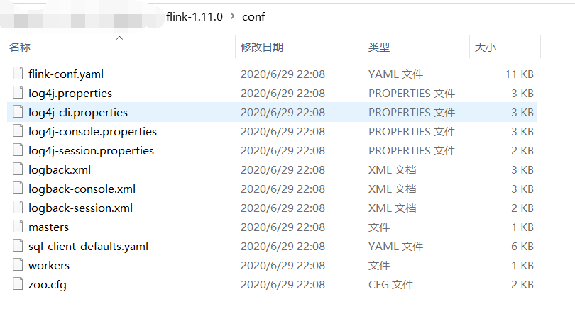

# 配置文件

配置文件位于 `${FLINK_HOME}/conf` 文件夹下，主要有 `flink-conf.yaml` 配置、日志的配置文件、zk 配置、Flink SQL Client 配置，如下图所示：



## masters

格式为：`host:port`

## workers

里面是每个 worker 节点的 IP/Hostname，每一个 worker 结点之后都会运行一个 TaskManager，一个一行。

## 日志配置

Flink 在不同平台下运行的日志文件

```
log4j-cli.properties
log4j-console.properties
log4j-yarn-session.properties
log4j.properties
logback-console.xml
logback-yarn.xml
logback.xml
```

