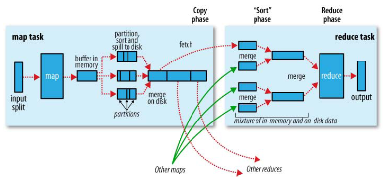

# MapReduce工作流程

MapReduce是我们再进行离线大数据处理的时候经常要使用的计算模型，MapReduce的计算过程被封装的很好，我们只用使用Map和Reduce函数，所以对其整体的计算过程不是太清楚，同时MapReduce1.0和MapReduce2.0在网上有很多人混淆。

## MapReduce1.0运行模型


#### Input

Input但是输入文件的存储位置，

###### 但是注意这里并一定是一些博客说的当然是HDFS似的分布式文件系统位置，默认是HDFS文件系统，当然也可以修改。

，它也可以是本机上的文件位置。
 我们来仔细分析下input


首先我们知道要和JobTracker打交道是离不开JobClient这个接口的，就如上图所示，

然后JobClient中的Run方法 会让 JobClient 把所有 Hadoop Job 的信息，比如 mapper reducer jar path, mapper / reducer class name, 输入文件的路径等等，告诉给 JobTracker，如下面的代码所示：

```java
public int run(String[] args) throws Exception {
        
        //create job
        Job job = Job.getInstance(getConf(), this.getClass().getSimpleName());
        
        // set run jar class
        job.setJarByClass(this.getClass());
        
        // set input . output
        FileInputFormat.addInputPath(job, new Path(PropReader.Reader("arg1")));
        FileOutputFormat.setOutputPath(job, new Path(PropReader.Reader("arg2")));
        
        // set map
        job.setMapperClass(HFile2TabMapper.class);
        job.setMapOutputKeyClass(ImmutableBytesWritable.class);
        job.setMapOutputValueClass(Put.class);
        
        // set reduce
        job.setReducerClass(PutSortReducer.class);
        return 0;
    }
```

除此以外，JobClient.runJob() 还会做一件事，使用 InputFormat类去计算如何把 input 文件 分割成一份一份，然后交给 mapper 处理。inputformat.getSplit() 函数返回一个 InputSplit 的 List, 每一个 InputSplit 就是一个 mapper 需要处理的数据。

一个 Hadoop Job的 input 既可以是一个很大的 file, 也可以是多个 file; 无论怎样，getSplit() 都会计算如何分割 input.

###### 如果是HDFS文件系统，我们都知道其可以通过将文件分割为block的形式存放在很多台电脑上，使其可以存放很大的文件。那么Mapper是如何确定一个HDFS文件中的block存放哪几台电脑，有什么数据？

inputFormat它实际上是个 interface, 需要 类 来继承，提供分割 input 的逻辑。

Jobclient 有一个方法叫 setInputFormat(), 通过它，我们可以告诉 JobTracker 想要使用的 InputFormat 类 是什么。如果我们不设置，Hadoop默认的是 TextInputFormat, 它默认为文件在 HDFS上的每一个 Block 生成一个对应的 InputSplit. 所以大家使用 Hadoop 时，也可以编写自己的 input format, 这样可以自由的选择分割 input 的算法，甚至处理存储在 HDFS 之外的数据。

##### JobTracker 尽量把 mapper 安排在离它要处理的数据比较近的机器上，以便 mapper 从本机读取数据，节省网络传输时间。具体实现是如何实现？

对于每个 map任务, 我们知道它的 split 包含的数据所在的主机位置，我们就把 mapper 安排在那个相应的主机上好了，至少是比较近的host. 你可能会问：split 里存储的 主机位置是 HDFS 存数据的主机，和 MapReduce 的主机 有什么相关呢？为了达到数据本地性，其实通常把MapReduce 和 HDFS 部署在同一组主机上。

既然一个 InputSplit 对应一个 map任务, 那么当 map 任务收到它所处理数据的位置信息，它就可以从 HDFS 读取这些数据了。

###### 接下来我们再从map函数看Input

map函数接受的是一个 key value 对。

###### 实际上，Hadoop 会把每个 mapper 的输入数据再次分割，分割成一个个 key-value对, 然后为每一个 key-value对，调用Map函数一次. 为了这一步分割，Hadoop 使用到另一个类: RecordReader. 它主要的方法是 next(), 作用就是从 InputSplit 读出一条 key-value对.

RecordReader 可以被定义在每个 InputFormat 类中。当我们通过 JobClient.setInputFormat() 告诉 Hadoop inputFormat 类名称的时候， RecordReader 的定义也一并被传递过来。

所以整个Input,

1.JobClient输入输入文件的存储位置

2.JobClient通过InputFormat接口可以设置分割的逻辑，默认是按HDFS文件分割。

3.Hadoop把文件再次分割为key-value对。

4.JobTracker负责分配对应的分割块由对应的maper处理，同时 RecordReader负责读取key-value对值。

#### Mapper

JobClient运行后获得所需的配置文件和客户端计算所得的输入划分信息。并将这些信息都存放在JobTracker专门为该作业创建的文件夹中。文件夹名为该作业的Job ID。JAR文件默认会有10个副本（mapred.submit.replication属性控制）；

然后输入划分信息告诉了JobTracker应该为这个作业启动多少个map任务等信息。

JobTracker通过TaskTracker 向其汇报的心跳情况和slot（情况），每一个slot可以接受一个map任务，这样为了每一台机器map任务的平均分配，JobTracker会接受每一个TaskTracker所监控的slot情况。

JobTracker接收到作业后，将其放在一个作业队列里，等待作业调度器对其进行调度，当作业调度器根据自己的调度算法调度到该作业时，会根据输入划分信息为每个划分创建一个map任务，并将map任务分配给TaskTracker执行，分配时根据slot的情况作为标准。

TaskTracker每隔一段时间会给JobTracker发送一个心跳，告诉JobTracker它依然在运行，同时心跳中还携带着很多的信息，比如当前map任务完成的进度等信息。当JobTracker收到作业的最后一个任务完成信息时，便把该作业设置成“成功”。当JobClient查询状态时，它将得知任务已完成，便显示一条消息给用户。

###### Map通过 RecordReader 读取Input的key/value对，map根据用户自定义的任务，运行完毕后，产生另外一系列 key/value，并将其写入到Hadoop的内存缓冲取中，在内存缓冲区中的key/value对按key排序，此时会按照reduce partition进行，分到不同partition中，一旦内存满就会被写入到本地磁盘的文件里，这个文件叫spill file。

#### shuffle

Shuffle是我们不需要编写的模块，但却是十分关键的模块。



在map中，每个 map 函数会输出一组 key/value对, Shuffle 阶段需要从所有 map主机上把相同的 key 的 key value对组合在一起，（也就是这里省去的Combiner阶段）组合后传给 reduce主机, 作为输入进入 reduce函数里。

Partitioner组件 负责计算哪些 key 应当被放到同一个 reduce 里

HashPartitioner类，它会把 key 放进一个 hash函数里，然后得到结果。如果两个 key 的哈希值 一样，他们的 key/value对 就被放到同一个 reduce 函数里。我们也把分配到同一个 reduce函数里的 key /value对 叫做一个reduce partition.

我们看到 hash 函数最终产生多少不同的结果, 这个 Hadoop job 就会有多少个 reduce partition／reduce 函数，这些 reduce函数最终被JobTracker 分配到负责 reduce 的主机上，进行处理。

我们知道map阶段可能会产生多个spill file 当 Map 结束时，这些 spill file 会被 merge 起来,不是 merge 成一个 file，而是也会按 reduce partition 分成多个。

当 Map tasks 成功结束时，他们会通知负责的 tasktracker, 然后消息通过 jobtracker 的 heartbeat 传给 jobtracker. 这样，对于每一个 job, jobtracker 知道 map output 和 map tasks 的关联。Reducer 内部有一个 thread 负责定期向 jobtracker 询问 map output 的位置，直到 reducer 得到所有它需要处理的 map output 的位置。

Reducer 的另一个 thread 会把拷贝过来的 map output file merge 成更大的 file. 如果 map task 被 configure 成需要对 map output 进行压缩，那 reduce 还要对 map 结果进行解压缩。当一个 reduce task 所有的 map output 都被拷贝到一个它的 host上时，reduce 就要开始对他们排序了。

排序并不是一次把所有 file 都排序，而是分几轮。每轮过后产生一个结果，然后再对结果排序。最后一轮就不用产生排序结果了，而是直接向 reduce 提供输入。这时，用户提供的 reduce函数 就可以被调用了。输入就是 map 任务 产生的 key value对.

###### 同时reduce任务并不是在map任务完全结束后才开始的，Map 任务有可能在不同时间结束，所以 reduce 任务没必要等所有 map任务 都结束才开始。事实上，每个 reduce任务有一些 threads 专门负责从 map主机复制 map 输出（默认是5个）。

#### Reduce


reduce() 函数以 key 及对应的 value 列表作为输入，按照用户自己的程序逻辑，经合并 key 相同的 value 值后，产 生另外一系列 key/value 对作为最终输出写入 HDFS。