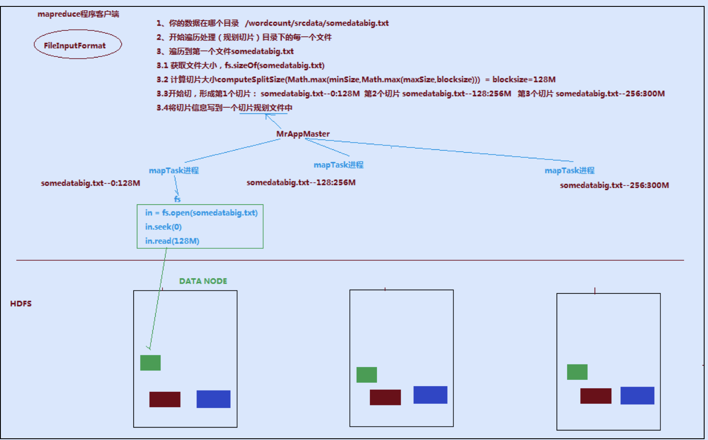

# MapReduce 切片机制

**需要注意的是 MapReduce 的切片只是一个逻辑程序。切片是用户程序在做。**一个切片对应一个 MapTask 实例。

通过分析源码，在 FileInputFormat 中，计算切片大小的逻辑：`Math.max(minSize,Math.min(maxSize,blockSize));`，切片主要由以下几个值来运算决定：

| 参数      | 默认值        | 配置参数                                        |
| :-------- | ------------- | ----------------------------------------------- |
| minsize   | 1             | `mapreduce.input.fileinputformat.split.minsize` |
| maxsize   | Long.MAXValue | `mapreduce.input.fileinputformat.split.maxsize` |
| blocksize |               |                                                 |

因此，**默认情况下，切片大小=blocksize**