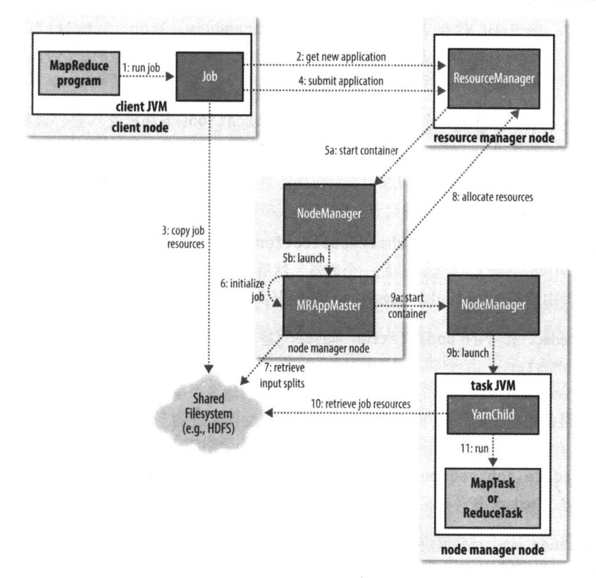

# MapReduce 作业运行机制

> 通过 Job 对象的 `submit()` 方法调用可以用来运行 MapReduce 作业。
>
> 注意：也可以调用 `waitForCompletion()`，它用于提交以前没有提交过的作业，并等待它的完成。

**Hadoop 运行 MapReduce 作业的工作原理**

**5 个独立的实体**

- 客户端，提交 MapReduce 任务
- YARN 资源管理器，负责协调集群上计算机资源的分配
- YARN 节点管理器，负责启动和监视集群中机器上的计算容器（container）
- MapReduce 的 appliaction master，负责协调运行 MapReduce 作业的任务。它和 MapReduce 任务在容器中运行，这些容器由资源管理器分配并由节点管理器进行管理
- 分布式文件系统，用来与其他实体间共享作业文件

## 1. 作业的提交

Job 的 `submit()` 方法创建一个内部的 JobSummiter 实例，并且调用其 `submitJobInternal()` 方法（**步骤1**）。提交作业后，`waitForCompletion()` 每秒轮询作业的进度，如果发现自上次报告后有改变，便把进度报告到控制台。作业完成后，如果成功，就显示作业计数器；如果失败，则导致作业失败的错误被记录到控制台。

JobSummiter 所实现的作业提交过程如下：

1. 向资源管理器请求一个新应用 ID，用于 MapReduce 作业 ID。【**步骤2**】
2. 检查作业的输出说明。例如，如果没有指定输入目录或输入目录已经存在，作业就不提交，错误抛出给 MapReduce 程序。
3. 计算作业的输入分片。如果分片无法计算，比如因为输入路径不存在，作业就不提交，错误返回给 MapReduce 程序。
4. 将运行作业所需要的资源（包括作业 JAR 文件、配置文件和计算所得的输入分片）复制到一个以作业 ID 命名的目录下的共享文件系统中【**步骤3**】。作业 JAR 的副本较多（由 `mapreduce.client.submit.file.replication` 属性控制，默认值为 10），因此在运行作业的任务时，集群中有很多副本可供节点管理器访问。
5. 通过调用资源管理器的 `submitApplication()` 方法提交作业。【**步骤4**】

## 2. 作业的初始化

资源管理器收到调用它的 `submitApplication()` 消息后，便将请求传递给 YARN 调度器（scheduler）。调度器分配一个容器，然后资源管理器在节点管理器的管理下在容器中启动 application master 的进程。【**步骤 5a 和 5b**】

MapReduce 作业的 application master 是一个 Java 应用程序，它的主类是 MRAppMaster。由于将接受来自任务的进度和完成报告【**步骤6**】，因此 application master 对作业的初始化是通过创建多个薄记对象以保持对作业进度的跟踪来完成。接下来，它接受来自共享文件系统的、在客户端计算的输入分片【**步骤7**】。然后对每一个分片创建一个 map 任务对象以及由 `mapreduce.job.reduces` 属性（通过作业的 `setNumReduceTasks()` 方法设置）确定的多个 reduce 任务对象。任务 ID 在此时分配。

## 3. 任务的分配

application master 会为作业中所有的 map 任务和 reduce 任务向资源管理器请求容器【**步骤8**】。首先为 map 任务发出请求，该请求的优先级要高于 reduce 任务的请求 ，这是因为所有的 map 任务必须在 reduce 的排序阶段能够启动完成。

reduce 任务能够在集群中任意位置运行，但是 map 任务的请求有着数据本地化局限，这也是调度器所关注的。在理想的情况下，任务是数据本地化（data local）的，意味着任务在分片驻留的同一节点上运行。

请求也为任务指定了内存需求和 CPU 数。在默认情况下，每个 map 任务和 reduce 任务都分配到 1024MB 的内存和一个虚拟的内核，这些值可以在每个作业的基础上进行配置，分别通过 4 个属性来设置 `mapreduce.map.memory.mb`、`mapreduce.map.cp.vcores`、 `mapreduce.reduce.memory.mb`和`mapreduce.reduce.cp.vcores`

## 4. 任务的执行

一旦资源管理器的调度器为任务分配了一个特定节点上的容器，application master 就通过与节点管理器通信来启动容器【**步骤 9a 和 9b**】。该任务由主类为 YarnChild 的一个 Java 应用程序执行。在它运行任务之前，首先将任务需要的资源本地化，包括作业配置、JAR 文件和所有来自分布式缓存的文件【**步骤10**】。最后，运行 map 任务或 reduce 任务【**步骤 11**】。

YarnChild 在指定的 JVM 中运行，因此用户定义的 map 或 reduce 函数（甚至是 YarnChild）中的任何缺陷不会影响到节点管理器，例如导致其奔溃或挂起。

每个任务都能够执行搭建（setup）和提交（commit） 动作，它们和任务本身在同一个 JVM 中运行，并由作业的 OutputCommiter 确定。对于基于文件的作业，提交动作将任务输出由临时位置搬移到最终位置。提交协议确保当推测执行（speculative execution）被启动时，只有一个任务副本被提交，其他的都被取消。

## 5. 进度和状态的更新

MapReduce 作业是长时间运行的批量作业，运行时间范围从数秒到数小时。因此对用户来说，得知关于作业的进展的一些反馈就很重要。一个作业和它的每个任务都有一个状态（status），包括：作业或任务状态（比如，运行中，成功完成，失败）、map 和 reduce 的进度、作业计数器的值、状态消息或描述（可以由用户代码来设置）。

## 6. 作业的完成

当 application master 收到作业最后一个任务已完成的通知后，便把作业的状态设置为“成功”。然后，在 Job 轮询状态时，便知道任务已成功完成，于是 Job 打印一条消息告知用户，然后从 `waitForCompletion()` 方法返回。Job 的统计信息和计数值也在这个时候输出到控制台。

如果 application master 有相应的设置，也会发送一个 HTTP 作业通知。希望收到回调指令的客户端可以通过 `mapreduce.job.end-notification.url` 属性来进行这项设置。

最后，作业完成时，application master 和任务容器清理其工作状态（这样中间输出将被删除），OutputCommiter 的 `commitJob()` 方法会被调用。作业信息由作业历史服务器存档，以便日后用户需要时可以查询。