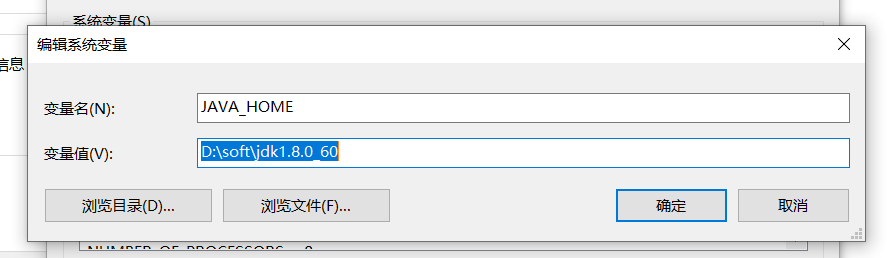

> ~~JDK下载地址：<https://www.oracle.com/technetwork/java/javase/downloads/jdk8-downloads-2133151.html>~~
> 
> JDK8 各小版本的下载地址：<https://www.oracle.com/java/technologies/javase/javase8-archive-downloads.html> 【更新时间：2020年10月23日】

## Windows

### 1、安装 JDK、JRE

安装过程中会出现两次安装提示 。第一次是安装 jdk ，第二次是安装 jre 。建议两个都安装在同一个java文件夹中的不同文件夹中。（不能都安装在java文件夹的根目录下，jdk和jre安装在同一文件夹会出错）。

### 2、环境变量配置

配置环境变量：右击==“我的电脑”-->"高级"-->"环境变量"==。

#### 2.1、`JAVA_HOME`环境变量

作用：它指向jdk的安装目录，Eclipse/NetBeans/Tomcat等软件就是通过搜索JAVA_HOME变量来找到并使用安装好的jdk。
配置方法：在系统变量里点击新建，变量名填写JAVA_HOME，变量值填写JDK的安装路径。（根据自己的安装路径填写）



#### 2.2、`CLASSPATH`环境变量

作用：是指定类搜索路径，要使用已经编写好的类，前提当然是能够找到它们了，JVM就是通过CLASSPTH来寻找类的。我们需要把jdk安装目录下的lib子目录中的dt.jar和tools.jar设置到CLASSPATH中，当然，当前目录“.”也必须加入到该变量中。

配置方法：新建CLASSPATH变量，变量值为：.;%JAVA_HOME%\lib;%JAVA_HOME%\lib\tools.jar 。CLASSPATH变量名字，可以大写也可以小写。注意不要忘记前面的点和中间的分号。且要在英文输入的状态下的分号和逗号。

`CLASSPATH:.;%JAVA_HOME%\lib;%JAVA_HOME%\lib\dt.jar;%JAVA_HOME%\lib\tools.jar;`

#### 2.3、`PATH`变量

作用：指定命令搜索路径，在i命令行下面执行命令如javac编译java程序时，它会到PATH变量所指定的路径中查找看是否能找到相应的命令程序。我们需要把jdk安装目录下的bin目录增加到现有的PATH变量中，bin目录中包含经常要用到的可执行文件如javac/java/javadoc等待，设置好PATH变量后，就可以在任何目录下执行javac/java等工具了。

在系统变量里找到Path变量，这是系统自带的，不用新建。双击Path，由于原来的变量值已经存在，故应在已有的变量后加上“;%JAVA_HOME%\bin;%JAVA_HOME%\jre\bin”。注意前面的分号。

`Path:;%JAVA_HOME%\bin;%JAVA_HOME%\jre\bin`

## Linux

下载对应的 Linux JDK 版本，这里使用 `jdk-8u131-linux-x64.tar.gz` 安装包。

**1、解压**

```bash
mkdir -p /usr/local/java
tar -zxvf jdk-8u131-linux-x64.tar.gz -C /usr/local/java
```

**2、设置环境变量**

```bash
vim /etc/profile

export JAVA_HOME=/usr/local/java/jdk1.8.0_131  
export JRE_HOME=${JAVA_HOME}/jre  
export CLASSPATH=.:${JAVA_HOME}/lib:${JRE_HOME}/lib  
export PATH=${JAVA_HOME}/bin:$PATH

# 执行环境变量
source /etc/profile
```

## 测试环境

输入`java -version`来验证安装是否正确

