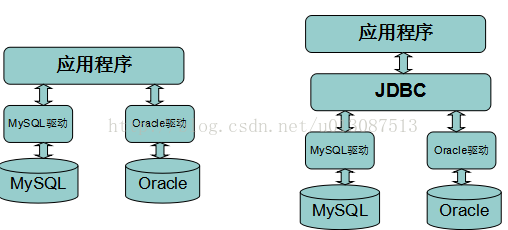
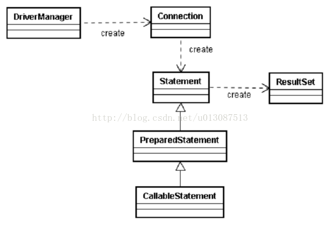
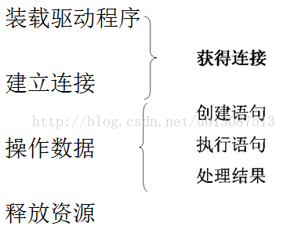
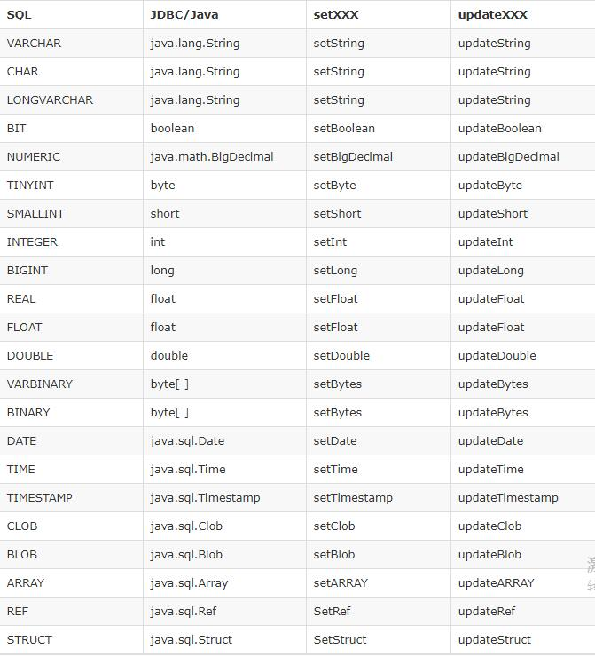

# JDBC

## 简介

> JDBC全称为：Java  DataBase Connectivity （Java数据库连接）

SUN公司为了简化、统一对数据库的操作，定义了一套Java操作数据库的规范，称之为JDBC



Sun公司为了简化数据库开发，定义了一套JDBC接口，这套接口由数据库厂商去实现，这样，开发人员只需要学习JDBC接口， 并通过JDBC加载具体的驱动，就可以操作数据库。

简单的说，JDBC的意义 **在于在Java程序中执行SQL语句** 。

### 架构

JDBC 的 API 支持两层和三层处理模式进行数据库访问，但一般的 JDBC 架构由两层处理模式组成：

- JDBC API: 提供了应用程序对 JDBC 管理器的连接。
- JDBC Driver API: 提供了 JDBC 管理器对驱动程序连接。

JDBC API 使用驱动程序管理器和数据库特定的驱动程序来提供异构（heterogeneous）数据库的透明连接。

JDBC 驱动程序管理器可确保正确的驱动程序来访问每个数据源。该驱动程序管理器能够支持连接到多个异构数据库的多个并发的驱动程序。

以下是结构图，其中显示了驱动程序管理器相对于在 JDBC 驱动程序和 Java 应用程序所处的位置。


### 常见的 JDBC 组件



JDBC 的 API 提供了以下接口和类：

- DriverManager ：这个类管理一系列数据库驱动程序。匹配连接使用通信子协议从 JAVA 应用程序中请求合适的数据库驱动程序。识别 JDBC 下某个子协议的第一驱动程序将被用于建立数据库连接。
- Driver : 这个接口处理与数据库服务器的通信。很少直接与驱动程序互动，一般使用 DriverManager 中的对象，它管理此类型的对象。它也抽象与驱动程序对象工作相关的详细信息。
- Connection : 此接口具有接触数据库的所有方法。该连接对象表示通信上下文，即所有与数据库的通信仅通过这个连接对象进行。
- Statement : 使用创建于这个接口的对象将 SQL 语句提交到数据库。除了执行存储过程以外，一些派生的接口也接受参数。
- ResultSet : 在使用语句对象执行 SQL 查询后，这些对象保存从数据获得的数据。它作为一个迭代器，可以通过它的数据来移动。
- SQLException : 这个类处理发生在数据库应用程序的任何错误。

## JDBC 编程步骤以及JDBC访问数据库的流程



JDBC访问数据库的流程:

- 通过DriverManager加载驱动程序Driver；
- 通过DriverManager类获得表示数据库连接的Connection类对象；
- 通过Connection对象绑定要执行的语句，生成Statement类对象；
- 执行SQL语句，接收执行结果集ResultSet；
- 可选的对结果集ResultSet类对象的处理；
- 必要的关闭ResultSet、Statement和Connection

### Driver

JDBC 驱动实现了 JDBC API 中定义的接口，该接口用于与数据库服务器进行交互。

java.sql 包中附带的 JDK，包含了定义各种类与它们的行为和实际实现，这些类都在第三方驱动程序中完成。第三方供应商在他们的数据库驱动程序中都实现了 java.sql.Driver 接口。

### DriverManager

JDBC程序中的DriverManager是java.sql包下的一个驱动管理的工具类，可以理解成是一个容器(Vector)，可以装入很多数据库驱动，并创建与数据库的链接，这个API的常用方法：

```java
DriverManager.registerDriver(new Driver());
DriverManager.getConnection(url, user, password);
```

**注意** ：在实际开发中并不推荐采用registerDriver方法注册驱动。原因有二：

1. 在mysql的com.mysql.jdbc.Driver类中，有一段静态代码块 `java.sql.DriverManager.registerDriver(new Driver());`，如果采用此种方式加载驱动，会导致驱动程序注册两次，也就是说在内存中会有两个Driver对象
2. 程序依赖MySQL的API，脱离MySQL的jar包，程序将无法编译，将来程序切换底层数据库将会非常麻烦。

推荐方式：利用反射`Class.forName("com.mysql.jdbc.Driver")`;采用此种方式不会导致驱动对象在内存中重复出现，并且采用此种方式，程序仅仅需要一个字符串，不需要依赖具体的驱动，使程序的灵活性更高。

同样，在开发中也不建议采用具体的驱动类型指向getConnection方法返回connection对象。

### 数据库URL

URL用于标识数据库位置，程序员通过URL地址告诉JDBC程序连接哪个数据库，URL的写法为：

常用的 JDBC 驱动程序名和数据库URL

| RDBMS  | JDBC 驱动程序名称               | URL 格式                                            |
| :----: | :------------------------------ | :-------------------------------------------------- |
| MySQL  | com.mysql.jdbc.Driver           | jdbc:mysql://hostname/ databaseName                 |
| ORACLE | oracle.jdbc.driver.OracleDriver | jdbc:oracle:thin:@hostname:port Number:databaseName |
|  DB2   | COM.ibm.db2.jdbc.net.DB2Driver  | jdbc:db2:hostname:port Number/databaseName          |
| Sybase | com.sybase.jdbc.SybDriver       | jdbc:sybase:Tds:hostname: port Number/databaseName  |

### Connection

JDBC程序中的Connection，它用于代表数据库的连接，Connection是数据库编程中最重要的一个对象，客户端与数据库所有交互都是通过connection对象完成的，这个对象常用的方法：

- createStatement()：创建向数据库发送SQL的Statement对象。
- prepareStatement(String sql)：创建向数据库发送预编译SQL的PrepareStatement对象。
- prepareCall(String sql)：创建执行存储过程的callableStatement对象——执行存储过程
- setAutoCommit(boolean  autoCommit)：设置事务是否自动提交
- commit()：在链接上提交事务——与事务相关
- rollback()：在此链接上回滚事务

### Statement

|       接口        | 推荐使用                                                                              |
| :---------------: | :------------------------------------------------------------------------------------ |
|     Statement     | 可以正常访问数据库，适用于运行静态 SQL 语句。 Statement 接口不接受参数。              |
| PreparedStatement | 计划多次使用 SQL 语句， PreparedStatement 接口运行时接受输入的参数。                  |
| CallableStatement | 适用于当你要访问数据库存储过程的时候， CallableStatement 接口运行时也接受输入的参数。 |

#### Statement 接口

JDBC程序中的Statement对象用于向数据库发送SQL语句，想完成对数据库的增删改查，只需要通过这个对象向数据库发送增删改查语句即可。Statement对象常用方法：

- executeQuery(String sql)：用于向数据库发送查询语句（DQL）
- executeUpdate(String sql)：用于向；数据库发送insert、update或delete语句（DML）。利用返回值判断非0来确定sql语句是否执行成功
- execute(String  sql)：用于向数据库发送任意的sql语句
- addBatch(String sql)：把多条SQL语句放到一个批处理中
- executeBatch()：向数据库发送一批SQL语句执行
- clearBatch()：清空批处理

#### PreparedStatement 接口

它是一个预处理的Statement，它是java.sql.Statement接口的一个子接口。

#### CallableStatement 接口

CallableStatement 可以用来执行调用数据库存储过程。

### ResultSet

java.sql.ResultSet，它是用于封装select语句执行后查询的结果。

常用API：

- next()：用于判断是否有下一条记录。如果有返回true,并且让游标向下移动一行，如果没有返回false
- getXxx()：可以通过ResultSet提供的getXxx()方法来获取当前游标指向的这条记录中的列数据。常用:getInt()、getString()、getDate()、getDouble()

常用数据类型转换表：



#### 滚动结果集

默认得到的ResultSet它只能向下遍历(next()),对于ResultSet它可以设置成是滚动的，可以向上遍历，或者直接定位到一个指定的物理行号。写法如下：

```java
//默认结果集:只能向下执行，并且只能迭代一次。
Statement st=con.createStatement();
ResultSet rs=st.executeQuery(sql);

//创建滚动结果集
Statement stmt = con.createStatement(ResultSet.TYPE_SCROLL_INSENSITIVE, ResultSet.CONCUR_UPDATABLE);
ResultSet rs = stmt.executeQuery(sql);
```

```java
// java.sql.Connection 接口方法
/**
 * @param resultSetType
 *      结果集类型，它是 ResultSet.TYPE_FORWARD_ONLY、ResultSet.TYPE_SCROLL_INSENSITIVE 或 ResultSet.TYPE_SCROLL_SENSITIVE 之一
 * @param resultSetConcurrency
 *      并发类型；它是 ResultSet.CONCUR_READ_ONLY 或 ResultSet.CONCUR_UPDATABLE 之一
 */
Statement createStatement(int resultSetType, int resultSetConcurrency)  throws SQLException
```

结果集类型：

|                值                 | 作用                                                                           |
| :-------------------------------: | :----------------------------------------------------------------------------- |
|    ResultSet.TYPE_FORWARD_ONLY    | 该常量指示光标只能向前移动的 ResultSet 对象的类型。                            |
| ResultSet.TYPE_SCROLL_INSENSITIVE | 该常量指示可滚动但通常不受 ResultSet 底层数据更改影响的 ResultSet 对象的类型。 |
|  ResultSet.TYPE_SCROLL_SENSITIVE  | 该常量指示可滚动并且通常受 ResultSet 底层数据更改影响的 ResultSet 对象的类型。 |

并发类型：

|             值             | 作用                                              |
| :------------------------: | :------------------------------------------------ |
| ResultSet.CONCUR_READ_ONLY | 该常量指示不可以更新的 ResultSet 对象的并发模式。 |
| ResultSet.CONCUR_UPDATABLE | 该常量指示可以更新的 ResultSet 对象的并发模式。   |

以上五个值，可以有三种搭配方式:

- ResultSet.TYPE_FORWARD_ONLY       + ResultSet.CONCUR_READ_ONLY(默认)
- ResultSet.TYPE_SCROLL_INSENSITIVE + ResultSet.CONCUR_READ_ONLY
- ResultSet.TYPE_SCROLL_SENSITIVE   + ResultSet.CONCUR_UPDATABLE

常用API:

- next()：移动到下一行
- previous()：移动到前一行
- absolute(int row)：移动到指定行
- beforeFirst()：移动resultSet的最前面
- afterLast() ：移动到resultSet的最后面
- updateRow() ：更新行数据
  
### 释放资源

Jdbc程序运行完后，切记要释放程序在运行过程中，创建的那些与数据库进行交互的对象，这些对象通常是ResultSet, Statement和Connection对象。

特别是 **Connection** 对象，它是非常稀有的资源，用完后必须马上释放，如果Connection不能及时、正确的关闭，极易导致系统宕机。Connection的使用原则是尽量晚创建，尽量早的释放。

为确保资源释放代码能运行，资源释放代码也一定要放在finally语句中。

## JavaEE模式—DAO模式

- 封装对于数据源的操作
- 数据源可能是文件、数据库等任意存储方式
- 负责管理与数据库的连接
- 负责数据的存取（CURD）

> DAO模式（Data Access Object 数据访问对象）：在持久层通过DAO将数据源操作完全封装起来，业务层通过操作Java对象，完成对数据源操作，业务层无需知道数据源底层实现 ，通过java对象操作数据源。

DAO模式结构 ：

1. 数据源（MySQL数据库）
2. Business Object 业务层代码，调用DAO完成 对数据源操作
3. DataAccessObject 数据访问对象，持久层DAO程序，封装对数据源增删改查，提供方法参数都是Java对象
4. TransferObject 传输对象（值对象） 业务层通过向数据层传递 TO对象，完成对数据源的增删改查

## 其他

### 优化

#### 1、连接获取和释放

- 问题描述：数据库连接频繁的开启和关闭本身就造成了资源的浪费，影响系统的性能。

> 数据库连接的获取和关闭可以使用数据库连接池来解决资源浪费的问题。通过连接池就可以反复利用已经建立的连接去访问数据库了。减少连接的开启和关闭的时间。

- 问题描述：现在连接池多种多样，可能存在变化，有可能采用DBCP的连接池，也有可能采用容器本身的JNDI数据库连接池。

> 可以通过DataSource进行隔离解耦，统一从DataSource里面获取数据库连接，DataSource具体由DBCP实现还是由容器的JNDI实现都可以，所以我们将DataSource的具体实现通过让用户配置来应对变化。

