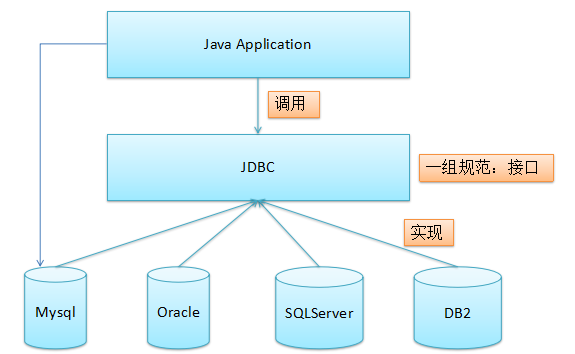
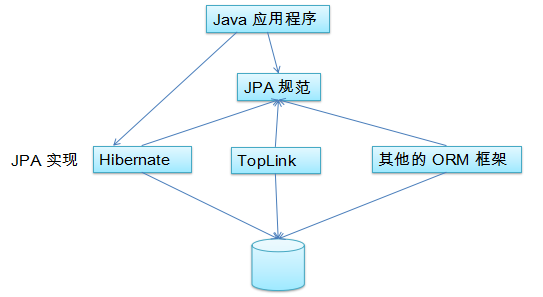

# JPA

## 简介



JPA（Java Persistence API）：用于对象持久化的API。

Java EE 5.0平台标准的 ORM 规范，使得应用程序以统一的方式访问持久层



### JPA和Hibernate的关系

JPA 是 Hibernate 的一个抽象，就像 JDBC 和 JDBC 驱动的关系；

**JPA 是规范**：JPA本质上就是一种ORM规范，不是ORM框架，因为JPA并未提供ORM实现，它只是制定了一些规范，提供了一些编程的API接口，但具体实现则由ORM厂商提供实现

**Hibernate是实现**：Hibernate除了作为ORM框架之外，它也是一种JPA实现

从功能上来说，**JPA是Hibernate功能的一个子集**

### JPA的供应商

JPA的目标之一是制定一个可以由很多供应商实现的API，目前Hibernate3.2+、TopLink10.1+以及OpenJPA都提供了JPA的实现：

- Hibernate：JPA 的始作俑者就是 Hibernate 的作者。Hibernate 从 3.2 开始兼容 JPA
- OpenJPA：OpenJPA是 Apache 组织提供的开源项目
- TopLink：TopLink 以前需要收费，如今开源了

### JPA 包括3方面的技术

- **ORM映射元数据**：JPA支持XML和JDK5.0注解两种元数据的形式，元数据描述对象和表之间的映射关系，框架根据此将实体对象持久化到数据库表中
- **JPA的API**：用来操作实体对象，执行CRUD操作，框架在后台完成所有的事情，开发者从繁琐的JDBC和SQL代码中解脱出来
- **查询语句（JPQL）**：这是持久化操作中很重要的一个方面，通过面向对象而非面向数据库的查询语句查询数据，避免程序和具体的SQL紧密耦合

## JPA 基本注解

JPA 基本注解：`@Entity`,`@Table`,`@Id`,`@GeneratedValue`,`@Column`,`@Basic`,`@Transient`,`@Temporal`用table来生成主键详解

### `@Entity`

用于实体类声明语句之前，指出该Java类为实体类，将映射到指定的数据库表。

### `@Table`

当实体类与其映射的数据库表名不同名时需要使用`@Table`注解说明，该注解与`@Entity`注解并列使用，置于实体类声明语句之前，可写于单独语句行，也可与声明语句同行

`@Table`注解的常用属性是**name**，用于指明数据库的表名

`@Table`注解还有一两个属性catalog和schema用于设置表所属的数据库目录或模式，通常为数据库名，uniqueConstraints属性用于设置约束条件，通常无需设置

### `@Id`

用于声明一个实体类的属性映射为数据库的主键列，该属性通常置于属性声明语句之前，可与声明语句同行，也可写在单独行上。`@Id`标注也可置于属性的getter方法之前

### `@GeneratedValue`

用于标注主键的生成策略，通过 strategy 属性指定。默认情况下，JPA 自动选择一个最适合底层数据库的主键生成策略：SqlServer 对应 identity，MySQL 对应 auto increment。

在 javax.persistence.GenerationType 中定义了以下几种可供选择的策略：

- IDENTITY：采用数据库 ID自增长的方式来自增主键字段，Oracle 不支持这种方式；
- AUTO： JPA自动选择合适的策略，是默认选项；
- SEQUENCE：通过序列产生主键，通过 `@SequenceGenerator` 注解指定序列名，MySql 不支持这种方式
- TABLE：通过表产生主键，框架借由表模拟序列产生主键，使用该策略可以使应用更易于数据库移植。

### `@Column`

当实体的属性与其映射的数据库表的列不同名时需要使用 `@Column` 注解说明，该注解通常置于实体的属性声明语句之前，还可与 `@Id` 注解一起使用。

`@Column` 注解的常用属性是 name，用于设置映射数据库表的列名。此外，该标注还包含其它多个属性，如：unique 、nullable、length等。

`@Column` 注解的 columnDefinition 属性: 表示该字段在数据库中的实际类型，通常 ORM 框架可以根据属性类型自动判断数据库中字段的类型,但是对于Date类型仍无法确定数据库中字段类型究竟是DATE,TIME还是TIMESTAMP.此外,String的默认映射类型为VARCHAR, 如果要将 String 类型映射到特定数据库的 BLOB 或TEXT 字段类型。

`@Column` 注解也可置于属性的getter方法之前

### `@Basic`

表示一个简单的属性到数据库表的字段的映射,对于没有任何注解的 `getXxxx()` 方法,默认即为`@Basic`

- fetch: 表示该属性的读取策略,有 EAGER 和 LAZY 两种,分别表示主支抓取和延迟加载,默认为 EAGER.
- optional:表示该属性是否允许为null, 默认为true

### `@Transient`

表示该属性并非一个到数据库表的字段的映射,ORM框架将忽略该属性。

如果一个属性并非数据库表的字段映射,就务必将其标示为`@Transient`,否则,ORM框架默认其注解为`@Basic`

### `@Temporal`

在核心的 Java API 中并没有定义 Date 类型的精度(temporal precision),而在数据库中,表示 Date 类型的数据有 DATE, TIME, 和 TIMESTAMP 三种精度(即单纯的日期,时间,或者两者 兼备),在进行属性映射时可使用@Temporal注解来调整精度。

### 示例

```java
/**
 * 注解@Entity映射的表名和类名一样
 * 注解@Table：当实体类与其映射的数据库表名不同名时使用。其中name，用于指明数据库的表名
 */
@Table(name="JPA_CUTOMERS")
@Entity
public class Customer {
    private Integer id;
    private String lastName;
    private String email;
    private int age;
    private Date createdTime;
    private Date birth;

    public Customer() {}

    //用 table 来生成主键详解（用的少）:
    //将当前主键的值单独保存到一个数据库的表中，主键的值每次都是从指定的表中查询来获得
    //这种方法生成主键的策略可以适用于任何数据库，不必担心不同数据库不兼容造成的问题
    /*@TableGenerator(name="ID_GENERATOR", --name 属性表示该主键生成的名称，它被引用在@GeneratedValue中设置的generator 值中(即这两个名字要一样）
            table="jpa_id_generators",   --table 属性表示表生成策略所持久化的表名
            pkColumnName="PK_NAME",      --pkColumnName 属性的值表示在持久化表中，该主键生成策略所对应键值的名称
            pkColumnValue="CUSTOMER_ID", --pkColumnValue 属性的值表示在持久化表中，该生成策略所对应的主键（跟pkColumnName属性可以确定唯一的一行，该行有很多列）
            valueColumnName="PK_VALUE",  --valueColumnName 属性的值表示在持久化表中，该主键当前所生成的值，它的值将会随着每次创建累加，（再加这个属性能确定唯一的那个点）
            allocationSize=100)          --allocationSize 表示每次主键值增加的大小, 默认值为 50
    @GeneratedValue(strategy=GenerationType.TABLE,generator="ID_GENERATOR")*/
    @GeneratedValue(strategy=GenerationType.AUTO)
    @Id
    public Integer getId() {
        return id;
    }
    public void setId(Integer id) {
        this.id = id;
    }

    /**
     * 注解@Column 当实体的属性与其映射的数据库表的列不同名时需要使用
     * nullable=false不能为空
     */
    @Column(name="LAST_NAME",length=50,nullable=false)
    public String getLastName() {
        return lastName;
    }
    public void setLastName(String lastName) {
        this.lastName = lastName;
    }

    //如果 列名跟字段一样如列名是email，则可以不用写，相关加了@Basic，但字段的属性都是默认的
    //@Basic
    public String getEmail() {
        return email;
    }
    public void setEmail(String email) {
        this.email = email;
    }

    public int getAge() {
        return age;
    }
    public void setAge(int age) {
        this.age = age;
    }

    //---------------------------------------------------------------
    //注解@Temporal 调整时间精度 2015-11-11 10:11:11
    @Temporal(TemporalType.TIMESTAMP)
    public Date getCreatedTime() {
        return createdTime;
    }
    public void setCreatedTime(Date createdTime) {
        this.createdTime = createdTime;
    }

    //2015-11-11
    @Temporal(TemporalType.DATE)
    public Date getBirth() {
        return birth;
    }
    public void setBirth(Date birth) {
        this.birth = birth;
    }

    //工具方法. 不需要映射为数据表的一列. 如果没有加@Transient，则会出错，因为没有set方法
    @Transient
    public String getInfo(){
        return "lastName: " + lastName + ", email: " + email;
    }
}
```

## JPA API

- Persistence
- EntityManagerFactory
- EntityManager