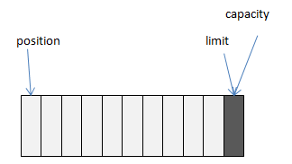
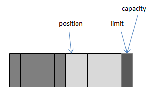
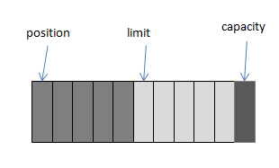

# NIO

## 概述

NIO 主要有三大核心部分：Channel(通道)，Buffer(缓冲区)，Selector。传统 IO 基于字节流和字符流进行操作，而 NIO 基于 Channel 和 Buffer(缓冲区)进行操作，数据总是从通道读取到缓冲区中，或者从缓冲区写入到通道中。Selector(选择区)用于监听多个通道的事件（比如：连接打开，数据到达）。因此，单个线程可以监听多个数据通道。

NIO 和传统 IO（一下简称 IO）之间第一个最大的区别是，IO 是面向流的，NIO 是面向缓冲区的。 Java IO 面向流意味着每次从流中读一个或多个字节，直至读取所有字节，它们没有被缓存在任何地方。此外，它不能前后移动流中的数据。如果需要前后移动从流中读取的数据，需要先将它缓存到一个缓冲区。NIO 的缓冲导向方法略有不同。数据读取到一个它稍后处理的缓冲区，需要时可在缓冲区中前后移动。这就增加了处理过程中的灵活性。但是，还需要检查是否该缓冲区中包含所有您需要处理的数据。而且，需确保当更多的数据读入缓冲区时，不要覆盖缓冲区里尚未处理的数据。

IO 的各种流是阻塞的。这意味着，当一个线程调用 `read()` 或 `write()` 时，该线程被阻塞，直到数据被读取完成，或数据完全写入。该线程在此期间不能再干任何事情了。 NIO 的非阻塞模式，使一个线程从某通道发送请求读取数据，但是它仅能得到目前可用的数据，如果目前没有数据可用时，就什么都不会获取。而不是保持线程阻塞，所以直至数据变的可以读取之前，该线程可以继续做其他的事情。 非阻塞写也是如此。一个线程请求写入一些数据到某通道，但不需要等待它完全写入，这个线程同时可以去做别的事情。 线程通常将非阻塞IO的空闲时间用于在其它通道上执行 IO 操作，所以一个单独的线程现在可以管理多个输入和输出通道（channel）。

## Channel

Channel一般指 **通道** ，Channel和IO中的Stream(流)是差不多一个等级的。

Java NIO的通道类似流，但又有些不同：

- 既可以从通道中读取数据，又可以写数据到通道。但流的读写通常是单向的。
- 通道可以异步地读写。
- 通道中的数据总是要先读到一个Buffer，或者总是要从一个Buffer中写入。

NIO中的Channel的主要实现有：

- **FileChannel** ：从文件中读写数据
- **DatagramChannel** ：能通过UDP读写网络中的数据。
- **SocketChannel** ：能通过TCP读写网络中的数据。
- **ServerSocketChannel** ：可以监听新进来的TCP连接，像Web服务器那样。对每一个新进来的连接都会创建一个SocketChannel。

### FileChannel

FileChannel是一个连接到文件的通道。可以通过文件通道读写文件。FileChannel无法设置为非阻塞模式，它总是运行在阻塞模式下。

#### 打开FileChannel

在使用FileChannel之前，必须先打开它，但是无法直接打开一个FileChannel，需要通过使用一个InputStream、OutputStream或者RandomAccessFile来获取一个FileChannel实例。

#### 读取数据

调用多个read()方法之一从FileChannel中读取数据。首先，分配一个Buffer。从FileChannel中读取的数据将被读到Buffer中。然后，调用FileChannel.read()方法。该方法将数据从FileChannel读取到Buffer中。read()方法返回的int值表示了有多少字节被读到了Buffer中。如果返回-1，表示到了文件末尾。

#### 写入数据

使用FileChannel.write()方法向FileChannel写数据，该方法的参数是一个Buffer。如：

```java
String newData = "New String to write to file..." + System.currentTimeMillis();

ByteBuffer buf = ByteBuffer.allocate(48);
buf.clear();
buf.put(newData.getBytes());

buf.flip();

while(buf.hasRemaining()) {
    channel.write(buf);
}
```

注意FileChannel.write()是在while循环中调用的。因为无法保证write()方法一次能向FileChannel写入多少字节，因此需要重复调用write()方法，直到Buffer中已经没有尚未写入通道的字节。

#### 关闭FileChannel

用完FileChannel后必须将其关闭。`channel.close()`

### SocketChannel

Java NIO中的SocketChannel是一个连接到TCP网络套接字的通道。可以通过以下2种方式创建SocketChannel：

1. 打开一个SocketChannel并连接到互联网上的某台服务器。
2. 一个新连接到达ServerSocketChannel时，会创建一个SocketChannel。

#### 打开SocketChannel

```java
SocketChannel socketChannel = SocketChannel.open();
socketChannel.connect(new InetSocketAddress("http://test.com", 80));
```

#### 关闭SocketChannel

当用完SocketChannel之后调用SocketChannel.close()关闭SocketChannel：

```java
socketChannel.close();
```

#### 从 SocketChannel 读取数据

要从SocketChannel中读取数据，调用一个read()的方法之一。

#### 写入 SocketChannel

写数据到SocketChannel用的是SocketChannel.write()方法，该方法以一个Buffer作为参数。

#### 非阻塞模式

可以设置 SocketChannel 为非阻塞模式（non-blocking mode）.设置之后，就可以在异步模式下调用connect(), read() 和write()了。

##### connect()

如果SocketChannel在非阻塞模式下，此时调用connect()，该方法可能在连接建立之前就返回了。为了确定连接是否建立，可以调用finishConnect()的方法。像这样：

```java
socketChannel.configureBlocking(false);
socketChannel.connect(new InetSocketAddress("http://test.com", 80));

while(! socketChannel.finishConnect() ){
    //wait, or do something else...
}
```

##### write()

非阻塞模式下，write()方法在尚未写出任何内容时可能就返回了。所以需要在循环中调用write()。

##### read()

非阻塞模式下,read()方法在尚未读取到任何数据时可能就返回了。所以需要关注它的int返回值，它会告诉你读取了多少字节。

### ServerSocketChannel

Java NIO中的 ServerSocketChannel 是一个可以监听新进来的TCP连接的通道, 就像标准IO中的ServerSocket一样。ServerSocketChannel类在 java.nio.channels包中。

```java
ServerSocketChannel serverSocketChannel = ServerSocketChannel.open();
serverSocketChannel.socket().bind(new InetSocketAddress(9999));

while(true){
    SocketChannel socketChannel = serverSocketChannel.accept();

    //do something with socketChannel...
}
```

#### 打开 ServerSocketChannel

通过调用 ServerSocketChannel.open() 方法来打开ServerSocketChannel.如：`ServerSocketChannel serverSocketChannel = ServerSocketChannel.open();`

#### 关闭 ServerSocketChannel

通过调用ServerSocketChannel.close() 方法来关闭ServerSocketChannel. 如：`serverSocketChannel.close();`

#### 监听新进来的连接

通过 ServerSocketChannel.accept() 方法监听新进来的连接。当 accept()方法返回的时候,它返回一个包含新进来的连接的 SocketChannel。因此, accept()方法会一直阻塞到有新连接到达。

通常不会仅仅只监听一个连接,在while循环中调用 accept()方法，如下：

```java
while(true){
    SocketChannel socketChannel = serverSocketChannel.accept();

    //do something with socketChannel...
}
```

当然,也可以在while循环中使用除了true以外的其它退出准则。

#### ServerSocketChannel 的非阻塞模式

ServerSocketChannel可以设置成非阻塞模式。在非阻塞模式下，accept() 方法会立刻返回，如果还没有新进来的连接,返回的将是null。 因此，需要检查返回的SocketChannel是否是null.如：

```java
ServerSocketChannel serverSocketChannel = ServerSocketChannel.open();
serverSocketChannel.socket().bind(new InetSocketAddress(9999));
serverSocketChannel.configureBlocking(false);
while (true)
{
    SocketChannel socketChannel = serverSocketChannel.accept();
    if (socketChannel != null)
    {
        // do something with socketChannel...
    }
}
```

### DatagramChannel

Java NIO中的DatagramChannel是一个能收发UDP包的通道。因为UDP是无连接的网络协议，所以不能像其它通道那样读取和写入。它发送和接收的是数据包。

#### 打开 DatagramChannel

```java
DatagramChannel channel = DatagramChannel.open();
channel.socket().bind(new InetSocketAddress(9999));
```

#### 接收数据

通过receive()方法从DatagramChannel接收数据，如：

```java
ByteBuffer buf = ByteBuffer.allocate(48);
buf.clear();
channel.receive(buf);
```

receive()方法会将接收到的数据包内容复制到指定的Buffer. 如果Buffer容不下收到的数据，多出的数据将被丢弃。

#### 发送数据

通过send()方法从DatagramChannel发送数据，如:

```java
String newData = "New String to write to file..." + System.currentTimeMillis();

ByteBuffer buf = ByteBuffer.allocate(48);
buf.clear();
buf.put(newData.getBytes());
buf.flip();

int bytesSent = channel.send(buf, new InetSocketAddress("test.com", 80));
```

#### 连接到特定的地址

可以将DatagramChannel“连接”到网络中的特定地址的。由于UDP是无连接的，连接到特定地址并不会像TCP通道那样创建一个真正的连接。而是锁住DatagramChannel ，让其只能从特定地址收发数据。

## Buffer

Java NIO 中的 Buffer 用于和 NIO 通道进行交互，数据是从通道读入缓冲区，从缓冲区写入到通道中的。

缓冲区本质上是一块可以写入数据，然后可以从中读取数据的内存。这块内存被包装成 NIO Buffer 对象，并提供了一组方法，用来方便的访问该块内存。

NIO 中的关键 Buffer 实现有：ByteBuffer、CharBuffer、DoubleBuffer、FloatBuffer、IntBuffer、LongBuffer、ShortBuffer，分别对应基本数据类型: byte、char、double、float、int、long、short。当然 NIO 中还有 MappedByteBuffer、HeapByteBuffer、DirectByteBuffer 等。

### Buffer 的使用

使用 Buffer 一般遵循以下几个步骤：

1. 分配空间（`ByteBuffer buf = ByteBuffer.allocate(1024);` 还有一种是 allocateDirector）
2. 写入数据到 Buffer
    - 从 Channel 写到 Buffer，（`int bytesRead = fileChannel.read(buf);`）
    - 通过 Buffer 的 `put()` 方法写到 Buffer 里（`buf.put(127);`）
3. 调用 `filp()` 方法（ `buf.flip();`）
4. 从 Buffer 中读取数据（`System.out.print((char)buf.get());`）
5. 调用 `clear()` 方法或者 `compact()` 方法

当向 Buffer 写入数据时，Buffer 会记录下写了多少数据。一旦要读取数据，需要通过 `flip()` 方法将 Buffer 从写模式切换到读模式。在读模式下，可以读取之前写入到 Buffer 的所有数据。

Buffer 顾名思义：缓冲区，实际上是一个容器，一个连续数组。Channel 提供从文件、网络读取数据的渠道，但是读写的数据都必须经过 Buffer。如下图：


- 向 Buffer 中写数据：
    1. 从 Channel 写到 Buffer (`fileChannel.read(buf)`)
    2. 通过 Buffer 的 `put()` 方法 (`buf.put(…)`)
- 从 Buffer 中读取数据：
    1. 从 Buffer 读取到 Channel (`channel.write(buf)`)
    2. 使用 `get()` 方法从 Buffer 中读取数据 (`buf.get()`)

Buffer 可以简单地理解为一组基本数据类型的元素列表，它通过几个变量来保存这个数据的当前位置状态：capacity、position、limit、mark：

|   索引   |                          说明                           |
| :------: | :-----------------------------------------------------: |
| capacity |                   缓冲区数组的总长度                    |
| position |              下一个要操作的数据元素的位置               |
|  limit   | 缓冲区数组中不可操作的下一个元素的位置：limit<=capacity |
|   mark   |       用于记录当前position的前一个位置或者默认是0       |

示例：

通过 `ByteBuffer.allocate(11)` 方法创建了一个 11 个 byte 的数组的缓冲区，position 的位置为 0，capacity 和 limit 默认都是数组长度，初始状态如下图：



当写入 5 个字节时，变化如下图：



这时需要将缓冲区中的 5 个字节数据写入 Channel 的通信信道，所以调用 `ByteBuffer.flip()` 方法，变化如下图所示( position 设回 0，并将 limit 设成之前的 position 的值)：



这时底层操作系统就可以从缓冲区中正确读取这个5个字节数据并发送出去了。在下一次写数据之前再调用 `clear()` 方法，缓冲区的索引位置又回到了初始位置。

调用 `clear()` 方法：position 将被设回 0，limit 设置成 capacity，换句话说，Buffer 被清空了，其实 Buffer 中的数据并未被清除，只是这些标记告诉我们可以从哪里开始往 Buffer 里写数据。如果 Buffer 中有一些未读的数据，调用 `clear()` 方法，数据将“被遗忘”，意味着不再有任何标记会告诉你哪些数据被读过，哪些还没有。如果 Buffer 中仍有未读的数据，且后续还需要这些数据，但是此时想要先先写些数据，那么使用 `compact()` 方法。`compact()` 方法将所有未读的数据拷贝到 Buffer 起始处。然后将 position 设到最后一个未读元素正后面。limit 属性依然像 `clear()` 方法一样，设置成 capacity。现在 Buffer 准备好写数据了，但是不会覆盖未读的数据。

通过调用 `Buffer.mark()` 方法，可以标记 Buffer 中的一个特定的 position，之后可以通过调用 `Buffer.reset()` 方法恢复到这个 position。`Buffer.rewind()` 方法将 position 设回 0，所以可以重读 Buffer 中的所有数据。limit 保持不变，仍然表示能从 Buffer 中读取多少个元素。

## Selector

Selector运行单线程处理多个Channel，如果应用打开了多个通道，但每个连接的流量都很低，使用Selector就会很方便。例如在一个聊天服务器中。要使用Selector, 得向Selector注册Channel，然后调用它的select()方法。这个方法会一直阻塞到某个注册的通道有事件就绪。一旦这个方法返回，线程就可以处理这些事件，事件的例子有如新的连接进来、数据接收等。


Selector(选择器、多路复用器)，多路复用器提供选择已经就绪的任务的能力。简单说，就是Selector会不断的轮询注册在其上的通道（Channel），如果某个通道发生了读写操作，这个通道就处于就绪状态，会被Selector轮询出来，然后通过SelectionKey可以取得就绪的Channel集合，从而进行后续的IO操作。一个多路复用器（Selector）可以负责成千上万的通道（Channel），没有上限。这也是JDK使用了epoll代替传统的select实现，获得连接句柄（客户端）没有限制。那也就意味着我们只要一个线程负责Selector的轮询，就可以接入成千上万个客户端，这是JDK NIO库的巨大进步。

Selector线程类似一个管理者（Master），管理了成千上万个管道，然后轮询哪个管道的数据已经准备好了，通知CPU执行IO的读取或写入操作。

Selector模式：当IO事件（管道）注册到选择器以后，Selector会分配给每个管道一个key值，相当于标签。Selector选择器是以轮询的方式进行查找注册的所有IO事件（管道），当IO事件（管道）准备就绪后，Selector就会识别，会通过key值来找到相应的管道，进行相关的数据处理操作（从管道中读取或写入数据，写到缓冲区中）。

### Selector的使用

Selector的创建：`Selector selector = Selector.open();`

为了将Channel和Selector配合使用，必须将Channel注册到Selector上，通过SelectableChannel.register()方法来实现:

```java
ssc= ServerSocketChannel.open();
ssc.socket().bind(new InetSocketAddress(8080));
ssc.configureBlocking(false);
ssc.register(selector, SelectionKey.OP_ACCEPT);
```

与Selector一起使用时，Channel必须处于非阻塞模式下。这意味着不能将FileChannel与Selector一起使用，因为FileChannel不能切换到非阻塞模式，而套接字通道都可以。

**注：** register()方法的第二个参数是一个"insterest集合"，意思是在通过Selector监听Channel时对什么事件进行监听。可以监听四种不同类型的事件：

- Connect
- Accept
- Read
- Write

通道触发了一个事件的意思是该事件已经就绪。所以，某个channel成功连接到到另一个服务器称为“连接就绪”。一个server socket channel准备好接收新进入的连接称为“接收就绪”。一个有数据可读的通道可以说是“读就绪”。等待写数据的通道可以说是“写就绪”。

这四种事件用SelectionKey的四个常量来表示：

- SelectionKey.OP_CONNECT
- SelectionKey.OP_ACCEPT
- SelectionKey.OP_READ
- SelectionKey.OP_WRITE

上述提到的insterest集合，可以用"位或"操作符将常量连接起来，`int interestSet = SelectionKey.OP_READ | SelectionKey.OP_WRITE;`

当向Selector注册Channel时，register()方法会返回一个SelectionKey对象。这个对象包含的属性：

- interest集合
- ready集合
- Channel
- Selector
- 附加的对象（可选）