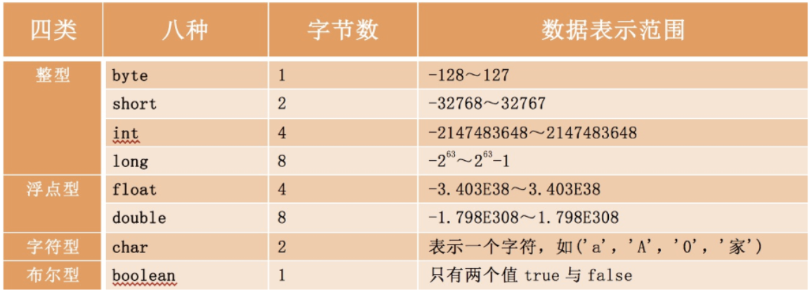

# 数据类型

基本数据类型不牵扯内存分配问题,而引用数据类型需要由开发者为其分配空间，基本类型保留的就是内容本身

## 基本数据类型

primitive主数据类型包括八种：

`boolean`,`char`, `byte`,`short`,`int`,`long`,`float`,`double`

除上述八种primitive主数据类型之外，其余类型都称之为引用数据类型；

- **数值型**

整形:`byte`,`short`,`int`,`long`	(**默认值0**)
浮点型:`float`,`double` (**默认值 0.0,小数默认double**)

- **字符型**

`char`	(**默认值'\u0000'**)

- **布尔型**

`boolean`	(**默认值false**)

## 引用数据类型

数组, 类, 接口	(默认值null)