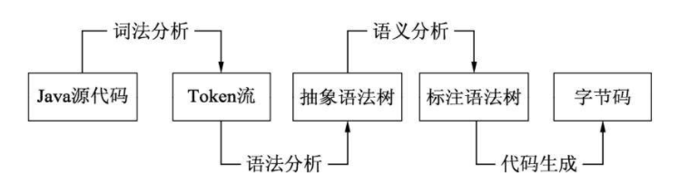

<!--
 * @Github       : https://github.com/superzhc/BigData-A-Question
 * @Author       : SUPERZHC
 * @CreateDate   : 2020-12-23 10:50:08
 * @LastEditTime : 2020-12-23 15:23:51
 * @Copyright 2020 SUPERZHC
-->
# 编译器-Javac

Javac 将 Java 源代码转变为字节码的过程中会涉及词法分析、语法分析、语义分析及代码生成等阶段，如下图所示：

