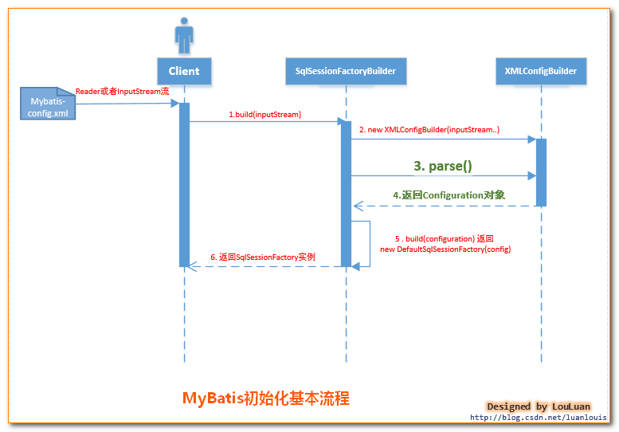
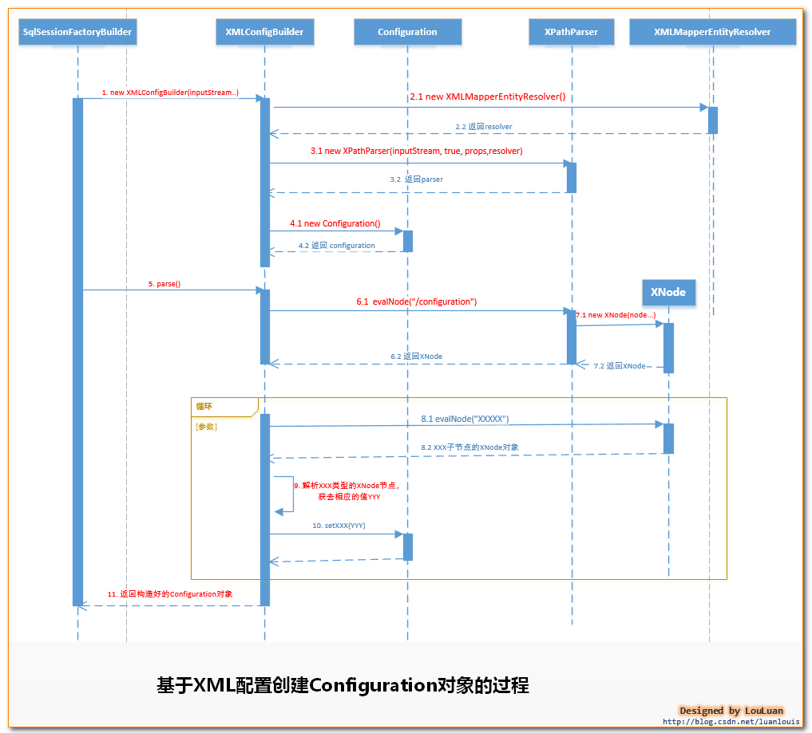

# Mybatis

## 基础

### mapper的xml配置文件

在配置文件中，mapper的namespace需要对应接口的全路径类名，如果不一致会报错。

#### MyBatis XML 标签类型说明

- resultMap 标签的类型属性为 type（必填）
- id, result 标签的类型属性为javaType（可选）
- idArg, arg 标签和上面两个类似，也都是 javaType（可选）
- association 标签的类型属性为 javaType（可选）
- discriminator 标签的类型属性为 javaType（可选）
- collection 这个标签最特殊，有两个类型属性，分别为 javaType（可选） 和 ofType（结果映射时必填）

### Mybatis参数

在使用MyBatis时，有两种使用方法。一种是使用的接口形式，另一种是通过SqlSession调用命名空间。这两种方式在传递参数时是不一样的，命名空间的方式更直接，但是多个参数时需要我们自己创建Map作为入参。相比而言，使用接口形式更简单。接口形式的参数是由MyBatis自己处理的。如果使用接口调用，入参需要经过额外的步骤处理入参，之后就和命名空间方式一样了。

参数的使用分为两部分：

- 第一种就是常见#{username}或者${username}
- 第二种就是在动态SQL中作为条件，例如`<if test="username!=null and username !=''">`

### MyBatis中的OGNL使用

#### MyBatis常用OGNL表达式

- e1 or e2
- e1 and e2
- e1 == e2,e1 eq e2
- e1 != e2,e1 neq e2
- e1 lt e2：小于
- e1 lte e2：小于等于，其他gt（大于）,gte（大于等于）
- e1 in e2
- e1 not in e2
- e1 + e2,e1 * e2,e1/e2,e1 - e2,e1%e2
- !e,not e：非，求反
- e.method(args)调用对象方法
- e.property对象属性值
- e1[ e2 ]按索引取值，List,数组和Map
- @class@method(args)调用类的静态方法
- @class@field调用类的静态字段值

### 动态SQL语句

mybatis 的动态sql语句是基于OGNL表达式的。

mybatis 动态SQL 语句主要有以下几类:

1. if 语句 (简单的条件判断)
2. choose (when,otherwize) ,相当于java 语言中的 switch ,与 jstl 中的choose 很类似.
3. trim (对包含的内容加上 prefix,或者 suffix 等，前缀，后缀)
4. where (主要是用来简化sql语句中where条件判断的，能智能的处理 and or ,不必担心多余导致语法错误)
5. set (主要用于更新时)
6. foreach (在实现 mybatis in 语句查询时特别有用)

## 原理

### 初始化机制

MyBatis使用org.apache.ibatis.session.Configuration 对象作为一个所有配置信息的容器，Configuration对象的组织结构和XML配置文件的组织结构几乎完全一样（当然，Configuration对象的功能并不限于此，它还负责创建一些MyBatis内部使用的对象，如Executor等)。

MyBatis初始化的过程，就是创建 Configuration对象的过程。

#### MyBatis的初始化方式

有两种方式：

- 基于XML配置文件：基于XML配置文件的方式是将MyBatis的所有配置信息放在XML文件中，MyBatis通过加载并XML配置文件，将配置文信息组装成内部的Configuration对象
- 基于Java API：这种方式不使用XML配置文件，需要MyBatis使用者在Java代码中，手动创建Configuration对象，然后将配置参数set 进入Configuration对象中

#### Mybatis初始化过程

Mybatis初始化的基本过程：

>SqlSessionFactoryBuilder根据传入的数据流生成Configuration对象，然后根据Configuration对象创建默认的SqlSessionFactory实例。

Mybatis初始化的序列图：



由上图所示，mybatis初始化要经过简单的以下几步：

1. 调用SqlSessionFactoryBuilder对象的build(inputStream)方法；
2. SqlSessionFactoryBuilder会根据输入流inputStream等信息创建XMLConfigBuilder对象;
3. SqlSessionFactoryBuilder调用XMLConfigBuilder对象的parse()方法；
4. XMLConfigBuilder对象返回Configuration对象；
5. SqlSessionFactoryBuilder根据Configuration对象创建一个DefaultSessionFactory对象；
6. SqlSessionFactoryBuilder返回 DefaultSessionFactory对象给Client，供Client使用。

初始化中涉及的几个对象：

- SqlSessionFactoryBuilder ： SqlSessionFactory的构造器，用于创建SqlSessionFactory，采用了Builder设计模式
- Configuration ：该对象是mybatis-config.xml文件中所有mybatis配置信息
- XmlConfigParser ：负责将mybatis-config.xml配置文件解析成Configuration对象，共SqlSessonFactoryBuilder使用，创建SqlSessionFactory
- SqlSessionFactory：SqlSession工厂类，以工厂形式创建SqlSession对象，采用了Factory工厂设计模式

#### Configuration对象

创建Configuration对象的过程：

1. XMLConfigBuilder会将XML配置文件的信息转换为Document对象，而XML配置定义文件DTD转换成XMLMapperEntityResolver对象，然后将二者封装到XpathParser对象中，XpathParser的作用是提供根据Xpath表达式获取基本的DOM节点Node信息的操作。
2. 之后XMLConfigBuilder调用parse()方法：会从XPathParser中取出 \<configuration\>节点对应的Node对象，然后解析此Node节点的子Node：properties, settings, typeAliases,typeHandlers, objectFactory, objectWrapperFactory, plugins, environments,databaseIdProvider, mappers  
    ```java
    public Configuration parse(){
        if (parsed)
        {
            throw new BuilderException("Each XMLConfigBuilder can only be used once.");
        }
        parsed = true;
        //源码中没有这一句，只有 parseConfiguration(parser.evalNode("/configuration"));
        //为了让读者看得更明晰，源码拆分为以下两句
        XNode configurationNode = parser.evalNode("/configuration");
        parseConfiguration(configurationNode);
        return configuration;
    }
    /*
    * 解析 "/configuration"节点下的子节点信息，然后将解析的结果设置到Configuration对象中
    */
    private void parseConfiguration(XNode root) {
        try {
            //1.首先处理properties 节点
            propertiesElement(root.evalNode("properties")); //issue #117 read properties first
            //2.处理typeAliases
            typeAliasesElement(root.evalNode("typeAliases"));
            //3.处理插件
            pluginElement(root.evalNode("plugins"));
            //4.处理objectFactory
            objectFactoryElement(root.evalNode("objectFactory"));
            //5.objectWrapperFactory
            objectWrapperFactoryElement(root.evalNode("objectWrapperFactory"));
            //6.settings
            settingsElement(root.evalNode("settings"));
            //7.处理environments
            environmentsElement(root.evalNode("environments")); // read it after objectFactory and objectWrapperFactory issue #631
            //8.database
            databaseIdProviderElement(root.evalNode("databaseIdProvider"));
            //9. typeHandlers
            typeHandlerElement(root.evalNode("typeHandlers"));
            //10 mappers,解析XML配置文件子节点<mappers>,它将解析我们配置的Mapper.xml配置文件，Mapper配置文件可以说是MyBatis的核心，MyBatis的特性和理念都体现在此Mapper的配置和设计上
            mapperElement(root.evalNode("mappers"));
        } catch (Exception e) {
            throw new BuilderException("Error parsing SQL Mapper Configuration. Cause: " + e, e);
        }
    }
    ```
3. 然后将这些值解析出来设置到Configuration对象中
4. 返回Configuration对象

MyBatis初始化基本过程的序列图细化:



### 一级缓存

MyBatis创建出一个SqlSession对象表示一次数据库会话。MyBatis在表示会话的SqlSession对象中建立一个简单的缓存，将每次查询到的结果结果缓存起来，当下次查询的时候，如果判断先前有个完全一样的查询，会直接从缓存中直接将结果取出，返回给用户，不需要再进行一次数据库查询了。


上图简单描述：

MyBatis会在一次会话的表示----一个SqlSession对象中创建一个本地缓存(local cache)，对于每一次查询，都会尝试根据查询的条件去本地缓存中查找是否在缓存中，如果在缓存中，就直接从缓存中取出，然后返回给用户；否则，从数据库读取数据，将查询结果存入缓存并返回给用户。

对于会话（Session）级别的数据缓存，我们称之为一级数据缓存，简称一级缓存。

### Mybatis架构设计

Mybatis的架构设计总结图：


#### 接口层

接口层---和数据库交互的方式。

MyBatis和数据库的交互有两种方式：

- 使用传统的MyBatis提供的API
- 使用Mapper接口

##### 使用传统的MyBatis提供的API


这是传统的传递Statement Id 和查询参数给SqlSession 对象，使用SqlSession对象完成和数据库的交互；MyBatis提供了非常方便和简单的API，供用户实现对数据库的增删改查数据操作，以及对数据库连接信息和MyBatis自身配置信息的维护操作。

##### 使用Mapper接口


MyBatis将配置文件中的每一个\<mapper\>节点抽象为一个 Mapper 接口，而这个接口中声明的方法和跟\<mapper\>节点中的\<select\|update\|delete\|insert\>节点项对应，即\<select\|update\|delete\|insert\>节点的id值为Mapper接口中的方法名称，parameterType值表示Mapper对应方法的入参类型，而resultMap值则对应了Mapper接口表示的返回值类型或者返回结果集的元素类型。

根据MyBatis的配置规范配置好后，通过SqlSession.getMapper(XXXMapper.class) 方法，MyBatis会根据相应的接口声明的方法信息，通过动态代理机制生成一个Mapper实例，使用Mapper接口的某一个方法时，MyBatis会根据这个方法的方法名和参数类型，确定Statement Id，底层还是通过SqlSession.select("statementId",parameterObject);或者SqlSession.update("statementId",parameterObject);等等来实现对数据库的操作。

MyBatis引用Mapper接口这种调用方式，纯粹是为了满足面向接口编程的需要。（其实还有一个原因是在于，面向接口的编程，使得用户在接口上可以使用注解来配置SQL语句，这样就可以脱离XML配置文件，实现“零配置”）

#### 数据处理层

数据处理层可以说是MyBatis的核心，从大的方面上讲，它要完成两个功能：

- 通过传入参数构建动态SQL语句；
- SQL语句的执行以及封装查询结果集成List\<E\>

##### 参数映射和动态SQL语句生成

动态语句生成可以说是MyBatis框架非常优雅的一个设计，MyBatis通过传入的参数值，使用Ognl 来动态地构造SQL语句，使得MyBatis有很强的灵活性和扩展性。

参数映射指的是对于Java数据类型和jdbc数据类型之间的转换：这里有包括两个过程：查询阶段，我们要将java类型的数据，转换成jdbc类型的数据，通过preparedStatement.setXXX()来设值；另一个就是对resultset查询结果集的jdbcType数据转换成java数据类型。

##### SQL语句的执行以及封装查询结果集成List\<E\>

动态SQL语句生成之后，MyBatis将执行SQL语句，并将可能返回的结果集转换成List\<E\>列表。MyBatis在对结果集的处理中，支持结果集关系一对多和多对一的转换，并且有两种支持方式，一种为嵌套查询语句的查询，还有一种是嵌套结果集的查询。

#### 框架支撑层

1. 事务管理机制
2. 连接池管理机制
3. 缓存机制
4. SQL语句的配置方式

#### 引导层

引导层是配置和启动MyBatis配置信息的方式。MyBatis提供两种方式来引导MyBatis：基于XML配置文件的方式和基于Java API的方式。

### MyBatis的主要构件及其相互关系

从MyBatis代码实现的角度来看，MyBatis的主要的核心部件有以下几个：

- SqlSession：作为MyBatis工作的主要顶层API，表示和数据库交互的会话，完成必要数据库增删改查功能
- Executor：MyBatis执行器，是MyBatis 调度的核心，负责SQL语句的生成和查询缓存的维护
- StatementHandler：封装了JDBC Statement操作，负责对JDBC statement 的操作，如设置参数、将Statement结果集转换成List集合。
- ParameterHandler：负责对用户传递的参数转换成JDBC Statement 所需要的参数，
- ResultSetHandler：负责将JDBC返回的ResultSet结果集对象转换成List类型的集合；
- TypeHandler：负责java数据类型和jdbc数据类型之间的映射和转换
- MappedStatement：MappedStatement维护了一条\<select|update|delete|insert\>节点的封装，
- SqlSource:负责根据用户传递的parameterObject，动态地生成SQL语句，将信息封装到BoundSql对象中，并返回
- BoundSql:表示动态生成的SQL语句以及相应的参数信息
- Configuration:MyBatis所有的配置信息都维持在Configuration对象之中。

关系图，如下：


## 知识片段

### 一、mybatis中的#和$的区别

\#相当于对数据 加上 双引号，$相当于直接显示数据。

1. \#将传入的数据都当成一个字符串，会对自动传入的数据加一个双引号。如：order by #user_id#，如果传入的值是111,那么解析成sql时的值为order by "111", 如果传入的值是id，则解析成的sql为order by "id"
2. \$将传入的数据直接显示生成在sql中。如：order by $user\_id$，如果传入的值是111,那么解析成sql时的值为order by user\_id,  如果传入的值是id，则解析成的sql为order by id
3. \#方式能够很大程度防止sql注入
4. \$方式无法防止Sql注入
5. \$方式一般用于传入数据库对象，例如传入表名
6. 一般能用#的就别用$.

**注：** MyBatis排序时使用order by 动态参数时需要注意，用$而不是#
