# Mybatis

## 概述

mybatis执行流程图:


执行流程：

1. 加载配置：在初始化的时候，会将MyBatis的配置信息全部加载到内存中，使用org.apache.ibatis.session.Configuration实例来维护。MyBatis的配置文件中配置信息的组织格式和内存中对象的组织格式几乎完全对应的。
2. 开启一个数据访问会话：创建SqlSession对象
3. 为SqlSession传递一个配置的Sql语句的 Statement Id 和参数，然后返回结果
4. MyBatis执行器Executor根据SqlSession传递的参数执行query()方法
5. StatementHandler对象负责设置Statement对象中的查询参数、处理JDBC返回的resultSet，将resultSet加工为List 集合返回

## 功能架构设计

mybatis功能架构图：


功能架构：

- API接口层：提供给外部使用的接口API，开发人员通过这些本地API来操纵数据库。接口层一接收到调用请求就会调用数据处理层来完成具体的数据处理。
- 数据处理层：负责具体的SQL查找、SQL解析、SQL执行和执行结果映射处理等。它主要的目的是根据调用的请求完成一次数据库操作。
- 框架支撑层：负责最基础的功能支撑，包括连接管理、事务管理、配置加载和缓存处理，这些都是共用的东西，将它们抽取出来作为最基础的组件。为上层的数据处理层提供最基础的支撑。

### 接口层--和数据库交互的方式

Mybatis和数据库的交互有两种方式：

- 使用传统的MyBatis提供的API
- 使用Mapper接口

#### 传统的MyBatis提供的API

就是传统的传递 Statement Id 和查询参数给 SqlSession 对象，使用 SqlSession 对象完成和数据库的交互；MyBatis 提供了非常方便和简单的API，供用户实现对数据库的增删改查数据操作，以及对数据库连接信息和 MyBatis 自身配置信息的维护操作。


上述使用MyBatis 的方法，是创建一个和数据库打交道的 SqlSession 对象，然后根据 Statement Id 和参数来操作数据库，这种方式固然很简单和实用，但是它不符合面向对象语言的概念和面向接口编程的编程习惯。由于面向接口的编程是面向对象的大趋势，MyBatis 为了适应这一趋势，增加了第二种使用MyBatis 支持接口（Interface）调用方式。

#### Mapper接口

MyBatis 将配置文件中的每一个 <mapper> 节点抽象为一个 Mapper 接口，而这个接口中声明的方法和跟 <mapper> 节点中的<select|update|delete|insert> 节点项对应，即<select|update|delete|insert> 节点的id值为Mapper 接口中的方法名称，parameterType 值表示Mapper 对应方法的入参类型，而 resultMap 值则对应了 Mapper 接口表示的返回值类型或者返回结果集的元素类型。


根据MyBatis 的配置规范配置好后，通过SqlSession.getMapper(XXXMapper.class) 方法，MyBatis 会根据相应的接口声明的方法信息，通过动态代理机制生成一个Mapper 实例，使用Mapper 接口的某一个方法时，MyBatis 会根据这个方法的方法名和参数类型，确定Statement Id，底层还是通过SqlSession.select("statementId",parameterObject);或者SqlSession.update("statementId",parameterObject); 等等来实现对数据库的操作。

MyBatis 引用Mapper 接口这种调用方式，纯粹是为了满足面向接口编程的需要。（其实还有一个原因是在于，面向接口的编程，使得用户在接口上可以使用注解来配置SQL语句，这样就可以脱离XML配置文件，实现“0配置”）。

### 数据处理层

数据处理层是 MyBatis 的核心，它主要完成一下功能：

- 通过传入参数构建动态SQL语句
- SQL语句的执行以及封装查询结果集成List<E>

#### 参数映射和动态SQL语句生成

动态语句生成可以说是MyBatis框架非常优雅的一个设计，MyBatis 通过传入的参数值，使用 Ognl 来动态地构造SQL语句，使得MyBatis 有很强的灵活性和扩展性。

参数映射指的是对于java 数据类型和jdbc数据类型之间的转换：这里有包括两个过程：查询阶段，要将java类型的数据，转换成jdbc类型的数据，通过 preparedStatement.setXXX() 来设值；另一个就是对resultset查询结果集的jdbcType 数据转换成java 数据类型。

#### SQL语句的执行以及封装查询结果集成List<E>

动态SQL语句生成之后，MyBatis 将执行SQL语句，并将可能返回的结果集转换成List<E> 列表。MyBatis 在对结果集的处理中，支持结果集关系一对多和多对一的转换，并且有两种支持方式，一种为嵌套查询语句的查询，还有一种是嵌套结果集的查询。

### 框架支撑层

#### 事务管理机制

事务管理机制对于ORM框架而言是不可缺少的一部分，事务管理机制的质量也是考量一个ORM框架是否优秀的一个标准。

##### 事务概述

对数据库的事务而言，应该具有以下几点：创建（create）、提交（commit）、回滚（rollback）、关闭（close）。对应地，MyBatis将事务抽象成了Transaction接口：其接口定义如下：

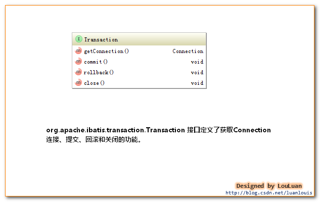

MyBatis的事务管理分为两种形式：

1. 使用JDBC的事务管理机制：即利用java.sql.Connection对象完成对事务的提交（commit()）、回滚（rollback()）、关闭（close()）等
2. 使用MANAGED的事务管理机制：这种机制MyBatis自身不会去实现事务管理，而是让程序的容器如（JBOSS，Weblogic）来实现对事务的管理

这两者的类图如下所示：

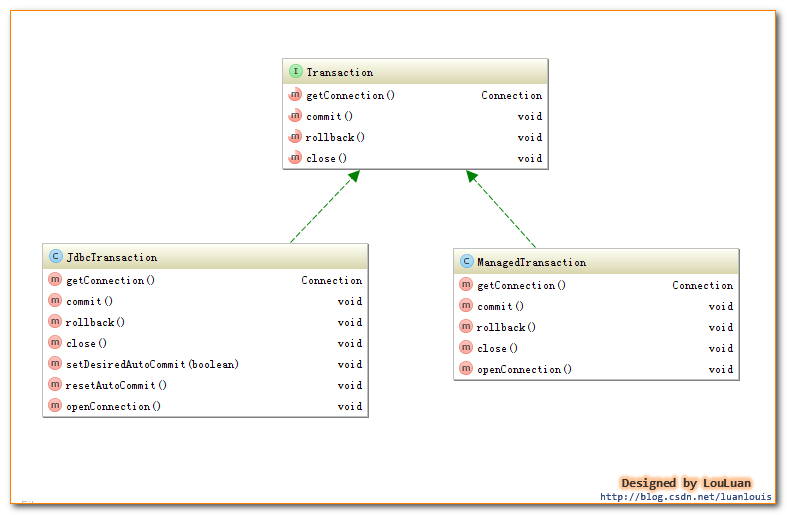

##### 事务的配置、创建和使用

- 事务的配置

在使用MyBatis时，一般会在MyBatisXML配置文件中定义类似如下的信息：

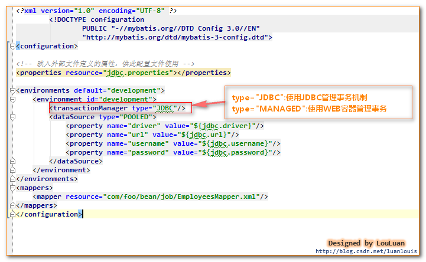

<environment>节点定义了连接某个数据库的信息，其子节点<transactionManager> 的type 会决定用什么类型的事务管理机制。

- 事务工厂的创建

MyBatis事务的创建是交给TransactionFactory 事务工厂来创建的，如果将<transactionManager>的type 配置为"JDBC",那么，在MyBatis初始化解析<environment>节点时，会根据type="JDBC"创建一个JdbcTransactionFactory工厂，其源码如下：

```java
/**
 * 解析<transactionManager>节点，创建对应的TransactionFactory
 * @param context
 * @return
 * @throws Exception
 */
private TransactionFactory transactionManagerElement(XNode context) throws Exception {
    if (context != null) {
        String type = context.getStringAttribute("type");
        Properties props = context.getChildrenAsProperties();
        /*
            在Configuration初始化的时候，会通过以下语句，给JDBC和MANAGED对应的工厂类
            typeAliasRegistry.registerAlias("JDBC", JdbcTransactionFactory.class);
            typeAliasRegistry.registerAlias("MANAGED", ManagedTransactionFactory.class);
            下述的resolveClass(type).newInstance()会创建对应的工厂实例
        */
        TransactionFactory factory = (TransactionFactory) resolveClass(type).newInstance();
        factory.setProperties(props);
        return factory;
    }
    throw new BuilderException("Environment declaration requires a TransactionFactory.");
}
```

如上述代码所示，如果type = "JDBC",则MyBatis会创建一个JdbcTransactionFactory.class 实例；如果type="MANAGED"，则MyBatis会创建一个MangedTransactionFactory.class实例。

MyBatis对<transactionManager>节点的解析会生成 TransactionFactory实例；而对<dataSource>解析会生成datasouce实例，作为<environment>节点，会根据TransactionFactory和DataSource实例创建一个Environment对象，代码如下所示：

```java
private void environmentsElement(XNode context) throws Exception {
    if (context != null) {
        if (environment == null) {
            environment = context.getStringAttribute("default");
        }
        for (XNode child : context.getChildren()) {
            String id = child.getStringAttribute("id");
            //是和默认的环境相同时，解析之
            if (isSpecifiedEnvironment(id)) {
            //1.解析<transactionManager>节点，决定创建什么类型的TransactionFactory
            TransactionFactory txFactory = transactionManagerElement(child.evalNode("transactionManager"));
            //2. 创建dataSource
            DataSourceFactory dsFactory = dataSourceElement(child.evalNode("dataSource"));
            DataSource dataSource = dsFactory.getDataSource();
            //3. 使用了Environment内置的构造器Builder，传递id 事务工厂TransactionFactory和数据源DataSource
            Environment.Builder environmentBuilder = new Environment.Builder(id)
                .transactionFactory(txFactory)
                .dataSource(dataSource);
            configuration.setEnvironment(environmentBuilder.build());
            }
        }
    }
}
```

Environment表示着一个数据库的连接，生成后的Environment对象会被设置到Configuration实例中，以供后续的使用。

- 事务工厂TransactionFactory

事务工厂Transaction定义了创建Transaction的两个方法：一个是通过指定的Connection对象创建Transaction，另外是通过数据源DataSource来创建Transaction。与JDBC 和MANAGED两种Transaction相对应，TransactionFactory有两个对应的实现的子类：如下所示：

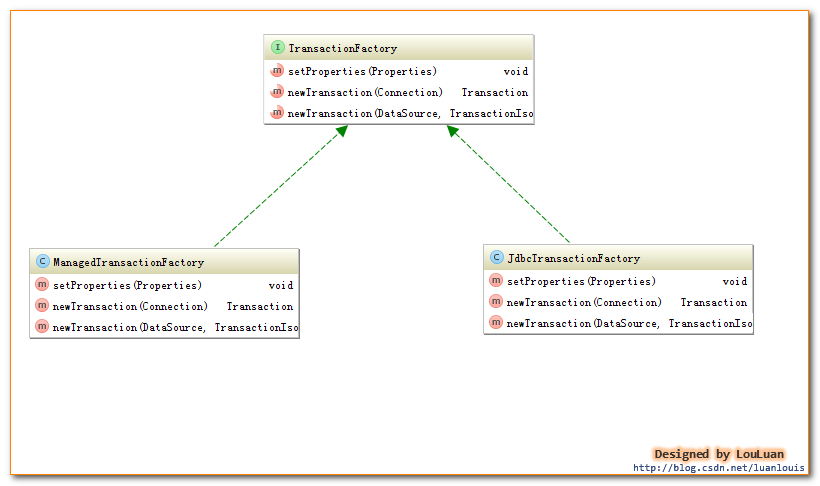

- 事务Transaction的创建

通过事务工厂TransactionFactory很容易获取到Transaction对象实例。以JdbcTransaction为例，看一下JdbcTransactionFactory是怎样生成JdbcTransaction的，代码如下：

```java
public class JdbcTransactionFactory implements TransactionFactory {

    public void setProperties(Properties props) {
    }

    /**
     * 根据给定的数据库连接Connection创建Transaction
     * @param conn Existing database connection
     * @return
     */
    public Transaction newTransaction(Connection conn) {
        return new JdbcTransaction(conn);
    }

    /**
     * 根据DataSource、隔离级别和是否自动提交创建Transacion
     *
     * @param ds
     * @param level Desired isolation level
     * @param autoCommit Desired autocommit
     * @return
     */
    public Transaction newTransaction(DataSource ds, TransactionIsolationLevel level, boolean autoCommit) {
        return new JdbcTransaction(ds, level, autoCommit);
    }
}
```

如上说是，JdbcTransactionFactory会创建JDBC类型的Transaction，即JdbcTransaction。类似地，ManagedTransactionFactory也会创建ManagedTransaction。下面我们会分别深入JdbcTranaction 和ManagedTransaction，看它们到底是怎样实现事务管理的。

- JdbcTransaction

JdbcTransaction直接使用JDBC的提交和回滚事务管理机制 。它依赖与从dataSource中取得的连接connection 来管理transaction 的作用域，connection对象的获取被延迟到调用getConnection()方法。如果autocommit设置为on，开启状态的话，它会忽略commit和rollback。

直观地讲，就是JdbcTransaction是使用的java.sql.Connection 上的commit和rollback功能，JdbcTransaction只是相当于对java.sql.Connection事务处理进行了一次包装（wrapper），Transaction的事务管理都是通过java.sql.Connection实现的。JdbcTransaction的代码实现如下：

```java
/**
 * @see JdbcTransactionFactory
 * @author Clinton Begin
 */
public class JdbcTransaction implements Transaction {

    private static final Log log = LogFactory.getLog(JdbcTransaction.class);

    //数据库连接
    protected Connection connection;
    //数据源
    protected DataSource dataSource;
    //隔离级别
    protected TransactionIsolationLevel level;
    //是否为自动提交
    protected boolean autoCommmit;

    public JdbcTransaction(DataSource ds, TransactionIsolationLevel desiredLevel, boolean desiredAutoCommit) {
        dataSource = ds;
        level = desiredLevel;
        autoCommmit = desiredAutoCommit;
    }

    public JdbcTransaction(Connection connection) {
        this.connection = connection;
    }

    public Connection getConnection() throws SQLException {
        if (connection == null) {
            openConnection();
        }
        return connection;
    }

    /**
     * commit()功能 使用connection的commit()
     * @throws SQLException
     */
    public void commit() throws SQLException {
        if (connection != null && !connection.getAutoCommit()) {
            if (log.isDebugEnabled()) {
                log.debug("Committing JDBC Connection [" + connection + "]");
            }
            connection.commit();
        }
    }

    /**
     * rollback()功能 使用connection的rollback()
     * @throws SQLException
     */
    public void rollback() throws SQLException {
        if (connection != null && !connection.getAutoCommit()) {
            if (log.isDebugEnabled()) {
                log.debug("Rolling back JDBC Connection [" + connection + "]");
            }
            connection.rollback();
        }
    }

    /**
     * close()功能 使用connection的close()
     * @throws SQLException
     */
    public void close() throws SQLException {
        if (connection != null) {
            resetAutoCommit();
            if (log.isDebugEnabled()) {
                log.debug("Closing JDBC Connection [" + connection + "]");
            }
            connection.close();
        }
    }

    protected void setDesiredAutoCommit(boolean desiredAutoCommit) {
        try {
            if (connection.getAutoCommit() != desiredAutoCommit) {
                if (log.isDebugEnabled()) {
                log.debug("Setting autocommit to " + desiredAutoCommit + " on JDBC Connection [" + connection + "]");
                }
                connection.setAutoCommit(desiredAutoCommit);
            }
        } catch (SQLException e) {
            // Only a very poorly implemented driver would fail here,
            // and there's not much we can do about that.
            throw new TransactionException("Error configuring AutoCommit.  "
                + "Your driver may not support getAutoCommit() or setAutoCommit(). "
                + "Requested setting: " + desiredAutoCommit + ".  Cause: " + e, e);
        }
    }

    protected void resetAutoCommit() {
        try {
            if (!connection.getAutoCommit()) {
                // MyBatis does not call commit/rollback on a connection if just selects were performed.
                // Some databases start transactions with select statements
                // and they mandate a commit/rollback before closing the connection.
                // A workaround is setting the autocommit to true before closing the connection.
                // Sybase throws an exception here.
                if (log.isDebugEnabled()) {
                log.debug("Resetting autocommit to true on JDBC Connection [" + connection + "]");
                }
                connection.setAutoCommit(true);
            }
        } catch (SQLException e) {
            log.debug("Error resetting autocommit to true "
                + "before closing the connection.  Cause: " + e);
        }
    }

    protected void openConnection() throws SQLException {
        if (log.isDebugEnabled()) {
            log.debug("Opening JDBC Connection");
        }
        connection = dataSource.getConnection();
        if (level != null) {
            connection.setTransactionIsolation(level.getLevel());
        }
        setDesiredAutoCommit(autoCommmit);
    }

}
```

- ManagedTransaction

ManagedTransaction让容器来管理事务Transaction的整个生命周期，意思就是说，使用ManagedTransaction的commit和rollback功能不会对事务有任何的影响，它什么都不会做，它将事务管理的权利移交给了容器来实现。如下Managed的实现代码：

```java
/**
 *
 * 让容器管理事务transaction的整个生命周期
 * connection的获取延迟到getConnection()方法的调用
 * 忽略所有的commit和rollback操作
 * 默认情况下，可以关闭一个连接connection，也可以配置它不可以关闭一个连接
 * 让容器来管理transaction的整个生命周期
 * @see ManagedTransactionFactory
 * @author Clinton Begin
 */
public class ManagedTransaction implements Transaction {

    private static final Log log = LogFactory.getLog(ManagedTransaction.class);

    private DataSource dataSource;
    private TransactionIsolationLevel level;
    private Connection connection;
    private boolean closeConnection;

    public ManagedTransaction(Connection connection, boolean closeConnection) {
        this.connection = connection;
        this.closeConnection = closeConnection;
    }

    public ManagedTransaction(DataSource ds, TransactionIsolationLevel level, boolean closeConnection) {
        this.dataSource = ds;
        this.level = level;
        this.closeConnection = closeConnection;
    }

    public Connection getConnection() throws SQLException {
        if (this.connection == null) {
            openConnection();
        }
        return this.connection;
    }

    public void commit() throws SQLException {
        // Does nothing
    }

    public void rollback() throws SQLException {
        // Does nothing
    }

    public void close() throws SQLException {
        if (this.closeConnection && this.connection != null) {
            if (log.isDebugEnabled()) {
                log.debug("Closing JDBC Connection [" + this.connection + "]");
            }
            this.connection.close();
        }
    }

    protected void openConnection() throws SQLException {
        if (log.isDebugEnabled()) {
            log.debug("Opening JDBC Connection");
        }
        this.connection = this.dataSource.getConnection();
        if (this.level != null) {
            this.connection.setTransactionIsolation(this.level.getLevel());
        }
    }

}
```

注意：如果使用MyBatis构建本地程序，即不是WEB程序，若将type设置成"MANAGED"，那么，执行的任何update操作，即使最后执行了commit操作，数据也不会保留，不会对数据库造成任何影响。因为将MyBatis配置成了“MANAGED”，即MyBatis自己不管理事务，而又是运行的本地程序，没有事务管理功能，所以对数据库的update操作都是无效的。

#### 连接池管理机制

由于创建一个数据库连接所占用的资源比较大， 对于数据吞吐量大和访问量非常大的应用而言，连接池的设计就显得非常重要。

##### 数据源DataSource分类

MyBatis把数据源DataSource分为三种：


类型     | 作用
:------:|:------------------
UNPOOLED | 不使用连接池的数据源
POOLED   | 使用连接池的数据源
JNDI     | 使用JNDI实现的数据源

相应地，MyBatis内部分别定义了实现了java.sql.DataSource接口的UnpooledDataSource，PooledDataSource类来表示UNPOOLED、POOLED类型的数据源。 如下图所示：


对于JNDI类型的数据源DataSource，则是通过JNDI上下文中取值。

##### DataSource创建过程

MyBatis数据源DataSource对象的创建发生在MyBatis初始化的过程中。

1. MyBatis在初始化时，解析mybatis的xml配置文件，根据<dataSource>的type属性来创建相应类型的的数据源DataSource，即：
    - type=”POOLED”   ：MyBatis会创建PooledDataSource实例
    - type=”UNPOOLED” ：MyBatis会创建UnpooledDataSource实例
    - type=”JNDI”     ：MyBatis会从JNDI服务上查找DataSource实例，然后返回使用
2. MyBatis是通过工厂模式来创建数据源DataSource对象的，MyBatis定义了抽象的工厂接口:org.apache.ibatis.datasource.DataSourceFactory,通过其getDataSource()方法返回数据源DataSource：
    ```java
    public interface DataSourceFactory {
    void setProperties(Properties props);
    //生产DataSource
    DataSource getDataSource();
    }
    ```

    其类图如下所示：

    
3. MyBatis创建了DataSource实例后，会将其放到Configuration对象内的Environment对象中， 供以后使用。

##### Connection对象的创建

当需要创建 SqlSession 对象并需要执行SQL语句时，这时候 MyBatis 才会去调用 dataSource 对象来创建 java.sql.Connection 对象。也就是说，java.sql.Connection 对象的创建一直延迟到执行SQL语句的时候。

比如，我们有如下方法执行一个简单的SQL语句：

```java
String resource = "mybatis-config.xml";
InputStream inputStream = Resources.getResourceAsStream(resource);
SqlSessionFactory sqlSessionFactory = new SqlSessionFactoryBuilder().build(inputStream);
SqlSession sqlSession = sqlSessionFactory.openSession();
sqlSession.selectList("SELECT * FROM STUDENTS");
```

前4句都不会导致java.sql.Connection对象的创建，只有当第5句 `sqlSession.selectList("SELECT * FROM STUDENTS")`，才会触发MyBatis在底层执行下面这个方法来创建java.sql.Connection对象：

```java
protected void openConnection() throws SQLException {
    if (log.isDebugEnabled()) {
        log.debug("Opening JDBC Connection");
    }
    connection = dataSource.getConnection();
    if (level != null) {
        connection.setTransactionIsolation(level.getLevel());
    }
    setDesiredAutoCommit(autoCommmit);
}
```

##### 不使用连接池的UnpooledDataSource

当 <dataSource>的type属性被配置成了”UNPOOLED”，MyBatis首先会实例化一个UnpooledDataSourceFactory工厂实例，然后通过getDataSource()方法返回一个UnpooledDataSource实例对象引用，假定为dataSource。

使用UnpooledDataSource的getConnection(),每调用一次就会产生一个新的Connection实例对象。

UnPooledDataSource的getConnection()方法实现如下：

```java
/*
 * UnpooledDataSource的getConnection()实现
 */
public Connection getConnection() throws SQLException
{
    return doGetConnection(username, password);
}

private Connection doGetConnection(String username, String password) throws SQLException
{
    //封装username和password成properties
    Properties props = new Properties();
    if (driverProperties != null)
    {
        props.putAll(driverProperties);
    }
    if (username != null)
    {
        props.setProperty("user", username);
    }
    if (password != null)
    {
        props.setProperty("password", password);
    }
    return doGetConnection(props);
}

/*
 *  获取数据连接
 */
private Connection doGetConnection(Properties properties) throws SQLException
{
    //1.初始化驱动
    initializeDriver();
    //2.从DriverManager中获取连接，获取新的Connection对象
    Connection connection = DriverManager.getConnection(url, properties);
    //3.配置connection属性
    configureConnection(connection);
    return connection;
}
```

如上代码所示，UnpooledDataSource会做以下事情：

1. 初始化驱动 ：判断driver驱动是否已经加载到内存中，如果还没有加载，则会动态地加载driver类，并实例化一个Driver对象，使用DriverManager.registerDriver()方法将其注册到内存中，以供后续使用。
2. 创建Connection对象 ：使用DriverManager.getConnection()方法创建连接。
3. 配置Connection对象 ：设置是否自动提交autoCommit和隔离级别isolationLevel。
4. 返回Connection对象。

上述的序列图如下所示：


总结：从上述的代码中可以看到，每调用一次getConnection()方法，都会通过DriverManager.getConnection()返回新的java.sql.Connection实例。

##### 使用了连接池的PooledDataSource

PooledDataSource将java.sql.Connection对象包裹成PooledConnection对象放到了PoolState类型的容器中维护。 MyBatis将连接池中的PooledConnection分为两种状态： 空闲状态（idle）和活动状态(active)，这两种状态的PooledConnection对象分别被存储到PoolState容器内的idleConnections和activeConnections两个List集合中：

- idleConnections:空闲(idle)状态PooledConnection对象被放置到此集合中，表示当前闲置的没有被使用的PooledConnection集合，调用PooledDataSource的getConnection()方法时，会优先从此集合中取PooledConnection对象。当用完一个java.sql.Connection对象时，MyBatis会将其包裹成PooledConnection对象放到此集合中。
- activeConnections:活动(active)状态的PooledConnection对象被放置到名为activeConnections的ArrayList中，表示当前正在被使用的PooledConnection集合，调用PooledDataSource的getConnection()方法时，会优先从idleConnections集合中取PooledConnection对象,如果没有，则看此集合是否已满，如果未满，PooledDataSource会创建出一个PooledConnection，添加到此集合中，并返回。

PoolState连接池的大致结构如下所示：


- 获取java.sql.Connection对象的过程

```java
public Connection getConnection() throws SQLException {
    return popConnection(dataSource.getUsername(), dataSource.getPassword()).getProxyConnection();
}

public Connection getConnection(String username, String password) throws SQLException {
    return popConnection(username, password).getProxyConnection();
}

/*
 * 传递一个用户名和密码，从连接池中返回可用的PooledConnection
 */
private PooledConnection popConnection(String username, String password) throws SQLException
{
    boolean countedWait = false;
    PooledConnection conn = null;
    long t = System.currentTimeMillis();
    int localBadConnectionCount = 0;

    while (conn == null)
    {
        synchronized (state)
        {
            if (state.idleConnections.size() > 0)
            {
                // 连接池中有空闲连接，取出第一个
                conn = state.idleConnections.remove(0);
                if (log.isDebugEnabled())
                {
                    log.debug("Checked out connection " + conn.getRealHashCode() + " from pool.");
                }
            }
            else
            {
                // 连接池中没有空闲连接，则取当前正在使用的连接数小于最大限定值，
                if (state.activeConnections.size() < poolMaximumActiveConnections)
                {
                    // 创建一个新的connection对象
                    conn = new PooledConnection(dataSource.getConnection(), this);
                    @SuppressWarnings("unused")
                    //used in logging, if enabled
                    Connection realConn = conn.getRealConnection();
                    if (log.isDebugEnabled())
                    {
                        log.debug("Created connection " + conn.getRealHashCode() + ".");
                    }
                }
                else
                {
                    // Cannot create new connection 当活动连接池已满，不能创建时，取出活动连接池的第一个，即最先进入连接池的PooledConnection对象
                    // 计算它的校验时间，如果校验时间大于连接池规定的最大校验时间，则认为它已经过期了，利用这个PoolConnection内部的realConnection重新生成一个PooledConnection
                    PooledConnection oldestActiveConnection = state.activeConnections.get(0);
                    long longestCheckoutTime = oldestActiveConnection.getCheckoutTime();
                    if (longestCheckoutTime > poolMaximumCheckoutTime)
                    {
                        // Can claim overdue connection
                        state.claimedOverdueConnectionCount++;
                        state.accumulatedCheckoutTimeOfOverdueConnections += longestCheckoutTime;
                        state.accumulatedCheckoutTime += longestCheckoutTime;
                        state.activeConnections.remove(oldestActiveConnection);
                        if (!oldestActiveConnection.getRealConnection().getAutoCommit())
                        {
                            oldestActiveConnection.getRealConnection().rollback();
                        }
                        conn = new PooledConnection(oldestActiveConnection.getRealConnection(), this);
                        oldestActiveConnection.invalidate();
                        if (log.isDebugEnabled())
                        {
                            log.debug("Claimed overdue connection " + conn.getRealHashCode() + ".");
                        }
                    }
                    else
                    {
                        //如果不能释放，则必须等待有
                        // Must wait
                        try
                        {
                            if (!countedWait)
                            {
                                state.hadToWaitCount++;
                                countedWait = true;
                            }
                            if (log.isDebugEnabled())
                            {
                                log.debug("Waiting as long as " + poolTimeToWait + " milliseconds for connection.");
                            }
                            long wt = System.currentTimeMillis();
                            state.wait(poolTimeToWait);
                            state.accumulatedWaitTime += System.currentTimeMillis() - wt;
                        }
                        catch (InterruptedException e)
                        {
                            break;
                        }
                    }
                }
            }

            //如果获取PooledConnection成功，则更新其信息
            if (conn != null)
            {
                if (conn.isValid())
                {
                    if (!conn.getRealConnection().getAutoCommit())
                    {
                        conn.getRealConnection().rollback();
                    }
                    conn.setConnectionTypeCode(assembleConnectionTypeCode(dataSource.getUrl(), username, password));
                    conn.setCheckoutTimestamp(System.currentTimeMillis());
                    conn.setLastUsedTimestamp(System.currentTimeMillis());
                    state.activeConnections.add(conn);
                    state.requestCount++;
                    state.accumulatedRequestTime += System.currentTimeMillis() - t;
                }
                else
                {
                    if (log.isDebugEnabled())
                    {
                        log.debug("A bad connection (" + conn.getRealHashCode() + ") was returned from the pool, getting another connection.");
                    }
                    state.badConnectionCount++;
                    localBadConnectionCount++;
                    conn = null;
                    if (localBadConnectionCount > (poolMaximumIdleConnections + 3))
                    {
                        if (log.isDebugEnabled())
                        {
                            log.debug("PooledDataSource: Could not get a good connection to the database.");
                        }
                        throw new SQLException("PooledDataSource: Could not get a good connection to the database.");
                    }
                }
            }
        }
    }

    if (conn == null)
    {
        if (log.isDebugEnabled())
        {
            log.debug("PooledDataSource: Unknown severe error condition.  The connection pool returned a null connection.");
        }
        throw new SQLException("PooledDataSource: Unknown severe error condition.  The connection pool returned a null connection.");
    }

    return conn;
}
```

流程步骤：

1. 先看是否有空闲(idle)状态下的PooledConnection对象，如果有，就直接返回一个可用的PooledConnection对象；否则进行第2步。
2. 查看活动状态的PooledConnection池activeConnections是否已满；如果没有满，则创建一个新的PooledConnection对象，然后放到activeConnections池中，然后返回此PooledConnection对象；否则进行第三步；
3. 看最先进入activeConnections池中的PooledConnection对象是否已经过期：如果已经过期，从activeConnections池中移除此对象，然后创建一个新的PooledConnection对象，添加到activeConnections中，然后将此对象返回；否则进行第4步。
4. 线程等待，循环2步

对应的处理流程图如下所示：


如上所示,对于PooledDataSource的getConnection()方法内，先是调用类PooledDataSource的popConnection()方法返回了一个PooledConnection对象，然后调用了PooledConnection的getProxyConnection()来返回Connection对象。

MyBatis的PooledDataSource的PoolState内部维护的对象是PooledConnection类型的对象，而PooledConnection则是对真正的数据库连接java.sql.Connection实例对象的包裹器。

PooledConnection对象内持有一个真正的数据库连接java.sql.Connection实例对象和一个java.sql.Connection的代理：

其部分定义如下：

```java
class PooledConnection implements InvocationHandler {
  
  //......
  //所创建它的datasource引用
  private PooledDataSource dataSource;
  //真正的Connection对象
  private Connection realConnection;
  //代理自己的代理Connection
  private Connection proxyConnection;
  
  //......
}

PooledConenction实现了InvocationHandler接口，并且，proxyConnection对象也是根据这个它来生成的代理对象：
public PooledConnection(Connection connection, PooledDataSource dataSource) {
    this.hashCode = connection.hashCode();
    this.realConnection = connection;
    this.dataSource = dataSource;
    this.createdTimestamp = System.currentTimeMillis();
    this.lastUsedTimestamp = System.currentTimeMillis();
    this.valid = true;
    this.proxyConnection = (Connection) Proxy.newProxyInstance(Connection.class.getClassLoader(), IFACES, this);
}
```

实际上，调用PooledDataSource的getConnection()方法返回的就是这个proxyConnection对象。

当调用此proxyConnection对象上的任何方法时，都会调用PooledConnection对象内invoke()方法。PooledConnection类中的invoke()方法定义如下：

```java
public Object invoke(Object proxy, Method method, Object[] args) throws Throwable {
    String methodName = method.getName();
    //当调用关闭的时候，回收此Connection到PooledDataSource中
    if (CLOSE.hashCode() == methodName.hashCode() && CLOSE.equals(methodName)) {
      dataSource.pushConnection(this);
      return null;
    } else {
        try {
            if (!Object.class.equals(method.getDeclaringClass())) {
                checkConnection();
            }
            return method.invoke(realConnection, args);
        } catch (Throwable t) {
            throw ExceptionUtil.unwrapThrowable(t);
        }
    }
}
```

从上述代码可以看到，当使用了pooledDataSource.getConnection()返回的Connection对象的close()方法时，不会调用真正Connection的close()方法，而是将此Connection对象放到连接池中。

##### JNDI类型的数据源DataSource

对于JNDI类型的数据源DataSource的获取就比较简单，MyBatis定义了一个JndiDataSourceFactory工厂来创建通过JNDI形式生成的DataSource。

JndiDataSourceFactory的关键代码：

```java
if (properties.containsKey(INITIAL_CONTEXT)
        && properties.containsKey(DATA_SOURCE))
{
    //从JNDI上下文中找到DataSource并返回
    Context ctx = (Context) initCtx.lookup(properties.getProperty(INITIAL_CONTEXT));
    dataSource = (DataSource) ctx.lookup(properties.getProperty(DATA_SOURCE));
}
else if (properties.containsKey(DATA_SOURCE))
{
    // //从JNDI上下文中找到DataSource并返回
    dataSource = (DataSource) initCtx.lookup(properties.getProperty(DATA_SOURCE));
}
```

#### 缓存机制

为了提高数据利用率和减小服务器和数据库的压力，MyBatis 会对于一些查询提供会话级别的数据缓存，会将对某一次查询，放置到SqlSession 中，在允许的时间间隔内，对于完全相同的查询，MyBatis 会直接将缓存结果返回给用户，而不用再到数据库中查找。

##### MyBatis缓存机制的设计与实现

MyBatis将数据缓存设计成两级结构，分为一级缓存、二级缓存：

- 一级缓存是Session会话级别的缓存，位于表示一次数据库会话的SqlSession对象之中，又被称之为本地缓存。一级缓存是MyBatis内部实现的一个特性，用户不能配置，默认情况下自动支持的缓存，用户没有定制它的权利（不过这也不是绝对的，可以通过开发插件对它进行修改）；
- 二级缓存是Application应用级别的缓存，它的是生命周期很长，跟Application的声明周期一样，也就是说它的作用范围是整个Application应用。

MyBatis中一级缓存和二级缓存的组织如下图所示：


一级缓存的工作机制：

> 一级缓存是Session会话级别的，一般而言，一个SqlSession对象会使用一个Executor对象来完成会话操作，Executor对象会维护一个Cache缓存，以提高查询性能。

二级缓存的工作机制：

> 一个SqlSession对象会使用一个Executor对象来完成会话操作，MyBatis的二级缓存机制的关键就是对这个Executor对象做文章。如果配置了"cacheEnabled=true"，那么MyBatis在为SqlSession对象创建Executor对象时，会对Executor对象加上一个装饰者：CachingExecutor，这时SqlSession使用CachingExecutor对象来完成操作请求。CachingExecutor对于查询请求，会先判断该查询请求在Application级别的二级缓存中是否有缓存结果，如果有查询结果，则直接返回缓存结果；如果缓存中没有，再交给真正的Executor对象来完成查询操作，之后CachingExecutor会将真正Executor返回的查询结果放置到缓存中，然后在返回给用户。

MyBatis的二级缓存设计得比较灵活，可以使用MyBatis自己定义的二级缓存实现；也可以通过实现org.apache.ibatis.cache.Cache接口自定义缓存；也可以使用第三方内存缓存库，如Memcached等。

##### 一级缓存

###### 什么是一级缓存？ 为什么使用一级缓存？

每当使用MyBatis开启一次和数据库的会话，MyBatis会创建出一个SqlSession对象表示一次数据库会话。

在对数据库的一次会话中，有可能会反复地执行完全相同的查询语句，如果不采取一些措施的话，每一次查询都会查询一次数据库,而在极短的时间内做了完全相同的查询，那么它们的结果极有可能完全相同，由于查询一次数据库的代价很大，这有可能造成很大的资源浪费。

为了解决这一问题，减少资源的浪费，MyBatis会在表示会话的SqlSession对象中建立一个简单的缓存，将每次查询到的结果结果缓存起来，当下次查询的时候，如果判断先前有个完全一样的查询，会直接从缓存中直接将结果取出，返回给用户，不需要再进行一次数据库查询了。

如下图所示，MyBatis会在一次会话的表示----一个SqlSession对象中创建一个本地缓存(local cache)，对于每一次查询，都会尝试根据查询的条件去本地缓存中查找是否在缓存中，如果在缓存中，就直接从缓存中取出，然后返回给用户；否则，从数据库读取数据，将查询结果存入缓存并返回给用户。


> 对于会话（Session）级别的数据缓存，称之为一级数据缓存，简称一级缓存。

###### MyBatis中的一级缓存是怎样组织的？（即SqlSession中的缓存是怎样组织的？）

由于MyBatis使用SqlSession对象表示一次数据库的会话，那么，对于会话级别的一级缓存也应该是在SqlSession中控制的。

实际上, SqlSession 只是一个MyBatis对外的接口，SqlSession将它的工作交给了Executor执行器这个角色来完成，负责完成对数据库的各种操作。当创建了一个SqlSession对象时，MyBatis会为这个SqlSession对象创建一个新的Executor执行器，而缓存信息就被维护在这个Executor执行器中，MyBatis将缓存和对缓存相关的操作封装成了Cache接口中。SqlSession、Executor、Cache之间的关系如下列类图所示：


如上述的类图所示，Executor接口的实现类BaseExecutor中拥有一个Cache接口的实现类PerpetualCache，则对于BaseExecutor对象而言，它将使用PerpetualCache对象维护缓存。

综上，SqlSession对象、Executor对象、Cache对象之间的关系如下图所示：


由于Session级别的一级缓存实际上就是使用PerpetualCache维护的，那么PerpetualCache是怎样实现的呢？

PerpetualCache实现原理其实很简单，其内部就是通过一个简单的HashMap<k,v> 来实现的，没有其他的任何限制。如下是PerpetualCache的实现代码：

```java
package org.apache.ibatis.cache.impl;

import java.util.HashMap;
import java.util.Map;
import java.util.concurrent.locks.ReadWriteLock;

import org.apache.ibatis.cache.Cache;
import org.apache.ibatis.cache.CacheException;

/**
 * 使用简单的HashMap来维护缓存
 * @author Clinton Begin
 */
public class PerpetualCache implements Cache {

    private String id;

    private Map<Object, Object> cache = new HashMap<Object, Object>();

    public PerpetualCache(String id) {
        this.id = id;
    }

    public String getId() {
        return id;
    }

    public int getSize() {
        return cache.size();
    }

    public void putObject(Object key, Object value) {
        cache.put(key, value);
    }

    public Object getObject(Object key) {
        return cache.get(key);
    }

    public Object removeObject(Object key) {
        return cache.remove(key);
    }

    public void clear() {
        cache.clear();
    }

    public ReadWriteLock getReadWriteLock() {
        return null;
    }

    public boolean equals(Object o) {
        if (getId() == null) throw new CacheException("Cache instances require an ID.");
        if (this == o) return true;
        if (!(o instanceof Cache)) return false;

        Cache otherCache = (Cache) o;
        return getId().equals(otherCache.getId());
    }

    public int hashCode() {
        if (getId() == null) throw new CacheException("Cache instances require an ID.");
        return getId().hashCode();
    }
}
```

###### 一级缓存的生命周期有多长？

- MyBatis在开启一个数据库会话时，会创建一个新的SqlSession对象，SqlSession对象中会有一个新的Executor对象，Executor对象中持有一个新的PerpetualCache对象；当会话结束时，SqlSession对象及其内部的Executor对象还有PerpetualCache对象也一并释放掉。
- 如果SqlSession调用了close()方法，会释放掉一级缓存PerpetualCache对象，一级缓存将不可用；
- 如果SqlSession调用了clearCache()，会清空PerpetualCache对象中的数据，但是该对象仍可使用；
- SqlSession中执行了任何一个update操作(update()、delete()、insert()) ，都会清空PerpetualCache对象的数据，但是该对象可以继续使用；

SqlSession 一级缓存的工作流程：

1. 对于某个查询，根据statementId,params,rowBounds来构建一个key值，根据这个key值去缓存Cache中取出对应的key值存储的缓存结果；
2. 判断从Cache中根据特定的key值取的数据数据是否为空，即是否命中；
3. 如果命中，则直接将缓存结果返回；
4. 如果没命中：
    1. 去数据库中查询数据，得到查询结果；
    2. 将key和查询到的结果分别作为key,value对存储到Cache中；
    3. 将查询结果返回；
5. 结束。

###### Cache接口的设计以及CacheKey的定义

如下图所示，MyBatis定义了一个org.apache.ibatis.cache.Cache接口作为其Cache提供者的SPI(Service Provider Interface) ，所有的MyBatis内部的Cache缓存，都应该实现这一接口。MyBatis定义了一个PerpetualCache实现类实现了Cache接口，实际上，在SqlSession对象里的Executor 对象内维护的Cache类型实例对象，就是PerpetualCache子类创建的。


Cache最核心的实现其实就是一个Map，将本次查询使用的特征值作为key，将查询结果作为value存储到Map中。

- Cache中key的设定规则

MyBatis认为，对于两次查询，如果以下条件都完全一样，那么就认为它们是完全相同的两次查询：

1. 传入的 statementId
2. 查询时要求的结果集中的结果范围 （结果的范围通过rowBounds.offset和rowBounds.limit表示）；
3. 这次查询所产生的最终要传递给JDBC java.sql.Preparedstatement的Sql语句字符串（boundSql.getSql() ）
4. 传递给java.sql.Statement要设置的参数值

现在分别解释上述四个条件：

1. 传入的statementId，对于MyBatis而言，你要使用它，必须需要一个statementId，它代表着你将执行什么样的Sql；
2. MyBatis自身提供的分页功能是通过RowBounds来实现的，它通过rowBounds.offset和rowBounds.limit来过滤查询出来的结果集，这种分页功能是基于查询结果的再过滤，而不是进行数据库的物理分页；

由于MyBatis底层还是依赖于JDBC实现的，那么，对于两次完全一模一样的查询，MyBatis要保证对于底层JDBC而言，也是完全一致的查询才行。而对于JDBC而言，两次查询，只要传入给JDBC的SQL语句完全一致，传入的参数也完全一致，就认为是两次查询是完全一致的。

上述的第3个条件正是要求保证传递给JDBC的SQL语句完全一致；第4条则是保证传递给JDBC的参数也完全一致；

第4个条件讲的有可能比较含糊，举一个例子：

```xml
<select id="selectByCritiera" parameterType="java.util.Map" resultMap="BaseResultMap">
    select employee_id,first_name,last_name,email,salary
    from louis.employees
    where  employee_id = #{employeeId}
    and first_name= #{firstName}
    and last_name = #{lastName}
    and email = #{email}
</select>
```

如果使用上述的"selectByCritiera"进行查询，那么，MyBatis会将上述的SQL中的#{} 都替换成 ? 如下：

```sql
select employee_id,first_name,last_name,email,salary
from louis.employees
where  employee_id = ?
and first_name= ?
and last_name = ?
and email = ?
```

MyBatis最终会使用上述的SQL字符串创建JDBC的java.sql.PreparedStatement对象，对于这个PreparedStatement对象，还需要对它设置参数，调用setXXX()来完成设值，第4条的条件，就是要求对设置JDBC的PreparedStatement的参数值也要完全一致。
即3、4两条MyBatis最本质的要求就是：调用JDBC的时候，传入的SQL语句要完全相同，传递给JDBC的参数值也要完全相同。

综上所述,CacheKey由以下条件决定：

> statementId  + rowBounds  + 传递给JDBC的SQL  + 传递给JDBC的参数值

- CacheKey的创建

对于每次的查询请求，Executor都会根据传递的参数信息以及动态生成的SQL语句，将上面的条件根据一定的计算规则，创建一个对应的CacheKey对象。

创建CacheKey的目的，就两个：

1. 根据CacheKey作为key,去Cache缓存中查找缓存结果；
2. 如果查找缓存命中失败，则通过此CacheKey作为key，将从数据库查询到的结果作为value，组成key,value对存储到Cache缓存中。

CacheKey的构建被放置到了Executor接口的实现类BaseExecutor中，定义如下：

```java
/**
 * 所属类:  org.apache.ibatis.executor.BaseExecutor
 * 功能   :   根据传入信息构建CacheKey
 */
public CacheKey createCacheKey(MappedStatement ms, Object parameterObject, RowBounds rowBounds, BoundSql boundSql) {
    if (closed) throw new ExecutorException("Executor was closed.");
    CacheKey cacheKey = new CacheKey();
    //1.statementId
    cacheKey.update(ms.getId());
    //2. rowBounds.offset
    cacheKey.update(rowBounds.getOffset());
    //3. rowBounds.limit
    cacheKey.update(rowBounds.getLimit());
    //4. SQL语句
    cacheKey.update(boundSql.getSql());
    //5. 将每一个要传递给JDBC的参数值也更新到CacheKey中
    List<ParameterMapping> parameterMappings = boundSql.getParameterMappings();
    TypeHandlerRegistry typeHandlerRegistry = ms.getConfiguration().getTypeHandlerRegistry();
    for (int i = 0; i < parameterMappings.size(); i++) { // mimic DefaultParameterHandler logic
        ParameterMapping parameterMapping = parameterMappings.get(i);
        if (parameterMapping.getMode() != ParameterMode.OUT) {
            Object value;
            String propertyName = parameterMapping.getProperty();
            if (boundSql.hasAdditionalParameter(propertyName)) {
                value = boundSql.getAdditionalParameter(propertyName);
            } else if (parameterObject == null) {
                value = null;
            } else if (typeHandlerRegistry.hasTypeHandler(parameterObject.getClass())) {
                value = parameterObject;
            } else {
                MetaObject metaObject = configuration.newMetaObject(parameterObject);
                value = metaObject.getValue(propertyName);
            }
            //将每一个要传递给JDBC的参数值也更新到CacheKey中
            cacheKey.update(value);
        }
    }
    return cacheKey;
}
```

- CacheKey的hashcode生成算法

Cache接口的实现，本质上是使用的HashMap<k,v>,而构建CacheKey的目的就是为了作为HashMap<k,v>中的key值。而HashMap是通过key值的hashcode 来组织和存储的，那么，构建CacheKey的过程实际上就是构造其hashCode的过程。下面的代码就是CacheKey的核心hashcode生成算法：

```java
public void update(Object object) {
    if (object != null && object.getClass().isArray()) {
      int length = Array.getLength(object);
      for (int i = 0; i < length; i++) {
        Object element = Array.get(object, i);
        doUpdate(element);
      }
    } else {
      doUpdate(object);
    }
}

private void doUpdate(Object object) {
    //1. 得到对象的hashcode;  
    int baseHashCode = object == null ? 1 : object.hashCode();
    //对象计数递增
    count++;
    checksum += baseHashCode;
    //2. 对象的hashcode 扩大count倍
    baseHashCode *= count;
    //3. hashCode * 拓展因子（默认37）+拓展扩大后的对象hashCode值
    hashcode = multiplier * hashcode + baseHashCode;
    updateList.add(object);
}
```

###### 一级缓存的性能分析

从两个一级缓存的特性来讨论SqlSession的一级缓存性能问题：

- MyBatis对会话（Session）级别的一级缓存设计的比较简单，就简单地使用了HashMap来维护，并没有对HashMap的容量和大小进行限制。

这样的话，如果我一直使用某一个SqlSession对象查询数据，这样会不会导致HashMap太大，而导致 java.lang.OutOfMemoryError错误啊？

MyBatis这样设计也有它自己的理由：

1. 一般而言SqlSession的生存时间很短。一般情况下使用一个SqlSession对象执行的操作不会太多，执行完就会消亡；
2. 对于某一个SqlSession对象而言，只要执行update操作（update、insert、delete），都会将这个SqlSession对象中对应的一级缓存清空掉，所以一般情况下不会出现缓存过大，影响JVM内存空间的问题；
3. 可以手动地释放掉SqlSession对象中的缓存。

- 一级缓存是一个粗粒度的缓存，没有更新缓存和缓存过期的概念

MyBatis的一级缓存就是使用了简单的HashMap，MyBatis只负责将查询数据库的结果存储到缓存中去，不会去判断缓存存放的时间是否过长、是否过期，因此也就没有对缓存的结果进行更新这一说了。

根据一级缓存的特性，在使用的过程中，应该注意：

1. 对于数据变化频率很大，并且需要高时效准确性的数据要求，使用SqlSession查询的时候，要控制好SqlSession的生存时间，SqlSession的生存时间越长，它其中缓存的数据有可能就越旧，从而造成和真实数据库的误差；同时对于这种情况，用户也可以手动地适时清空SqlSession中的缓存；
2. 对于只执行、并且频繁执行大范围的select操作的SqlSession对象，SqlSession对象的生存时间不应过长。

##### 二级缓存

MyBatis的二级缓存是Application级别的缓存，它可以提高对数据库查询的效率，以提高应用的性能。

###### 二级缓存的工作模式

当开一个会话时，一个SqlSession对象会使用一个Executor对象来完成会话操作，MyBatis的二级缓存机制的关键就是对这个Executor对象做文章。如果配置了"cacheEnabled=true"，那么MyBatis在为SqlSession对象创建Executor对象时，会对Executor对象加上一个装饰者：CachingExecutor，这时SqlSession使用CachingExecutor对象来完成操作请求。CachingExecutor对于查询请求，会先判断该查询请求在Application级别的二级缓存中是否有缓存结果，如果有查询结果，则直接返回缓存结果；如果缓存中没有，再交给真正的Executor对象来完成查询操作，之后CachingExecutor会将真正Executor返回的查询结果放置到缓存中，然后在返回给用户。


CachingExecutor是Executor的装饰者，以增强Executor的功能，使其具有缓存查询的功能，这里用到了设计模式中的装饰者模式，CachingExecutor和Executor的接口的关系如下类图所示：


###### MyBatis二级缓存的划分

MyBatis并不是简单地对整个Application就只有一个Cache缓存对象，它将缓存划分的更细，即是Mapper级别的，即每一个Mapper都可以拥有一个Cache对象，具体如下：

- 为每一个Mapper分配一个Cache缓存对象（使用<cache>节点配置）；
- 多个Mapper共用一个Cache缓存对象（使用<cache-ref>节点配置）；

如果想让多个Mapper公用一个Cache的话，可以使用<cache-ref namespace="">节点，来指定你的这个Mapper使用到了哪一个Mapper的Cache缓存。

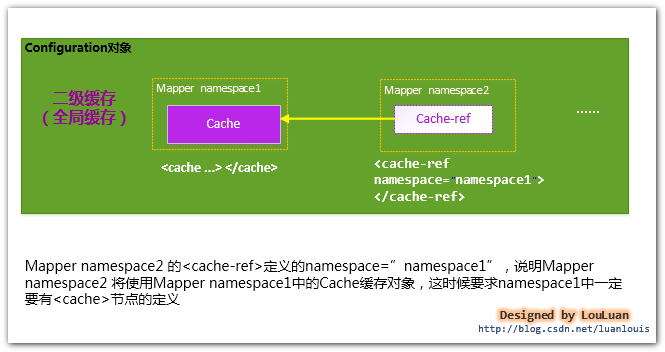

###### 使用二级缓存，必须要具备的条件

MyBatis对二级缓存的支持粒度很细，它会指定某一条查询语句是否使用二级缓存。

虽然在Mapper中配置了<cache>,并且为此Mapper分配了Cache对象，这并不表示使用Mapper中定义的查询语句查到的结果都会放置到Cache对象之中，必须指定Mapper中的某条选择语句是否支持缓存，即如下所示，在<select> 节点中配置useCache="true"，Mapper才会对此Select的查询支持缓存特性，否则，不会对此Select查询，不会经过Cache缓存。如下所示，Select语句配置了useCache="true"，则表明这条Select语句的查询会使用二级缓存。

`
<select id="selectByMinSalary" resultMap="BaseResultMap" parameterType="java.util.Map" useCache="true">
`

总之，要想使某条Select查询支持二级缓存，需要保证：

1. MyBatis支持二级缓存的总开关：全局配置变量参数   cacheEnabled=true
2. 该select语句所在的Mapper，配置了<cache> 或<cached-ref>节点，并且有效
3. 该select语句的参数 useCache=true

###### 一级缓存和二级缓存的使用顺序

请注意，如果MyBatis使用了二级缓存，并且Mapper和select语句也配置使用了二级缓存，那么在执行select查询的时候，MyBatis会先从二级缓存中取输入，其次才是一级缓存，即MyBatis查询数据的顺序是：

> 二级缓存 ———> 一级缓存 ——> 数据库

###### 二级缓存实现的选择

MyBatis对二级缓存的设计非常灵活，它自己内部实现了一系列的Cache缓存实现类，并提供了各种缓存刷新策略如LRU，FIFO等等；另外，MyBatis还允许用户自定义Cache接口实现，用户是需要实现org.apache.ibatis.cache.Cache接口，然后将Cache实现类配置在<cache  type="">节点的type属性上即可；除此之外，MyBatis还支持跟第三方内存缓存库如Memecached的集成，总之，使用MyBatis的二级缓存有三个选择:

1. MyBatis自身提供的缓存实现；
2. 用户自定义的Cache接口实现；
3. 跟第三方内存缓存库的集成；

###### MyBatis自身提供的二级缓存的实现

MyBatis自身提供了丰富的，并且功能强大的二级缓存的实现，它拥有一系列的Cache接口装饰者，可以满足各种对缓存操作和更新的策略。

MyBatis定义了大量的Cache的装饰器来增强Cache缓存的功能，如下类图所示：

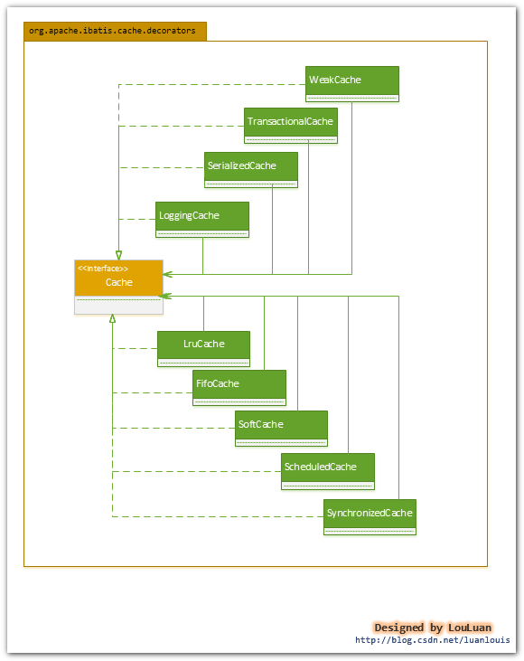

对于每个Cache而言，都有一个容量限制，MyBatis各供了各种策略来对Cache缓存的容量进行控制，以及对Cache中的数据进行刷新和置换。MyBatis主要提供了以下几个刷新和置换策略：

- LRU：（Least Recently Used）,最近最少使用算法，即如果缓存中容量已经满了，会将缓存中最近做少被使用的缓存记录清除掉，然后添加新的记录；
- FIFO：（First in first out）,先进先出算法，如果缓存中的容量已经满了，那么会将最先进入缓存中的数据清除掉；
- Scheduled：指定时间间隔清空算法，该算法会以指定的某一个时间间隔将Cache缓存中的数据清空；

#### SQL语句的配置方式[TODO]

传统的MyBatis 配置SQL 语句方式就是使用XML文件进行配置的，但是这种方式不能很好地支持面向接口编程的理念，为了支持面向接口的编程，MyBatis 引入了Mapper接口的概念，面向接口的引入，对使用注解来配置SQL 语句成为可能，用户只需要在接口上添加必要的注解即可，不用再去配置XML文件了，但是，目前的MyBatis 只是对注解配置SQL 语句提供了有限的支持，某些高级功能还是要依赖XML配置文件配置SQL 语句。

### 引导层

引导层是配置和启动 MyBatis 配置信息的方式。MyBatis 提供两种方式来引导 MyBatis ：基于XML配置文件的方式和基于Java API 的方式

#### 初始化机制

Mybatis框架的初始化，是为了加载自己运行时所需要的配置信息。MyBatis的配置信息，大概包含以下信息，其高层级结构如下：

- configuration 配置
    - properties 属性
    - settings 设置
    - typeAliases 类型命名
    - typeHandlers 类型处理器
    - objectFactory 对象工厂
    - plugins 插件
    - environments 环境
        - environment 环境变量
        - transactionManager 事务管理器
        - dataSource 数据源
- 映射器

MyBatis采用了一个非常直白和简单的方式，使用 org.apache.ibatis.session.Configuration 对象作为一个所有配置信息的容器，Configuration对象的组织结构和XML配置文件的组织结构几乎完全一样（当然，Configuration对象的功能并不限于此，它还负责创建一些MyBatis内部使用的对象，如Executor等。如下图所示：


> 可以这么说，MyBatis初始化的过程，就是创建 Configuration对象的过程。

MyBatis的初始化可以有两种方式：

- 基于XML配置文件：基于XML配置文件的方式是将MyBatis的所有配置信息放在XML文件中，MyBatis通过加载并XML配置文件，将配置文信息组装成内部的Configuration对象
- 基于Java API：这种方式不使用XML配置文件，需要MyBatis使用者在Java代码中，手动创建Configuration对象，然后将配置参数set 进入Configuration对象中

##### MyBatis基于XML配置文件创建Configuration对象的过程

MyBatis初始化基本过程：

SqlSessionFactoryBuilder根据传入的数据流生成Configuration对象，然后根据Configuration对象创建默认的SqlSessionFactory实例。

初始化的基本过程如下序列图所示：


由上图所示，mybatis初始化要经过简单的以下几步：

1. 调用SqlSessionFactoryBuilder对象的build(inputStream)方法；
2. SqlSessionFactoryBuilder会根据输入流inputStream等信息创建XMLConfigBuilder对象；
3. SqlSessionFactoryBuilder调用XMLConfigBuilder对象的parse()方法；
4. XMLConfigBuilder对象返回Configuration对象；
5. SqlSessionFactoryBuilder根据Configuration对象创建一个DefaultSessionFactory对象；
6. SqlSessionFactoryBuilder返回 DefaultSessionFactory对象给Client，供Client使用。

SqlSessionFactoryBuilder相关的代码如下所示：

```java
public SqlSessionFactory build(InputStream inputStream)
{
    return build(inputStream, null, null);
}

public SqlSessionFactory build(InputStream inputStream, String environment, Properties properties)
{
    try
    {
        //2. 创建XMLConfigBuilder对象用来解析XML配置文件，生成Configuration对象
        XMLConfigBuilder parser = new XMLConfigBuilder(inputStream, environment, properties);
        //3. 将XML配置文件内的信息解析成Java对象Configuration对象
        Configuration config = parser.parse();
        //4. 根据Configuration对象创建出SqlSessionFactory对象
        return build(config);
    }
    catch (Exception e)
    {
        throw ExceptionFactory.wrapException("Error building SqlSession.", e);
    }
    finally
    {
        ErrorContext.instance().reset();
        try
        {
            inputStream.close();
        }
        catch (IOException e)
        {
            // Intentionally ignore. Prefer previous error.
        }
    }
}

//从此处可以看出，MyBatis内部通过Configuration对象来创建SqlSessionFactory,用户也可以自己通过API构造好Configuration对象，调用此方法创建SqlSessionFactory
public SqlSessionFactory build(Configuration config)
{
    return new DefaultSqlSessionFactory(config);
}
```

上述的初始化过程中，涉及到了以下几个对象：

- SqlSessionFactoryBuilder ： SqlSessionFactory的构造器，用于创建SqlSessionFactory，采用了Builder设计模式
- Configuration ：该对象是mybatis-config.xml文件中所有mybatis配置信息
- SqlSessionFactory：SqlSession工厂类，以工厂形式创建SqlSession对象，采用了Factory工厂设计模式
- XmlConfigParser ：负责将mybatis-config.xml配置文件解析成Configuration对象，共SqlSessonFactoryBuilder使用，创建SqlSessionFactory

创建Configuration对象的过程

1. XMLConfigBuilder会将XML配置文件的信息转换为Document对象，而XML配置定义文件DTD转换成XMLMapperEntityResolver对象，然后将二者封装到XpathParser对象中，XpathParser的作用是提供根据Xpath表达式获取基本的DOM节点Node信息的操作。如下图所示：
    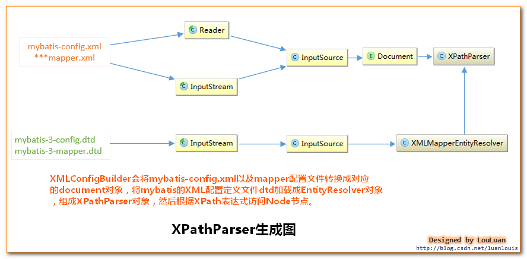
    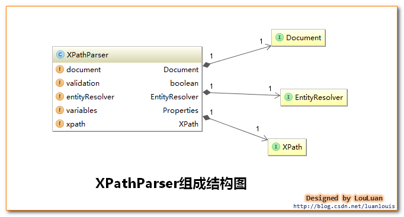
2. 之后XMLConfigBuilder调用parse()方法：会从XPathParser中取出 <configuration>节点对应的Node对象，然后解析此Node节点的子Node：properties, settings, typeAliases,typeHandlers, objectFactory, objectWrapperFactory, plugins, environments,databaseIdProvider, mappers
    ```java
    public Configuration parse()
    {
        if (parsed)
        {
            throw new BuilderException("Each XMLConfigBuilder can only be used once.");
        }
        parsed = true;
        //源码中没有这一句，只有 parseConfiguration(parser.evalNode("/configuration"));
        //为了让读者看得更明晰，源码拆分为以下两句
        XNode configurationNode = parser.evalNode("/configuration");
        parseConfiguration(configurationNode);
        return configuration;
    }
    /*
    解析 "/configuration"节点下的子节点信息，然后将解析的结果设置到Configuration对象中
    */
    private void parseConfiguration(XNode root) {
        try {
            //1.首先处理properties 节点	
            propertiesElement(root.evalNode("properties")); //issue #117 read properties first
            //2.处理typeAliases
            typeAliasesElement(root.evalNode("typeAliases"));
            //3.处理插件
            pluginElement(root.evalNode("plugins"));
            //4.处理objectFactory
            objectFactoryElement(root.evalNode("objectFactory"));
            //5.objectWrapperFactory
            objectWrapperFactoryElement(root.evalNode("objectWrapperFactory"));
            //6.settings
            settingsElement(root.evalNode("settings"));
            //7.处理environments
            environmentsElement(root.evalNode("environments")); // read it after objectFactory and objectWrapperFactory issue #631
            //8.database
            databaseIdProviderElement(root.evalNode("databaseIdProvider"));
            //9. typeHandlers
            typeHandlerElement(root.evalNode("typeHandlers"));
            //10 mappers
            mapperElement(root.evalNode("mappers"));
        } catch (Exception e) {
            throw new BuilderException("Error parsing SQL Mapper Configuration. Cause: " + e, e);
        }
    }
    ```
3. 然后将这些值解析出来设置到Configuration对象中。
4. 返回Configuration对象

将上述的MyBatis初始化基本过程的序列图细化，


##### 手动加载XML配置文件创建Configuration对象完成初始化，创建并使用SqlSessionFactory对象

使用XMLConfigBuilder手动解析XML配置文件来创建Configuration对象，代码如下：

```java
String resource = "mybatis-config.xml";
InputStream inputStream = Resources.getResourceAsStream(resource);
//手动创建XMLConfigBuilder，并解析创建Configuration对象
XMLConfigBuilder parser = new XMLConfigBuilder(inputStream, null,null);
Configuration configuration=parse();
//使用Configuration对象创建SqlSessionFactory
SqlSessionFactory sqlSessionFactory = new SqlSessionFactoryBuilder().build(configuration);
//使用MyBatis
SqlSession sqlSession = sqlSessionFactory.openSession();
List list = sqlSession.selectList("com.foo.bean.BlogMapper.queryAllBlogInfo");
```

##### 涉及到的设计模式

初始化的过程涉及到创建各种对象，所以会使用一些创建型的设计模式。在初始化的过程中，Builder模式运用的比较多。

Builder模式应用1： SqlSessionFactory的创建

对于创建SqlSessionFactory时，会根据情况提供不同的参数，其参数组合可以有以下几种：

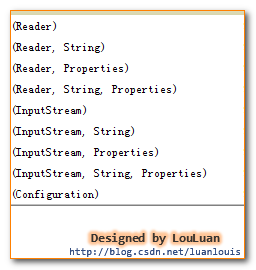

由于构造时参数不定，可以为其创建一个构造器Builder，将SqlSessionFactory的构建过程和表示分开：

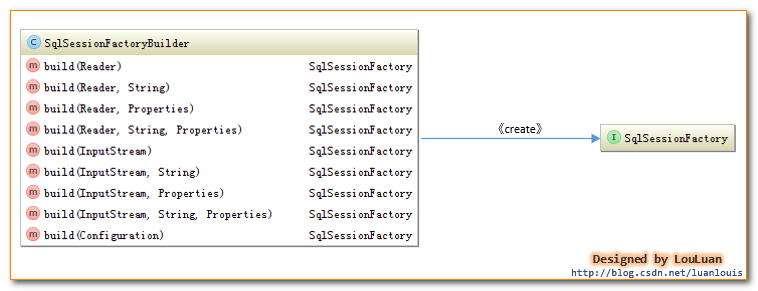

MyBatis将SqlSessionFactoryBuilder和SqlSessionFactory相互独立。

Builder模式应用2： 数据库连接环境Environment对象的创建

在构建Configuration对象的过程中，XMLConfigParser解析 mybatis XML配置文件节点<environment>节点时，会有以下相应的代码：

```java
private void environmentsElement(XNode context) throws Exception {
    if (context != null) {
        if (environment == null) {
            environment = context.getStringAttribute("default");
        }
        for (XNode child : context.getChildren()) {
            String id = child.getStringAttribute("id");
            //是和默认的环境相同时，解析之
            if (isSpecifiedEnvironment(id)) {
                TransactionFactory txFactory = transactionManagerElement(child.evalNode("transactionManager"));
                DataSourceFactory dsFactory = dataSourceElement(child.evalNode("dataSource"));
                DataSource dataSource = dsFactory.getDataSource();

                //使用了Environment内置的构造器Builder，传递id 事务工厂和数据源
                Environment.Builder environmentBuilder = new Environment.Builder(id)
                    .transactionFactory(txFactory)
                    .dataSource(dataSource);
                configuration.setEnvironment(environmentBuilder.build());
            }
        }
    }
}
```

在Environment内部，定义了静态内部Builder类：

```java
public final class Environment {
    private final String id;
    private final TransactionFactory transactionFactory;
    private final DataSource dataSource;

    public Environment(String id, TransactionFactory transactionFactory, DataSource dataSource) {
        if (id == null) {
            throw new IllegalArgumentException("Parameter 'id' must not be null");
        }
        if (transactionFactory == null) {
            throw new IllegalArgumentException("Parameter 'transactionFactory' must not be null");
        }
        this.id = id;
        if (dataSource == null) {
            throw new IllegalArgumentException("Parameter 'dataSource' must not be null");
        }
        this.transactionFactory = transactionFactory;
        this.dataSource = dataSource;
    }

    public static class Builder {
        private String id;
        private TransactionFactory transactionFactory;
        private DataSource dataSource;

        public Builder(String id) {
            this.id = id;
        }

        public Builder transactionFactory(TransactionFactory transactionFactory) {
            this.transactionFactory = transactionFactory;
            return this;
        }

        public Builder dataSource(DataSource dataSource) {
            this.dataSource = dataSource;
            return this;
        }

        public String id() {
            return this.id;
        }

        public Environment build() {
            return new Environment(this.id, this.transactionFactory, this.dataSource);
        }

    }

    public String getId() {
        return this.id;
    }

    public TransactionFactory getTransactionFactory() {
        return this.transactionFactory;
    }

    public DataSource getDataSource() {
        return this.dataSource;
    }

}
```

## 框架架构设计

mybatis框架架构图：

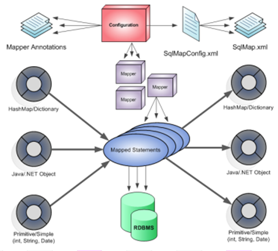

## MyBatis的主要构件及其相互关系

从MyBatis代码实现的角度来看，MyBatis的主要的核心部件有以下几个：

名称|作用
:--:|:--
SqlSession       | 作为MyBatis工作的主要顶层API，表示和数据库交互的会话，完成必要数据库增删改查功能
Executor         | MyBatis执行器，是MyBatis 调度的核心，负责SQL语句的生成和查询缓存的维护
StatementHandler | 封装了JDBC Statement操作，负责对JDBC statement 的操作，如设置参数、将Statement结果集转换成List集合
ParameterHandler | 负责对用户传递的参数转换成JDBC Statement 所需要的参数
ResultSetHandler | 负责将JDBC返回的ResultSet结果集对象转换成List类型的集合
TypeHandler      | 负责java数据类型和jdbc数据类型之间的映射和转换
MappedStatement  | MappedStatement维护了一条<select|update|delete|insert>节点的封装
SqlSource        | 负责根据用户传递的parameterObject，动态地生成SQL语句，将信息封装到BoundSql对象中，并返回
BoundSql         | 表示动态生成的SQL语句以及相应的参数信息
Configuration    | MyBatis所有的配置信息都维持在Configuration对象之中

mybatis层次结构：


### [SqlSessionFactoryBuilder](SqlSessionFactoryBuilder.md)

> SqlSessionFactoryBuilder类的主要作用就是创建一个 SqlSessionFactory 。

### [SqlSessionFactory](SqlSessionFactory.md)

> SqlSessionFactory用于生产SqlSession

### [SqlSession](SqlSession.md)

#### SqlSession工作过程

- 1、开启一个数据库访问会话---创建SqlSession对象

> Mybatis封装了对数据库的访问，把对数据库的会话和事务控制放到了SqlSession对象中。


- 2、为SqlSession传递一个配置的Sql语句的Statement Id和参数，然后返回结果

`List<Employee> result = sqlSession.selectList("com.example.ClassName.methodName",params);`

com.example.ClassName.methodName是mapper.xml的 Statement Id，params是传递的查询参数

> SqlSession根据 Statement ID, 在mybatis配置对象Configuration中获取到对应的MappedStatement对象，然后调用mybatis执行器来执行具体的操作。

- 3、MyBatis执行器Executor根据SqlSession传递的参数执行query()方法
- 4、StatementHandler对象负责设置Statement对象中的查询参数、处理JDBC返回的resultSet，将resultSet加工为List 集合返回

### [Executor](Executor.md)

功能和作用：

1. 根据传递的参数，完成SQL语句的动态解析，生成BoundSql对象，供StatementHandler使用；
2. 为查询创建缓存，以提高性能；
3. 创建JDBC的Statement连接对象，传递给StatementHandler对象，返回List查询结果。

### [StatementHandler](StatementHandler.md)

1. 对于JDBC的PreparedStatement类型的对象，创建的过程中，使用的是SQL语句字符串会包含若干个? 占位符，其后再对占位符进行设值。StatementHandler通过parameterize(statement)方法对Statement进行设值；
2. StatementHandler通过List<E> query(Statement statement, ResultHandler resultHandler)方法来完成执行Statement，和将Statement对象返回的resultSet封装成List；

### [ResultSetHandler](ResultSetHandler.md)