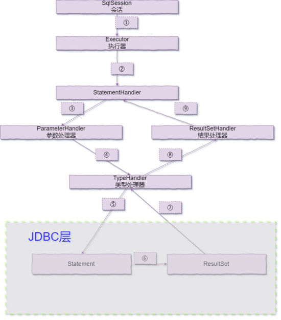

MyBatis 执行的流程如下所示：



由上图可知，MyBatis 的重要接口分别为：`SqlSession`、`Executor`、`StatementHandler`、`ParameterHandler`、`ResultSetHandler`、`TypeHandler`。

## SqlSession

SqlSession 是 Myabtis 中的核心 API，主要用来执行命令，获取映射，管理事务。它包含了所有执行语句、提交或回滚事务以及获取映射器实例的方法。

在 Mybatis 中有三个实现类，分别是 `DefaultSqlSession`、`SqlSessionManager`、`SqlSessionTemplate`，其中重要的就是 `DefaultSqlSession`。但在与 SpringBoot 整合时，Mybatis 的启动器配置类会默认注入一个 `SqlSessionTemplate`。

SqlSession 定义了将近 20 个方法，下面对这些方法进行了分类总结。

### 语句执行方法

这些方法被用来执行定义在 SQL 映射 XML 文件中的 SELECT、INSERT、UPDATE 和 DELETE 语句。可以通过名字快速了解它们的作用，每一方法都接受语句的 ID 以及参数对象，参数可以是原始类型（支持自动装箱或包装类）、JavaBean、POJO 或 Map。

```java
<T> T selectOne(String statement, Object parameter)
<E> List<E> selectList(String statement, Object parameter)
<T> Cursor<T> selectCursor(String statement, Object parameter)
<K,V> Map<K,V> selectMap(String statement, Object parameter, String mapKey)
int insert(String statement, Object parameter)
int update(String statement, Object parameter)
int delete(String statement, Object parameter)
```

~~select 还有几个重要的重载方法，用于限制返回行数，在 MySQL 中对应的是 limit~~，如下：

```java
<E> List<E> selectList (String statement, Object parameter, RowBounds rowBounds)
<T> Cursor<T> selectCursor(String statement, Object parameter, RowBounds rowBounds)
<K,V> Map<K,V> selectMap(String statement, Object parameter, String mapKey, RowBounds rowbounds)
void select (String statement, Object parameter, ResultHandler<T> handler)
void select (String statement, Object parameter, RowBounds rowBounds, ResultHandler<T> handler)
```

### 立即批量更新方法

将 ExecutorType 设置为 ExecutorType.BATCH 时，可以使用这个方法清除（执行）缓存在 JDBC 驱动类中的批量更新语句。

```java
List<BatchResult> flushStatements()
```

### 事务控制方法

有四个方法用来控制事务作用域。

```java
void commit()
void commit(boolean force)
void rollback()
void rollback(boolean force)
```

> 注：如果设置了自动提交或使用外部事务管理器，以上方法都是不会起任何作用的。然而，如果使用由 Connection 实例控制的 JDBC 事务管理器，那么以上四个方法就会起作用。


默认情况下 MyBatis 不会自动提交事务，除非它侦测到调用了插入、更新或删除方法改变了数据库。如果没有使用这些方法提交修改，那么可以在commit 和 rollback 方法参数中传入 true 值，来保证事务被正常提交（注意，在自动提交模式或者使用了外部事务管理器的情况下，设置 force 值对 session 无效）。大部分情况下无需调用 rollback()，因为 MyBatis 会在没有调用 commit 时替你完成回滚操作。不过，要在一个可能多次提交或回滚的 session 中详细控制事务，回滚操作就派上用场了。

### 本地缓存方法

Mybatis 使用到了两种缓存：本地缓存（local cache）和二级缓存（second level cache）。

默认情况下，本地缓存数据的生命周期等同于整个 session 的周期。由于缓存会被用来解决循环引用问题和加快重复嵌套查询的速度，所以无法将其完全禁用。但是可以通过设置 localCacheScope=STATEMENT 来只在语句执行时使用缓存。

可以调用如下方法清除本地缓存：

```java
void clearCache()
```

### 获取映射器

在 SqlSession 中可以获取用户自定义的映射器，直接使用下面的方法，如下：

```java
<T> T getMapper(Class<T> type)
```

## Executor

Mybatis 的执行器，是 Mybatis 的调度核心，负责 SQL 语句的生成和缓存的维护，SqlSession 中的 crud 方法实际上都是调用执行器中的对应方法执行。

## StatementHandler

对SQL语句进行处理和参数赋值的接口

## ParameterHandler

ParameterHandler 在 Mybatis 中负责将 sql 中的占位符替换为真正的参数，它是一个接口，有且只有一个实现类 DefaultParameterHandler。

## TypeHandler

## ResultSetHandler