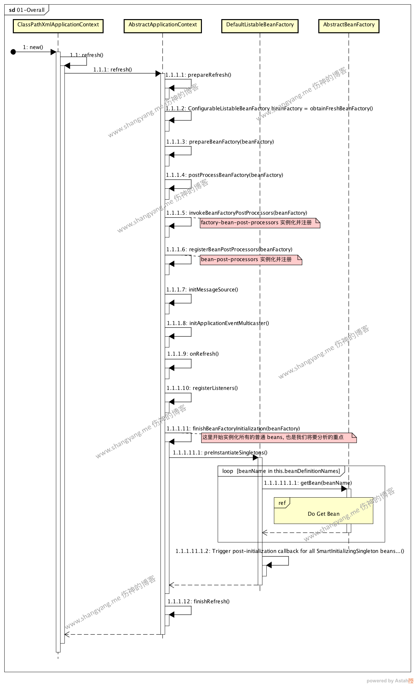
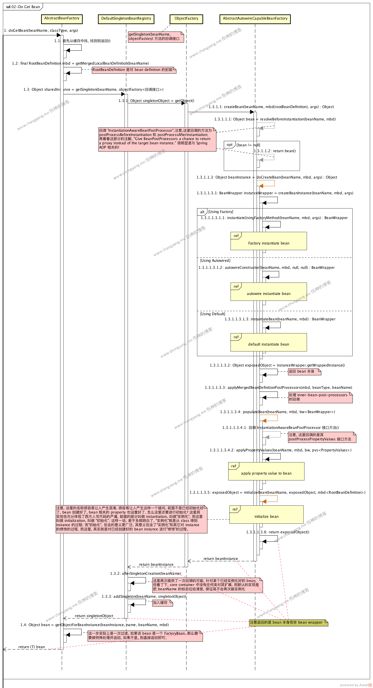
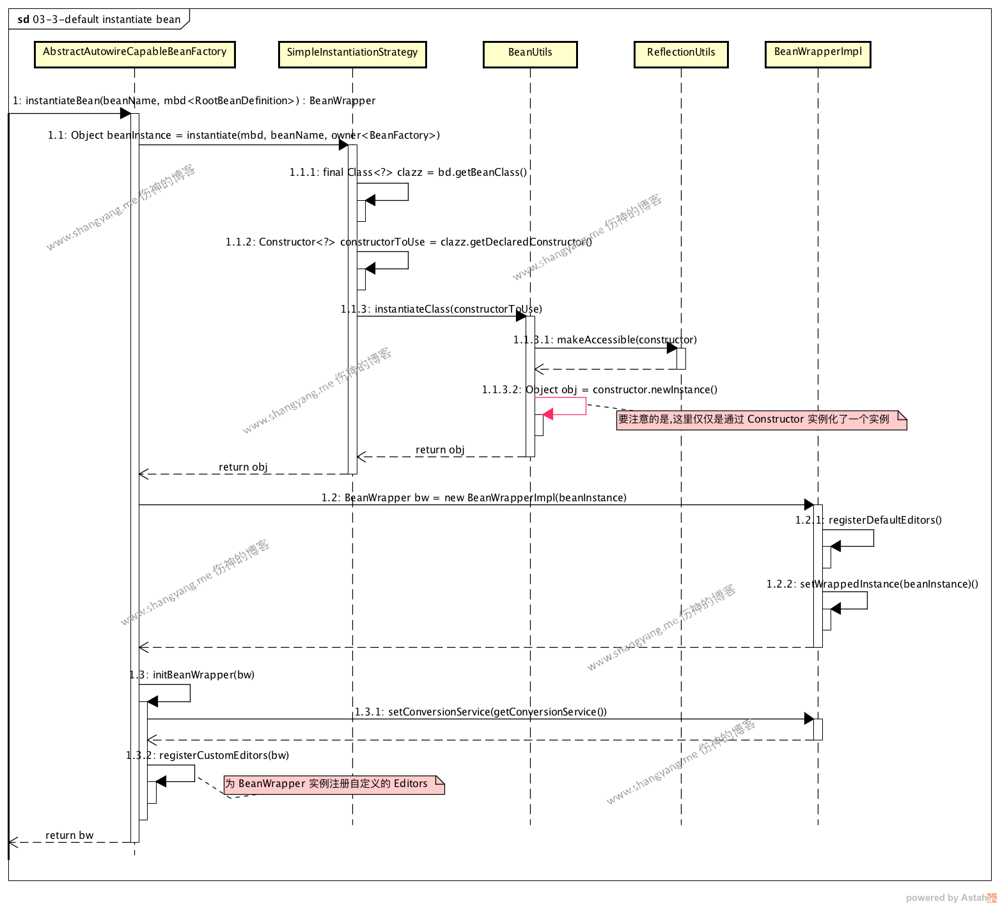
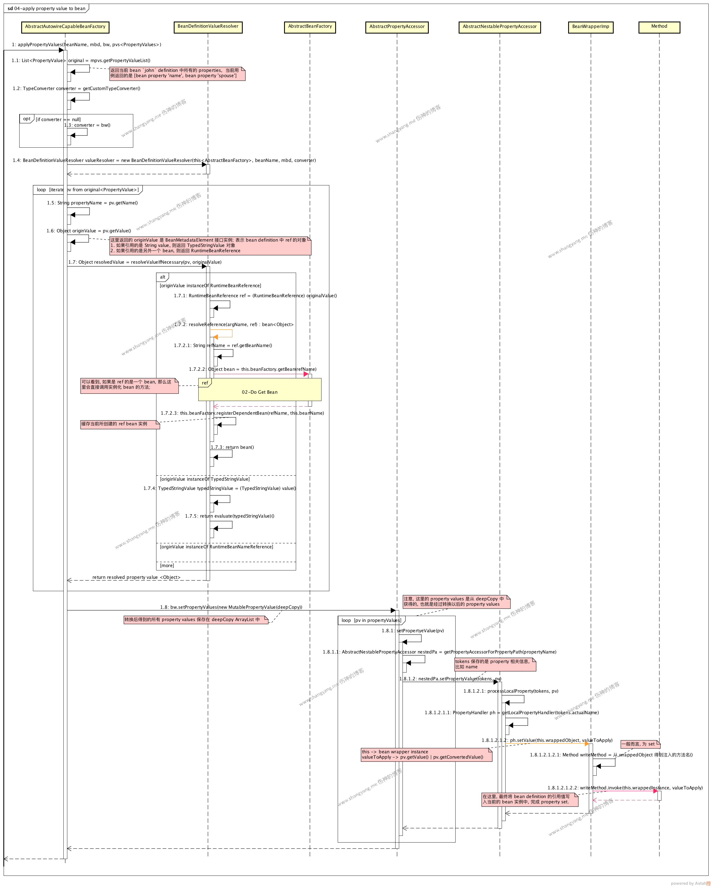
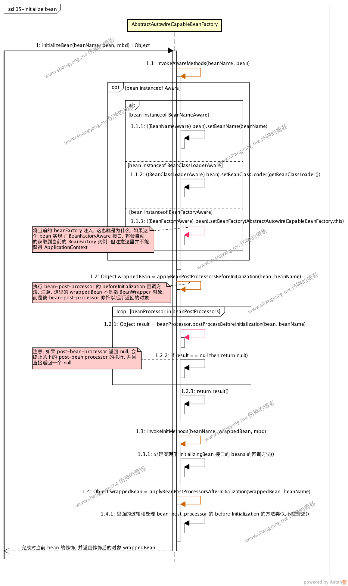

# Beans

## Spring Beans 初始化流程分析

### 主流程



### 解析并注册 bean definitions 流程

#### Do Get Bean 流程

Do Get Bean 流程的入口是 AbstractBeanFactory#doGetBean 方法，主流程图如下，



主流程大致为，从缓存中找到是否已经实例化了该 singleton bean，如果已经实例化好了，那么就直接返回；如果在缓存中没有找到，则将当前的 bean 封装为 RootBeanDefinition，然后通过调用 DefaultSingletonBeanRegistry#getSingleton 得到初始化好的 singleton bean，然后将其注册至缓存( step 1.3.3 addSingleton )，然后再判断是普通 bean 还是 factory bean 作必要的处理( step 1.4 getObjectForBeanInstance )后，最后返回；

##### RootBeanDefinition

初始化了一个 RootBeanDefinition 对象，正如其类名描述的那样，是该 bean 的顶层描述；包含了 bean 的字段属性，ref属性以及继承相关等等属性；

##### Step 1.3：DefaultSingletonBeanRegistry#getSingleton

此步骤的相关代码如下，

```java
// Create bean instance.
if (mbd.isSingleton()) {
    sharedInstance = getSingleton(beanName, new ObjectFactory<Object>() {
        @Override
        public Object getObject() throws BeansException {
            try {
                return createBean(beanName, mbd, args);
            }
            catch (BeansException ex) {
                // Explicitly remove instance from singleton cache: It might have been put there
                // eagerly by the creation process, to allow for circular reference resolution.
                // Also remove any beans that received a temporary reference to the bean.
                destroySingleton(beanName);
                throw ex;
            }
        }
    });
    bean = getObjectForBeanInstance(sharedInstance, name, beanName, mbd);
}
```

调用父类 DefaultSingletonBeanRegistry#getSingleton 方法；注意，这里通过接口 ObjectFactory<Object> 定义了一个回调方法 getObject()，通过该回调方法调用 AbstractAutowireCapableBeanFactory#createBean 方法，通过此回调方法正式拉开了实例化 bean 的序幕。

##### Step 1.3.1.1：AbstractAutowireCapableBeanFactory#createBean

AbstractAutowireCapableBeanFactory#doCreateBean 方法是初始化 bean 的最核心的入口方法，执行流程如 Do Get Bean 流程所示，

主流程主要做了这么三件事情，一、instantiate bean；二、populate bean；三、initialize bean；

包含五个子流程，它们分别是 factory instantiate bean、autwire instantiate bean、default instantiate bean、populate bean 以及 initialize bean，其中，前三个子流程对应第一件事情，实例化 bean；其次的子流程 populate bean 对应的是第二件事情，为 bean 设置 property 参数；最后一个子流程 [initialize bean] 对应最后一件事情既初始化 bean，这里的初始化指的是是对创建好的 bean 做一些修饰动作的。

###### 第一件事情：instantiate bean

该步骤对应 Do Get Bean 流程中的 Step 1.3.1.1.3.1 createBeanInstance；根据 bean 的不同配置方式，实现了三种实例化 bean 的方式，分别是 factory instantiate bean、autwire instantiate bean 以及 default instantiate bean；

- factory instantiate bean

用工厂方法实例化 bean，待叙；

- utwire instantiate bean

通过 autowire 注解的方式实例化 bean，待叙；

- default instantiate bean

此步骤对应 Do Get Bean 流程中的 Step 1.3.1.1.3.1.3 instantiateBean，其对应子流程 default instantiate bean 如下图所示，



注意几点：

- 这里仅仅是通过使用其构造函数 constructor 使用Java 反射实例化了 bean，并没有对其进行任何的参数赋值，赋值过程参考 populate bean 流程；
- 将 bean 封装为 BeanWrapper，然后注册 default PropertyEditor；注册 custom PropertyEditor；最后返回 BeanWrapper

###### 第二件事情：populate bean

对应 Do Get Bean 流程中的 Step 1.3.1.1.3.4 populateBean，通过调用 AbstractAutowireCapableBeanFactory#populateBean 正式给 bean 的参数进行赋值；下图 populate bean 的流程图，



通过调用 AbstractAutowireCapableBeanFactory#applyPropertyValues 方法正式给 bean 进行赋值操作，赋值的主流程主要包括两个部分，resolve property value object 和 set property value to bean

- resolve property value

对应上面 Sequence Diagram 中的 Step 1.5 - Step 1.7；这一步主要是去遍历当前 bean 所有的 property，并依次解析(resolve)得到对应的 Java 对象；通过方法 BeanDefinitionValueResolver#resolveValueIfNecessary 进行解析，解析的过程是针对不同类型的 Property，采用不同的解析方式，里面目前总共对应了十种类型，先看看它的源码，

```java
public Object resolveValueIfNecessary(Object argName, Object value) {
    // We must check each value to see whether it requires a runtime reference
    // to another bean to be resolved.
    if (value instanceof RuntimeBeanReference) { // 这里表示该 bean definition ref 引用的是一个 bean，那么这里，必须对该 bean 进行初始化操作；
        RuntimeBeanReference ref = (RuntimeBeanReference) value;
        return resolveReference(argName, ref);
    }
    else if (value instanceof RuntimeBeanNameReference) {
        String refName = ((RuntimeBeanNameReference) value).getBeanName();
        refName = String.valueOf(doEvaluate(refName));
        if (!this.beanFactory.containsBean(refName)) {
            throw new BeanDefinitionStoreException(
                    "Invalid bean name '" + refName + "' in bean reference for " + argName);
        }        return refName;
    }
    else if (value instanceof BeanDefinitionHolder) {
        // Resolve BeanDefinitionHolder: contains BeanDefinition with name and aliases.
        BeanDefinitionHolder bdHolder = (BeanDefinitionHolder) value;
        return resolveInnerBean(argName, bdHolder.getBeanName(), bdHolder.getBeanDefinition());
    }
    else if (value instanceof BeanDefinition) {
        // Resolve plain BeanDefinition, without contained name: use dummy name.
        BeanDefinition bd = (BeanDefinition) value;
        String innerBeanName = "(inner bean)" + BeanFactoryUtils.GENERATED_BEAN_NAME_SEPARATOR +
                ObjectUtils.getIdentityHexString(bd);
        return resolveInnerBean(argName, innerBeanName, bd);
    }
    else if (value instanceof ManagedArray) {
        // May need to resolve contained runtime references.
        ManagedArray array = (ManagedArray) value;
        Class<?> elementType = array.resolvedElementType;
        if (elementType == null) {
            String elementTypeName = array.getElementTypeName();
            if (StringUtils.hasText(elementTypeName)) {
                try {
                    elementType = ClassUtils.forName(elementTypeName, this.beanFactory.getBeanClassLoader());
                    array.resolvedElementType = elementType;
                }
                catch (Throwable ex) {
                    // Improve the message by showing the context.
                    throw new BeanCreationException(
                            this.beanDefinition.getResourceDescription(), this.beanName,
                            "Error resolving array type for " + argName, ex);
                }
            }
            else {
                elementType = Object.class;
            }
        }
        return resolveManagedArray(argName, (List<?>) value, elementType);
    }
    else if (value instanceof ManagedList) {
        // May need to resolve contained runtime references.
        return resolveManagedList(argName, (List<?>) value);
    }
    else if (value instanceof ManagedSet) {
        // May need to resolve contained runtime references.
        return resolveManagedSet(argName, (Set<?>) value);
    }
    else if (value instanceof ManagedMap) {
        // May need to resolve contained runtime references.
        return resolveManagedMap(argName, (Map<?, ?>) value);
    }
    else if (value instanceof ManagedProperties) {
        Properties original = (Properties) value;
        Properties copy = new Properties();
        for (Map.Entry<Object, Object> propEntry : original.entrySet()) {
            Object propKey = propEntry.getKey();
            Object propValue = propEntry.getValue();
            if (propKey instanceof TypedStringValue) {
                propKey = evaluate((TypedStringValue) propKey);
            }
            if (propValue instanceof TypedStringValue) {
                propValue = evaluate((TypedStringValue) propValue);
            }
            copy.put(propKey, propValue);
        }
        return copy;
    }
    else if (value instanceof TypedStringValue) {
        // Convert value to target type here.
        TypedStringValue typedStringValue = (TypedStringValue) value;
        Object valueObject = evaluate(typedStringValue);
        try {
            Class<?> resolvedTargetType = resolveTargetType(typedStringValue);
            if (resolvedTargetType != null) {
                return this.typeConverter.convertIfNecessary(valueObject, resolvedTargetType);
            }
            else {
                return valueObject;
            }
        }
        catch (Throwable ex) {
            // Improve the message by showing the context.
            throw new BeanCreationException(
                    this.beanDefinition.getResourceDescription(), this.beanName,
                    "Error converting typed String value for " + argName, ex);
        }
    }
    else {
        return evaluate(value);
    }
}
```

这里主要关注两类解析，

- RuntimeBeanReference 类型解析

这类是一个去解析一个ref bean。

所以可以看到，源码中是通过 resolveReference 方法调用 AbstractBeanFactory#getBean 方法去实例化一个 bean 并返回；对应的源码如下，

```java
/**
 * Resolve a reference to another bean in the factory.
 */
private Object resolveReference(Object argName, RuntimeBeanReference ref) {
    try {
        String refName = ref.getBeanName();
        refName = String.valueOf(doEvaluate(refName));
        if (ref.isToParent()) {
            if (this.beanFactory.getParentBeanFactory() == null) {
                throw new BeanCreationException(
                        this.beanDefinition.getResourceDescription(), this.beanName,
                        "Can't resolve reference to bean '" + refName +
                        "' in parent factory: no parent factory available");
            }
            return this.beanFactory.getParentBeanFactory().getBean(refName);
        }
        else {
            Object bean = this.beanFactory.getBean(refName); // 去得到这个 ref bean
            this.beanFactory.registerDependentBean(refName, this.beanName); // 注册
            return bean;
        }
    }
    catch (BeansException ex) {
        throw new BeanCreationException(
                this.beanDefinition.getResourceDescription(), this.beanName,
                "Cannot resolve reference to bean '" + ref.getBeanName() + "' while setting " + argName, ex);
    }
}
```

通过调用this.beanFactory.getBean(refName)再次进入Do Get Bean 流程初始化得到该 ref bean；

最后，将解析出来的 Property value 放在一个deepCopy的 ArrayList 列表对象中；顾名思义，就是对值进行了一次深度的拷贝，然后将其作为 bean 的参数，随后开始进行赋值操作；

- TypedStringValue 类型解析

这里主要被解析的 Property value 的类型配置为 `<property name="name" value="John Doe"/>` ，其 Property value 的值在配置文件中就是一个纯的字符串类型；但从源码中可以知道，Property value 是可以包含 value type 的，所以，在解析 TypedStringValue 的时候，需要根据 value type 进行解析；具体逻辑参考 `resolveTargetType(typedStringValue);`方法。

- set property value to bean

此步骤的主流程主要是通过Java Method 反射将解析出来的值赋值给当前的 bean；对应时序图中的 Step 1.8 setPropertyValues

可以看到，通过遍历 deepCopy ArrayList 对象中已经解析过后的 PropertyValue，最终由 BeanWrapperImpl 对象通过方法的反射，将值注入给当前的 bean，Step 1.8.1.2.1.2.2 writeMethod.invoke

BeanWrapperImpl.java 省略了大部分无关紧要的代码，

```java
@Override
public void setValue(final Object object, Object valueToApply) throws Exception{
    final Method writeMethod = (this.pd instanceof GenericTypeAwarePropertyDescriptor ?
            ((GenericTypeAwarePropertyDescriptor) this.pd).getWriteMethodForActualAccess() :
            this.pd.getWriteMethod());
    if (!Modifier.isPublic(writeMethod.getDeclaringClass().getModifiers()) && !writeMethod.isAccessible()) {
        if (System.getSecurityManager() != null) {
            AccessController.doPrivileged(new PrivilegedAction<Object>() {
                @Override
                public Object run() {
                    writeMethod.setAccessible(true);
                    return null;
                }
            });
        }
        else {
            writeMethod.setAccessible(true);
        }
    }

    ....
    writeMethod.invoke(getWrappedInstance(), valueToApply);

    ....
}
```

通过这一步，将相关的 property populate 给 bean 以后，才算 bean 的实例化完成；

###### 第三件事情：initialize bean

正如流程图中所描述的那样，这个步骤的名字非常然人迷惑，将流程图中写的备注摘录如下，

“注意, 这里的名称很容易让人产生混淆, 很容易让人产生这样一个疑问, 前面不是已经初始化好了, bean 创建好了, bean 相关的 property 也设置好了, 怎么这里还要进行初始化? 这里其实恰恰充分体现了西方人写代码的严谨, 前面的部分叫做 instantiation, 叫做”实例化”, 而这里叫做 initialization, 叫做 “初始化”; 这样一说, 差不多就明白了, “实例化”就是从 class 得到 instance 的过程; 而”初始化”, 包含的意义更广泛, 其意义包含了”实例化”和其它对 instance 的修饰的过程, 而这里, 其实就是对已经创建好的 bean instance 进行”修饰”的过程。”

所以，这里的 initialize 其实就是对通过 instantiate bean 和 populate bean 两个步骤实例化好的 bean 进行后续必要的修饰；通过流程图来看看，它是怎么去修饰的，



通过 AbstractAutowireCapableBeanFactory#initializeBean 方法进行对 bean 的修饰过程，看源码，(删除了大部分不相关的代码)

```java
protected Object initializeBean(final String beanName, final Object bean, RootBeanDefinition mbd) {
  
    invokeAwareMethods(beanName, bean); // 调用实现了 *Aware 接口的方法，比如注入 ApplicationContext...

    Object wrappedBean = bean;
    if (mbd == null || !mbd.isSynthetic()) {
        // 调用 bean-post-processor 的 before initialization 回调方法
        wrappedBean = applyBeanPostProcessorsBeforeInitialization(wrappedBean, beanName);
    }
    try {
        invokeInitMethods(beanName, wrappedBean, mbd); // 调用 InitializingBean#afterPropertiesSet 回调
    }
    catch (Throwable ex) {
        throw new BeanCreationException(
                (mbd != null ? mbd.getResourceDescription() : null),
                beanName, "Invocation of init method failed", ex);
    }
    if (mbd == null || !mbd.isSynthetic()) {
        // 调用 bean-post-processor 的 after initialization 回调方法
        wrappedBean = applyBeanPostProcessorsAfterInitialization(wrappedBean, beanName);
    }
    return wrappedBean; // 这里的 wrapped bean 指的是被 bean-post-processor 修饰以后的包装 bean
}
```

整个过程可以理解为三大块:

- 注入 Aware 对象；
- 回调 bean-post-processors 接口方法；
- 回调 InitializingBean 接口方法

####### 注入 Aware 对象

对应流程图中的 Step 1.1 invokeAwareMethods，该步骤注册所有实现了Aware接口的 beans

```java
/**
 * Marker superinterface indicating that a bean is eligible to be
 * notified by the Spring container of a particular framework object
 * through a callback-style method. Actual method signature is
 * determined by individual subinterfaces, but should typically
 * consist of just one void-returning method that accepts a single
 * argument.
 *
 * <p>Note that merely implementing {@link Aware} provides no default
 * functionality. Rather, processing must be done explicitly, for example
 * in a {@link org.springframework.beans.factory.config.BeanPostProcessor BeanPostProcessor}.
 * Refer to {@link org.springframework.context.support.ApplicationContextAwareProcessor}
 * and {@link org.springframework.beans.factory.support.AbstractAutowireCapableBeanFactory}
 * for examples of processing {@code *Aware} interface callbacks.
 *
 * @author Chris Beams
 * @since 3.1
 */
public interface Aware {
}
```

从 Aware 接口的注释中可以看到，允许实现了该 Aware 接口的当前 bean 能够有机会通过回调的方式注入 Spring 容器中默认实现了 Aware 接口的 bean，比如 BeanFactory 等；看看源码，

```java
//注入的三种情况
private void invokeAwareMethods(final String beanName, final Object bean) {
    if (bean instanceof Aware) {
        if (bean instanceof BeanNameAware) {
            ((BeanNameAware) bean).setBeanName(beanName);
        }
        if (bean instanceof BeanClassLoaderAware) {
            //将 Spring 容器的 BeanClassLoader 注入到当前 bean；记住，如果想要获得加载 Bean 当前的 ClassLoader 对象的时候，只需要让 Bean 实现 BeanClassLoaderAware 接口并实现相应接口方法即可
            ((BeanClassLoaderAware) bean).setBeanClassLoader(getBeanClassLoader());
        }
        if (bean instanceof BeanFactoryAware) {
            //将 Spring 容器中与 bean 初始化相关的 BeanFactory 实例注册给当前的 bean
            ((BeanFactoryAware) bean).setBeanFactory(AbstractAutowireCapableBeanFactory.this);
        }
    }
}
```

要特别特别注意的是，这里并没有注入ApplicationContext对象，要注入ApplicaitonContext对象，bean 必须实现ApplicatonContextAware接口；

```java
public interface ApplicationContextAware extends Aware {
    /**
     * Set the ApplicationContext that this object runs in.
     * Normally this call will be used to initialize the object.
     * <p>Invoked after population of normal bean properties but before an init callback such
     * as {@link org.springframework.beans.factory.InitializingBean#afterPropertiesSet()}
     * or a custom init-method. Invoked after {@link ResourceLoaderAware#setResourceLoader},
     * {@link ApplicationEventPublisherAware#setApplicationEventPublisher} and
     * {@link MessageSourceAware}, if applicable.
     * @param applicationContext the ApplicationContext object to be used by this object
     * @throws ApplicationContextException in case of context initialization errors
     * @throws BeansException if thrown by application context methods
     * @see org.springframework.beans.factory.BeanInitializationException
     */
    void setApplicationContext(ApplicationContext applicationContext) throws BeansException;
}
```

从注释中可以看到，它明确标注，是在 populate bean 以后，在处理 InitializingBean 接口回调之前调用，那是到底是在什么时刻呢？查看下方法 setApplicationContext 方法在 workspace 中的引用，它是在 ApplicationContextAwareProcessor#invokeAwareInterfaces 方法中被调用，而 ApplicationContextAwareProcessor 正好是一个 BeanPostProcessor 对象，所以，ApplicaitonContext对象实际上是在 bean-post-procesor before initialization流程中被注入的，看源码，

```java
class ApplicationContextAwareProcessor implements BeanPostProcessor {
    private final ConfigurableApplicationContext applicationContext;
    private final StringValueResolver embeddedValueResolver;
    /**
     * Create a new ApplicationContextAwareProcessor for the given context.
     */
    public ApplicationContextAwareProcessor(ConfigurableApplicationContext applicationContext) {
        this.applicationContext = applicationContext;
        this.embeddedValueResolver = new EmbeddedValueResolver(applicationContext.getBeanFactory());
    }
    @Override
    public Object postProcessBeforeInitialization(final Object bean, String beanName) throws BeansException {
        AccessControlContext acc = null;

        ....
        invokeAwareInterfaces(bean);
        ....

        return bean;
    }
    private void invokeAwareInterfaces(Object bean) {
        if (bean instanceof Aware) {
            if (bean instanceof EnvironmentAware) {
                ((EnvironmentAware) bean).setEnvironment(this.applicationContext.getEnvironment());
            }
            if (bean instanceof EmbeddedValueResolverAware) {
                ((EmbeddedValueResolverAware) bean).setEmbeddedValueResolver(this.embeddedValueResolver);
            }
            if (bean instanceof ResourceLoaderAware) {
                ((ResourceLoaderAware) bean).setResourceLoader(this.applicationContext);
            }
            if (bean instanceof ApplicationEventPublisherAware) {
                ((ApplicationEventPublisherAware) bean).setApplicationEventPublisher(this.applicationContext);
            }
            if (bean instanceof MessageSourceAware) {
                ((MessageSourceAware) bean).setMessageSource(this.applicationContext);
            }
            if (bean instanceof ApplicationContextAware) {
                ((ApplicationContextAware) bean).setApplicationContext(this.applicationContext);
            }
        }
    }
    @Override
    public Object postProcessAfterInitialization(Object bean, String beanName) {
        return bean;
    }
}
```

####### 回调 bean-post-processors 接口方法

BeanPostProcessor接口的源码，

```java
public interface BeanPostProcessor {
    /**
     * Apply this BeanPostProcessor to the given new bean instance <i>before</i> any bean
     * initialization callbacks (like InitializingBean's {@code afterPropertiesSet}
     * or a custom init-method). The bean will already be populated with property values.
     * The returned bean instance may be a wrapper around the original.
     * @param bean the new bean instance
     * @param beanName the name of the bean
     * @return the bean instance to use, either the original or a wrapped one;
     * if {@code null}, no subsequent BeanPostProcessors will be invoked
     * @throws org.springframework.beans.BeansException in case of errors
     * @see org.springframework.beans.factory.InitializingBean#afterPropertiesSet
     */
    Object postProcessBeforeInitialization(Object bean, String beanName) throws BeansException;
    /**
     * Apply this BeanPostProcessor to the given new bean instance <i>after</i> any bean
     * initialization callbacks (like InitializingBean's {@code afterPropertiesSet}
     * or a custom init-method). The bean will already be populated with property values.
     * The returned bean instance may be a wrapper around the original.
     * <p>In case of a FactoryBean, this callback will be invoked for both the FactoryBean
     * instance and the objects created by the FactoryBean (as of Spring 2.0). The
     * post-processor can decide whether to apply to either the FactoryBean or created
     * objects or both through corresponding {@code bean instanceof FactoryBean} checks.
     * <p>This callback will also be invoked after a short-circuiting triggered by a
     * {@link InstantiationAwareBeanPostProcessor#postProcessBeforeInstantiation} method,
     * in contrast to all other BeanPostProcessor callbacks.
     * @param bean the new bean instance
     * @param beanName the name of the bean
     * @return the bean instance to use, either the original or a wrapped one;
     * if {@code null}, no subsequent BeanPostProcessors will be invoked
     * @throws org.springframework.beans.BeansException in case of errors
     * @see org.springframework.beans.factory.InitializingBean#afterPropertiesSet
     * @see org.springframework.beans.factory.FactoryBean
     */
    Object postProcessAfterInitialization(Object bean, String beanName) throws BeansException;
}
```

该接口定义了两个回调方法：

- Object postProcessBeforeInitialization(Object bean, String beanName)
    从方法的注释中不难发现，该方法是在回调 InitializeBean 接口方法之前调用，并且是在 populate bean) 之后进行的调用，通常是对原有 bean 做一层封装，然后返回该封装对象；这就是我在前文所描述的，其实就是是对原有 bean 起到修饰的作用；
- Object postProcessAfterInitialization(Object bean, String beanName)
    从方法的注释中不难发现，该方法是在回调 InitializeBean 接口方法之前调用，同样也是在 populate bean) 之后进行的调用

所以，bean-post-processors 总共有两次调用的时机，分别是 before initialization 和 after initialization，而且要特别注意的是，该回调方法是针对对容器中所有的普通 bean 进行的回调；

- before initialization

该步骤对应 Step 1.2 applyBeanPostProcessorsBeforeInitialization，然后正式调用 Step 1.2.1 beanPostProcessor.postProcessBeforeInitialization bean-post-processor 的回调方法，不过这里要注意的是，如果 Step 1.2.1 返回 null，会终止余下的 post-bean-processor 的执行，并且直接返回一个 null，该 null 同样被视为是封装后的产物，既然是 null，那么后续的 bean-post-processor 也无需处理了，也无法对原有的 bean 进行包装了.. 不过，我到觉得这里的 Spring 源码的逻辑应该改进一下，不允许返回 null 的情况，如果返回 null 则报错最好，因为 bean-post-processor 是对原有 bean 进行修饰，是新增属性，而非干掉实例本身.. 来看看源码，

```java
@Override
public Object applyBeanPostProcessorsBeforeInitialization(Object existingBean, String beanName)
        throws BeansException {
    Object result = existingBean;
    for (BeanPostProcessor beanProcessor : getBeanPostProcessors()) {
        result = beanProcessor.postProcessBeforeInitialization(result, beanName);
        if (result == null) {
            return result;
        }
    }
    return result;
}
```

如果某个 beanProcessor 处理返回一个 null 则直接返回，并且终止其余的 bean-post-processors

- after initialization

对应的是 step 1.4 applyBeanPostProcessorsAfterInitialization 步骤，里面的逻辑和 before initialization 逻辑类似，不再赘述。

####### 回调 InitializingBean 接口方法

该步骤对应的是 Step 1.3: invokeInitMethod，回调 InitializingBean 接口方法，看源码，

```java
protected void invokeInitMethods(String beanName, final Object bean, RootBeanDefinition mbd)
        throws Throwable {
    boolean isInitializingBean = (bean instanceof InitializingBean);
    if (isInitializingBean && (mbd == null || !mbd.isExternallyManagedInitMethod("afterPropertiesSet"))) {
        if (logger.isDebugEnabled()) {
            logger.debug("Invoking afterPropertiesSet() on bean with name '" + beanName + "'");
        }
        .....
        ((InitializingBean) bean).afterPropertiesSet();
        .....
    }
    if (mbd != null) {
        String initMethodName = mbd.getInitMethodName();
        if (initMethodName != null && !(isInitializingBean && "afterPropertiesSet".equals(initMethodName)) &&
                !mbd.isExternallyManagedInitMethod(initMethodName)) {
            invokeCustomInitMethod(beanName, bean, mbd);
        }
    }
}
```

可以看到，主要回调的是InitializingBean接口的afterPropertiesSet方法，所以，我们可以让某个 bean 实现 InitializingBean 接口，并通过该接口实现一些当 bean 实例化好以后的回调方法，注意afterPropertiesSet并不返回任何值，所以，这里不是像 bean-post-processor 那样对 bean 起到修饰的作用，而是起到纯粹的调用作用；

### 总结

以上便是 Spring IoC 容器的核心实现了，容器要达到的最本质的目的就是IoC既反转控制，由容器来负责管理对象实例相关依赖的初始化和注入，而不再是由 bean 自己去控制自己的依赖的初始化和注入过程了；而IoC的实现是通过DI既是依赖注入实现的；也就是为什么上面所介绍的内容都是围绕着 Spring 容器如何实例化一个 bean，如何赋值，如何进行回调等一系列在 bean 的构建声明周期过程中的种种行为；

这样做能达到的好处就是，实现了对象的依赖属性和依赖对象的高度可定制化，可以通过容器配置的方式，轻松的修改 bean 所的依赖对象，以改变原有的其行为。

通过 bean-post-processor 扩展点能够对原始的 bean 进行包装，通过这样的方式，可以包装得到一个 proxy bean，提供相关的 AOP 操作，比如提供事务，异常处理等等方法注入的实现。