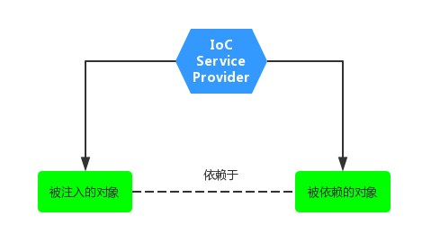
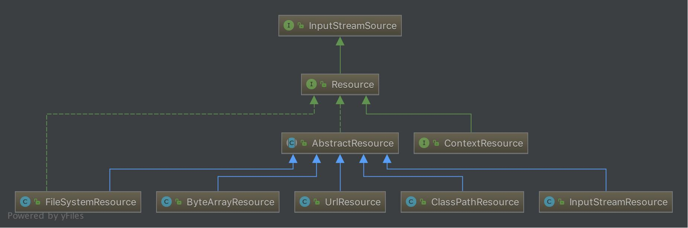
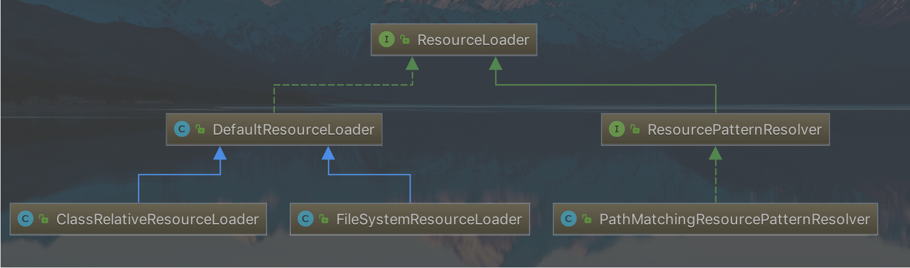
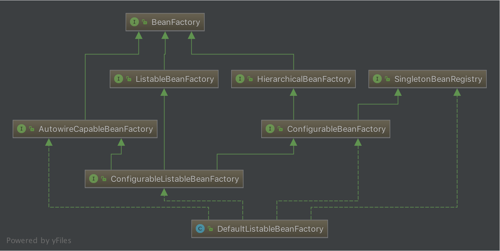
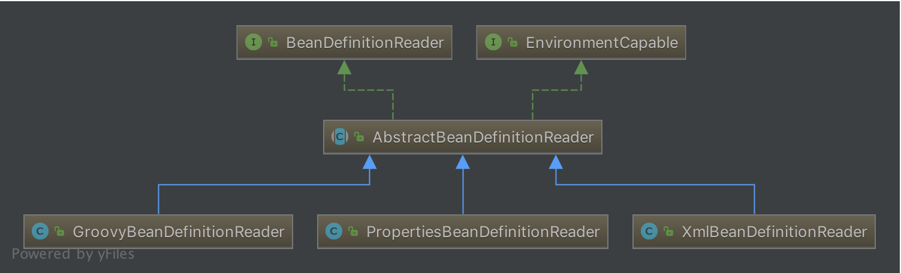
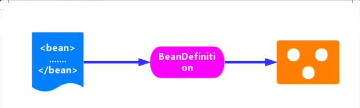

# IoC/DI

**IoC:Inversion of Control** [控制反转]

**DI:Dependency Injection** [依赖注入]

## 简介

IoC 容器最主要是完成 **对象的创建** 和 **依赖的管理注入**，IoC 的理念如下图：



所谓控制反转，就是把原先我们代码里面需要实现的对象创建、依赖的代码，反转给容器来帮忙实现。那么必然的我们需要创建一个容器，同时需要一种描述来让容器知道需要创建的对象与对象的关系。这个描述最具体表现就是我们可配置的文件。

对象和对象关系的表示可以用 `xml`、`properties` 文件等语义化配置文件表示。

描述对象关系的文件存放的地方可能是 `classpath` 、 `filesystem` 、 `URL 网络资源` 、 `servletContext` 等。

IoC为*被注入对象*提供*被依赖对象*有如下几种方式：
- **构造器注入**：*被注入的对象*通过在其构造方法中声明依赖对象的参数列表，让外部知道它需要哪些依赖对象
  - 构造器注入方式比较直观，对象构建完毕后就可以直接使用
- **setter方法注入**：对于 JavaBean 对象而言，一般都是通过 `getter` 和 `setter` 方法来访问和设置对象的属性。所以，当前对象只需要为其所依赖的对象提供相对应的 `setter` 方法，就可以通过该方法将相应的依赖对象设置到被注入对象中。
  - 相比于构造器注入，setter 方式注入会显得比较宽松灵活些，它可以在任何时候进行注入（当然是在使用依赖对象之前）
- **接口注入**：它需要被依赖的对象实现不必要的接口，带有侵入性。*一般都不推荐这种方式*

## IoC 体系结构

### Resource体系

Resource ，对资源的抽象，它的每一个实现类都代表了一种资源的访问策略，如 `ClasspathResource` 、 `URLResource` 、 `FileSystemResource` 等。



Spring利用`ResourceLoader`来进行统一资源加载，类图如下：




### BeanFactory

Spring Bean的创建是典型的**工厂模式**，其中 `BeanFactory` 作为最顶层的一个接口类，它定义了 IoC 容器的基本功能规范，`BeanFactory` 这个容器接口在 `org.springframework.beans.factory.BeanFactor` 中被定义，源码如下：

```java
public interface BeanFactory {
    //对FactoryBean的转义定义，因为如果使用bean的名字检索FactoryBean得到的对象是工厂生成的对象，
    //如果需要得到工厂本身，需要转义
    String FACTORY_BEAN_PREFIX = "&";

    //根据bean的名字，获取在IOC容器中得到bean实例
    Object getBean(String name) throws BeansException;

    //根据bean的名字和Class类型来得到bean实例，增加了类型安全验证机制。
    Object getBean(String name, Class requiredType) throws BeansException;

    //提供对bean的检索，看看是否在IOC容器有这个名字的bean
    boolean containsBean(String name);

    //根据bean名字得到bean实例，并同时判断这个bean是不是单例
    boolean isSingleton(String name) throws NoSuchBeanDefinitionException;

    //得到bean实例的Class类型
    Class getType(String name) throws NoSuchBeanDefinitionException;

    //得到bean的别名，如果根据别名检索，那么其原名也会被检索出来
    String[] getAliases(String name);
}
```

`BeanFactory` 有三个子类：`ListableBeanFactory` 、 `HierarchicalBeanFactory` 和 `AutowireCapableBeanFactory` ，其中 `DefaultListableBeanFactory` 为最终默认实现，它实现了所有接口。



在 BeanFactory 里只对 IoC 容器的基本行为作了定义，根本不关心 Bean 是如何定义怎样加载的。正如用户只关心工厂里得到什么的产品对象，至于工厂是怎么生产这些对象的，这个基本的接口不关心。而要知道工厂是如何产生对象的，需要看具体的 IoC 容器实现， **spring提供了许多IOC容器的实现，比如 `XmlBeanFactory` 、 `ClasspathXmlApplicationContext` 、 `ApplicationContext` 等**。其中 `XmlBeanFactory` 就是针对最基本的 IoC 容器的实现，这个 IoC 容器可以读取 XML 文件定义的 `BeanDefinition`（XML文件中对bean的描述）；`ApplicationContext` 是 Spring 提供的一个高级的 IoC 容器，它除了能够提供 IoC 容器的基本功能外，还为用户提供了以下的附加服务：

1. 支持信息源，可以实现国际化。（实现`MessageSource`接口）
2. 访问资源。(实现`ResourcePatternResolver`接口)
3. 支持应用事件。(实现`ApplicationEventPublisher`接口)

### BeanDefinition

Spring IoC 容器管理定义的各种 Bean 对象及其相互的关系，Bean 对象在 Spring 实现中是以 `BeanDefinition` 来描述的。



## IoC 流程


Spring IoC 容器所起的作用如上图所示，它会以某种方式加载 Configuration Metadata，将其解析注册到容器内部，然后回根据这些信息绑定整个系统的对象，最终组装成一个可用的基于轻量级容器的应用系统。

Spring 在实现上述功能中，将整个流程分为两个阶段：**容器初始化阶段**和**加载 Bean 阶段**。
- **容器初始化阶段**：首先通过某种方式加载 Configuration Metadata (主要是依据 Resource、ResourceLoader 两个体系)，然后容器会对加载的 Configuration MetaData 进行解析和分析，并将分析的信息组装成 BeanDefinition，并将其保存注册到相应的 BeanDefinitionRegistry 中。至此，Spring IoC 的初始化工作完成。
- **加载 Bean 阶段**：经过容器初始化阶段后，应用程序中定义的 Bean 信息已经全部加载到系统中了，当显示或者隐式地调用 `getBean(...)` 时，则会触发加载 bean 阶段。在这阶段，容器会首先检查所请求的对象是否已经初始化完成了，如果没有，则会根据注册的 bean 信息实例化请求的对象，并为其注册依赖，然后将其返回给请求方。至此第二个阶段也已经完成。

### IoC 初始化

示例代码：

```java
ClassPathResource resource = new ClassPathResource("bean.xml");
DefaultListableBeanFactory factory = new DefaultListableBeanFactory();
XmlBeanDefinitionReader reader = new XmlBeanDefinitionReader(factory);
reader.loadBeanDefinitions(resource);
```

上面代码是 Spring 中编程式使用 IoC 容器，通过此处代码可初步判定 Spring IoC 容器的使用过程：

1. 获取资源
2. 获取`BeanFactory`
3. 根据新建的`BeanFactory`创建一个`BeanDefinitionReader`对象，该Reader对象为资源的解析器
4. 装载资源




由上图可知，整个过程就分为三个步骤：
- **Resource 定位**：一般用外部资源来描述Bean对象，所以初始化IoC容器的第一步就是需要定位这个外部资源
- **BeanDefinition 载入**：`BeanDefinitionReader`读取、解析`Resource`资源，将用户定义的Bean转换成IoC容器的内部数据结构：`BeanDefinition`。在IoC容器内部维护着一个`BeanDefinition Map`的数据结构，在配置文件中每一个`<bean>`都对应着一个`BeanDefinition`对象
- **BeanDefinition 注册**：向IoC容器注册解析好的`BeanDefinition`，这个过程是通过`BeanDefinitionRegistry`接口来实现的。【注：IoC容器内部是将解析得到的BeanDefinition注入到一个HashMap容器中，IoC容器就是通过这个HashMap来维护这些BeanDefintion的，但是这个过程并没有完成依赖注入，依赖注入是发生在应用第一次调用`getBean()`向容器索要Bean时；当然可以通过设置预处理，即对某个Bean设置`lazyinit`属性，那么Bean的依赖注入会在容器初始化的时候完成。】

#### Resource 定位

Spring 为了解决资源定位的问题，提供了两个接口：Resource、ResourceLoader，其中 Resource 接口是 Spring 统一资源的抽象接口，ResourceLoader 则是 Spring 资源加载的统一抽象。

详细见：[统一资源加载策略](Java/Spring/SpringCore/Ioc源码解析/统一资源加载策略.md)

#### BeanDefinition 的载入和注册

- **加载Bean资源**

[加载Bean资源](Java/Spring/SpringCore/Ioc源码解析/加载Bean.md)

- **获取Document对象**

在 `XmlBeanDefinitionReader.doLoadDocument()` 方法中做了两件事:
1. 调用 `getValidationModeForResource()` 获取 XML 的验证模式，详细见：[获取XML的验证模型](Java/Spring/SpringCore/Ioc源码解析/获取验证模型.md)
2. 调用 `DocumentLoader.loadDocument()` 获取 Document 对象，详细见：[获取Document对象](Java/Spring/SpringCore/Ioc源码解析/获取Document对象.md)

- **解析和注册**

从给定的 Document 对象中解析定义的 BeanDefinition 并将它们注册到注册表中，根据 Document 对象和 Resource 对象调用 `registerBeanDefinitions()` 方法，源码如下：

```java
public int registerBeanDefinitions(Document doc, Resource resource) throws BeanDefinitionStoreException {
    BeanDefinitionDocumentReader documentReader = createBeanDefinitionDocumentReader();
    int countBefore = getRegistry().getBeanDefinitionCount();
    documentReader.registerBeanDefinitions(doc, createReaderContext(resource));
    return getRegistry().getBeanDefinitionCount() - countBefore;
}

protected BeanDefinitionDocumentReader createBeanDefinitionDocumentReader() {
    return BeanDefinitionDocumentReader.class.cast(BeanUtils.instantiateClass(this.documentReaderClass));
}

public XmlReaderContext createReaderContext(Resource resource) {
    return new XmlReaderContext(resource, this.problemReporter, this.eventListener, this.sourceExtractor, this, getNamespaceHandlerResolver());
}
```

根据待解析的 Docuemnt 对象以及解析器的当前上下文（包括目标注册表和被解析的资源）创建 BeanDefinitionDocumentReader 接口对象，这个对象的默认实现是 DefaultBeanDefinitionDocumentReader，通过 `DefaultBeanDefinitionDocumentReader.processBeanDefinition()` 来[解析BeanDefintion](Java/Spring/SpringCore/Ioc源码解析/解析BeanDefinition.md)。

在Spring中有两种解析Bean方式：
- 根节点或者子节点采用默认命名空间，则调用`parseDefaultElement()`进行[默认标签解析](Java/Spring/SpringCore/Ioc源码解析/默认标签解析.md)
- 自定义节点，则调用`delegate.parseCustomElement()`方法进行[自定义解析](Java/Spring/SpringCore/Ioc源码解析/自定义标签.md)

在对 Bean 的解析完成后，就是对[Bean 的注册](Java/Spring/SpringCore/Ioc源码解析/注册BeanDefinition.md)

### 加载 Bean 阶段

[加载 Bean 的过程](Java/Spring/SpringCore/Ioc源码解析/加载bean阶段.md)

由上可知，加载 Bean 的过程主要是分为三个部分：

1. 分析从[缓存中获取单例 Bean](Java/Spring/SpringCore/Ioc源码解析/单例Bean.md)，以及对 Bean 的实例中获取对象
2. 如果从单例缓存中获取 Bean，Spring 是怎么加载的呢？所以第二部分是分析 Bean 加载，以及 Bean 的依赖处理
3. Bean 已经加载了，依赖也处理完毕了，第三部分则分析[各个作用域的 Bean 初始化](Java/Spring/SpringCore/Ioc源码解析/各Scope的Bean创建.md)过程。

## 参考资料

*IoC理论博客推荐*：
- 谈谈对Spring IOC的理解：<http://www.cnblogs.com/xdp-gacl/p/4249939.html>
- Spring的IOC原理：<https://blog.csdn.net/m13666368773/article/details/7802126>>
- spring ioc原理：<https://blog.csdn.net/it_man/article/details/4402245>