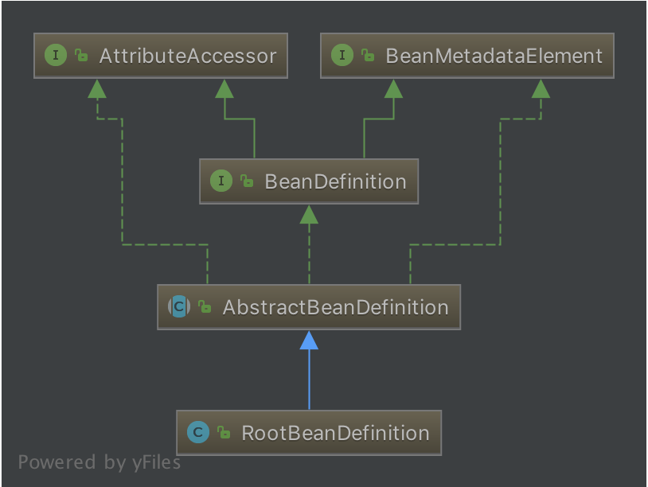

# Spring IoC

- [Spring IoC](#spring-ioc)
  - [IoC理论](#ioc理论)
  - [各个组件](#各个组件)
    - [Resource体系](#resource体系)
    - [BeanFactory体系](#beanfactory体系)
    - [Beandefinition体系](#beandefinition体系)
    - [BeandefinitionReader体系](#beandefinitionreader体系)
    - [ApplicationContext体系](#applicationcontext体系)
  - [IoC流程](#ioc流程)
    - [IoC初始化](#ioc初始化)
      - [Resource 定位](#resource-定位)
      - [BeanDefinition 的载入和注册](#beandefinition-的载入和注册)
    - [加载 bean 阶段](#加载-bean-阶段)

## IoC理论

`IoC` 全称为 `Inversion of Control`，翻译为 “**控制反转**”，它还有一个别名为 `DI`（`Dependency Injection`）,即**依赖注入**。

> IoC的定义
> > 所谓 IOC ，就是由 Spring IOC 容器来负责对象的生命周期和对象之间的关系
> 
> IoC的理念就是让**别人为你服务**，如下图
> 

IoC的四个经典问题及回答：
1. **谁控制谁**：在传统的开发模式下，都是采用直接 `new` 一个对象的方式来创建对象，也就是说依赖的对象直接由用户自己控制，但是有了 `IoC` 容器后，则直接由 `IoC` 容器来控制。*所以“谁控制谁”，当然是 `IoC` 容器控制对象*。
2. **控制什么**：控制对象。
3. **为何是反转**：没有 IoC 的时候都是在自己对象中主动去创建被依赖的对象，这是正转。但是有了 IoC 后，所依赖的对象直接由 IoC 容器创建后注入到被注入的对象中，依赖的对象由原来的主动获取变成被动接受，所以是反转。
4. **哪些方面反转了**：所依赖对象的获取被反转了。

IoC为*被注入对象*提供*被依赖对象*有如下几种方式：
- **构造器注入**：*被注入的对象*通过在其构造方法中声明依赖对象的参数列表，让外部知道它需要哪些依赖对象
  - 构造器注入方式比较直观，对象构建完毕后就可以直接使用
- **setter方法注入**：对于 JavaBean 对象而言，一般都是通过 `getter` 和 `setter` 方法来访问和设置对象的属性。所以，当前对象只需要为其所依赖的对象提供相对应的 `setter` 方法，就可以通过该方法将相应的依赖对象设置到被注入对象中。
  - 相比于构造器注入，setter 方式注入会显得比较宽松灵活些，它可以在任何时候进行注入（当然是在使用依赖对象之前）
- **接口注入**：它需要被依赖的对象实现不必要的接口，带有侵入性。*一般都不推荐这种方式*

*IoC理论博客推荐*：
- 谈谈对Spring IOC的理解：<http://www.cnblogs.com/xdp-gacl/p/4249939.html>
- Spring的IOC原理[通俗解释一下]：<https://blog.csdn.net/m13666368773/article/details/7802126>>
- spring ioc原理（看完后大家可以自己写一个spring）：<https://blog.csdn.net/it_man/article/details/4402245>

## 各个组件

### Resource体系

Resource，对资源的抽象，它的每一个实现类都代表了一种资源的访问策略，如`ClasspathResource`、`URLResource`，`FileSystemResource`等。


Spring利用`ResourceLoader`来进行统一资源加载，类图如下：


### BeanFactory体系

`BeanFactory`是一个非常纯粹的 bean 容器，它是 IOC 必备的数据结构，其中 `BeanDefinition` 是它的基本结构，它内部维护着一个 `BeanDefinition map` ，并可根据 `BeanDefinition` 的描述进行 bean 的创建和管理。


BeanFacoty 有三个直接子类 `ListableBeanFactory`、`HierarchicalBeanFactory` 和 `AutowireCapableBeanFactory`，`DefaultListableBeanFactory` 为最终默认实现，它实现了所有接口。

### Beandefinition体系

`BeanDefinition` 用来描述 Spring 中的 Bean 对象。



### BeandefinitionReader体系

`BeanDefinitionReader` 的作用是读取 Spring 的配置文件的内容，并将其转换成 Ioc 容器内部的数据结构：`BeanDefinition`。


### ApplicationContext体系

**ApplicationContext** 是 Spring 容器，它叫做应用上下文，继承 BeanFactory，所以它是 BeanFactory 的扩展升级版。由于 ApplicationContext 的结构就决定了它与 BeanFactory 的不同，其主要区别有：
- 继承 `MessageSource`，提供国际化的标准访问策略。
- 继承 `ApplicationEventPublisher` ，提供强大的事件机制。
- 扩展 `ResourceLoader`，可以用来加载多个 Resource，可以灵活访问不同的资源。
- 对 Web 应用的支持。

## IoC流程


Spring IOC 容器所起的作用如上图所示，它会以某种方式加载 Configuration Metadata，将其解析注册到容器内部，然后回根据这些信息绑定整个系统的对象，最终组装成一个可用的基于轻量级容器的应用系统。

Spring 在实现上述功能中，将整个流程分为两个阶段：**容器初始化阶段**和**加载 bean 阶段**。
- **容器初始化阶段**：首先通过某种方式加载 Configuration Metadata (主要是依据 Resource、ResourceLoader 两个体系)，然后容器会对加载的 Configuration MetaData 进行解析和分析，并将分析的信息组装成 BeanDefinition，并将其保存注册到相应的 BeanDefinitionRegistry 中。至此，Spring IOC 的初始化工作完成。
- **加载 bean 阶段**：经过容器初始化阶段后，应用程序中定义的 bean 信息已经全部加载到系统中了，当显示或者隐式地调用 `getBean()` 时，则会触发加载 bean 阶段。在这阶段，容器会首先检查所请求的对象是否已经初始化完成了，如果没有，则会根据注册的 bean 信息实例化请求的对象，并为其注册依赖，然后将其返回给请求方。至此第二个阶段也已经完成。

### IoC初始化

示例代码：

```java
ClassPathResource resource = new ClassPathResource("bean.xml");
DefaultListableBeanFactory factory = new DefaultListableBeanFactory();
XmlBeanDefinitionReader reader = new XmlBeanDefinitionReader(factory);
reader.loadBeanDefinitions(resource);
```

上面代码是Spring中编程式使用IoC容器，通过此处代码可初步判定Spring IoC容器的使用过程：
1. 获取资源
2. 获取`BeanFactory`
3. 根据新建的`BeanFactory`创建一个`BeanDefinitionReader`对象，该Reader对象为资源的解析器
4. 装载资源


由上图可知，整个过程就分为三个步骤：
- **Resource 定位**：一般用外部资源来描述Bean对象，所以初始化IoC容器的第一步就是需要定位这个外部资源
- **BeanDefinition 载入**：`BeanDefinitionReader`读取、解析`Resource`资源，将用户定义的Bean转换成IoC容器的内部数据结构：`BeanDefinition`。在IoC容器内部维护着一个`BeanDefinition Map`的数据结构，在配置文件中每一个`<bean>`都对应着一个`BeanDefinition`对象
- **BeanDefinition 注册**：向IoC容器注册解析好的`BeanDefinition`，这个过程是通过`BeanDefinitionRegistry`接口来实现的。【注：IoC容器内部是将解析得到的BeanDefinition注入到一个HashMap容器中，IoC容器就是通过这个HashMap来维护这些BeanDefintion的，但是这个过程并没有完成依赖注入，依赖注入是发生在应用第一次调用`getBean()`向容器索要Bean时；当然可以通过设置预处理，即对某个Bean设置`lazyinit`属性，那么Bean的依赖注入会在容器初始化的时候完成。】

#### Resource 定位

Spring 为了解决资源定位的问题，提供了两个接口：Resource、ResourceLoader，其中 Resource 接口是 Spring 统一资源的抽象接口，ResourceLoader 则是 Spring 资源加载的统一抽象。

详细见：[统一资源加载策略](./统一资源加载策略.md)

#### BeanDefinition 的载入和注册

- **加载Bean资源**

[加载Bean](./加载Bean.md)

- **获取Document对象**

在 `XmlBeanDefinitionReader.doLoadDocument()` 方法中做了两件事:
1. 调用 `getValidationModeForResource()` 获取 XML 的验证模式，详细见：[获取XML的验证模型](./获取验证模型.md)
2. 调用 `DocumentLoader.loadDocument()` 获取 Document 对象，详细见：[获取Document对象](./获取Document对象.md)

- **解析和注册**

从给定的Document对象中解析定义的BeanDefinition并将它们注册到注册表中，根据 Document 对象和 Resource 对象调用`registerBeanDefinitions()`方法，源码如下：

```java
public int registerBeanDefinitions(Document doc, Resource resource) throws BeanDefinitionStoreException {
  BeanDefinitionDocumentReader documentReader = createBeanDefinitionDocumentReader();
  int countBefore = getRegistry().getBeanDefinitionCount();
  documentReader.registerBeanDefinitions(doc, createReaderContext(resource));
  return getRegistry().getBeanDefinitionCount() - countBefore;
}

protected BeanDefinitionDocumentReader createBeanDefinitionDocumentReader() {
  return BeanDefinitionDocumentReader.class.cast(BeanUtils.instantiateClass(this.documentReaderClass));
}

public XmlReaderContext createReaderContext(Resource resource) {
  return new XmlReaderContext(resource, this.problemReporter, this.eventListener, this.sourceExtractor, this, getNamespaceHandlerResolver());
}
```

根据待解析的 Docuemnt 对象以及解析器的当前上下文（包括目标注册表和被解析的资源）创建`BeanDefinitionDocumentReader`接口对象，这个对象的默认实现是`DefaultBeanDefinitionDocumentReader`，通过`DefaultBeanDefinitionDocumentReader.processBeanDefinition()`来[解析BeanDefintion](./解析BeanDefinition.md)。

在Spring中有两种解析Bean方式：
- 根节点或者子节点采用默认命名空间，则调用`parseDefaultElement()`进行[默认标签解析](./默认标签解析.md)
- 自定义节点，则调用`delegate.parseCustomElement()`方法进行[自定义解析](./自定义标签.md)

在对Bean的解析完成后，就是对Bean的[注册](./注册BeanDefinition.md)

### 加载 bean 阶段

[概览加载bean的过程](./加载bean阶段.md)

经概览可知，加载bean的过程主要是分为三个部分：

1. 分析从[缓存中获取单例 bean](./单例Bean.md)，以及对 bean 的实例中获取对象
2. 如果从单例缓存中获取 bean，Spring 是怎么加载的呢？所以第二部分是分析 bean 加载，以及 bean 的依赖处理
3. bean 已经加载了，依赖也处理完毕了，第三部分则分析[各个作用域的 bean 初始化](./各Scope的Bean创建.md)过程。