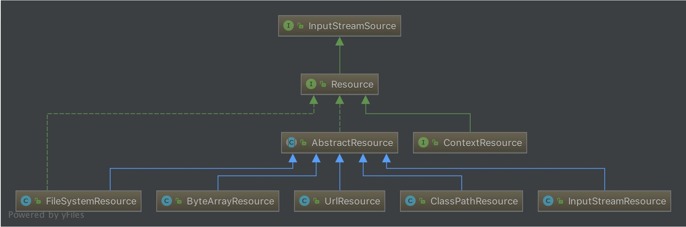
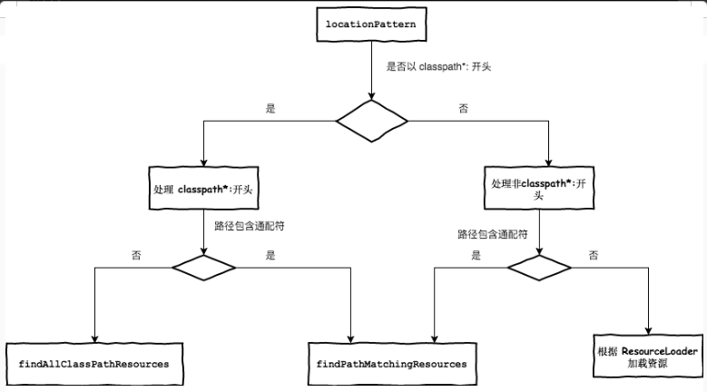

# Spring 统一资源加载策略

## 统一资源 Resource

`org.springframework.core.io.Resource` 为 Spring 框架所有资源的抽象和访问接口，它继承 `org.springframework.core.io.InputStreamSource`接口。作为所有资源的统一抽象，Source 定义了一些通用的方法，由子类 `AbstractResource` 提供统一的默认实现。定义如下：

```java
public interface Resource extends InputStreamSource {

    /**
     * 资源是否存在
     */
    boolean exists();

    /**
     * 资源是否可读
     */
    default boolean isReadable() {
        return true;
    }

    /**
     * 资源所代表的句柄是否被一个stream打开了
     */
    default boolean isOpen() {
        return false;
    }

    /**
     * 是否为 File
     */
    default boolean isFile() {
        return false;
    }

    /**
     * 返回资源的URL的句柄
     */
    URL getURL() throws IOException;

    /**
     * 返回资源的URI的句柄
     */
    URI getURI() throws IOException;

    /**
     * 返回资源的File的句柄
     */
    File getFile() throws IOException;

    /**
     * 返回 ReadableByteChannel
     */
    default ReadableByteChannel readableChannel() throws IOException {
        return Channels.newChannel(getInputStream());
    }

    /**
     * 资源内容的长度
     */
    long contentLength() throws IOException;

    /**
     * 资源最后的修改时间
     */
    long lastModified() throws IOException;

    /**
     * 根据资源的相对路径创建新资源
     */
    Resource createRelative(String relativePath) throws IOException;

    /**
     * 资源的文件名
     */
    @Nullable
    String getFilename();

    /**
     * 资源的描述
     */
    String getDescription();
}
```

类结构图如下：



从上图可以看到，Resource根据资源的不同类型提供不同的具体实现，如下：
- `FileSystemResource`:对`java.io.File`类型资源的封装，只要是跟File打交道的，基本上与FileSystemResource也可以打交道。支持文件和URL的形式，实现WritableResource接口，且从Spring Framework 5.0 开始，FileSystemResource使用NIO2.0 API进行读/写交互
- `ByteArrayResource`:对字节数组提供的数据的封装。如果通过InputStream形式访问该类型的资源，该实现会根据字节数据的数据构造一个相应的ByteArrayInputStream
- `UrlResource`:对`java.net.URL`类型资源的封装。内部委托URL进行具体的资源操作
- `ClassPathResource`:class path类型资源的实现。使用给定的ClassLoader或者给定的Class来加载资源
- `InputStreamResource`:将给定的InputStream作为一种资源的Resource的实现类

AbstractResource 为 Resource 接口的默认实现，它实现了 Resource 接口的大部分的公共实现，作为 Resource 接口中的重中之重，其定义如下：

```java
public abstract class AbstractResource implements Resource {

    /**
     * 判断文件是否存在，若判断过程产生异常（因为会调用SecurityManager来判断），就关闭对应的流
     */
    @Override
    public boolean exists() {
        try {
            return getFile().exists();
        }
        catch (IOException ex) {
            // Fall back to stream existence: can we open the stream?
            try {
                InputStream is = getInputStream();
                is.close();
                return true;
            }
            catch (Throwable isEx) {
                return false;
            }
        }
    }

    /**
     * 直接返回true，表示可读
     */
    @Override
    public boolean isReadable() {
        return true;
    }

    /**
     * 直接返回 false，表示未被打开
     */
    @Override
    public boolean isOpen() {
        return false;
    }

    /**
     *  直接返回false，表示不为 File
     */
    @Override
    public boolean isFile() {
        return false;
    }

    /**
     * 抛出 FileNotFoundException 异常，交给子类实现
     */
    @Override
    public URL getURL() throws IOException {
        throw new FileNotFoundException(getDescription() + " cannot be resolved to URL");
    }

    /**
     * 基于 getURL() 返回的 URL 构建 URI
     */
    @Override
    public URI getURI() throws IOException {
        URL url = getURL();
        try {
            return ResourceUtils.toURI(url);
        }
        catch (URISyntaxException ex) {
            throw new NestedIOException("Invalid URI [" + url + "]", ex);
        }
    }

    /**
     * 抛出 FileNotFoundException 异常，交给子类实现
     */
    @Override
    public File getFile() throws IOException {
        throw new FileNotFoundException(getDescription() + " cannot be resolved to absolute file path");
    }

    /**
     * 根据 getInputStream() 的返回结果构建 ReadableByteChannel
     */
    @Override
    public ReadableByteChannel readableChannel() throws IOException {
        return Channels.newChannel(getInputStream());
    }

    /**
     * 获取资源的长度
     *
     * 这个资源内容长度实际就是资源的字节长度，通过全部读取一遍来判断
     */
    @Override
    public long contentLength() throws IOException {
        InputStream is = getInputStream();
        try {
            long size = 0;
            byte[] buf = new byte[255];
            int read;
            while ((read = is.read(buf)) != -1) {
                size += read;
            }
            return size;
        }
        finally {
            try {
                is.close();
            }
            catch (IOException ex) {
            }
        }
    }

    /**
     * 返回资源最后的修改时间
     */
    @Override
    public long lastModified() throws IOException {
        long lastModified = getFileForLastModifiedCheck().lastModified();
        if (lastModified == 0L) {
            throw new FileNotFoundException(getDescription() +
                    " cannot be resolved in the file system for resolving its last-modified timestamp");
        }
        return lastModified;
    }


    protected File getFileForLastModifiedCheck() throws IOException {
        return getFile();
    }

    /**
     * 交给子类实现
     */
    @Override
    public Resource createRelative(String relativePath) throws IOException {
        throw new FileNotFoundException("Cannot create a relative resource for " + getDescription());
    }

    /**
     * 获取资源名称，默认返回 null
     */
    @Override
    @Nullable
    public String getFilename() {
        return null;
    }

    /**
     * 返回资源的描述
     */
    @Override
    public String toString() {
        return getDescription();
    }

    @Override
    public boolean equals(Object obj) {
        return (obj == this ||
            (obj instanceof Resource && ((Resource) obj).getDescription().equals(getDescription())));
    }

    @Override
    public int hashCode() {
        return getDescription().hashCode();
    }
}
```

**注**：若需要实现自定义的Resource，一般不实现Resource接口，而应该继承AbstractResource抽象类，然后根据当前的具体资源特性覆盖相应的方法即可。

## 统一资源定位 ResourceLoader

`org.springframework.core.io.ResourceLoader` 为 Spring 资源加载的统一抽象，具体的资源加载则由相应的实现类来完成，所以可以将 ResourceLoader 称作为统一资源定位器。其定义如下：

```java
public interface ResourceLoader {
    String CLASSPATH_URL_PREFIX = ResourceUtils.CLASSPATH_URL_PREFIX;

    Resource getResource(String location);

    ClassLoader getClassLoader();
}
```

ResourceLoader接口提供两种方法：`getResource(String location)`、`getClassLoader()`
- `getResource(String location)`:根据所提供资源的路径location返回Resource实例，但是它不确保该Resource一定存在，需要调用`Resource.exist()`方法判断。
  - 该方法支持以下模式的资源加载：
    - URL位置资源，如`file:C:/test.dat`
    - ClassPath位置资源，如`classpath:test.dat`
    - 相对路径资源，如`WEB-INF/test.dat`，此时返回的Resource实例根据实现不同个而不同
  - 该方法的主要实现是在其子类`DefaultResourceLoader`中实现
- `getClassLoader()`:返回ClassLoader实例

ResourceLoader作为Spring统一的资源加载器，它提供了统一的抽象，具体的实现则由相应的子类来负责实现，其类的结构图如下：


### DefaultResourceLoader

DefaultResourceLoader是ResourceLoader的默认实现，它接收ClassLoader作为构造函数的参数或者使用不带参数的构造函数，在使用不带参数的构造函数时，使用的ClassLoader为默认的ClassLoader（一般为`Thread.currentThread().getContextClassLoader()`），可以通过`ClassUtils.getDefaultClassLoader()`获取。如下：

```java
public DefaultResourceLoader() {
    this.classLoader = ClassUtils.getDefaultClassLoader();
}

public DefaultResourceLoader(@Nullable ClassLoader classLoader) {
    this.classLoader = classLoader;
}

public void setClassLoader(@Nullable ClassLoader classLoader) {
    this.classLoader = classLoader;
}

@Override
@Nullable
public ClassLoader getClassLoader() {
    return (this.classLoader != null ? this.classLoader : ClassUtils.getDefaultClassLoader());
}
```

ResourceLoader中最核心的方法为`getResource()`，它根据提供的location返回相应的Resource，DefaultResourceLoader对该方法提供了核心实现（它的两个子类都没有提供覆盖该方法，所以可以断定ResourceLoader的资源加载策略就封装在DefaultResourceLoader中），如下：

```java
public Resource getResource(String location) {
    Assert.notNull(location, "Location must not be null");

    for (ProtocolResolver protocolResolver : this.protocolResolvers) {
        Resource resource = protocolResolver.resolve(location, this);
        if (resource != null) {
            return resource;
        }
    }

    if (location.startsWith("/")) {
        return getResourceByPath(location);
    }
    else if (location.startsWith(CLASSPATH_URL_PREFIX)) {
        return new ClassPathResource(location.substring(CLASSPATH_URL_PREFIX.length()), getClassLoader());
    }
    else {
        try {
            // Try to parse the location as a URL...
            URL url = new URL(location);
            return (ResourceUtils.isFileURL(url) ? new FileUrlResource(url) : new UrlResource(url));
        }
        catch (MalformedURLException ex) {
            // No URL -> resolve as resource path.
            return getResourceByPath(location);
        }
    }
}
```

首先通过ProtocolResolver来加载资源，成功则直接返回Resource，否则调用如下逻辑：
1. 若location以`/`开头，则调用`getResourceByPath()`构造ClassPathContextResource类型资源并返回
2. 若location以`classpath:`开头，则构造ClassPathResource类型并返回，在构造该资源时，通过`getClassLoader()`获取当前的ClassLoader
3. 构造URL，尝试通过它进行资源定位，若没有抛出MalformedURLException异常，则判断是否是FileURL，如果是则构造FileUrlResource资源，否则构造UrlResource。若在加载过程中抛出MalformedURLException异常，则委派`getResourceByPath()`实现资源定位加载

- **ProtocolResolver**

*Spring Framework 5.0 开始支持的方案*

ProtocolResolver，用户自定义协议资源解决策略，作为DefaultResourceLoader的SPI，它允许用户自定义资源加载协议，而不需要继承ResourceLoader的子类，只需要实现ProtocolResolver接口来实现自定义ResourceLoader。ProtocolResolver接口，仅有一个方法`Resource resolve(String location, ResourceLoader resourceLoader)`，该方法接收两个参数：资源路径location，指定的加载器 ResourceLoader，返回为相应的 Resource 。在Spring框架中该接口并没有实现，它需要用户自定义，自定义的Resolver要加入Spring体系中通过`DefaultResourceLoader.addProtocolResolver()` 即可，如下：

```java
public void addProtocolResolver(ProtocolResolver resolver) {
    Assert.notNull(resolver, "ProtocolResolver must not be null");
    this.protocolResolvers.add(resolver);
}
```

### FileSystemResourceLoader

因DefaultResourceLoader对`getResourceByPath(String)`方法对路径地址`D:/test/test.txt`的资源处理的资源类是`ClassPathResource`，这其实不是很恰当的，此时可以使用FileSystemResourceLoader来处理此类资源。FileSystemResourceLoader继承DefaultResourceLoader且覆写了`getResourceByPath(String)`，使之从文件系统加载资源并以`FileSystemResource`类型返回，如下：

```java
@Override
protected Resource getResourceByPath(String path) {
    if (path.startsWith("/")) {
        path = path.substring(1);
    }
    return new FileSystemContextResource(path);
}

private static class FileSystemContextResource extends FileSystemResource implements ContextResource {

    public FileSystemContextResource(String path) {
        super(path);
    }

    @Override
    public String getPathWithinContext() {
        return getPath();
    }
}
```

### ResourcePatternResolver

ResourceLoader的`Resource getResource(String location)`每次只能根据location返回一个Resource，当需要加载多个资源时，除了多次调用`getResource()`别无他法。ResourcePatternResolver是ResourceLoader的扩展，它支持根据制定的资源路径匹配模式每次返回多个Resource实例，其定义如下：

```java
public interface ResourcePatternResolver extends ResourceLoader {
    String CLASSPATH_ALL_URL_PREFIX = "classpath*:";

    Resource[] getResources(String locationPattern) throws IOException;
}
```

ResourcePatternResolver在ResourceLoad的基础上增加了`getResources(String locationPattern)`，以支持根据路径匹配模式返回多个Resource实例，同时也增加了一种新的协议前缀`classpath*:`，该协议前缀由其子类负责实现。

PathMathingResourcePatternResolver为ResourcePatternResolver最常用的子类，它除了支持ResourceLoader和ResourcePatternResolver新增的`classpath*:`前缀外，还支持Ant风格的路径匹配模式（类似于`**/*.xml`）

PathMatchingResourcePatternResolver提供的三个构造方法，如下：

```java
public PathMatchingResourcePatternResolver() {
    this.resourceLoader = new DefaultResourceLoader();
}

public PathMatchingResourcePatternResolver(ResourceLoader resourceLoader) {
    Assert.notNull(resourceLoader, "ResourceLoader must not be null");
    this.resourceLoader = resourceLoader;
}

public PathMatchingResourcePatternResolver(@Nullable ClassLoader classLoader) {
    this.resourceLoader = new DefaultResourceLoader(classLoader);
}
```

PathMatchingResourcePatternResolver 在实例化的时候，可以指定一个 ResourceLoader，如果不指定的话，它会在内部构造一个 DefaultResourceLoader。

- **`Resource getResource(String location)`**

```java
@Override
public Resource getResource(String location) {
    return getResourceLoader().getResource(location);
}
```

`getResource()` 方法直接委托给相应的 ResourceLoader 来实现，所以如果在实例化的 PathMatchingResourcePatternResolver 的时候，如果不知道 ResourceLoader ，那么在加载资源时，其实就是 DefaultResourceLoader 的过程。

- **`Resource[] getResources(String locationPattern)`**

```java
public Resource[] getResources(String locationPattern) throws IOException {
    Assert.notNull(locationPattern, "Location pattern must not be null");

    // 以 classpath*: 开头
    if (locationPattern.startsWith(CLASSPATH_ALL_URL_PREFIX)) {
        // 路径包含通配符
        if (getPathMatcher().isPattern(locationPattern.substring(CLASSPATH_ALL_URL_PREFIX.length()))) {
            return findPathMatchingResources(locationPattern);
        }
        else {
            // 路径不包含通配符
            return findAllClassPathResources(locationPattern.substring(CLASSPATH_ALL_URL_PREFIX.length()));
        }
    }
    else {
        int prefixEnd = (locationPattern.startsWith("war:") ? locationPattern.indexOf("*/") + 1 :
                locationPattern.indexOf(':') + 1);
        // 路径包含通配符
        if (getPathMatcher().isPattern(locationPattern.substring(prefixEnd))) {
            return findPathMatchingResources(locationPattern);
        }
        else {
            return new Resource[] {getResourceLoader().getResource(locationPattern)};
        }
    }
}
```

处理逻辑如下图：


- **`findAllClassPathResources()`**

当locationPattern以`classpath*:`开头，但是不包含通配符，则调用`findAllClassPathResources()`方法加载资源。该方法返回**classes**路径下和**所有jar包**中的所有相匹配的资源。

```java
protected Resource[] findAllClassPathResources(String location) throws IOException {
    String path = location;
    if (path.startsWith("/")) {
        path = path.substring(1);
    }
    Set<Resource> result = doFindAllClassPathResources(path);
    if (logger.isDebugEnabled()) {
        logger.debug("Resolved classpath location [" + location + "] to resources " + result);
    }
    return result.toArray(new Resource[0]);
}

// 根据ClassLoader加载路径下的所有资源。
protected Set<Resource> doFindAllClassPathResources(String path) throws IOException {
    Set<Resource> result = new LinkedHashSet<>(16);
    ClassLoader cl = getClassLoader();
    Enumeration<URL> resourceUrls = (cl != null ? cl.getResources(path) : ClassLoader.getSystemResources(path));
    while (resourceUrls.hasMoreElements()) {
        URL url = resourceUrls.nextElement();
        result.add(convertClassLoaderURL(url));
    }
    if ("".equals(path)) {
        addAllClassLoaderJarRoots(cl, result);
    }
    return result;
}
```

通过上面的分析，`findAllClassPathResources()` 其实就是利用 ClassLoader 来加载指定路径下的资源，不过它是在 class 路径下还是在 jar 包中。如果我们传入的路径为空或者 /，则会调用 addAllClassLoaderJarRoots() 方法加载所有的 jar 包。

- **`findPathMatchingResources()`**

当locationPattern以`classpath*:`开头且当中包含了通配符，则调用该方法进行资源加载。如下：

```java
protected Resource[] findPathMatchingResources(String locationPattern) throws IOException {
    // 确定根路径
    String rootDirPath = determineRootDir(locationPattern);
    String subPattern = locationPattern.substring(rootDirPath.length());

    // 获取根据路径下得资源
    Resource[] rootDirResources = getResources(rootDirPath);

    Set<Resource> result = new LinkedHashSet<>(16);
    for (Resource rootDirResource : rootDirResources) {
        rootDirResource = resolveRootDirResource(rootDirResource);
        URL rootDirUrl = rootDirResource.getURL();
        // bundle 资源类型
        if (equinoxResolveMethod != null && rootDirUrl.getProtocol().startsWith("bundle")) {
            URL resolvedUrl = (URL) ReflectionUtils.invokeMethod(equinoxResolveMethod, null, rootDirUrl);
            if (resolvedUrl != null) {
                rootDirUrl = resolvedUrl;
            }
            rootDirResource = new UrlResource(rootDirUrl);
        }

        // VFS 资源
        if (rootDirUrl.getProtocol().startsWith(ResourceUtils.URL_PROTOCOL_VFS)) {
            result.addAll(VfsResourceMatchingDelegate.findMatchingResources(rootDirUrl, subPattern, getPathMatcher()));
        }
        // Jar
        else if (ResourceUtils.isJarURL(rootDirUrl) || isJarResource(rootDirResource)) {
            result.addAll(doFindPathMatchingJarResources(rootDirResource, rootDirUrl, subPattern));
        }
        else {
            result.addAll(doFindPathMatchingFileResources(rootDirResource, subPattern));
        }
    }
    if (logger.isDebugEnabled()) {
        logger.debug("Resolved location pattern [" + locationPattern + "] to resources " + result);
    }
    return result.toArray(new Resource[0]);
}

//主要用于确定根路径
protected String determineRootDir(String location) {
    int prefixEnd = location.indexOf(':') + 1;
    int rootDirEnd = location.length();
    while (rootDirEnd > prefixEnd && getPathMatcher().isPattern(location.substring(prefixEnd, rootDirEnd))) {
        rootDirEnd = location.lastIndexOf('/', rootDirEnd - 2) + 1;
    }
    if (rootDirEnd == 0) {
        rootDirEnd = prefixEnd;
    }
    return location.substring(0, rootDirEnd);
}
```

`findPathMatchingResources()`主要逻辑分为两步：
1. 确定目录，获取该目录下的所有资源
2. 在所获得的所有资源中进行迭代匹配获取想要的资源

在`findPathMatchingResources()`中主要关注两个方法：
- `determineRootDir()`:主要是用于确定根路径，该方法一定要给出一个确定的根目录。该根目录用于确定文件的匹配的起始点，将根目录位置的资源解析为 `java.io.File` 并将其传递到 `retrieveMatchingFiles()`，其余为知用于模式匹配，找出我们所需要的资源。
- `doFindPathMatchingFileResources()`