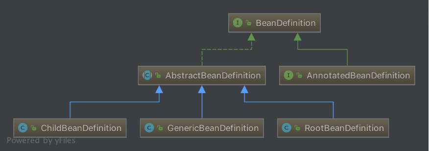

# 默认标签解析

- [默认标签解析](#默认标签解析)
  - [`import`标签](#import标签)
  - [`bean`标签](#bean标签)
    - [BeanDefinition](#beandefinition)
    - [子元素](#子元素)
      - [meta](#meta)
      - [lookup-method](#lookup-method)
      - [replace-method](#replace-method)
      - [constructor-arg](#constructor-arg)
      - [property](#property)
      - [qualifier](#qualifier)
    - [`bean`标签的自定义标签元素解析](#bean标签的自定义标签元素解析)

默认标签解析的源码如下：

```java
private void parseDefaultElement(Element ele, BeanDefinitionParserDelegate delegate) {
    // 对 import 标签的解析
    if (delegate.nodeNameEquals(ele, IMPORT_ELEMENT)) {
        importBeanDefinitionResource(ele);
    }
    // 对 alias 标签的解析
    else if (delegate.nodeNameEquals(ele, ALIAS_ELEMENT)) {
        processAliasRegistration(ele);
    }
    // 对 bean 标签的解析
    else if (delegate.nodeNameEquals(ele, BEAN_ELEMENT)) {
        processBeanDefinition(ele, delegate);
    }
    // 对 beans 标签的解析
    else if (delegate.nodeNameEquals(ele, NESTED_BEANS_ELEMENT)) {
        // recurse
        doRegisterBeanDefinitions(ele);
    }
}
```

方法的功能可清楚知道分别是对四种不同的标签进行解析，分别是`import`、`alias`、`bean`、`beans`

## `import`标签

在Spring工程很大的时候，配置文件的维护很麻烦，需要将配置文件拆分成多个，针对这种情况Spring提供了一个分模块的思路，利用import标签。

Spring利用`importBeanDefinitionResource()`方法完成对import标签的解析，代码如下：

```java
protected void importBeanDefinitionResource(Element ele) {
    // 获取 resource 的属性值 
    String location = ele.getAttribute(RESOURCE_ATTRIBUTE);
    // 为空，直接退出
    if (!StringUtils.hasText(location)) {
        getReaderContext().error("Resource location must not be empty", ele);
        return;
    }

    // 解析系统属性，格式如 ："${user.dir}"
    location = getReaderContext().getEnvironment().resolveRequiredPlaceholders(location);

    Set<Resource> actualResources = new LinkedHashSet<>(4);

    // 判断 location 是相对路径还是绝对路径
    boolean absoluteLocation = false;
    try {
        absoluteLocation = ResourcePatternUtils.isUrl(location) || ResourceUtils.toURI(location).isAbsolute();
    }
    catch (URISyntaxException ex) {
        // cannot convert to an URI, considering the location relative
        // unless it is the well-known Spring prefix "classpath*:"
    }

    // 绝对路径
    if (absoluteLocation) {
        try {
            // 直接根据地质加载相应的配置文件
            int importCount = getReaderContext().getReader().loadBeanDefinitions(location, actualResources);
            if (logger.isDebugEnabled()) {
                logger.debug("Imported " + importCount + " bean definitions from URL location [" + location + "]");
            }
        }
        catch (BeanDefinitionStoreException ex) {
            getReaderContext().error(
                    "Failed to import bean definitions from URL location [" + location + "]", ele, ex);
        }
    }
    else {
        // 相对路径则根据相应的地质计算出绝对路径地址
        try {
            int importCount;
            Resource relativeResource = getReaderContext().getResource().createRelative(location);
            if (relativeResource.exists()) {
                importCount = getReaderContext().getReader().loadBeanDefinitions(relativeResource);
                actualResources.add(relativeResource);
            }
            else {
                String baseLocation = getReaderContext().getResource().getURL().toString();
                importCount = getReaderContext().getReader().loadBeanDefinitions(
                        StringUtils.applyRelativePath(baseLocation, location), actualResources);
            }
            if (logger.isDebugEnabled()) {
                logger.debug("Imported " + importCount + " bean definitions from relative location [" + location + "]");
            }
        }
        catch (IOException ex) {
            getReaderContext().error("Failed to resolve current resource location", ele, ex);
        }
        catch (BeanDefinitionStoreException ex) {
            getReaderContext().error("Failed to import bean definitions from relative location [" + location + "]",
                    ele, ex);
        }
    }
    // 解析成功后，进行监听器激活处理
    Resource[] actResArray = actualResources.toArray(new Resource[0]);
    getReaderContext().fireImportProcessed(location, actResArray, extractSource(ele));
}
```

解析import的整个过程如下：
1. 获取source属性的值，该值表示资源的路径
2. 解析路径中的系统属性，如`${user.dir}`
3. 判断资源路径location是绝对路径还是相对路径
4. 如果是绝对路径，则递归调用Bean的解析过程，进行另一次解析
5. 如果是相对路径，则先计算出绝对路径得到Resource，然后进行解析
6. 通知监听器【<font color="red">监听器???</font>】，完成解析

- **判断路径**

方法通过以下方法来判断location是相对路径还是绝对路径：

```java
absoulteLocation=ResourcePatternUtils.isUrl(location) || ResourceUtils.toURI(location).isAbsolute();
```

判断绝对路径的规则如下：
- 以`classpath*:`或者`classpath:`开头为绝对路径
- 能够通过该location构造出`java.net.URL`为绝对路径
- 根据location构造`java.net.URI`判断调用`isAbsolute()`判断是否为绝对路径

- **绝对路径**

如果location为绝对路径则调用`loadBeanDefinitions()`,该方法在`AbstractBeanDefinitionReader`中定义，代码如下：

```java
public int loadBeanDefinitions(String location, @Nullable Set<Resource> actualResources) throws BeanDefinitionStoreException {
    ResourceLoader resourceLoader = getResourceLoader();
    if (resourceLoader == null) {
        throw new BeanDefinitionStoreException(
                "Cannot import bean definitions from location [" + location + "]: no ResourceLoader available");
    }

    if (resourceLoader instanceof ResourcePatternResolver) {
        // Resource pattern matching available.
        try {
            Resource[] resources = ((ResourcePatternResolver) resourceLoader).getResources(location);
            int loadCount = loadBeanDefinitions(resources);
            if (actualResources != null) {
                for (Resource resource : resources) {
                    actualResources.add(resource);
                }
            }
            if (logger.isDebugEnabled()) {
                logger.debug("Loaded " + loadCount + " bean definitions from location pattern [" + location + "]");
            }
            return loadCount;
        }
        catch (IOException ex) {
            throw new BeanDefinitionStoreException(
                    "Could not resolve bean definition resource pattern [" + location + "]", ex);
        }
    }
    else {
        // Can only load single resources by absolute URL.
        Resource resource = resourceLoader.getResource(location);
        int loadCount = loadBeanDefinitions(resource);
        if (actualResources != null) {
            actualResources.add(resource);
        }
        if (logger.isDebugEnabled()) {
            logger.debug("Loaded " + loadCount + " bean definitions from location [" + location + "]");
        }
        return loadCount;
    }
}
```

- **相对路径**

如果是相对路径则会根据相应的Resource计算出相应的绝对路径，然后根据该路径构造出一个Resource，若该Resource存在，则调用`XmlBeanDefinitionReader.loadBeanDefinitions()`进行BeanDefintion加载，否则构造一个绝对location，调用`AbstractBeanDefinitionReader.loadBeanDefinitions()`方法，与绝对路径过程一样。

至此，import 标签解析完毕，整个过程比较清晰明了：**获取 source 属性值，得到正确的资源路径，然后调用 `loadBeanDefinitions()` 方法进行递归的 BeanDefinition 加载**

## `bean`标签

在方法`parseDefaultElement()`中，如果遇到标签`<bean>`则调用`processBeanDefinition()`方法进行bean标签解析，如下：

```java
protected void processBeanDefinition(Element ele, BeanDefinitionParserDelegate delegate) {
    BeanDefinitionHolder bdHolder = delegate.parseBeanDefinitionElement(ele);
    if (bdHolder != null) {
        bdHolder = delegate.decorateBeanDefinitionIfRequired(ele, bdHolder);
        try {
            // Register the final decorated instance.
            BeanDefinitionReaderUtils.registerBeanDefinition(bdHolder, getReaderContext().getRegistry());
        }
        catch (BeanDefinitionStoreException ex) {
            getReaderContext().error("Failed to register bean definition with name '" +
                    bdHolder.getBeanName() + "'", ele, ex);
        }
        // Send registration event.
        getReaderContext().fireComponentRegistered(new BeanComponentDefinition(bdHolder));
    }
}
```

整个过程分为四个步骤：
1. 调用`BeanDefinitionParserDelegate.parseBeanDefinitionElement()`进行元素解析，解析过程中如果失败，返回null，错误由`ProblemReporter`处理。如果解析成功则返回**BeanDefinitionHolder实例**bdHolder。**BeanDefinitionHolder为持有name和alias的BeanDefinition**。
2. 若实例bdHolder不为空，则调用`BeanDefinitionParserDelegate.decorateBeanDefinitionIfRequired()`进行自定义标签处理
3. 解析完成后，则调用`BeanDefinitionReaderUtils.registerBeanDefinition()`对bdHolder进行注册
4. 发出响应事件【<font color="red">学习事件相关</font>】，通知相关监听器，完成Bean标签解析

- **`parseBeanDefinitionElement()`**

```java
public BeanDefinitionHolder parseBeanDefinitionElement(Element ele, @Nullable BeanDefinition containingBean) {
    // 解析 id 属性
    String id = ele.getAttribute(ID_ATTRIBUTE);

    // 解析 name 属性
    String nameAttr = ele.getAttribute(NAME_ATTRIBUTE);
    // 分割 name 属性
    List<String> aliases = new ArrayList<>();
    if (StringUtils.hasLength(nameAttr)) {
        String[] nameArr = StringUtils.tokenizeToStringArray(nameAttr, MULTI_VALUE_ATTRIBUTE_DELIMITERS);
        aliases.addAll(Arrays.asList(nameArr));
    }

    String beanName = id;
    if (!StringUtils.hasText(beanName) && !aliases.isEmpty()) {
        beanName = aliases.remove(0);
        if (logger.isDebugEnabled()) {
            logger.debug("No XML 'id' specified - using '" + beanName +
                    "' as bean name and " + aliases + " as aliases");
        }
    }

    // 检查 name 的唯一性
    if (containingBean == null) {
        checkNameUniqueness(beanName, aliases, ele);
    }

    // 解析 属性，构造 AbstractBeanDefinition
    AbstractBeanDefinition beanDefinition = parseBeanDefinitionElement(ele, beanName, containingBean);
    if (beanDefinition != null) {
        // 如果 beanName 不存在，则根据条件构造一个 beanName
        if (!StringUtils.hasText(beanName)) {
            try {
                if (containingBean != null) {
                    beanName = BeanDefinitionReaderUtils.generateBeanName(
                            beanDefinition, this.readerContext.getRegistry(), true);
                }
                else {
                    beanName = this.readerContext.generateBeanName(beanDefinition);
                    String beanClassName = beanDefinition.getBeanClassName();
                    if (beanClassName != null &&
                            beanName.startsWith(beanClassName) && beanName.length() > beanClassName.length() &&
                            !this.readerContext.getRegistry().isBeanNameInUse(beanClassName)) {
                        aliases.add(beanClassName);
                    }
                }
                if (logger.isDebugEnabled()) {
                    logger.debug("Neither XML 'id' nor 'name' specified - " +
                            "using generated bean name [" + beanName + "]");
                }
            }
            catch (Exception ex) {
                error(ex.getMessage(), ele);
                return null;
            }
        }
        String[] aliasesArray = StringUtils.toStringArray(aliases);

        // 封装 BeanDefinitionHolder
        return new BeanDefinitionHolder(beanDefinition, beanName, aliasesArray);
    }

    return null;
}

public AbstractBeanDefinition parseBeanDefinitionElement(
        Element ele, String beanName, @Nullable BeanDefinition containingBean) {

    this.parseState.push(new BeanEntry(beanName));

    String className = null;
    // 解析 class 属性
    if (ele.hasAttribute(CLASS_ATTRIBUTE)) {
        className = ele.getAttribute(CLASS_ATTRIBUTE).trim();
    }

    String parent = null;
    // 解析 parent 属性
    if (ele.hasAttribute(PARENT_ATTRIBUTE)) {
        parent = ele.getAttribute(PARENT_ATTRIBUTE);
    }

    try {
        // 创建用于承载属性的 GenericBeanDefinition 实例
        AbstractBeanDefinition bd = createBeanDefinition(className, parent);

        // 解析默认 bean 的各种属性
        parseBeanDefinitionAttributes(ele, beanName, containingBean, bd);

        // 提取 description
        bd.setDescription(DomUtils.getChildElementValueByTagName(ele, DESCRIPTION_ELEMENT));

        // 解析元数据
        parseMetaElements(ele, bd);

        // 解析 lookup-method 属性
        parseLookupOverrideSubElements(ele, bd.getMethodOverrides());

        // 解析 replaced-method 属性
        parseReplacedMethodSubElements(ele, bd.getMethodOverrides());

        // 解析构造函数参数
        parseConstructorArgElements(ele, bd);

        // 解析 property 子元素
        parsePropertyElements(ele, bd);

        // 解析 qualifier 子元素
        parseQualifierElements(ele, bd);

        bd.setResource(this.readerContext.getResource());
        bd.setSource(extractSource(ele));

        return bd;
    }
    catch (ClassNotFoundException ex) {
        error("Bean class [" + className + "] not found", ele, ex);
    }
    catch (NoClassDefFoundError err) {
        error("Class that bean class [" + className + "] depends on not found", ele, err);
    }
    catch (Throwable ex) {
        error("Unexpected failure during bean definition parsing", ele, ex);
    }
    finally {
        this.parseState.pop();
    }

    return null;
}
```

方法`parseBeanDefinitionElement(Element ele, @Nullable BeanDefinition containingBean)`还没有对Bean标签进行解析，只是在解析动作之前做了一些功能架构，主要的工作有：
- 解析id、name属性，确定alias集合，检测beanName是否唯一
- 调用方法 **`parseBeanDefinitionElement()`对Bean标签中的所有属性值进行解析并封装成GenericBeanDefinition实例beanDefinition**
- 根据所获取的信息（beanName、aliases、beanDefinition）构造**BeanDefinitionHolder实例对象**并返回

beanName的命名规则：<font color="red">**如果id不为空，则`beanName=id`；如果id为空，但是alias不为空，则beanName为alias的第一个元素，如果二者都为空，则根据默认规则来设置beanNName**</font>。

### BeanDefinition

**解析bean标签的过程其实就是构造一个BeanDefinition对象的过程；`<bean>`元素标签拥有的属性配置，BeanDefinition均提供了相应的属性，与之一一对应**。

**BeanDefinition是一个接口，它描述了一个Bean实例，包括属性值、构造方法值和继承自它的类的更多信息**。它继承 AttributeAccessor 和 BeanMetadataElement 接口。两个接口定义如下：
- `AttributeAccessor`:定义了与其他对象的（元数据）进行连接和访问的约定，即对属性的修改，包括获取、设置、删除
- `BeanMetadataElement`:Bean元对象持有的配置元素可以通过`getSource()`方法获取

BeanDefinition整体结构如下图：



常用的三个实现类有：`ChildBeanDefinition`、`GenericBeanDefinition`、`RootBeanDefinition`，三者都继承 `AbstractBeanDefinition`。如果配置文件中定义了父 `<bean>` 和 子 `<bean>` ，则父 `<bean>` 用 RootBeanDefinition表示，子 `<bean>` 用 ChildBeanDefinition 表示，而没有父 `<bean>` 的就使用RootBeanDefinition 表示；GenericBeanDefinition 为一站式服务类。AbstractBeanDefinition对三个子类共同的类信息进行抽象。

- **解析Bean标签**

在 `BeanDefinitionParserDelegate.parseBeanDefinitionElement()` 中完成 Bean 的解析，返回的是一个已经完成对 `<bean>` 标签解析的 BeanDefinition 实例。在该方法内部，首先调用 `createBeanDefinition()` 方法创建一个**用于承载属性的`GenericBeanDefinition`实例**，如下：

```java
protected AbstractBeanDefinition createBeanDefinition(@Nullable String className, @Nullable String parentName) throws ClassNotFoundException {
    return BeanDefinitionReaderUtils.createBeanDefinition(
            parentName, className, this.readerContext.getBeanClassLoader());
}
```

通过`BeanDefinitionReaderUtils`创建，如下：

```java
/**
* 该方法主要是设置parentName、className、ClassLoader
*/
public static AbstractBeanDefinition createBeanDefinition(
        @Nullable String parentName, @Nullable String className, @Nullable ClassLoader classLoader) throws ClassNotFoundException {
    GenericBeanDefinition bd = new GenericBeanDefinition();
    bd.setParentName(parentName);
    if (className != null) {
        if (classLoader != null) {
            bd.setBeanClass(ClassUtils.forName(className, classLoader));
        }
        else {
            bd.setBeanClassName(className);
        }
    }
    return bd;
}
```

创建完 GenericBeanDefinition 实例后，再调用 `parseBeanDefinitionAttributes()` ，该方法将创建好的 GenericBeanDefinition 实例当做参数，对 Bean 标签的所有属性进行解析，如下：

```java
public AbstractBeanDefinition parseBeanDefinitionAttributes(Element ele, String beanName, @Nullable BeanDefinition containingBean, AbstractBeanDefinition bd) {
    // 解析 scope 标签
    if (ele.hasAttribute(SINGLETON_ATTRIBUTE)) {
        error("Old 1.x 'singleton' attribute in use - upgrade to 'scope' declaration", ele);
    }
    else if (ele.hasAttribute(SCOPE_ATTRIBUTE)) {
        bd.setScope(ele.getAttribute(SCOPE_ATTRIBUTE));
    }
    else if (containingBean != null) {
        // Take default from containing bean in case of an inner bean definition.
        bd.setScope(containingBean.getScope());
    }

    // 解析 abstract 标签
    if (ele.hasAttribute(ABSTRACT_ATTRIBUTE)) {
        bd.setAbstract(TRUE_VALUE.equals(ele.getAttribute(ABSTRACT_ATTRIBUTE)));
    }

    // 解析 lazy-init 标签
    String lazyInit = ele.getAttribute(LAZY_INIT_ATTRIBUTE);
    if (DEFAULT_VALUE.equals(lazyInit)) {
        lazyInit = this.defaults.getLazyInit();
    }
    bd.setLazyInit(TRUE_VALUE.equals(lazyInit));

    // 解析 autowire 标签
    String autowire = ele.getAttribute(AUTOWIRE_ATTRIBUTE);
    bd.setAutowireMode(getAutowireMode(autowire));

    // 解析 depends-on 标签
    if (ele.hasAttribute(DEPENDS_ON_ATTRIBUTE)) {
        String dependsOn = ele.getAttribute(DEPENDS_ON_ATTRIBUTE);
        bd.setDependsOn(StringUtils.tokenizeToStringArray(dependsOn, MULTI_VALUE_ATTRIBUTE_DELIMITERS));
    }

    // 解析 autowire-candidate 标签
    String autowireCandidate = ele.getAttribute(AUTOWIRE_CANDIDATE_ATTRIBUTE);
    if ("".equals(autowireCandidate) || DEFAULT_VALUE.equals(autowireCandidate)) {
        String candidatePattern = this.defaults.getAutowireCandidates();
        if (candidatePattern != null) {
            String[] patterns = StringUtils.commaDelimitedListToStringArray(candidatePattern);
            bd.setAutowireCandidate(PatternMatchUtils.simpleMatch(patterns, beanName));
        }
    }
    else {
        bd.setAutowireCandidate(TRUE_VALUE.equals(autowireCandidate));
    }

    // 解析 primay 标签
    if (ele.hasAttribute(PRIMARY_ATTRIBUTE)) {
        bd.setPrimary(TRUE_VALUE.equals(ele.getAttribute(PRIMARY_ATTRIBUTE)));
    }

    // 解析 init-method 标签
    if (ele.hasAttribute(INIT_METHOD_ATTRIBUTE)) {
        String initMethodName = ele.getAttribute(INIT_METHOD_ATTRIBUTE);
        bd.setInitMethodName(initMethodName);
    }
    else if (this.defaults.getInitMethod() != null) {
        bd.setInitMethodName(this.defaults.getInitMethod());
        bd.setEnforceInitMethod(false);
    }

    // 解析 destroy-mothod 标签
    if (ele.hasAttribute(DESTROY_METHOD_ATTRIBUTE)) {
        String destroyMethodName = ele.getAttribute(DESTROY_METHOD_ATTRIBUTE);
        bd.setDestroyMethodName(destroyMethodName);
    }
    else if (this.defaults.getDestroyMethod() != null) {
        bd.setDestroyMethodName(this.defaults.getDestroyMethod());
        bd.setEnforceDestroyMethod(false);
    }

    // 解析 factory-method 标签
    if (ele.hasAttribute(FACTORY_METHOD_ATTRIBUTE)) {
        bd.setFactoryMethodName(ele.getAttribute(FACTORY_METHOD_ATTRIBUTE));
    }
    if (ele.hasAttribute(FACTORY_BEAN_ATTRIBUTE)) {
        bd.setFactoryBeanName(ele.getAttribute(FACTORY_BEAN_ATTRIBUTE));
    }

    return bd;
}
```

### 子元素

完成 Bean 标签基本属性解析后，会依次调用 `parseMetaElements()`、`parseLookupOverrideSubElements()`、`parseReplacedMethodSubElements()` 对子元素 `meta`、`lookup-method`、`replace-method` 完成解析。三个子元素的作用如下：
- `meta`:元数据
- `lookup-method`:Spring 动态改变 bean 里方法的实现。方法返回的对象，使用 Spring 内原有的这类对象替换，通过改变方法返回值来动态改变方法。内部实现为使用 cglib 方法，重新生成子类，重写配置的方法和返回对象，达到动态改变的效果。
- `replace-method`:Spring 动态改变 bean 里方法的实现。需要改变的方法，使用 Spring 内原有其他类（需要继承接口`org.springframework.beans.factory.support.MethodReplacer`）的逻辑，替换这个方法。通过改变方法执行逻辑来动态改变方法。

#### meta

> `meta` ：元数据。当需要使用里面的信息时可以通过key获取

**`meta` 所声明的 key 并不会在 Bean 中体现，只是一个额外的声明，当需要使用里面的信息时，通过 BeanDefinition 的 `getAttribute()` 获取**。该子元素的解析过程如下：

```java
public void parseMetaElements(Element ele, BeanMetadataAttributeAccessor attributeAccessor) {
    NodeList nl = ele.getChildNodes();
    for (int i = 0; i < nl.getLength(); i++) {
        Node node = nl.item(i);
        if (isCandidateElement(node) && nodeNameEquals(node, META_ELEMENT)) {
            Element metaElement = (Element) node;
            String key = metaElement.getAttribute(KEY_ATTRIBUTE);
            String value = metaElement.getAttribute(VALUE_ATTRIBUTE);
            BeanMetadataAttribute attribute = new BeanMetadataAttribute(key, value);
            attribute.setSource(extractSource(metaElement));
            attributeAccessor.addMetadataAttribute(attribute);
        }
    }
}
```

解析过程较为简单，获取相应的 key – value 构建 BeanMetadataAttribute 对象，然后通过 `addMetadataAttribute()` 加入到 AbstractBeanDefinition 中。如下：

```java
public void addMetadataAttribute(BeanMetadataAttribute attribute) {
    super.setAttribute(attribute.getName(), attribute);
}
```

通过 `AttributeAccessorSupport` 实现，如下：

```java
public void setAttribute(String name, @Nullable Object value) {
    Assert.notNull(name, "Name must not be null");
    if (value != null) {
        this.attributes.put(name, value);
    }
    else {
        removeAttribute(name);
    }
}
```

AttributeAccessorSupport 是接口 AttributeAccessor 的实现者。 AttributeAccessor 接口定义了与其他对象的元数据进行连接和访问的约定，可以通过该接口对属性进行获取、设置、删除操作。

设置元数据后，则可以通过 getAttribute() 获取,如下：

```java
public Object getAttribute(String name) {
    BeanMetadataAttribute attribute = (BeanMetadataAttribute) super.getAttribute(name);
    return (attribute != null ? attribute.getValue() : null);
}
```

#### lookup-method

> `lookup-method` ：**获取器注入，是把一个方法声明为返回某种类型的 bean 但实际要返回的 bean 是在配置文件里面配置的**。该方法可以用于设计一些可插拔的功能上，解除程序依赖。

其解析过程如下：

```java
public void parseLookupOverrideSubElements(Element beanEle, MethodOverrides overrides) {
    NodeList nl = beanEle.getChildNodes();
    for (int i = 0; i < nl.getLength(); i++) {
        Node node = nl.item(i);
        if (isCandidateElement(node) && nodeNameEquals(node, LOOKUP_METHOD_ELEMENT)) {
            Element ele = (Element) node;
            String methodName = ele.getAttribute(NAME_ATTRIBUTE);
            String beanRef = ele.getAttribute(BEAN_ELEMENT);
            LookupOverride override = new LookupOverride(methodName, beanRef);
            override.setSource(extractSource(ele));
            overrides.addOverride(override);
        }
    }
}
```

#### replace-method

> `replaced-method` ：**可以在运行时调用新的方法替换现有的方法，还能动态的更新原有方法的逻辑**

该标签使用方法和 lookup-method 标签差不多，只不过替代方法的类需要实现 MethodReplacer 接口。

其解析过程如下：

```java
public void parseReplacedMethodSubElements(Element beanEle, MethodOverrides overrides) {
    NodeList nl = beanEle.getChildNodes();
    for (int i = 0; i < nl.getLength(); i++) {
        Node node = nl.item(i);
        if (isCandidateElement(node) && nodeNameEquals(node, REPLACED_METHOD_ELEMENT)) {
            Element replacedMethodEle = (Element) node;
            String name = replacedMethodEle.getAttribute(NAME_ATTRIBUTE);
            String callback = replacedMethodEle.getAttribute(REPLACER_ATTRIBUTE);
            ReplaceOverride replaceOverride = new ReplaceOverride(name, callback);
            // Look for arg-type match elements.
            List<Element> argTypeEles = DomUtils.getChildElementsByTagName(replacedMethodEle, ARG_TYPE_ELEMENT);
            for (Element argTypeEle : argTypeEles) {
                String match = argTypeEle.getAttribute(ARG_TYPE_MATCH_ATTRIBUTE);
                match = (StringUtils.hasText(match) ? match : DomUtils.getTextValue(argTypeEle));
                if (StringUtils.hasText(match)) {
                    replaceOverride.addTypeIdentifier(match);
                }
            }
            replaceOverride.setSource(extractSource(replacedMethodEle));
            overrides.addOverride(replaceOverride);
        }
    }
}
```

该子元素和 lookup-method 资源的解析过程差不多，同样是提取 name 和 replacer 属性构建 ReplaceOverride 对象，然后记录到 AbstractBeanDefinition 中的 methodOverrides 属性中。

#### constructor-arg

`parseConstructorArgElements()` 方法完成 `constructor-arg` 子元素的解析:

```java
public void parseConstructorArgElements(Element beanEle, BeanDefinition bd) {
    NodeList nl = beanEle.getChildNodes();
    for (int i = 0; i < nl.getLength(); i++) {
        Node node = nl.item(i);
        if (isCandidateElement(node) && nodeNameEquals(node, CONSTRUCTOR_ARG_ELEMENT)) {
            parseConstructorArgElement((Element) node, bd);
        }
    }
}

public void parseConstructorArgElement(Element ele, BeanDefinition bd) {
    // 提取 index、type、name 属性值
    String indexAttr = ele.getAttribute(INDEX_ATTRIBUTE);
    String typeAttr = ele.getAttribute(TYPE_ATTRIBUTE);
    String nameAttr = ele.getAttribute(NAME_ATTRIBUTE);

    // 如果有index
    if (StringUtils.hasLength(indexAttr)) {
        try {
            int index = Integer.parseInt(indexAttr);
            if (index < 0) {
                error("'index' cannot be lower than 0", ele);
            }
            else {
                try {
                    // 构造一个 ConstructorArgumentEntry 并将其加入到 ParseState 中
                    this.parseState.push(new ConstructorArgumentEntry(index));

                    // 解析 ele 对应属性元素
                    Object value = parsePropertyValue(ele, bd, null);

                    // 根据解析的属性元素构造一个 valueHolder 对象
                    ConstructorArgumentValues.ValueHolder valueHolder = new ConstructorArgumentValues.ValueHolder(value);
                    if (StringUtils.hasLength(typeAttr)) {
                        valueHolder.setType(typeAttr);
                    }
                    if (StringUtils.hasLength(nameAttr)) {
                        valueHolder.setName(nameAttr);
                    }
                    valueHolder.setSource(extractSource(ele));

                    // 不允许重复指定相同参数
                    if (bd.getConstructorArgumentValues().hasIndexedArgumentValue(index)) {
                        error("Ambiguous constructor-arg entries for index " + index, ele);
                    }
                    else {
                        // 加入到 indexedArgumentValues
                        bd.getConstructorArgumentValues().addIndexedArgumentValue(index, valueHolder);
                    }
                }
                finally {
                    this.parseState.pop();
                }
            }
        }
        catch (NumberFormatException ex) {
            error("Attribute 'index' of tag 'constructor-arg' must be an integer", ele);
        }
    }
    else {
        try {
            this.parseState.push(new ConstructorArgumentEntry());
            Object value = parsePropertyValue(ele, bd, null);
            ConstructorArgumentValues.ValueHolder valueHolder = new ConstructorArgumentValues.ValueHolder(value);
            if (StringUtils.hasLength(typeAttr)) {
                valueHolder.setType(typeAttr);
            }
            if (StringUtils.hasLength(nameAttr)) {
                valueHolder.setName(nameAttr);
            }
            valueHolder.setSource(extractSource(ele));
            bd.getConstructorArgumentValues().addGenericArgumentValue(valueHolder);
        }
        finally {
            this.parseState.pop();
        }
    }
}
```

首先获取 index、type、name 三个属性值，然后根据是否存在 index 来区分。其实两者逻辑都差不多，总共分为如下几个步骤（以有 index 为例）：
1. 构造 ConstructorArgumentEntry 对象并将其加入到 ParseState 队列中。ConstructorArgumentEntry 表示构造函数的参数。
2. 调用 `parsePropertyValue()` 解析 constructor-arg 子元素，返回结果值
3. 根据解析的结果值构造 ConstructorArgumentValues.ValueHolder 实例对象
4. 将 type、name 封装到 ConstructorArgumentValues.ValueHolder 中，然后将 ValueHolder 实例对象添加到 indexedArgumentValues 中。

无 index 的处理逻辑差不多，只有几点不同：构造 ConstructorArgumentEntry 对象时是调用无参构造函数；最后是将 ValueHolder 实例添加到 genericArgumentValues 中。

`parsePropertyValue()` 对子元素进一步解析

```java
public Object parsePropertyValue(Element ele, BeanDefinition bd, @Nullable String propertyName) {
    String elementName = (propertyName != null) ?
            "<property> element for property '" + propertyName + "'" :
            "<constructor-arg> element";

    NodeList nl = ele.getChildNodes();
    Element subElement = null;
    for (int i = 0; i < nl.getLength(); i++) {
        Node node = nl.item(i);
        // meta 、description 不处理
        if (node instanceof Element && !nodeNameEquals(node, DESCRIPTION_ELEMENT) &&
                !nodeNameEquals(node, META_ELEMENT)) {
            // Child element is what we're looking for.
            if (subElement != null) {
                error(elementName + " must not contain more than one sub-element", ele);
            }
            else {
                subElement = (Element) node;
            }
        }
    }

    // 解析 ref 元素
    boolean hasRefAttribute = ele.hasAttribute(REF_ATTRIBUTE);
    // 解析 value 元素
    boolean hasValueAttribute = ele.hasAttribute(VALUE_ATTRIBUTE);

    // constructor-arg 子元素有两种情况不存在
    // 1. 即存在 ref 又存在 value
    // 2. 存在 ref 或者 value，但是又有子元素
    if ((hasRefAttribute && hasValueAttribute) ||
            ((hasRefAttribute || hasValueAttribute) && subElement != null)) {
        error(elementName +
                " is only allowed to contain either 'ref' attribute OR 'value' attribute OR sub-element", ele);
    }

    if (hasRefAttribute) {
        // 获取 ref 属性值
        String refName = ele.getAttribute(REF_ATTRIBUTE);
        if (!StringUtils.hasText(refName)) {
            error(elementName + " contains empty 'ref' attribute", ele);
        }
        // 将 ref 属性值构造为 RuntimeBeanReference 实例对象
        RuntimeBeanReference ref = new RuntimeBeanReference(refName);
        ref.setSource(extractSource(ele));
        return ref;
    }
    else if (hasValueAttribute) {
        // 解析 value 属性值，构造 TypedStringValue 实例对象
        TypedStringValue valueHolder = new TypedStringValue(ele.getAttribute(VALUE_ATTRIBUTE));
        valueHolder.setSource(extractSource(ele));
        return valueHolder;
    }
    else if (subElement != null) {
        // 解析子元素
        return parsePropertySubElement(subElement, bd);
    }
    else {
        // Neither child element nor "ref" or "value" attribute found.
        error(elementName + " must specify a ref or value", ele);
        return null;
    }
}
```

1. 提取 constructor-arg 子元素的 ref 和 value 的属性值，对其进行判断，以下两种情况是不允许存在的
    - ref 和 value 属性同时存在
    - 存在 ref 或者 value 且又有子元素
2. 若存在 ref 属性，则获取其值并将其封装进 RuntimeBeanReference 实例对象中
3. 若存在 value 属性，则获取其值并将其封装进 TypedStringValue 实例对象中
4. 如果子元素不为空，则调用 parsePropertySubElement() 进行子元素进一步处理

对于 constructor-arg 子元素的嵌套子元素，需要调用 `parsePropertySubElement()` 进一步处理。

```java
public Object parsePropertySubElement(Element ele, @Nullable BeanDefinition bd) {
    return parsePropertySubElement(ele, bd, null);
}

public Object parsePropertySubElement(Element ele, @Nullable BeanDefinition bd, @Nullable String defaultValueType) {
    if (!isDefaultNamespace(ele)) {
        return parseNestedCustomElement(ele, bd);
    }
    else if (nodeNameEquals(ele, BEAN_ELEMENT)) {
        BeanDefinitionHolder nestedBd = parseBeanDefinitionElement(ele, bd);
        if (nestedBd != null) {
            nestedBd = decorateBeanDefinitionIfRequired(ele, nestedBd, bd);
        }
        return nestedBd;
    }
    else if (nodeNameEquals(ele, REF_ELEMENT)) {
        // A generic reference to any name of any bean.
        String refName = ele.getAttribute(BEAN_REF_ATTRIBUTE);
        boolean toParent = false;
        if (!StringUtils.hasLength(refName)) {
            // A reference to the id of another bean in a parent context.
            refName = ele.getAttribute(PARENT_REF_ATTRIBUTE);
            toParent = true;
            if (!StringUtils.hasLength(refName)) {
                error("'bean' or 'parent' is required for <ref> element", ele);
                return null;
            }
        }
        if (!StringUtils.hasText(refName)) {
            error("<ref> element contains empty target attribute", ele);
            return null;
        }
        RuntimeBeanReference ref = new RuntimeBeanReference(refName, toParent);
        ref.setSource(extractSource(ele));
        return ref;
    }
    else if (nodeNameEquals(ele, IDREF_ELEMENT)) {
        return parseIdRefElement(ele);
    }
    else if (nodeNameEquals(ele, VALUE_ELEMENT)) {
        return parseValueElement(ele, defaultValueType);
    }
    else if (nodeNameEquals(ele, NULL_ELEMENT)) {
        // It's a distinguished null value. Let's wrap it in a TypedStringValue
        // object in order to preserve the source location.
        TypedStringValue nullHolder = new TypedStringValue(null);
        nullHolder.setSource(extractSource(ele));
        return nullHolder;
    }
    else if (nodeNameEquals(ele, ARRAY_ELEMENT)) {
        return parseArrayElement(ele, bd);
    }
    else if (nodeNameEquals(ele, LIST_ELEMENT)) {
        return parseListElement(ele, bd);
    }
    else if (nodeNameEquals(ele, SET_ELEMENT)) {
        return parseSetElement(ele, bd);
    }
    else if (nodeNameEquals(ele, MAP_ELEMENT)) {
        return parseMapElement(ele, bd);
    }
    else if (nodeNameEquals(ele, PROPS_ELEMENT)) {
        return parsePropsElement(ele);
    }
    else {
        error("Unknown property sub-element: [" + ele.getNodeName() + "]", ele);
        return null;
    }
}
```

#### property

对于 property 子元素的解析，Spring 调用 `parsePropertyElements()`。如下：

```java
public void parsePropertyElements(Element beanEle, BeanDefinition bd) {
    NodeList nl = beanEle.getChildNodes();
    for (int i = 0; i < nl.getLength(); i++) {
        Node node = nl.item(i);
        if (isCandidateElement(node) && nodeNameEquals(node, PROPERTY_ELEMENT)) {
            parsePropertyElement((Element) node, bd);
        }
    }
}

public void parsePropertyElement(Element ele, BeanDefinition bd) {
    // 获取 name 属性
    String propertyName = ele.getAttribute(NAME_ATTRIBUTE);
    if (!StringUtils.hasLength(propertyName)) {
        error("Tag 'property' must have a 'name' attribute", ele);
        return;
    }
    this.parseState.push(new PropertyEntry(propertyName));
    try {
        // 如果存在相同的 name
        if (bd.getPropertyValues().contains(propertyName)) {
            error("Multiple 'property' definitions for property '" + propertyName + "'", ele);
            return;
        }

        // 解析属性值
        Object val = parsePropertyValue(ele, bd, propertyName);
        // 根据解析的属性值构造 PropertyValue 实例对象
        PropertyValue pv = new PropertyValue(propertyName, val);
        parseMetaElements(ele, pv);
        pv.setSource(extractSource(ele));
        // 添加到 MutablePropertyValues 中
        bd.getPropertyValues().addPropertyValue(pv);
    }
    finally {
        this.parseState.pop();
    }
}
```

与解析 constructor-arg 子元素步骤差不多。调用 `parsePropertyValue()` 解析子元素属性值，然后根据该值构造 PropertyValue 实例对象并将其添加到 BeanDefinition 中的 MutablePropertyValues 中。

#### qualifier

### `bean`标签的自定义标签元素解析

`processBeanDefinition()` 负责`<bean>`标签的解析，在解析过程中首先调用 `BeanDefinitionParserDelegate.parseBeanDefinitionElement()` 完成默认标签的解析，如果解析成功（返回的 bdHolder != null ），则首先调用 `BeanDefinitionParserDelegate.decorateBeanDefinitionIfRequired()` 完成自定义标签元素解析

```java
public BeanDefinitionHolder decorateBeanDefinitionIfRequired(Element ele, BeanDefinitionHolder definitionHolder) {
    return decorateBeanDefinitionIfRequired(ele, definitionHolder, null);
}

public BeanDefinitionHolder decorateBeanDefinitionIfRequired(
        Element ele, BeanDefinitionHolder definitionHolder, @Nullable BeanDefinition containingBd) {

    BeanDefinitionHolder finalDefinition = definitionHolder;

    // 遍历节点，查看是否有适用于装饰的属性
    NamedNodeMap attributes = ele.getAttributes();
    for (int i = 0; i < attributes.getLength(); i++) {
        Node node = attributes.item(i);
        finalDefinition = decorateIfRequired(node, finalDefinition, containingBd);
    }

    // 遍历子节点，查看是否有适用于修饰的子元素
    NodeList children = ele.getChildNodes();
    for (int i = 0; i < children.getLength(); i++) {
        Node node = children.item(i);
        if (node.getNodeType() == Node.ELEMENT_NODE) {
            finalDefinition = decorateIfRequired(node, finalDefinition, containingBd);
        }
    }
    return finalDefinition;
}

public BeanDefinitionHolder decorateIfRequired(
        Node node, BeanDefinitionHolder originalDef, @Nullable BeanDefinition containingBd) {
    // 获取自定义标签的命名空间
    String namespaceUri = getNamespaceURI(node);
    // 过滤掉默认命名标签
    if (namespaceUri != null && !isDefaultNamespace(namespaceUri)) {
        // 获取相应的处理器
        NamespaceHandler handler = this.readerContext.getNamespaceHandlerResolver().resolve(namespaceUri);
        if (handler != null) {
            // 进行装饰处理
            BeanDefinitionHolder decorated =
                    handler.decorate(node, originalDef, new ParserContext(this.readerContext, this, containingBd));
            if (decorated != null) {
                return decorated;
            }
        }
        else if (namespaceUri.startsWith("http://www.springframework.org/")) {
            error("Unable to locate Spring NamespaceHandler for XML schema namespace [" + namespaceUri + "]", node);
        }
        else {
            if (logger.isDebugEnabled()) {
                logger.debug("No Spring NamespaceHandler found for XML schema namespace [" + namespaceUri + "]");
            }
        }
    }
    return originalDef;
}
```

首先获取自定义标签的命名空间，如果不是默认的命名空间则根据该命名空间获取相应的处理器，最后调用处理器的 `decorate()` 进行装饰处理。具体的装饰过程这里不进行讲述，在后面分析自定义标签时会做详细说明。

- **Bean的解析过程的简要总结**：

解析 BeanDefinition 的入口在 `DefaultBeanDefinitionDocumentReader.parseBeanDefinitions()` 。该方法会根据命令空间来判断标签是默认标签还是自定义标签，其中默认标签由 `parseDefaultElement()` 实现，自定义标签由 `parseCustomElement()` 实现。在默认标签解析中，会根据标签名称的不同进行 `import` 、`alias` 、`bean` 、`beans` 四大标签进行处理，其中 `bean` 标签的解析为核心，它由 `processBeanDefinition()` 方法实现。`processBeanDefinition()` 开始进入解析核心工作，分为三步：

1. 解析默认标签：`BeanDefinitionParserDelegate.parseBeanDefinitionElement()`
2. 解析默认标签下的自定义标签元素：`BeanDefinitionParserDelegate.decorateBeanDefinitionIfRequired()`
3. 注册解析的 BeanDefinition：`BeanDefinitionReaderUtils.registerBeanDefinition`

在默认标签解析过程中，核心工作由 `parseBeanDefinitionElement()` 方法实现，该方法会依次解析 Bean 标签的属性、各个子元素，解析完成后返回一个 GenericBeanDefinition 实例对象。