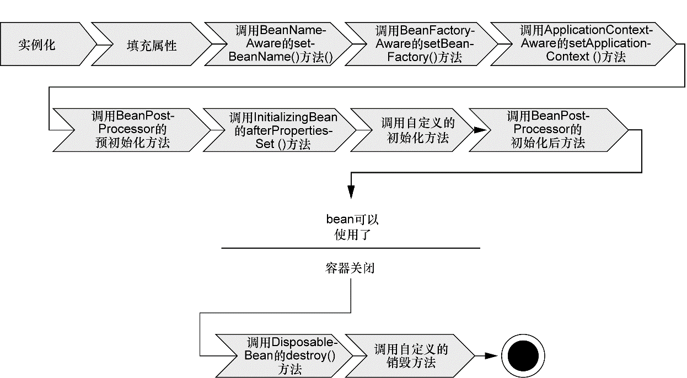

# Spring 的 Bean

## Bean 的生命周期

在传统的 Java 应用中， bean 的生命周期很简单。使用 Java 关键字 new 进行 bean 实例化，然后该 bean 就可以使用了。一旦该 bean 不再被使用，则由 Java 自动进行垃圾回收。

相比之下， Spring 容器中的 bean 的生命周期就显得相对复杂多了。如下图展示了 bean 装载到 Spring 应用上下文中的一个典型的生命周期过程。

如上图所见，在 Bean 准备就绪之前，Bean 工厂执行了若干启动步骤：

1. Spring 对 Bean 进行实例化；
2. Spring 将值和 Bean 的引用注入到 bean 对应的属性中；
3. 如果 bean 实现了 BeanNameAware 接口，Spring 将 bean 的 ID 传递给 setBean-Name() 方法；
4. 如果 bean 实现了 BeanFactoryAware 接口，Spring 将调用 `setBeanFactory()` 方法，将 BeanFactory 容器实例传入；
5. 如果 bean 实现了 ApplicationContextAware 接口，Spring 将调用 `setApplicationContext()` 方法，将 bean 所在的应用上下文的引用出入进来；
6. 如果 bean 实现了 BeanPostProcessor 接口，Spring 将调用它们的 `post-ProcessBeforeInitialization()` 方法；
7. 如果 bean 实现了 InitializingBean 接口，Spring 将调用它们的 `after-PropertiesSet()` 方法。类似地，如果 bean 使用 `init-method`声明了初始化方法，该方法也会被调用；
8. 如果 bean 实现了 BeanPostProcessor 接口，Spring 将调用它们的 `post-ProcessAfterInitialization()` 方法；
9. 此时，bean 已准备就绪，可以被应用程序使用了，它们将一直驻留在应用上下文中，直到该应用上下文被销毁；
10. 如果 bean 实现了 DisposableBean 接口，Spring 将调用它的 `destroy()` 接口方法。同样，如果 bean 使用destroy-method 声明了销毁方法，该方法也会被调用。

## 装配 Bean

在 Spring 中，对象无需自己查找或创建与其所关联的其他对象，容器负责把需要相互协作的对象引用赋予给各个对象。创建应用对象之间协作的关系的行为通常称为装配（wiring），这也是依赖注入（DI）的本质。