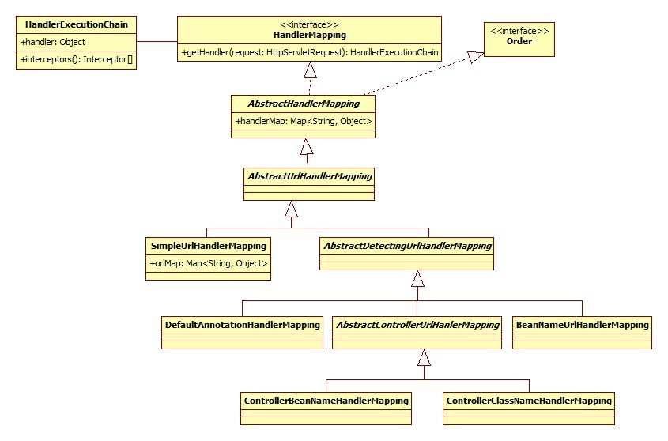

# 处理器映射-HandlerMapping

HandlerMapping 的工作就是为每个请求映射到合适请求的一个处理器Handler，其实现机制简单来说就是维持了一个 URL 到 Controller 关系的 Map 结构，其提供的实际功能也是根据 request 请求来获取具体执行的包含 Controller 信息的 HandlerAdapter。

至于在配置文件中配置的BeanNameUrlHandlerMapping或者是SimpleUrlHandlerMapping，它们的目的是一样的，只是通过request请求来找handler的方式不一样罢了。

HandlerMapping相关类之间的关系图：



HandlerMapping 接口及实现类如下：

- HandlerMapping 接口：接口中主要定义了一个getHandler方法，返回一个 HandlerExecutionChain 对象，`HandlerExecutionChain getHandler(HttpServletRequest request) throws Exception`
- AbstractHandlerMapping 抽象类：一个基础抽象类，主要是准备上下文环境
    1. 实现了接口的 getHandler 方法
    2. 定义了 getHandlerInternal 方法，返回 HandlerMethod
    3. 定义了 getHandlerExecutionChain 方法，返回 HandlerExecutionChain

AbstractHandlerMapping 的两个子类 AbstractHandlerMethodMapping 和 AbstractUrlHandlerMapping

- AbstractHandlerMethodMapping 系列是将具体的 Method 作为 Handler 来使用的，也是我们用的最多的，比如经常使用的 @RequestMapping 所注解的方法就是这种 Handler ，这种 Handler 是 HandlerMethod
- AbstractUrlHandlerMapping 是通过 url 来进行匹配的，大致原理就是将 url 与对应的 Handler 保存在一个 map 中。

在 DispatcherServlet 的 doDispatch 方法中实现如下：

```java
protected void doDispatch(HttpServletRequest request, HttpServletResponse response) throws Exception {
    HandlerExecutionChain mappedHandler = null;
    ........
    mappedHandler = getHandler(processedRequest);
    ........
}
```

getHandler方法的操作就是选择HandlerMapping，调用getHandler(request)方法获得HandlerExecutionChain

```java
protected HandlerExecutionChain getHandler(HttpServletRequest request) throws Exception {
    for (HandlerMapping hm : this.handlerMappings) {
        if (logger.isTraceEnabled()) {
            logger.trace(
                "Testing handler map [" + hm + "] in DispatcherServlet with name '" + getServletName() + "'");
        }
        HandlerExecutionChain handler = hm.getHandler(request);
        if (handler != null) {
            return handler;
        }
    }
    return null;
}
```

接口HandlerMapping定义的方法很简单就是一个getHandler方法，采用 **模板方法模式** ，很多实现是在子类中具体实现的。

```java
/**
 *handlerMapping的工作就是为了请求找到合适的处理器handler
 *最常用的两个handlerMapping：BeanNameURLHandlerMapping：查找spring容器中和请求的url同名的bean
 *SimpleUrlHandlerMapping：配置请求url和handler的映射关系
 */
public interface HandlerMapping {

    String PATH_WITHIN_HANDLER_MAPPING_ATTRIBUTE = HandlerMapping.class.getName() + ".pathWithinHandlerMapping";

    String BEST_MATCHING_PATTERN_ATTRIBUTE = HandlerMapping.class.getName() + ".bestMatchingPattern";

    String INTROSPECT_TYPE_LEVEL_MAPPING = HandlerMapping.class.getName() + ".introspectTypeLevelMapping";

    String URI_TEMPLATE_VARIABLES_ATTRIBUTE = HandlerMapping.class.getName() + ".uriTemplateVariables";

    String MATRIX_VARIABLES_ATTRIBUTE = HandlerMapping.class.getName() + ".matrixVariables";

    String PRODUCIBLE_MEDIA_TYPES_ATTRIBUTE = HandlerMapping.class.getName() + ".producibleMediaTypes";

    //获得HandlerExecutionChain
    HandlerExecutionChain getHandler(HttpServletRequest request) throws Exception;
}
```

## AbstractHandlerMapping

AbstractHandlerMapping实现HandlerMapping接口定的getHandler：

1. 提供getHandlerInternal模版方法给子类实现
2. 如果没有获取Handler，则使用默认的defaultHandler
3. 如果handler是String类型，从context获取实例
4. 通过getHandlerExecutionChain封装handler，添加interceptor

HandlerMapping中定义了方法getHandler(HttpServletRequest request)，AbstractHandlerMapping中的实现如下：

```java
//获得一个HandlerExecutionChain
@Override
public final HandlerExecutionChain getHandler(HttpServletRequest request) throws Exception {
    //从实现类中获得HanlderMethod
    Object handler = getHandlerInternal(request);
    if (handler == null) {
        handler = getDefaultHandler();
    }
    if (handler == null) {
        return null;
    }
    // Bean name or resolved handler?
    if (handler instanceof String) {
        String handlerName = (String) handler;
        handler = getApplicationContext().getBean(handlerName);
    }
    //获得HandlerExecutionChain
    HandlerExecutionChain executionChain = getHandlerExecutionChain(handler, request);
    if (CorsUtils.isCorsRequest(request)) {
        CorsConfiguration globalConfig = this.corsConfigSource.getCorsConfiguration(request);
        CorsConfiguration handlerConfig = getCorsConfiguration(handler, request);
        CorsConfiguration config = (globalConfig != null ? globalConfig.combine(handlerConfig) : handlerConfig);
        executionChain = getCorsHandlerExecutionChain(request, executionChain, config);
    }
    return executionChain;
}
```

在getHandler方法中又出现了两个方法getHandlerInternal(request)，在子类中实现，目的就是获取要执行的Controller。

```java
//模板方法，用于子类中实现，通过request去查找对应的执行方法HandlerMethod
protected abstract Object getHandlerInternal(HttpServletRequest request) throws Exception;
```

getHandlerExecutionChain就是创建一个HandlerExecutionChain实例，参数值就是handler和request。

```java
protected HandlerExecutionChain getHandlerExecutionChain(Object handler, HttpServletRequest request) {
    //如果没有获得则创建一个
    HandlerExecutionChain chain = (handler instanceof HandlerExecutionChain ? (HandlerExecutionChain) handler : new HandlerExecutionChain(handler));
    //获得IP地址及端口后的URL地址
    String lookupPath = this.urlPathHelper.getLookupPathForRequest(request);
    //在HandlerExecutionChain中添加拦截器
    for (HandlerInterceptor interceptor : this.adaptedInterceptors) {
        if (interceptor instanceof MappedInterceptor) {
            MappedInterceptor mappedInterceptor = (MappedInterceptor) interceptor;
            //根据lookupPath来获取Interceptor
            if (mappedInterceptor.matches(lookupPath, this.pathMatcher)) {
                chain.addInterceptor(mappedInterceptor.getInterceptor());
            }
        }
        else {
            chain.addInterceptor(interceptor);
        }
    }
    return chain;
}
```

AbstractHandlerMapping的属性

```java
// order赋了最大值,优先级是最小的
private int order = Integer.MAX_VALUE;  // default: same as non-Ordered
// 默认的Handler,这边使用的Obejct,子类实现的时候,使用HandlerMethod,HandlerExecutionChain等
private Object defaultHandler;
// url计算的辅助类
private UrlPathHelper urlPathHelper = new UrlPathHelper();
// 基于ant进行path匹配,解决如/books/{id}场景
private PathMatcher pathMatcher = new AntPathMatcher();
// 拦截器配置:1,HandlerMapping属性设置;2,extendInterceptors设置
private final List<Object> interceptors = new ArrayList<Object>();
// 从interceptors中解析得到,直接添加给全部handler
private final List<HandlerInterceptor> adaptedInterceptors = new ArrayList<HandlerInterceptor>();
// 使用前需要跟url进行匹配,匹配通过才会使用
private final List<MappedInterceptor> mappedInterceptors = new ArrayList<MappedInterceptor>();
```

AbstractHandlerMapping提供了设置不同HandlerMapping的执行顺序oder。

```java
//设置不同HandlerMapping实现类的执行顺序
public final void setOrder(int order) {
    this.order = order;
}

@Override
public final int getOrder() {
    return this.order;
}
```

除了以上几个重要的方法外，AbstractHandlerMapping还提供了进行拦截器初始化的一些操作。

```java
//初始化时调用，初始化一些基本信息，这里主要是初始化一些拦截器
@Override
protected void initApplicationContext() throws BeansException {
    extendInterceptors(this.interceptors);//添加或修改intercept，现在并没有具体实现
    detectMappedInterceptors(this.adaptedInterceptors);//将springMVC容器或者父容器中的所有MappedInterceptor类型的Bean添加到mappedInterceptors属性中
    initInterceptors();
}

protected void extendInterceptors(List<Object> interceptors) {
}

//将springMVC容器或者父容器中的所有MappedInterceptor类型的Bean添加到mappedInterceptors属性中
protected void detectMappedInterceptors(List<HandlerInterceptor> mappedInterceptors) {
    mappedInterceptors.addAll(BeanFactoryUtils.beansOfTypeIncludingAncestors(getApplicationContext(), MappedInterceptor.class, true, false).values());
}

//初始化Interceptor,将interceptors属性里所包含的对象按类型添加到mappedInterceptors或者adaptedInterceptors中。
protected void initInterceptors() {
    if (!this.interceptors.isEmpty()) {
        for (int i = 0; i < this.interceptors.size(); i++) {
            Object interceptor = this.interceptors.get(i);
            if (interceptor == null) {
                throw new IllegalArgumentException("Entry number " + i + " in interceptors array is null");
            }
            this.adaptedInterceptors.add(adaptInterceptor(interceptor));
        }
    }
}

protected HandlerInterceptor adaptInterceptor(Object interceptor) {
    if (interceptor instanceof HandlerInterceptor) {
        return (HandlerInterceptor) interceptor;
    }
    else if (interceptor instanceof WebRequestInterceptor) {
        return new WebRequestHandlerInterceptorAdapter((WebRequestInterceptor) interceptor);
    }
    else {
        throw new IllegalArgumentException("Interceptor type not supported: " + interceptor.getClass().getName());
    }
}

protected final HandlerInterceptor[] getAdaptedInterceptors() {
    int count = this.adaptedInterceptors.size();
    return (count > 0 ? this.adaptedInterceptors.toArray(new HandlerInterceptor[count]) : null);
}

protected final MappedInterceptor[] getMappedInterceptors() {
    List<MappedInterceptor> mappedInterceptors = new ArrayList<MappedInterceptor>();
    for (HandlerInterceptor interceptor : this.adaptedInterceptors) {
        if (interceptor instanceof MappedInterceptor) {
            mappedInterceptors.add((MappedInterceptor) interceptor);
        }
    }
    int count = mappedInterceptors.size();
    return (count > 0 ? mappedInterceptors.toArray(new MappedInterceptor[count]) : null);
}
```

总体来看AbstractHandlerMapping提供了抽象方法getHandlerInternal在子类中实现，根据获得的Handler及配置的拦截器Interceptor来生成HandlerExecutionChain。

## AbstractUrlHandlerMapping

### Handler的查找

子类AbstractUrlHandlerMapping中对抽象类getHandlerInternal(HttpServletRequest request)的实现。

```java
//获取Handler，主要是通过url和method的对应关系来查找
@Override
protected Object getHandlerInternal(HttpServletRequest request) throws Exception {
    //获取request中的请求链接
    String lookupPath = getUrlPathHelper().getLookupPathForRequest(request);
    //根据链接查找handler
    Object handler = lookupHandler(lookupPath, request);
    if (handler == null) {
        // We need to care for the default handler directly, since we need to
        // expose the PATH_WITHIN_HANDLER_MAPPING_ATTRIBUTE for it as well.
        //定义一个变量，保存找到的原始Handler
        Object rawHandler = null;
        if ("/".equals(lookupPath)) {
            rawHandler = getRootHandler();
        }
        if (rawHandler == null) {
            rawHandler = getDefaultHandler();
        }
        if (rawHandler != null) {
            // Bean name or resolved handler?
            //如果是String类型则到容器中查找具体的Bean
            if (rawHandler instanceof String) {
                String handlerName = (String) rawHandler;
                rawHandler = getApplicationContext().getBean(handlerName);
            }
            // 预留的校验handler模版方法，没有使用
            validateHandler(rawHandler, request);
            // 添加expose属性到request的拦截器
            handler = buildPathExposingHandler(rawHandler, lookupPath, lookupPath, null);
        }
    }
    if (handler != null && logger.isDebugEnabled()) {
        logger.debug("Mapping [" + lookupPath + "] to " + handler);
    }
    else if (handler == null && logger.isTraceEnabled()) {
        logger.trace("No handler mapping found for [" + lookupPath + "]");
    }
    return handler;
}
```

从上面的实现方法getHandlerInternal来看，首先是通过lookupHandler方法来查找Handler，这里我们看到了之前说的Map对象，用来存储url和Handler之间的关系，当Handler获取为String时需要从Bean容器中获取注入的实现类，当然在查找过程中也会有模糊匹配等查找过程。

```java
protected Object lookupHandler(String urlPath, HttpServletRequest request) throws Exception {
    // Direct match?
    //直接从map中获取
    Object handler = this.handlerMap.get(urlPath);
    if (handler != null) {
        // Bean name or resolved handler?
        //如果是String类型则从容器中获取
        if (handler instanceof String) {
            String handlerName = (String) handler;
            handler = getApplicationContext().getBean(handlerName);
        }
        validateHandler(handler, request);
        return buildPathExposingHandler(handler, urlPath, urlPath, null);
    }
    // Pattern match?
    //通过模糊匹配来查找
    List<String> matchingPatterns = new ArrayList<String>();
    for (String registeredPattern : this.handlerMap.keySet()) {
        if (getPathMatcher().match(registeredPattern, urlPath)) {
            matchingPatterns.add(registeredPattern);
        }
        else if (useTrailingSlashMatch()) {
            if (!registeredPattern.endsWith("/") && getPathMatcher().match(registeredPattern + "/", urlPath)) {
                matchingPatterns.add(registeredPattern +"/");
            }
        }
    }
    String bestPatternMatch = null;
    //匹配规则
    Comparator<String> patternComparator = getPathMatcher().getPatternComparator(urlPath);
    if (!matchingPatterns.isEmpty()) {
        Collections.sort(matchingPatterns, patternComparator);
        if (logger.isDebugEnabled()) {
            logger.debug("Matching patterns for request [" + urlPath + "] are " + matchingPatterns);
        }
        bestPatternMatch = matchingPatterns.get(0);
    }
    if (bestPatternMatch != null) {
        handler = this.handlerMap.get(bestPatternMatch);
        if (handler == null) {
            Assert.isTrue(bestPatternMatch.endsWith("/"));
            handler = this.handlerMap.get(bestPatternMatch.substring(0, bestPatternMatch.length() - 1));
        }
        // Bean name or resolved handler?
        if (handler instanceof String) {
            String handlerName = (String) handler;
            handler = getApplicationContext().getBean(handlerName);
        }
        validateHandler(handler, request);
        String pathWithinMapping = getPathMatcher().extractPathWithinPattern(bestPatternMatch, urlPath);

        // There might be multiple 'best patterns', let's make sure we have the correct URI template variables
        // for all of them
        Map<String, String> uriTemplateVariables = new LinkedHashMap<String, String>();
        for (String matchingPattern : matchingPatterns) {
            if (patternComparator.compare(bestPatternMatch, matchingPattern) == 0) {
                Map<String, String> vars = getPathMatcher().extractUriTemplateVariables(matchingPattern, urlPath);
                Map<String, String> decodedVars = getUrlPathHelper().decodePathVariables(request, vars);
                uriTemplateVariables.putAll(decodedVars);
            }
        }
        if (logger.isDebugEnabled()) {
            logger.debug("URI Template variables for request [" + urlPath + "] are " + uriTemplateVariables);
        }
        return buildPathExposingHandler(handler, bestPatternMatch, pathWithinMapping, uriTemplateVariables);
    }
    // No handler found...
    return null;
}
```

### Handler的注册

AbstractUrlHandlerMapping中也提供了注册url和handler到handlerMap中的操作，具体的调用则要到AbstractUrlHandlerMapping的子类中实现。

```java
//注册url和Bean的map，注册多个string的url到一个处理器中
protected void registerHandler(String[] urlPaths, String beanName) throws BeansException, IllegalStateException {
    Assert.notNull(urlPaths, "URL path array must not be null");
    for (String urlPath : urlPaths) {
        registerHandler(urlPath, beanName);
    }
}

//注册url和Bean的map,将具体的Handler注入到url对应的map中
protected void registerHandler(String urlPath, Object handler) throws BeansException, IllegalStateException {
    Assert.notNull(urlPath, "URL path must not be null");
    Assert.notNull(handler, "Handler object must not be null");
    Object resolvedHandler = handler;

    // Eagerly resolve handler if referencing singleton via name.
    //如果Handler是String类型而且没有设置lazyInitHandlers则从springMVC容器中获取handler
    if (!this.lazyInitHandlers && handler instanceof String) {
        String handlerName = (String) handler;
        if (getApplicationContext().isSingleton(handlerName)) {
            resolvedHandler = getApplicationContext().getBean(handlerName);
        }
    }

    Object mappedHandler = this.handlerMap.get(urlPath);
    if (mappedHandler != null) {
        if (mappedHandler != resolvedHandler) {
            throw new IllegalStateException(
                    "Cannot map " + getHandlerDescription(handler) + " to URL path [" + urlPath +
                    "]: There is already " + getHandlerDescription(mappedHandler) + " mapped.");
        }
    }
    else {
        if (urlPath.equals("/")) {
            if (logger.isInfoEnabled()) {
                logger.info("Root mapping to " + getHandlerDescription(handler));
            }
            setRootHandler(resolvedHandler);
        }
        else if (urlPath.equals("/*")) {
            if (logger.isInfoEnabled()) {
                logger.info("Default mapping to " + getHandlerDescription(handler));
            }
            setDefaultHandler(resolvedHandler);
        }
        else {
            this.handlerMap.put(urlPath, resolvedHandler);
            if (logger.isInfoEnabled()) {
                logger.info("Mapped URL path [" + urlPath + "] onto " + getHandlerDescription(handler));
            }
        }
    }
}
```

通过上面介绍知道AbstractUrlHandlerMapping提供的功能就是根据url从handlerMap中获取handler和注册url和handler的对应关系到handlerMap中，当然这个过程中还包含很多其他的操作。

## SimpleUrlHandlerMapping

> SimpleUrlHandlerMapping只是参与Handler的注册,请求映射时由AbstractUrlHandlerMapping搞定。

在AbstractUrlHandlerMapping中有一个注册url和Handler关系的注册函数，这个函数的调用是在实现类SimpleUrlHandlerMapping中实现的，目的是springMVC容器启动时将url和handler的对应关系注册到handlerMap中。

SimpleUrlHandlerMapping有一个初始化容器上下文的操作，调用父类的super.initApplicationContext会将bean注入到容器中，registerHandlers将url和Handler的对应关系注册到urlMap中，容器初始化之后会调用setMappings或者setUrlMap将url和handler的对应关系注册的urlMap中。

```java
public void setMappings(Properties mappings) {
    CollectionUtils.mergePropertiesIntoMap(mappings, this.urlMap);
}

public void setUrlMap(Map<String, ?> urlMap) {
    this.urlMap.putAll(urlMap);
}


//重写父类的方法，注册到父类的map中
@Override
public void initApplicationContext() throws BeansException {
    super.initApplicationContext();
    registerHandlers(this.urlMap);
}

//将所有的url和Handler的对应关系放到父类AbstractURLHandlerMapping的map中
protected void registerHandlers(Map<String, Object> urlMap) throws BeansException {
    if (urlMap.isEmpty()) {
        logger.warn("Neither 'urlMap' nor 'mappings' set on SimpleUrlHandlerMapping");
    }
    else {
        for (Map.Entry<String, Object> entry : urlMap.entrySet()) {
            String url = entry.getKey();
            Object handler = entry.getValue();
            // Prepend with slash if not already present.
            if (!url.startsWith("/")) {
                url = "/" + url;
            }
            // Remove whitespace from handler bean name.
            if (handler instanceof String) {
                handler = ((String) handler).trim();
            }
            registerHandler(url, handler);
        }
    }
}
```

越是到了实现子类，子类需要完成的功能越少，SimpleUrlHandlerMapping完成的工作就是容器初始化时获取所有的url和handler的对应关系，将url和handler的关系注册到handlerMap中即可，它的使命就完成了。

## AbstractDetectingUrlHandlerMapping

> AbstractDetectingUrlHandlerMapping是通过扫描方式注册Handler，收到请求时由AbstractURLHandlerMapping的getHandlerInternal进行分发

在AbstractUrlHandlerMapping中handlerMap有一个注册url和Handler关系的注册函数，这个函数的调用是在实现类AbstractDetectingUrlHandlerMapping中实现的，目的是springMVC容器启动时将url和handler的对应关系注册到handlerMap中。

AbstractDetectingUrlHandlerMapping 抽象类：通过重写initApplicationContext来注册Handler，调用detectHandlers方法会根据配置的detectHandlersInAcestorContexts参数从springMVC容器或者springMVC集群父容器中找到所有bean的beanName，然后调用determineUrlsForHandler方法对每个beanName解析出对应的urls，如果解析的结果不为空，则将解析出的urls和beanName注册到父类的map中。

```java
//初始化容器
@Override
public void initApplicationContext() throws ApplicationContextException {
    super.initApplicationContext();
    detectHandlers();
}
```

在调用父类的super.initApplicationContext后就是注册每个bean和url的关系，即调用detectHandlers。

```java
//注册每个bean对应的url的关系
protected void detectHandlers() throws BeansException {
    if (logger.isDebugEnabled()) {
        logger.debug("Looking for URL mappings in application context: " + getApplicationContext());
    }
    //获取容器的所有bean的名字
    String[] beanNames = (this.detectHandlersInAncestorContexts ?
            BeanFactoryUtils.beanNamesForTypeIncludingAncestors(getApplicationContext(), Object.class) :
            getApplicationContext().getBeanNamesForType(Object.class));

    // Take any bean name that we can determine URLs for.
    //对每个beanName解析url，如果能解析到就注册到父类的map中
    for (String beanName : beanNames) {
        //子类具体去实现
        String[] urls = determineUrlsForHandler(beanName);
        if (!ObjectUtils.isEmpty(urls)) {
            // URL paths found: Let's consider it a handler.
            //将解析的url注册到父类
            registerHandler(urls, beanName);
        }
        else {
            if (logger.isDebugEnabled()) {
                logger.debug("Rejected bean name '" + beanName + "': no URL paths identified");
            }
        }
    }
}

//预留的模版方法定义如下：
protected abstract String[] determineUrlsForHandler(String beanName);
```

其中determineUrlsForHandler函数是在其子类中实现的，registerHandler函数操作是在父类AbstractUrlHandlerMapping中实现的，将bean和url的关系注册到handlerMap中。

## BeanNameUrlHandlerMapping

在AbstractDetectingUrlHandlerMapping中定义了一个抽象方法determineUrlsForHandler，其在AbstractDetectingUrlHandlerMapping的子类BeanNameUrlHandlerMapping中的实现如下：

```java
public class BeanNameUrlHandlerMapping extends AbstractDetectingUrlHandlerMapping {
    /**
     * Checks name and aliases of the given bean for URLs, starting with "/".
     */
    @Override
    protected String[] determineUrlsForHandler(String beanName) {
        List<String> urls = new ArrayList<String>();
        if (beanName.startsWith("/")) {
            urls.add(beanName);
        }
        //注入的bean name为请求链接
        String[] aliases = getApplicationContext().getAliases(beanName);
        for (String alias : aliases) {
            if (alias.startsWith("/")) {
                urls.add(alias);
            }
        }
        return StringUtils.toStringArray(urls);
    }
}
```

BeanNameUrlHandlerMapping主要个作用就是将beanName及其别名作为url。

## AbstractControllerUrlHandlerMapping

AbstractDetectingUrlHandlerMapping抽象类定义了一个抽象方法determineUrlsForHandler在子类AbstractControllerUrlHandlerMapping中实现。

子类中AbstractControllerUrlHandlerMapping中determineUrlsForHandler的实现如下，实现原理就是根据beanName从容器中获取bean，然后调用buildUrlsForHandler完成beanName和beanClass的对应关系，其具体实现还是在其子类中实现。

```java
@Override
protected String[] determineUrlsForHandler(String beanName) {
    Class<?> beanClass = getApplicationContext().getType(beanName);
    //判断是不是支持的类型
    if (isEligibleForMapping(beanName, beanClass)) {
        //模板方法，在子类实现
        return buildUrlsForHandler(beanName, beanClass);
    }
    else {
        return null;
    }
}

// 由子类实现具体的url生成规则
protected abstract String[] buildUrlsForHandler(String beanName, Class<?> beanClass);
```

除此之外AbstractControllerUrlHandlerMapping还提供了一些配置，用于排除掉一些包或者一些类，可以在配置中进行配置

```java
public void setIncludeAnnotatedControllers(boolean includeAnnotatedControllers) {
    this.predicate = (includeAnnotatedControllers ?
            new AnnotationControllerTypePredicate() : new ControllerTypePredicate());
}

public void setExcludedPackages(String... excludedPackages) {
    this.excludedPackages = (excludedPackages != null) ?
            new HashSet<String>(Arrays.asList(excludedPackages)) : new HashSet<String>();
}

public void setExcludedClasses(Class<?>... excludedClasses) {
    this.excludedClasses = (excludedClasses != null) ?
            new HashSet<Class<?>>(Arrays.asList(excludedClasses)) : new HashSet<Class<?>>();
}
```

判断beanName和beanClass是否已经配置排除对应关系

```java
// 判断Controller是否被排除在外（通过package排除或类class排除）
protected boolean isEligibleForMapping(String beanName, Class<?> beanClass) {
    if (beanClass == null) {
        if (logger.isDebugEnabled()) {
            logger.debug("Excluding controller bean '" + beanName + "' from class name mapping " +
                    "because its bean type could not be determined");
        }
        return false;
    }
    if (this.excludedClasses.contains(beanClass)) {
        if (logger.isDebugEnabled()) {
            logger.debug("Excluding controller bean '" + beanName + "' from class name mapping " +
                    "because its bean class is explicitly excluded: " + beanClass.getName());
        }
        return false;
    }
    String beanClassName = beanClass.getName();
    for (String packageName : this.excludedPackages) {
        if (beanClassName.startsWith(packageName)) {
            if (logger.isDebugEnabled()) {
                logger.debug("Excluding controller bean '" + beanName + "' from class name mapping " +
                        "because its bean class is defined in an excluded package: " + beanClass.getName());
            }
            return false;
        }
    }
    return isControllerType(beanClass);
}

// 判断是否Controller的子类
protected boolean isControllerType(Class beanClass) {
    return this.predicate.isControllerType(beanClass);
}
```

总结：AbstractControllerUrlHandlerMapping的实现机制就是根据beanName从容器中获取实现类beanClass，同时beanName和beanClass的对应关系的操作是在其子类中完成实现的，同时AbstractControllerUrlHandlerMapping提供了一些配置用于排除一些类的关系。

## ControllerBeanNameHandlerMapping

AbstractControllerUrlHandlerMapping定义了抽象方法buildUrlsForHandler，在其子类ControllerBeanNameHandlerMapping中的实现。

ControllerBeanNameHandlerMapping中buildUrlsForHandler的实现如下，还是将beanName及其别名作为url

```java
@Override
protected String[] buildUrlsForHandler(String beanName, Class<?> beanClass) {
    List<String> urls = new ArrayList<String>();
    urls.add(generatePathMapping(beanName));
    String[] aliases = getApplicationContext().getAliases(beanName);
    for (String alias : aliases) {
        urls.add(generatePathMapping(alias));
    }
    return StringUtils.toStringArray(urls);
}
```

generatePathMapping函数中的实现是给beanName加上以下前缀等。

```java
protected String generatePathMapping(String beanName) {
    String name = (beanName.startsWith("/") ? beanName : "/" + beanName);
    StringBuilder path = new StringBuilder();
    if (!name.startsWith(this.urlPrefix)) {
        path.append(this.urlPrefix);
    }
    path.append(name);
    if (!name.endsWith(this.urlSuffix)) {
        path.append(this.urlSuffix);
    }
    return path.toString();
}
```

和其他的实现子类一样，ControllerBeanNameHandlerMapping实现的功能很简单，就是将beanName及其别名作为url返回。

## ControllerClassNameHandlerMapping

AbstractControllerUrlHandlerMapping定义了抽象方法buildUrlsForHandler，在其子类ControllerClassNameHandlerMapping中的实现。

ControllerClassNameHandlerMapping中buildUrlsForHandler实现如下，根据beanClass来获取url

```java
@Override
protected String[] buildUrlsForHandler(String beanName, Class<?> beanClass) {
    return generatePathMappings(beanClass);
}

protected String[] generatePathMappings(Class<?> beanClass) {
    StringBuilder pathMapping = buildPathPrefix(beanClass);
    String className = ClassUtils.getShortName(beanClass);
    String path = (className.endsWith(CONTROLLER_SUFFIX) ?
            className.substring(0, className.lastIndexOf(CONTROLLER_SUFFIX)) : className);
    if (path.length() > 0) {
        if (this.caseSensitive) {
            pathMapping.append(path.substring(0, 1).toLowerCase()).append(path.substring(1));
        }
        else {
            pathMapping.append(path.toLowerCase());
        }
    }
    if (isMultiActionControllerType(beanClass)) {
        return new String[] {pathMapping.toString(), pathMapping.toString() + "/*"};
    }
    else {
        return new String[] {pathMapping.toString() + "*"};
    }
}

private StringBuilder buildPathPrefix(Class<?> beanClass) {
    StringBuilder pathMapping = new StringBuilder();
    if (this.pathPrefix != null) {
        pathMapping.append(this.pathPrefix);
        pathMapping.append("/");
    }
    else {
        pathMapping.append("/");
    }
    if (this.basePackage != null) {
        String packageName = ClassUtils.getPackageName(beanClass);
        if (packageName.startsWith(this.basePackage)) {
            String subPackage = packageName.substring(this.basePackage.length()).replace('.', '/');
            pathMapping.append(this.caseSensitive ? subPackage : subPackage.toLowerCase());
            pathMapping.append("/");
        }
    }
    return pathMapping;
}
```

## AbstractHandlerMethodMapping

在AbstractHandlerMethodMapping中getHandlerInternal的实现如下：

```java
//根据request来获取HandlerMethod
@Override
protected HandlerMethod getHandlerInternal(HttpServletRequest request) throws Exception {
    //获取请求连接
    String lookupPath = getUrlPathHelper().getLookupPathForRequest(request);
    if (logger.isDebugEnabled()) {
        logger.debug("Looking up handler method for path " + lookupPath);
    }
    //读锁
    this.mappingRegistry.acquireReadLock();
    try {
        //获取HandlerMethod
        HandlerMethod handlerMethod = lookupHandlerMethod(lookupPath, request);
        if (logger.isDebugEnabled()) {
            if (handlerMethod != null) {
                logger.debug("Returning handler method [" + handlerMethod + "]");
            }
            else {
                logger.debug("Did not find handler method for [" + lookupPath + "]");
            }
        }
        return (handlerMethod != null ? handlerMethod.createWithResolvedBean() : null);
    }
    finally {
        this.mappingRegistry.releaseReadLock();
    }
}
```

具体的实现是在lookupHandlerMethod中，最终是在mappingRegistry中获取HandlerMethod，mappingRegistry可以看似是一个Map结构（其实其包含了3个map），包含了url和HandlerMethod的对应关系。

```java
protected HandlerMethod lookupHandlerMethod(String lookupPath, HttpServletRequest request) throws Exception {
    List<Match> matches = new ArrayList<Match>();
    //从mappingRegistry中获取directPathMatches匹配关系
    List<T> directPathMatches = this.mappingRegistry.getMappingsByUrl(lookupPath);
    if (directPathMatches != null) {
        addMatchingMappings(directPathMatches, matches, request);
    }
    if (matches.isEmpty()) {
        // No choice but to go through all mappings...
        addMatchingMappings(this.mappingRegistry.getMappings().keySet(), matches, request);
    }
    //最终返回HandlerMethod
    if (!matches.isEmpty()) {
        Comparator<Match> comparator = new MatchComparator(getMappingComparator(request));
        Collections.sort(matches, comparator);
        if (logger.isTraceEnabled()) {
            logger.trace("Found " + matches.size() + " matching mapping(s) for [" +
                    lookupPath + "] : " + matches);
        }
        Match bestMatch = matches.get(0);
        if (matches.size() > 1) {
            if (CorsUtils.isPreFlightRequest(request)) {
                return PREFLIGHT_AMBIGUOUS_MATCH;
            }
            Match secondBestMatch = matches.get(1);
            if (comparator.compare(bestMatch, secondBestMatch) == 0) {
                Method m1 = bestMatch.handlerMethod.getMethod();
                Method m2 = secondBestMatch.handlerMethod.getMethod();
                throw new IllegalStateException("Ambiguous handler methods mapped for HTTP path '" +
                        request.getRequestURL() + "': {" + m1 + ", " + m2 + "}");
            }
        }
        handleMatch(bestMatch.mapping, lookupPath, request);
        return bestMatch.handlerMethod;
    }
    else {
        return handleNoMatch(this.mappingRegistry.getMappings().keySet(), lookupPath, request);
    }
}
```

以下几个方法是在查找url和HandlerMethod的过程中一些帮助实现。

```java
private void addMatchingMappings(Collection<T> mappings, List<Match> matches, HttpServletRequest request) {
    for (T mapping : mappings) {
        T match = getMatchingMapping(mapping, request);
        if (match != null) {
            matches.add(new Match(match, this.mappingRegistry.getMappings().get(mapping)));
        }
    }
}

//在子类中实现
protected abstract T getMatchingMapping(T mapping, HttpServletRequest request);

protected abstract Comparator<T> getMappingComparator(HttpServletRequest request);

protected void handleMatch(T mapping, String lookupPath, HttpServletRequest request) {
    request.setAttribute(HandlerMapping.PATH_WITHIN_HANDLER_MAPPING_ATTRIBUTE, lookupPath);
}

//在子类中实现
protected HandlerMethod handleNoMatch(Set<T> mappings, String lookupPath, HttpServletRequest request)
        throws Exception {

    return null;
}
```

在AbstractHandlerMethodMapping中当bean被注入到容器后会执行一系列的初始化过程，代码如下：

```java
//容器启动时会运行此方法，完成handlerMethod的注册操作
@Override
public void afterPropertiesSet() {
    initHandlerMethods();
}
```

进行HandlerMethod的注册操作，简单来说就是从springMVC的容器中获取所有的beanName，注册url和实现方法HandlerMethod的对应关系。

```java
// 扫描ApplicationContext中的bean，然后筛选 handler method 并注册
protected void initHandlerMethods() {
    if (logger.isDebugEnabled()) {
        logger.debug("Looking for request mappings in application context: " + getApplicationContext());
    }
    // 从springMVC容器中获取所有的beanName
    String[] beanNames = (this.detectHandlerMethodsInAncestorContexts ?
            BeanFactoryUtils.beanNamesForTypeIncludingAncestors(getApplicationContext(), Object.class) :
            getApplicationContext().getBeanNamesForType(Object.class));
    // 注册从容器中获取的beanName
    for (String name : beanNames) {
        if (!name.startsWith(SCOPED_TARGET_NAME_PREFIX) && isHandler(getApplicationContext().getType(name))) {
            detectHandlerMethods(name);
        }
    }
    handlerMethodsInitialized(getHandlerMethods());
}
```

根据beanName进行一系列的注册，最终实现是在registerHandlerMethod

```java
protected void detectHandlerMethods(final Object handler) {
    //获取bean实例
    Class<?> handlerType =
            (handler instanceof String ? getApplicationContext().getType((String) handler) : handler.getClass());

    // Avoid repeated calls to getMappingForMethod which would rebuild RequestMappingInfo instances
    final Map<Method, T> mappings = new IdentityHashMap<Method, T>();
    final Class<?> userType = ClassUtils.getUserClass(handlerType);

    Set<Method> methods = HandlerMethodSelector.selectMethods(userType, new MethodFilter() {
        @Override
        public boolean matches(Method method) {
            //创建RequestMappingInfo
            T mapping = getMappingForMethod(method, userType);
            if (mapping != null) {
                mappings.put(method, mapping);
                return true;
            }
            else {
                return false;
            }
        }
    });

    for (Method method : methods) {
        registerHandlerMethod(handler, method, mappings.get(method));
    }
}
```

registerHandlerMethod的注册操作是将beanName，Method及创建的RequestMappingInfo之间的 关系。

```java
//注册beanName和method及RequestMappingInfo之间的关系，RequestMappingInfo会保存url信息
@Deprecated
protected void registerHandlerMethod(Object handler, Method method, T mapping) {
    this.mappingRegistry.register(mapping, handler, method);
}
```

getMappingForMethod方法是在子类RequestMappingHandlerMapping中实现的，具体实现就是创建一个RequestMappingInfo

```java
@Override
protected RequestMappingInfo getMappingForMethod(Method method, Class<?> handlerType) {
    RequestMappingInfo info = createRequestMappingInfo(method);
    if (info != null) {
        RequestMappingInfo typeInfo = createRequestMappingInfo(handlerType);
        if (typeInfo != null) {
            info = typeInfo.combine(info);
        }
    }
    return info;
}

private RequestMappingInfo createRequestMappingInfo(AnnotatedElement element) {
    RequestMapping requestMapping = AnnotatedElementUtils.findMergedAnnotation(element, RequestMapping.class);
    RequestCondition<?> condition = (element instanceof Class<?> ?
            getCustomTypeCondition((Class<?>) element) : getCustomMethodCondition((Method) element));
    return (requestMapping != null ? createRequestMappingInfo(requestMapping, condition) : null);
}
```

这样就实现了将url和HandlerMethod的对应关系注册到mappingRegistry中。

MappingRegistry中的注册实现如下，并且MappingRegistry定义了几个map结构，用来存储注册信息

```java
private final Map<T, MappingRegistration<T>> registry = new HashMap<T, MappingRegistration<T>>();

private final Map<T, HandlerMethod> mappingLookup = new LinkedHashMap<T, HandlerMethod>();

private final MultiValueMap<String, T> urlLookup = new LinkedMultiValueMap<String, T>();

private final Map<String, List<HandlerMethod>> nameLookup = new ConcurrentHashMap<String, List<HandlerMethod>>();

private final Map<HandlerMethod, CorsConfiguration> corsLookup = new ConcurrentHashMap<HandlerMethod, CorsConfiguration>();
```

完成beanName，HandlerMethod及RequestMappingInfo之间的对应关系注册。

```java
//注册beanName和method及RequestMappingInfo之间的关系，RequestMappingInfo中有url信息
public void register(T mapping, Object handler, Method method) {

    this.readWriteLock.writeLock().lock();
    try {
        //创建HandlerMethod
        HandlerMethod handlerMethod = createHandlerMethod(handler, method);
        assertUniqueMethodMapping(handlerMethod, mapping);

        if (logger.isInfoEnabled()) {
            logger.info("Mapped \"" + mapping + "\" onto " + handlerMethod);
        }
        //保存url和handlerMethod之间的对应关系
        this.mappingLookup.put(mapping, handlerMethod);
        //保存url和RequestMappingInfo对应关系
        List<String> directUrls = getDirectUrls(mapping);
        for (String url : directUrls) {
            this.urlLookup.add(url, mapping);
        }

        String name = null;
        if (getNamingStrategy() != null) {
            name = getNamingStrategy().getName(handlerMethod, mapping);
            addMappingName(name, handlerMethod);
        }

        CorsConfiguration corsConfig = initCorsConfiguration(handler, method, mapping);
        if (corsConfig != null) {
            this.corsLookup.put(handlerMethod, corsConfig);
        }

        this.registry.put(mapping, new MappingRegistration<T>(mapping, handlerMethod, directUrls, name));
    }
    finally {
        this.readWriteLock.writeLock().unlock();
    }
}
```

## RequestMappingHandlerMapping

RequestMappingHandlerMapping，用于注解@Controller，@RequestMapping来定义的Controller

初始化时，3个类的大致分工如下：

- AbstractHandlerMethodMapping定义整个算法流程；
- RequestMappingInfoHandlerMapping提供匹配条件RequestMappingInfo的解析处理；
- RequestMappingHandlerMapping根据@RequestMapping注解生成RequestMappingInfo，同时提供isHandler实现。

整个初始化工作由AbstractHandlerMethodMapping的initHandlerMethods主导：

1. 使用BeanFactoryUtils扫描应用下的Object或者直接从容器中获取Object
2. 迭代类，分别判断isHandler判断目标类是否是Handler
    1. RequestMappingHandlerMapping.isHandler根据@Controller或@RequestMapping注解判断（有任意一个）
3. 对handler解析出所有需要分发的方法detectHandlerMethods
    1. 获取原始的Class<?>
    2. 使用HandlerMethodSelector.selectMethods过滤具体handler method，预留getMappingForMethod模版方法给子类RequestMappingHandlerMapping.getMappingForMethod根据类，方法上的RequestMapping注解生成匹配条件RequestMappingInfo
    3. 对过滤到的每个method进行注册registerHanderMethod
        1. 使用createHandlerMethod封装处理器为HandlerMethod
        2. 判断之前是否已经匹配条件对应的处理器是否冲突（相同的匹配条件只能有一个对应的处理器）
        3. 设置匹配条件到 handler method 的映射关系
        4. 从匹配条件中解析出url，并注册到urlMap（url到匹配条件的映射），这边由RequestMappingInfoHandlerMapping.getMappingPathPatterns实现
4. 对HandlerMethod进行初始化handlerMethodsInitialized，其实现在什么都没做

AbstractHandlerMethodMapping实现接口getHandlerInternal，定义查找流程。RequestMappingInfoHandlerMapping根据RequestMappingInfo，细化匹配条件，并在匹配不到的情况下，使用RequestCondition再次尝试匹配。

AbstractHandlerMethodMapping实现接口getHandlerInternal：

1. 使用UrlPathHelper查找request对应的path
2. 查找path对应的HandlerMethod
    1. 从urlMap中直接等值匹配查找匹配条件RequestMappingInfo
    2. 如果等值查找到匹配条件,将其添加到match条件中
    3. 如果没有找到匹配条件,使用所有的handlerMethod的RequestMappingInfo进行匹配
    4. 对匹配到的Match进行排序,取出最高优先级的Match,并核对是否是唯一的最高优先级
    5. 对匹配到条件,没有匹配到条件的两种情况,分别进行封装
3. 封装HandlerMethod,确保bean中存的是实例

### 总结

1. AbstractHandlerMethodMaping 定义初始化流程,请求时如何映射
    初始化:
        1.1.1 扫描应用下的Object
        1.1.2 预留isHandler钩子方法给子类判断Object是否handler
        1.1.3 迭代扫描每一个handler,找出符合要求的方法,这边判断依然是留给子类实现getMappingForMethod
        1.1.4 注册查找到的处理器,需要确保一个匹配条件RequestMappingInfo只能映射到一个handler
        1.1.5 根据匹配条件获取url,同样的只是定义流程,具体的算法留给子类实现getMappingPathPatterns
    请求request分发处理:
        1.2.1 直接字符串匹配的方式,查找handler
        1.2.2 匹配条件查找,这边具体的算法交由子类处理getMatchingMapping
        1.2.3 排序并获取最佳匹配handler,这边的排序方式还是子类处理getMappingConmparator
        1.2.4 分别封装匹配到和未匹配到handler的情况
2. RequestMappingInfoHandlerMapping使用RequestMappingInfo实现匹配条件,RequestMappingInfo的初始化留给子类
    2.1 根据RequestMappingInfo生成url   ->getMappingPathPatterns
    2.2 使用匹配条件查找Handler -> getMatchingMapping
    2.3 完成比较器算法 -> getMappingComparator
    2.4 覆写handleMatch,缓存n多信息到request
        注册pattern,最佳匹配的pattern,url中解析出来的参数,url中解析出来的多值参数,mediaType
    2.1.5 覆写handlerNoMatch,最后的挣扎,再尝试匹配一次
3. RequestMappingHandlerMapping 根据注解@Controller @RequestMapping生成RequestMappingInfo,并校验isHandler
    3.1 覆写afterPropertiesSet,添加文件后缀判断
    3.2 实现isHandler,类上有@Controller @RequestMapping其中一个注解就对
    3.3 解析注解内容,生产RequestMappingInfo实例

## 总结

1. AbstractHandlerMapping 准备上下文环境；提供getHandlerInternal钩子；封装拦截器到HandlerExecutionChain
2. AbstractURLHandlerMapping 实现注册handler的方法供子类使用；实现getHandlerInternal，根据子类初始化的配置信息，查找handler
3. AbstractDetectingUrlHandlerMapping 扫描应用下的Object，迭代后提供钩子方法determineUrlsForHandler由子类决定如何过滤
4. AbstractControllerURLHandlerMapping 实现determineUrlsForHandler，添加过滤排除的handler操作（配置文件配置），预留钩子方法buildUrlsForHandler给子类实现；同时判断Controller子类
5. ControllerBeanNameHandlerMapping 根据beanName生成url
6. ControllerClassNameHandlerMapping 根据className生成url