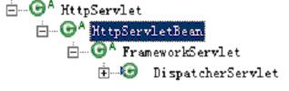
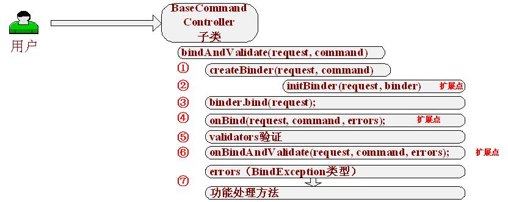
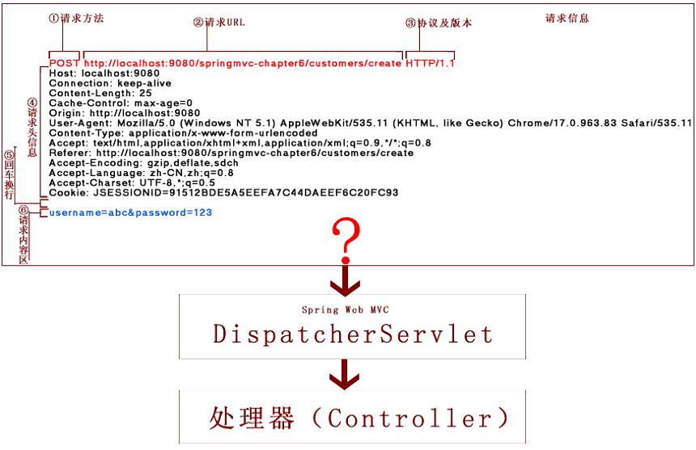
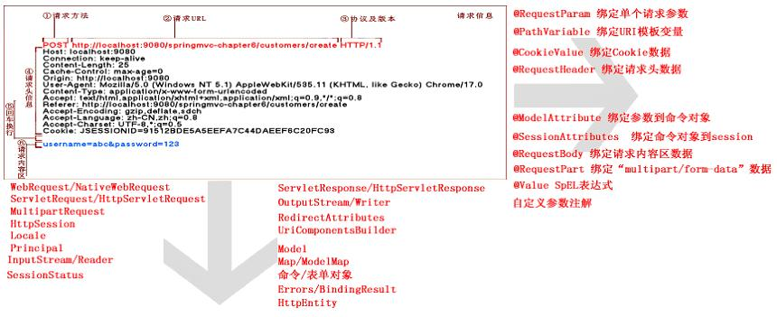

# Spring MVC

## 简介

Spring Web MVC 是一种基于 Java 的实现了 Web MVC 设计模式的请求驱动类型的轻量级 Web 框架，即使用了 MVC 架构模式的思想，将 Web 层进行职责解耦，基于请求驱动指的就是使用请求-响应模型，框架的目的就是帮助用户简化开发，Spring Web MVC 也是要简化用户日常 Web 开发的。

Spring Web MVC 也是服务到工作者模式的实现，但进行可优化。前端控制器是 DispatcherServlet；应用控制器其实拆为处理器映射器(Handler Mapping)进行处理器管理和视图解析器(View Resolver)进行视图管理；~~页面控制器/动作/处理器为 Controller 接口（仅包含 `ModelAndView handleRequest(request, response)` 方法）的实现（也可以是任何的POJO类）~~；支持本地化（Locale）解析、主题（Theme）解析及文件上传等；提供了非常灵活的数据验证、格式化和数据绑定机制；提供了强大的约定大于配置（惯例优先原则）的契约式编程支持。

## Spring Web MVC核心架构图


核心架构的具体流程步骤如下：

1. 首先*用户发送请求 Request——>DispatcherServlet*，前端控制器收到请求后自己不进行处理，而是委托给其他的解析器进行处理，作为统一访问点，进行全局的流程控制；
2. *DispatcherServlet——>HandlerMapping* ， HandlerMapping 将会把请求映射为 HandlerExecutionChain 对象（包含一个 Handler 处理器（页面控制器）对象、多个 HandlerInterceptor 拦截器）对象，通过这种策略模式，很容易添加新的映射策略；
3. *DispatcherServlet——>HandlerAdapter* ， HandlerAdapter 将会把处理器包装为适配器，从而支持多种类型的处理器，即适配器设计模式的应用，从而很容易支持很多类型的处理器；
4. *HandlerAdapter——>处理器功能处理方法的调用*， HandlerAdapter 将会根据适配的结果调用真正的处理器的功能处理方法，完成功能处理；并返回一个 ModelAndView 对象（包含模型数据、逻辑视图名）；
5. *ModelAndView的逻辑视图名——> ViewResolver* ， ViewResolver 将把逻辑视图名解析为具体的 View，通过这种策略模式，很容易更换其他视图技术；
6. *View——>渲染*， View 会根据传进来的 Model 模型数据进行渲染，此处的 Model 实际是一个 Map 数据结构，因此很容易支持其他视图技术；
7. 返回控制权给 DispatcherServlet，由 DispatcherServlet 返回响应给用户，到此一个流程结束。

具体的核心开发步骤：

1. DispatcherServlet 在 `web.xml` 中的部署描述，从而拦截请求到 Spring Web MVC
2. HandlerMapping 的配置，从而将请求映射到处理器
3. HandlerAdapter 的配置，从而支持多种类型的处理器
4. ViewResolver 的配置，从而将逻辑视图名解析为具体视图技术
5. 处理器（页面控制器）的配置，从而进行功能处理

## Spring Web MVC优势

1. 清晰的角色划分：前端控制器（DispatcherServlet）、请求到处理器映射（HandlerMapping）、处理器适配器（HandlerAdapter）、视图解析器（ViewResolver）、处理器或页面控制器（Controller）、验证器（Validator）、命令对象（Command  请求参数绑定到的对象就叫命令对象）、表单对象（Form Object 提供给表单展示和提交到的对象就叫表单对象）；
2. 分工明确，而且扩展点相当灵活，可以很容易扩展，虽然几乎不需要；
3. 由于命令对象就是一个 POJO ，无需继承框架特定 API，可以使用命令对象直接作为业务对象；
4. 和 Spring 其他框架无缝集成，是其它 Web 框架所不具备的；
5. 可适配，通过 HandlerAdapter 可以支持任意的类作为处理器；
6. 可定制性，HandlerMapping 、 ViewResolver 等能够非常简单的定制；
7. 功能强大的数据验证、格式化、绑定机制；
8. 利用 Spring 提供的 Mock 对象能够非常简单的进行 Web 层单元测试；
9. 本地化、主题的解析的支持，使我们更容易进行国际化和主题的切换。
10. 强大的 JSP 标签库，使 JSP 编写更容易。

## ~~实际开发流程步骤~~【老版本的使用方式，废弃】

### 前端控制器的配置

在 `web.xml` 添加配置

```xml
<servlet>
    <servlet-name>chapter2</servlet-name>
    <servlet-class>org.springframework.web.servlet.DispatcherServlet</servlet-class>
    <load-on-startup>1</load-on-startup>
</servlet>
<servlet-mapping>
    <servlet-name>chapter2</servlet-name>
    <url-pattern>/</url-pattern>
</servlet-mapping>
```

load-on-startup：表示启动容器时初始化该 Servlet；

url-pattern：表示哪些请求交给 Spring Web MVC 处理， `/` 是用来定义默认 servlet 映射的，也可以如 `*.html` 表示拦截所有以 html 为扩展名的请求。

### 在 Spring 配置文件中配置 HandlerMapping 、 HandlerAdapter

```xml
<!-- HandlerMapping -->
<bean class="org.springframework.web.servlet.handler.BeanNameUrlHandlerMapping"/>

<!-- HandlerAdapter -->
<bean class="org.springframework.web.servlet.mvc.SimpleControllerHandlerAdapter"/> 
```

BeanNameUrlHandlerMapping：表示将请求的 URL 和 Bean 名字映射，如 URL 为 `上下文/hello`，则 Spring 配置文件必须有一个名字为 `/hello` 的Bean，上下文默认忽略。

SimpleControllerHandlerAdapter：表示所有实现了 `org.springframework.web.servlet.mvc.Controller` 接口的 Bean 可以作为 Spring Web MVC 中的处理器。如果需要其他类型的处理器可以通过实现 HadlerAdapter 来解决。

### 在 Spring 配置文件中配置 ViewResolver

```xml
<!-- ViewResolver -->
<bean class="org.springframework.web.servlet.view.InternalResourceViewResolver">
    <property name="viewClass" value="org.springframework.web.servlet.view.JstlView"/>
    <property name="prefix" value="/WEB-INF/jsp/"/>
    <property name="suffix" value=".jsp"/>
</bean>
```

- InternalResourceViewResolver：用于支持 Servlet、JSP 视图解析；
- viewClass：JstlView 表示 JSP 模板页面需要使用 JSTL 标签库，classpath 中必须包含 jstl 的相关 jar 包；
- prefix 和 suffix：查找视图页面的前缀和后缀（前缀[逻辑视图名]后缀），比如传进来的逻辑视图名为 hello，则该该 jsp 视图页面应该存放在 `WEB-INF/jsp/hello.jsp`。

### 开发处理器/页面控制器

### 开发视图页面

### POST中文乱码解决方案

spring Web MVC 框架提供了 `org.springframework.web.filter.CharacterEncodingFilter` 用于解决 POST 方式造成的中文乱码问题，具体配置如下：

```xml
<filter>
    <filter-name>CharacterEncodingFilter</filter-name>
    <filter-class>org.springframework.web.filter.CharacterEncodingFilter</filter-class>
    <init-param>
        <param-name>encoding</param-name>
        <param-value>utf-8</param-value>
    </init-param>
</filter>
<filter-mapping>
    <filter-name>CharacterEncodingFilter</filter-name>
    <url-pattern>/*</url-pattern>
</filter-mapping>
```

## Spring3.1新特性【新版本使用的介绍，见如下来使用 SpringMVC】

1. Spring2.5 之前是通过实现 Controller 接口或其实现来定义用户的处理器类。
2. Spring2.5 引入注解式处理器支持，通过 `@Controller` 和 `@RequestMapping` 注解定义处理器类。
    需要通过处理器映射 `DefaultAnnotationHandlerMapping` 和处理器适配器 `AnnotationMethodHandlerAdapter` 来开启支持 `@Controller` 和 `@RequestMapping` 注解的处理器。
    - `@Controller`：用于标识是处理器类；
    - `@RequestMapping`：请求到处理器功能方法的映射规则；
    - `@RequestParam`：请求参数到处理器功能处理方法的方法参数上的绑定；
    - `@ModelAttribute`：请求参数到命令对象的绑定；
    - `@SessionAttributes`：用于声明 session 级别存储的属性，放置在处理器类上，通常列出模型属性（如 `@ModelAttribute`）对应的名称，则这些属性会透明的保存到 session 中；
    - `@InitBinder`：自定义数据绑定注册支持，用于将请求参数转换到命令对象属性的对应类型；
3. Spring3.0 引入 RESTful 架构风格支持(通过 `@PathVariable` 注解和一些其他特性支持),且又引入了更多的注解支持：
    - `@CookieValue`：cookie 数据到处理器功能处理方法的方法参数上的绑定；
    - `@RequestHeader`：请求头（header）数据到处理器功能处理方法的方法参数上的绑定；
    - `@RequestBody`：请求的 body 体的绑定（通过 HttpMessageConverter 进行类型转换）；
    - `@ResponseBody`：处理器功能处理方法的返回值作为响应体（通过 HttpMessageConverter 进行类型转换）；
    - `@ResponseStatus`：定义处理器功能处理方法/异常处理器返回的状态码和原因；
    - `@ExceptionHandler`：注解式声明异常处理器；
    - `@PathVariable`：请求 URI 中的模板变量部分到处理器功能处理方法的方法参数上的绑定，从而支持 RESTful 架构风格的 URI；
4. JSR-303 验证框架的无缝支持（通过 `@Valid` 注解定义验证元数据）；
5. 使用 Spring 3 开始的 ConversionService 进行类型转换（PropertyEditor依然有效），支持使用 `@NumberFormat` 和 `@DateTimeFormat` 来进行数字和日期的格式化；HttpMessageConverter（Http输入/输出转换器，比如JSON、XML等的数据输出转换器）;ContentNegotiatingViewResolver，内容协商视图解析器，它还是视图解析器，只是它支持根据请求信息将同一模型数据以不同的视图方式展示（如json、xml、html等），RESTful架构风格中很重要的概念（同一资源，多种表现形式）；
6. Spring 3 引入 一个  mvc XML的命名空间用于支持mvc配置，包括如：
    - `<mvc:annotation-driven>`：
        - 自动注册基于注解风格的处理器需要的 DefaultAnnotationHandlerMapping、AnnotationMethodHandlerAdapter
        - 支持 Spring3 的 ConversionService 自动注册
        - 支持 JSR-303 验证框架的自动探测并注册（只需把 JSR-303 实现放置到 classpath）
        - 自动注册相应的 HttpMessageConverter（用于支持 `@RequestBody`  和 `@ResponseBody`）（如XML输入输出转换器（只需将 JAXP 实现放置到 classpath）、JSON 输入输出转换器（只需将 Jackson 实现放置到 classpath））等。
    - `<mvc:interceptors>`：注册自定义的处理器拦截器；
    - `<mvc:view-controller>`：和 ParameterizableViewController 类似，收到相应请求后直接选择相应的视图；
    - `<mvc:resources>`：逻辑静态资源路径到物理静态资源路径的支持；
    - `<mvc:default-servlet-handler>`：当在 `web.xml` 中 DispatcherServlet 使用 `<url-pattern>/</url-pattern>` 映射时，能映射静态资源（当 Spring Web MVC 框架没有处理请求对应的控制器时（如一些静态资源），转交给默认的Servlet来响应静态文件，否则报404找不到资源错误）。
7. Spring3.1 新特性：对 Servlet 3.0 的全面支持。
    - `@EnableWebMvc`：用于在基于 Java 类定义 Bean 配置中开启 MVC 支持，和XML中的 `<mvc:annotation-driven>` 功能一样；
    - `@RequestMapping` 的 "consumes" 和 "produces" 条件支持：用于支持 `@RequestBody` 和 `@ResponseBody`；consumes 指定请求的内容是什么类型的内容，即本处理方法消费什么类型的数据，如 consumes="application/json" 表示 JSON 类型的内容，Spring 会根据相应的 HttpMessageConverter 进行请求内容区数据到 `@RequestBody` 注解的命令对象的转换；produces 指定生产什么类型的内容，如 produces="application/json" 表示 JSON 类型的内容，Spring 的根据相应的 HttpMessageConverter 进行请求内容区数据到 `@RequestBody` 注解的命令对象的转换，Spring 会根据相应的 HttpMessageConverter 进行模型数据（返回值）到 JSON 响应内容的转换。
    - URI模板变量增强：URI模板变量可以直接绑定到 `@ModelAttribute` 指定的命令对象、`@PathVariable` 方法参数在视图渲染之前被合并到模型数据中（除JSON序列化、XML混搭场景下）。
    - `@Validated`：JSR-303 的 `javax.validation.Valid` 一种变体（非 JSR-303 规范定义的，而是 Spring 自定义的），用于提供对 Spring 的验证器（`org.springframework.validation.Validator`）支持，需要 Hibernate Validator 4.2 及更高版本支持；
    - `@RequestPart`：提供对 “multipart/form-data” 请求的全面支持，支持 Servlet 3.0 文件上传（`javax.servlet.http.Part）、支持内容的 HttpMessageConverter（即根据请求头的Content-Type，来判断内容区数据是什么类型，如 JSON、XML，能自动转换为命令对象），比 `@RequestParam` 更强大（只能对请求参数数据绑定，key-alue格式），而 `@RequestPart` 支持如JSON、XML内容区数据的绑定；
    - Flash 属性 和 RedirectAttribute：通过 FlashMap 存储一个请求的输出，当进入另一个请求时作为该请求的输入，典型场景如重定向（POST-REDIRECT-GET模式，1、POST时将下一次需要的数据放在FlashMap；2、重定向；3、通过GET访问重定向的地址，此时 FlashMap 会把1放到 FlashMap 的数据取出放到请求中，并从 FlashMap 中删除；从而支持在两次请求之间保存数据并防止了重复表单提交）。Spring Web MVC 提供 FlashMapManager 用于管理 FlashMap，默认使用 SessionFlashMapManager，即数据默认存储在 session 中。

## 深入分析Spring与Spring MVC容器

Spring Framework 本身没有 web 功能，Spring MVC 使用 WebApplicationContext 类扩展 ApplicationContext，使得拥有 Web 功能。

以 Tomcat 为例，在 Web 容器中使用 Spring MVC，必须进行四项的配置：

1. 修改 `web.xml`，添加 servlet 定义；
2. 编写 `servletname-servlet.xml`（servletname 实在 `web.xml 中配置 `DispactherServlet` 时使 servlet-name 的值）配置；
3. contextConfigLocation 初始化参数、配置 ContextLoaderListerner；

在 `web.xml` 配置文件中，有两个主要的配置：ContextLoaderListerner 和 DispatcherServlet。同样的关于spring配置文件的相关配置也有两部分：context-param 和 DispatcherServlet 中的 init-param。

在Spring MVC中，Spring Context 是以父子的继承结构存在的。Web 环境中存在一个 ROOT Context，这个 Context 是整个应用的根上下文，是其他 context 的双亲 Context。同时 Spring MVC 也对应的持有一个独立的 Context，它是 ROOT Context 的子上下文。

ROOT Context 是在 ContextLoaderListerner 中配置的，ContextLoaderListerner 读取 context-param 中的 contextConfigLocation 指定的配置文件，创建 ROOT Context。

Spring MVC 启动过程大致分为两个过程：

1. ContextLoaderListerner 的初始化，实例化 IoC 容器，并将此容器实例注册到 ServletContext 中；
2. DispatcherServlet 初始化；

Web 容器调用 contextInitialized 方法初始化 ContextLoaderListerner，在此方法中，ContextLoaderListerner 通过调用继承自 ContextLoader 的 initWebApplicationContext 方法实例化 Spring IoC 容器。

Spring MVC 中核心类是 DispatcherServlet，在这个类中完成 Spring Context 的加载和创建，并且能够根据 Spring Context 的内容将请求分发给各个 Controller 类。DispatcherServlet 继承自 HttpServlet，关于 Spring Context 的配置文件加载和创建是在 `init()` 方法中进行的，主要的调用顺序是 `init-->initServletBean-->initWebApplicationContext`。通过 initWebApplicationContext 方法的调用，创建了 DispatcherServlet 对应的 context，并将其放置到 ServletContext中，这样就完成了在 web 容器中构建 Spring IoC 容器的过程。

Spring 的启动过程其实就是其 IoC 容器的启动过程，对于 Web 程序，IoC 容器启动过程即是建立上下文的过程。

Spring的启动过程：（**重要**）

1. 首先，对于一个 web应用，其部署在web 容器中，web 容器提供其一个全局的上下文环境，这个上下文就是 ServletContext，其为后面的 Spring IoC 容器提供宿主环境；
2. 其次，在 `web.xml` 中会提供有 contextLoaderListerner。在web容器启动时，会触发容器初始化事件，此时 contextLoaderListerner 会监听到这个事件，其 contextInitialized 方法会被调用，在这个方法中，spring 会初始化一个启动上下文，这个上下文被称为根上下文，即 WebApplicationContext，这是一个接口类，确切的说，其实际的实现类是 XmWebApplicationContext。这个就是spring的IoC容器，其对应的Bean定义的配置由web.xml中的context-param标签指定。在这个IoC容器初始化完毕后，spring以WebApplicationContext.ROOTWEBAPPLICATIONCONTEXTATTRIBUTE为属性key，将其存储到ServletContxt中，便于获取。
3. 再次，contextLoaderListerner 监听器初始化完毕后，开始初始化 `web.xml` 中配置的 Servlet，这个 servlet 可以配置多个，以最常见的 DispatcherServlet 为例，这个 servlet 实际上一个标准的前端控制器，用以转发、匹配、处理每个 servlet 请求。DispatcherServlet 上下文在初始化的时候会建立自己的 IoC 上下文，用以持有 Spring MVC 相关 的Bean。在建立DispatcherServlet自己的IoC上下文时，会利用WebApplciationContext.ROOTWEBAPPLICTIONCONTEXTATTRIBUTE。先从ServletContext中获取之前的根上下文（即WebApplictionContext）作为自己的上下文的parent上下文。有了这个parent上下文之后，再初始化自己持有的上下文。这个DispatcherServlet初始化自己的上下文的工作在其initStrategies方法中可以看到，大概的工作就是初始化处理器映射、视图解析等。这个servlet自己持有的上下文默认实现类也是XmlWebApplicationContext。初始化完毕后，spring以与servlet的名字相关（此处不是简单的以servlet名为key，而是通过一些转换）的属性为属性key，也将其存到ServletContext中，以便后续使用。这样灭个servlet就持有自己的上下文，即拥有自己独立的Bean空间，同时各个servlet共享相同的Bean，即根上下文定义的那些Bean。

## DispatcherServlet详解

### DispatcherServlet作用

DispatcherServlet是前端控制器设计模式的实现，提供Spring Web MVC的集中访问点，而且负责职责的分派，而且与Spring IoC容器无缝集成，从而可以获得Spring的所有好处。

DispatcherServlet主要用作职责调度工作，本身主要用于控制流程，主要职责如下：

1. 文件上传解析，如果请求类型是multipart将通过MultipartResolver进行文件上传解析；
2. 通过HandlerMapping，将请求映射到处理器（返回一个HandlerExecutionChain，它包括一个处理器、多个HandlerInterceptor拦截器）；
3. 通过HandlerAdapter支持多种类型的处理器(HandlerExecutionChain中的处理器)；
4. 通过ViewResolver解析逻辑视图名到具体视图实现；
5. 本地化解析；
6. 渲染具体的视图等；
7. 如果执行过程中遇到异常将交给HandlerExceptionResolver来解析。

从以上可以看出DispatcherServlet主要负责流程的控制（而且在流程中的每个关键点都是很容易扩展的）。

### DispatcherServlet在web.xml中的配置

```xml
<servlet>
    <servlet-name>springmvc</servlet-name>
    <servlet-class>org.springframework.web.servlet.DispatcherServlet</servlet-class>
    <load-on-startup>1</load-on-startup>
</servlet>
<servlet-mapping>
    <servlet-name>springmvc</servlet-name>
    <url-pattern>/</url-pattern>
</servlet-mapping>
```

load-on-startup：表示启动容器时初始化该Servlet；

url-pattern：表示哪些请求交给Spring Web MVC处理， “/” 是用来定义默认servlet映射的。也可以如“*.html”表示拦截所有以html为扩展名的请求。

该DispatcherServlet默认使用WebApplicationContext作为上下文，Spring默认配置文件为“/WEB-INF/[servlet名字]-servlet.xml”。

DispatcherServlet也可以配置自己的初始化参数，覆盖默认配置：

|         参数          | 描述                                                                                                                                                                                                    |
| :-------------------: | :------------------------------------------------------------------------------------------------------------------------------------------------------------------------------------------------------ |
|     contextClass      | 实现WebApplicationContext接口的类，当前的servlet用它来创建上下文。如果这个参数没有指定， 默认使用XmlWebApplicationContext                                                                               |
| contextConfigLocation | 传给上下文实例（由contextClass指定）的字符串，用来指定上下文的位置。这个字符串可以被分成多个字符串（使用逗号作为分隔符） 来支持多个上下文（在多上下文的情况下，如果同一个bean被定义两次，后面一个优先） |
|       namespace       | WebApplicationContext命名空间。默认值是[server-name]-servlet                                                                                                                                            |

通过初始化参数示例：

```xml
<servlet>
    <servlet-name>springmvc</servlet-name>
    <servlet-class>org.springframework.web.servlet.DispatcherServlet</servlet-class>
    <load-on-startup>1</load-on-startup>
    <init-param>
        <param-name>contextConfigLocation</param-name>
        <param-value>classpath:spring-mvc.xml</param-value>
    </init-param>
</servlet>
```

如果使用如上配置，Spring Web MVC框架将加载“classpath:spring-mvc.xml”来进行初始化上下文而不是“/WEB-INF/[servlet名字]-servlet.xml”

### 上下文关系

集成Web环境的通用配置：

```xml
<context-param>
    <param-name>contextConfigLocation</param-name>
    <param-value>
        classpath:spring-common-config.xml,
        classpath:spring-rabbit-config.xml
    </param-value>
</context-param>
<listener>
    <listener-class>org.springframework.web.context.ContextLoaderListener</listener-class>
</listener>
```

如上配置是Spring集成Web环境的通用配置；一般用于加载除Web层的Bean（如DAO、Service等），以便于与其他任何Web框架集成。

contextConfigLocation：表示用于加载Bean的配置文件；

contextClass：表示用于加载Bean的ApplicationContext实现类，默认WebApplicationContext。

创建完毕后会将该上下文放在ServletContext：`servletContext.setAttribute(WebApplicationContext.ROOT_WEB_APPLICATION_CONTEXT_ATTRIBUTE,this.context);`

ContextLoaderListener初始化的上下文和DispatcherServlet初始化的上下文关系,如图所示：


从图中可以看出：

- ContextLoaderListener初始化的上下文加载的Bean是对于整个应用程序共享的，不管是使用什么表现层技术，一般如DAO层、Service层Bean；
- DispatcherServlet初始化的上下文加载的Bean是只对Spring Web MVC有效的Bean，如Controller、HandlerMapping、HandlerAdapter等等，该初始化上下文应该只加载Web相关组件。

### DispatcherServlet初始化顺序

继承体系结构如下所示：



1. HttpServletBean继承HttpServlet，因此在Web容器启动时将调用它的init方法，该初始化方法的主要作用将Servlet初始化参数（init-param）设置到该组件上（如contextAttribute、contextClass、namespace、contextConfigLocation），通过BeanWrapper简化设值过程，方便后续使用；提供给子类初始化扩展点，initServletBean()，该方法由FrameworkServlet覆盖。
    ```java
    public abstract class HttpServletBean extends HttpServlet implements EnvironmentAware{
    @Override
        public final void init() throws ServletException {
            //省略部分代码

            //1、如下代码的作用是将Servlet初始化参数设置到该组件上如contextAttribute、contextClass、namespace、contextConfigLocation；
            try {
                PropertyValues pvs = new ServletConfigPropertyValues(getServletConfig(), this.requiredProperties);
                BeanWrapper bw = PropertyAccessorFactory.forBeanPropertyAccess(this);
                ResourceLoader resourceLoader = new ServletContextResourceLoader(getServletContext());
                bw.registerCustomEditor(Resource.class, new ResourceEditor(resourceLoader, this.environment));
                initBeanWrapper(bw);
                bw.setPropertyValues(pvs, true);
            }
            catch (BeansException ex) {
                //…………省略其他代码
            }
            //2、提供给子类初始化的扩展点，该方法由FrameworkServlet覆盖
            initServletBean();
            if (logger.isDebugEnabled()) {
                logger.debug("Servlet '" + getServletName() + "' configured successfully");
            }
        }

        //…………省略其他代码
    }
    ```
2. FrameworkServlet继承HttpServletBean，通过initServletBean()进行Web上下文初始化，该方法主要覆盖一下两件事情：
    1. 初始化web上下文；
    2. 提供给子类初始化扩展点；
        ```java
        public abstract class FrameworkServlet extends HttpServletBean {
            @Override
            protected final void initServletBean() throws ServletException {
                //省略部分代码

                try {
                        //1、初始化Web上下文
                    this.webApplicationContext = initWebApplicationContext();
                        //2、提供给子类初始化的扩展点
                    initFrameworkServlet();
                }

                //省略部分代码
            }
        }

        protected WebApplicationContext initWebApplicationContext() {
                //ROOT上下文（ContextLoaderListener加载的）
            WebApplicationContext rootContext =WebApplicationContextUtils.getWebApplicationContext(getServletContext());
            WebApplicationContext wac = null;
            if (this.webApplicationContext != null) {
                // 1、在创建该Servlet注入的上下文
                wac = this.webApplicationContext;
                if (wac instanceof ConfigurableWebApplicationContext) {
                    ConfigurableWebApplicationContext cwac = (ConfigurableWebApplicationContext) wac;
                    if (!cwac.isActive()) {
                        if (cwac.getParent() == null) {
                            cwac.setParent(rootContext);
                        }
                        configureAndRefreshWebApplicationContext(cwac);
                    }
                }
            }
            if (wac == null) {
                    //2、查找已经绑定的上下文
                wac = findWebApplicationContext();
            }
            if (wac == null) {
                    //3、如果没有找到相应的上下文，并指定父亲为ContextLoaderListener
                wac = createWebApplicationContext(rootContext);
            }
            if (!this.refreshEventReceived) {
                    //4、刷新上下文（执行一些初始化）
                onRefresh(wac);
            }
            if (this.publishContext) {
                // Publish the context as a servlet context attribute.
                String attrName = getServletContextAttributeName();
                getServletContext().setAttribute(attrName, wac);
                //省略部分代码
            }
            return wac;
            }
        ```
    从initWebApplicationContext（）方法可以看出，基本上如果ContextLoaderListener加载了上下文将作为根上下文（DispatcherServlet的父容器）;最后调用了onRefresh()方法执行容器的一些初始化，这个方法由子类实现，来进行扩展。
3. DispatcherServlet继承FrameworkServlet，并实现了onRefresh()方法提供一些前端控制器相关的配置：
    ```java
    public class DispatcherServlet extends FrameworkServlet {
        //实现子类的onRefresh()方法，该方法委托为initStrategies()方法。
        @Override
        protected void onRefresh(ApplicationContext context) {
        initStrategies(context);
        }

        //初始化默认的Spring Web MVC框架使用的策略（如HandlerMapping）
        protected void initStrategies(ApplicationContext context) {
        initMultipartResolver(context);
        initLocaleResolver(context);
        initThemeResolver(context);
        initHandlerMappings(context);
        initHandlerAdapters(context);
        initHandlerExceptionResolvers(context);
        initRequestToViewNameTranslator(context);
        initViewResolvers(context);
        initFlashMapManager(context);
        }
    }
    ```
从如上代码可以看出，DispatcherServlet启动时会进行需要的Web层Bean的配置，如HandlerMapping、HandlerAdapter等，而且如果没有配置，还会给我们提供默认的配置。

综上，从代码可以看出，整个DispatcherServlet初始化的过程和做了些什么事情，具体主要做了如下两件事情：

1. 初始化Spring Web MVC使用的Web上下文，并且可能指定父容器为（ContextLoaderListener加载了根上下文）；
2. 初始化DispatcherServlet使用的策略，如HandlerMapping、HandlerAdapter等。

### DispatcherServlet默认配置

DispatcherServlet的默认配置在DispatcherServlet.properties（和DispatcherServlet类在一个包下）中，而且是当Spring配置文件中没有指定配置时使用的默认策略。

### DispatcherServlet中使用的特殊的Bean

DispatcherServlet默认使用WebApplicationContext作为上下文，因此详解下该上下文中有哪些特殊的Bean：

1. Controller：处理器/页面控制器，做的是MVC中的C的事情，但控制逻辑转移到前端控制器了，用于对请求进行处理；
2. HandlerMapping：请求到处理器的映射，如果映射成功返回一个HandlerExecutionChain对象（包含一个Handler处理器（页面控制器）对象、多个HandlerInterceptor拦截器）对象；如BeanNameUrlHandlerMapping将URL与Bean名字映射，映射成功的Bean就是此处的处理器；
3. HandlerAdapter：HandlerAdapter将会把处理器包装为适配器，从而支持多种类型的处理器，即适配器设计模式的应用，从而很容易支持很多类型的处理器；如SimpleControllerHandlerAdapter将对实现了Controller接口的Bean进行适配，并且掉处理器的handleRequest方法进行功能处理；
4. ViewResolver：ViewResolver将把逻辑视图名解析为具体的View，通过这种策略模式，很容易更换其他视图技术；如InternalResourceViewResolver将逻辑视图名映射为jsp视图；
5. LocalResover：本地化解析，因为Spring支持国际化，因此LocalResover解析客户端的Locale信息从而方便进行国际化；
6. ThemeResovler：主题解析，通过它来实现一个页面多套风格，即常见的类似于软件皮肤效果；
7. MultipartResolver：文件上传解析，用于支持文件上传；
8. HandlerExceptionResolver：处理器异常解析，可以将异常映射到相应的统一错误界面，从而显示用户友好的界面（而不是给用户看到具体的错误信息）；
9. RequestToViewNameTranslator：当处理器没有返回逻辑视图名等相关信息时，自动将请求URL映射为逻辑视图名；
10. FlashMapManager：用于管理FlashMap的策略接口，FlashMap用于存储一个请求的输出，当进入另一个请求时作为该请求的输入，通常用于重定向场景。

## ~~Controller接口控制器详解~~

### Controller简介

Controller控制器，是MVC中的部分C，可以称为页面控制器、动作、处理器，此处的控制器主要负责功能处理部分：

1. 收集、验证请求参数并绑定到命令对象；
2. 将命令对象交给业务对象，由业务对象处理并返回模型数据；
3. 返回ModelAndView（Model部分是业务对象返回的模型数据，视图部分为逻辑视图名）。

**注：** MVC中完整的C（包含控制逻辑+功能处理）由（DispatcherServlet + Controller）组成。

Spring Web MVC支持多种类型的控制器，比如实现Controller接口，从Spring2.5开始支持注解方式的控制器（如@Controller、@RequestMapping、@RequestParam、@ModelAttribute等），我们也可以自己实现相应的控制器（只需要定义相应的HandlerMapping和HandlerAdapter即可）。

### Controller接口

```java
package org.springframework.web.servlet.mvc;

public interface Controller {
       ModelAndView handleRequest(HttpServletRequest request, HttpServletResponse response) throws Exception;
}
```

这是控制器接口，此处只有一个方法handleRequest，用于进行请求的功能处理，处理完请求后返回ModelAndView（Model模型数据部分 和 View视图部分）。

Spring默认提供了一些Controller接口的实现以方便我们使用，具体继承体系如图：  


### WebContentGenerator

用于提供如浏览器缓存控制、是否必须有session开启、支持的请求方法类型（GET、POST等）等，该类主要有如下属性：

- Set\<String\>  supportedMethods：设置支持的请求方法类型，默认支持“GET”、“POST”、“HEAD”，如果我们想支持“PUT”，则可以加入该集合“PUT”。
- boolean requireSession = false：是否当前请求必须有session，如果此属性为true，但当前请求没有打开session将抛出HttpSessionRequiredException异常；
- boolean useExpiresHeader = true：是否使用HTTP1.0协议过期响应头：如果true则会在响应头添加：“Expires：”；需要配合cacheSeconds使用；
- boolean useCacheControlHeader = true：是否使用HTTP1.1协议的缓存控制响应头，如果true则会在响应头添加；需要配合cacheSeconds使用；
- boolean useCacheControlNoStore = true：是否使用HTTP 1.1协议的缓存控制响应头，如果true则会在响应头添加；需要配合cacheSeconds使用；
- private int cacheSeconds = -1：缓存过期时间，正数表示需要缓存，负数表示不做任何事情（也就是说保留上次的缓存设置）

该抽象类默认被AbstractController和WebContentInterceptor继承。

### AbstractController

该抽象类实现了Controller，并继承了WebContentGenerator（具有该类的特性），该类有如下属性：  
    boolean synchronizeOnSession = false：表示该控制器是否在执行时同步session，从而保证该会话的用户串行访问该控制器。

### ServletForwardingController

将接收到的请求转发到一个命名的servlet.

### BaseCommandController

命令控制器通用基类，提供了以下功能支持：

1. 数据绑定：请求参数绑定到一个command object（命令对象，非GoF里的命令设计模式），这里的命令对象是指绑定请求参数的任何POJO对象；
    - commandClass：表示命令对象实现类，如UserModel；
    - commandName：表示放入请求的命令对象名字（默认command），request.setAttribute(commandName, commandObject);
2. 验证功能：提供Validator注册功能，注册的验证器会验证命令对象属性数据是否合法；
    - validators：通过该属性注入验证器，验证器用来验证命令对象属性是否合法；

该抽象类没有没有提供流程功能，只是提供了一些公共的功能，实际使用时需要使用它的子类。

### AbstractCommandController

命令控制器之一，可以实现该控制器来创建命令控制器，该控制器能自动封装请求参数到一个命令对象，而且提供了验证功能。

### AbstractFormController

用于支持带步骤的表单提交的命令控制器基类，使用该控制器可以完成：

1. 定义表单处理（表单的渲染），并从控制器获取命令对象构建表单；
2. 提交表单处理，当用户提交表单内容后，AbstractFormController可以将用户请求的数据绑定到命令对象，并可以验证表单内容、对命令对象进行处理。

### SimpleFormController

提供了更好的两步表单支持：

1. 准备要展示的数据，并到表单展示页面；
2. 提交数据数据进行处理。

### CancellableFormController

一个可取消的表单控制器，继承SimpleFormController，额外提供取消表单功能:

1. 表单展示：和SimpleFormController一样；
2. 表单取消：和SimpleFormController一样；
3. 表单成功提交：取消功能处理方法为：onCancel(Object command)，而且默认返回cancelView属性指定的逻辑视图名。

### AbstractWizardFormController

向导控制器类提供了多步骤（向导）表单的支持（如完善个人资料时分步骤填写基本信息、工作信息、学校信息等）

### ParameterizableViewController

参数化视图控制器，不进行功能处理（即静态视图），根据参数的逻辑视图名直接选择需要展示的视图。

该控制器接收到请求后直接选择参数化的视图，这样的好处是在配置文件中配置，从而避免程序的硬编码，比如像帮助页面等不需要进行功能处理，因此直接使用该控制器映射到视图。

### AbstractUrlViewController

提供根据请求URL路径直接转化为逻辑视图名的支持基类，即不需要功能处理，直接根据URL计算出逻辑视图名，并选择具体视图进行展示：

- urlDecode：是否进行url解码，不指定则默认使用服务器编码进行解码（如Tomcat默认ISO-8859-1）；
- urlPathHelper：用于解析请求路径的工具类，默认为org.springframework.web.util.UrlPathHelper。

### UrlFilenameViewController

将请求的URL路径转换为逻辑视图名并返回的转换控制器，即不需要功能处理，直接根据URL计算出逻辑视图名，并选择具体视图进行展示：根据请求URL路径计算逻辑视图名；

### MultiActionController

使用Spring Web MVC提供的MultiActionController，用于支持在一个控制器里添加多个功能处理方法，即将多个请求的处理方法放置到一个控制器里。

详细使用参考：<http://jinnianshilongnian.iteye.com/blog/1630585>

## 数据类型转换和数据验证



流程：

1. 首先创建数据绑定器，在此处会创建ServletRequestDataBinder类的对象，并设置messageCodesResolver（错误码解析器）；
2. 提供第一个扩展点，初始化数据绑定器，在此处我们可以覆盖该方法注册自定义的PropertyEditor（请求参数——>命令对象属性的转换）；
3. 进行数据绑定，即请求参数——>命令对象的绑定；
4. 提供第二个扩展点，数据绑定完成后的扩展点，此处可以实现一些自定义的绑定动作；
5. 验证器对象的验证，验证器通过validators注入，如果验证失败，需要把错误信息放入Errors（此处使用BindException实现）；
6. 提供第三个扩展点，此处可以实现自定义的绑定/验证逻辑；
7. 将errors传入功能处理方法进行处理，功能方法应该判断该错误对象是否有错误进行相应的处理。

### 数据类型转换

请求参数（String）——>命令对象属性（可能是任意类型）的类型转换，即数据绑定时的类型转换，使用PropertyEditor实现绑定时的类型转换。

Spring内建的PropertyEditor如下所示：

| 类名                    | 说明                                                                                                                                                     | 默认是否注册 |
| :---------------------- | :------------------------------------------------------------------------------------------------------------------------------------------------------- | :----------: |
| ByteArrayPropertyEditor | String<——>byte[]                                                                                                                                         |      是      |
| ClassEditor             | String<——>Class，当类没有发现抛出IllegalArgumentException                                                                                                |      是      |
| CustomBooleanEditor     | String<——>Boolean，true/yes/on/1转换为true；false/no/off/0转换为false                                                                                    |      是      |
| CustomCollectionEditor  | 数组/Collection——>Collection；普通值——>Collection（只包含一个对象），如String——>Collection，不允许Collection——>String（单方向转换）                      |      是      |
| CustomNumberEditor      | String<——>Number(Integer、Long、Double)                                                                                                                  |      是      |
| FileEditor              | String<——>File                                                                                                                                           |      是      |
| InputStreamEditor       | String——>InputStream，单向的，不能InputStream——>String                                                                                                   |      是      |
| LocaleEditor            | String<——>Locale，（String的形式为[语言]\_[国家]\_[变量]，这与Local对象的toString()方法得到的结果相同）                                                  |      是      |
| PatternEditor           | String<——>Pattern                                                                                                                                        |      是      |
| PropertiesEditor        | String<——>java.lang.Properties                                                                                                                           |      是      |
| URLEditor               | String<——>URL                                                                                                                                            |      是      |
| StringTrimmerEditor     | 一个用于trim 的 String类型的属性编辑器，如默认删除两边的空格，charsToDelete属性：可以设置为其他字符，emptyAsNull属性：将一个空字符串转化为null值的选项。 |      否      |
| CustomDateEditor        | String<——>java.util.Date                                                                                                                                 |      否      |

### 数据验证

1. 数据绑定失败：比如需要数字却输入了字母；
2. 数据不合法：可以认为是业务错误，通过自定义验证器验证，如用户名长度必须在5-20之间，我们却输入了100个字符等；
3. 错误对象：当我们数据绑定失败或验证失败后，错误信息存放的对象，我们叫错误对象，在Spring Web MVC中Errors是具体的代表者；线程不安全对象；
4. 错误消息：是硬编码，还是可配置？实际工作应该使用配置方式，我们只是把错误码（errorCode）放入错误对象，在展示时读取相应的错误消息配置文件来获取要显示的错误消息(errorMessage)；

## 处理器拦截器详解

Spring Web MVC的处理器拦截器，类似于Servlet开发中的过滤器Filter，用于对处理器进行预处理和后处理。

### 拦截器接口

```java
package org.springframework.web.servlet;
public interface HandlerInterceptor {
    //预处理回调方法，实现处理器的预处理（如登录检查），第三个参数为响应的处理器
    //返回值：true表示继续流程（如调用下一个拦截器或处理器）；false表示流程中断（如登录检查失败），不会继续调用其他的拦截器或处理器，此时我们需要通过response来产生响应； 
    boolean preHandle(HttpServletRequest request, HttpServletResponse response,Object handler) throws Exception;

    //后处理回调方法，实现处理器的后处理（但在渲染视图之前），此时我们可以通过modelAndView（模型和视图对象）对模型数据进行处理或对视图进行处理，modelAndView也可能为null。
    void postHandle(HttpServletRequest request, HttpServletResponse response,Object handler, ModelAndView modelAndView）throws Exception;

    //整个请求处理完毕回调方法，即在视图渲染完毕时回调，如性能监控中我们可以在此记录结束时间并输出消耗时间，还可以进行一些资源清理，类似于try-catch-finally中的finally，但仅调用处理器执行链中preHandle返回true的拦截器的afterCompletion
    void afterCompletion(HttpServletRequest request, HttpServletResponse response,Object handler, Exception ex)throws Exception;
}
```

### 拦截器适配器

有时候我们可能只需要实现三个回调方法中的某一个，如果实现HandlerInterceptor接口的话，三个方法必须实现，不管你需不需要，此时spring提供了一个HandlerInterceptorAdapter适配器（一种适配器设计模式的实现），允许我们只实现需要的回调方法。

#### 运行流程图

正常流程：


中断流程：


## 注解式控制器

### 注解式控制器简介

1. Spring2.5之前是通过实现Controller接口或其实现来定义处理器类。已经被废弃。
2. Spring2.5引入注解式处理器支持，通过@Controller 和 @RequestMapping注解定义我们的处理器类。
    并且提供了一组强大的注解：
    - @Controller：用于标识是处理器类；
    - @RequestMapping：请求到处理器功能方法的映射规则；
    - @RequestParam：请求参数到处理器功能处理方法的方法参数上的绑定；
    - @ModelAttribute：请求参数到命令对象的绑定；
    - @SessionAttributes：用于声明session级别存储的属性，放置在处理器类上，通常列出模型属性（如@ModelAttribute）对应的名称，则这些属性会透明的保存到session中；
    - @InitBinder：自定义数据绑定注册支持，用于将请求参数转换到命令对象属性的对应类型；  
    **注：** 需要通过处理器映射DefaultAnnotationHandlerMapping和处理器适配器AnnotationMethodHandlerAdapter来开启支持@Controller 和@RequestMapping注解的处理器。
3. Spring3.0引入RESTful架构风格支持(通过@PathVariable注解和一些其他特性支持),且又引入了更多的注解支持：
    - @CookieValue：cookie数据到处理器功能处理方法的方法参数上的绑定；
    - @RequestHeader：请求头（header）数据到处理器功能处理方法的方法参数上的绑定；
    - @RequestBody：请求的body体的绑定（通过HttpMessageConverter进行类型转换）；
    - @ResponseBody：处理器功能处理方法的返回值作为响应体（通过HttpMessageConverter进行类型转换）；
    - @ResponseStatus：定义处理器功能处理方法/异常处理器返回的状态码和原因；
    - @ExceptionHandler：注解式声明异常处理器；
    - @PathVariable：请求URI中的模板变量部分到处理器功能处理方法的方法参数上的绑定，从而支持RESTful架构风格的URI；
4. Spring3.1使用新的HandlerMapping 和 HandlerAdapter来支持@Contoller和@RequestMapping注解处理器。
    新的@Contoller和@RequestMapping注解支持类：处理器映射RequestMappingHandlerMapping和处理器适配器RequestMappingHandlerAdapter组合来代替Spring2.5开始的处理器映射DefaultAnnotationHandlerMapping和处理器适配器AnnotationMethodHandlerAdapter，提供更多的扩展点。

### 请求映射

一般请求，如图：



http请求包含六部分信息：

1. 请求方法，如GET或POST，表示提交的方式；
2. URL，请求的地址信息；
3. 协议及版本；
4. 请求头信息（包括Cookie信息）；
5. 回车换行（CRLF）；
6. 请求内容区（即请求的内容或数据），如表单提交时的参数数据、URL请求参数（?abc=123 ？后边的）等。

此处1，2，4，6一般是可变的，因此可以将这些信息进行请求到处理器的功能处理方法的映射，因此请求的映射分为如下几种：

- URL路径映射：使用URL映射请求到处理器的功能处理方法；
- 请求方法映射限定：如限定功能处理方法只处理GET请求；
- 请求参数映射限定：如限定只处理包含“abc”请求参数的请求；
- 请求头映射限定：如限定只处理“Accept=application/json”的请求。 

#### URL路径映射

##### 普通URL路径映射

```
@RequestMapping(value={"/test1", "/user/create"})：多个URL路径可以映射到同一个处理器的功能处理方法。
```

##### URI模板模式映射

```
@RequestMapping(value="/users/{userId}")：{×××}占位符， 请求的URL可以是 “/users/123456”或“/users/abcd”,且可以通过@PathVariable可以提取URI模板模式中的{×××}中的×××变量。  
@RequestMapping(value="/users/{userId}/create")：这样也是可以的，请求的URL可以是“/users/123/create”。  
@RequestMapping(value="/users/{userId}/topics/{topicId}")：这样也是可以的，请求的URL可以是“/users/123/topics/123”。
```

##### Ant风格的URL路径映射

```
@RequestMapping(value="/users/**")：可以匹配“/users/abc/abc”，但“/users/123”将会被【URI模板模式映射中的“/users/{userId}”模式优先映射到】  
@RequestMapping(value="/product?")：可匹配“/product1”或“/producta”，但不匹配“/product”或“/productaa”;  
@RequestMapping(value="/product*")：可匹配“/productabc”或“/product”，但不匹配“/productabc/abc”;  
@RequestMapping(value="/product/*")：可匹配“/product/abc”，但不匹配“/productabc”;  
@RequestMapping(value="/products/**/{productId}")：可匹配“/products/abc/abc/123”或“/products/123”，也就是Ant风格和URI模板变量风格可混用;
```

##### 正则表达式风格的URL路径映射

从Spring3.0开始支持正则表达式风格的URL路径映射，格式为{变量名:正则表达式}，可以通过@PathVariable提取模式中的{×××：正则表达式匹配的值}中的×××变量

```
@RequestMapping(value="/products/{categoryCode:\\d+}-{pageNumber:\\d+}")：可以匹配“/products/123-1”，但不能匹配“/products/abc-1”，这样可以设计更加严格的规则。
```

正则表达式风格的URL路径映射是一种特殊的URI模板模式映射：  
URI模板模式映射是{userId}，不能指定模板变量的数据类型，如是数字还是字符串；  
正则表达式风格的URL路径映射，可以指定模板变量的数据类型，可以将规则写的相当复杂。

##### 组合使用是“或”的关系

如 `@RequestMapping(value={"/test1", "/user/create"})` 组合使用是或的关系，即“/test1”或“/user/create”请求URL路径都可以映射到@RequestMapping指定的功能处理方法。

#### 请求方法映射

##### 请求方法映射限定

添加请求方法的窄化：method = RequestMethod.GET；method = RequestMethod.POST...

##### 组合使用是“或”的关系[请求方法]

```
@RequestMapping(value="/test", method = {RequestMethod.POST, RequestMethod.GET})：即请求方法可以是 GET 或 POST。
```

**注：** 除了GET、POST，还有HEAD、OPTIONS、PUT、DELETE、TRACE；DispatcherServlet默认开启对 GET、POST、PUT、DELETE、HEAD的支持；如果需要支持OPTIONS、TRACE，请添加DispatcherServlet在web.xml的初始化参数：dispatchOptionsRequest 和 dispatchTraceRequest 为true。

##### 请求参数数据映射限定

###### 请求数据中有指定参数名

请求参数的窄化：params="test",请求参数中需要有test 

```
@RequestMapping(params="test", method=RequestMethod.GET)
```

###### 请求数据中没有指定参数名

```
@RequestMapping(params="!test", method=RequestMethod.GET)
```

###### 请求数据中指定参数名=值

```
@RequestMapping(params="test=test")
```

###### 请求数据中指定参数名!=值

```
@RequestMapping(params="test!=test")
```

###### 组合使用是“且”的关系

```
@RequestMapping(params={"test1", "test2=test2"})
```

#### 请求头数据映射限定

使用注解中的headers，同上

### 数据绑定

获取的数据如下图：



数据绑定，简单的说就是 Spring MVC 从请求中获取请求参数，赋予给处理方法相应的参数。主要流程如下：

1. DataBinder 接受带有请求参数的 ServletRequest 对象
2. 调用 ConversionService 组件，进行数据类型转换、数据格式化等工作
3. 然后调用 Validator 组件，进行数据校验等工作
4. 绑定结果到 BindingResult 对象
5. 最后赋予给处理方法相应的参数

#### 功能处理方法支持的参数类型

##### ServletRequest/HttpServletRequest 和 ServletResponse/HttpServletResponse

```java
public String requestOrResponse (
    ServletRequest servletRequest, HttpServletRequest httpServletRequest,
    ServletResponse servletResponse, HttpServletResponse httpServletResponse
)
```

Spring Web MVC框架会自动把相应的Servlet请求/响应（Servlet API）作为参数传递过来

##### InputStream/OutputStream 和 Reader/Writer

```java
public void inputOrOutBody(InputStream requestBodyIn, OutputStream responseBodyOut)
        throws IOException {
    responseBodyOut.write("success".getBytes());
}
```

requestBodyIn：获取请求的内容区字节流，等价于request.getInputStream();  
responseBodyOut：获取相应的内容区字节流，等价于response.getOutputStream()。

```java
public void readerOrWriteBody(Reader reader, Writer writer)
        throws IOException {
    writer.write("hello");
}
```

reader：获取请求的内容区字符流，等价于request.getReader();
writer：获取相应的内容区字符流，等价于response.getWriter()。

**注：** InputStream/OutputStream 和 Reader/Writer两组不能同时使用，只能使用其中的一组。

##### WebRequest/NativeWebRequest

WebRequest是Spring Web MVC提供的统一请求访问接口，不仅仅可以访问请求相关数据（如参数区数据、请求头数据，但访问不到Cookie区数据），还可以访问会话和上下文中的数据；NativeWebRequest继承了WebRequest，并提供访问本地Servlet API的方法。

1. webRequest.getParameter：访问请求参数区的数据，可以通过getHeader()访问请求头数据；
2. webRequest.setAttribute/getAttribute：到指定的作用范围内取/放属性数据，Servlet定义的三个作用范围分别使用如下常量代表：
    - SCOPE_REQUEST ：代表请求作用范围；
    - SCOPE_SESSION ：代表会话作用范围；
    - SCOPE\_GLOBAL\_SESSION ：代表全局会话作用范围，即ServletContext上下文作用范围。
3. nativeWebRequest.getNativeRequest/nativeWebRequest.getNativeResponse：得到本地的Servlet API。

##### HttpSession

##### 命令/表单对象

Spring Web MVC能够自动将请求参数绑定到功能处理方法的命令/表单对象上

##### Model、Map、ModelMap

Spring Web MVC 提供Model、Map或ModelMap让我们能去暴露渲染视图需要的模型数据。

##### Errors/BindingResult

#### @RequestParam绑定单个请求参数值

@RequestParam用于将请求参数区数据映射到功能处理方法的参数上。

```java
public String requestparam1(@RequestParam String username)

//或

//即通过@RequestParam("username")明确告诉Spring Web MVC使用username进行入参
public String requestparam2(@RequestParam("username") String username)
```

`@RequestParam` 注解主要有哪些参数：

- value：参数名字，即入参的请求参数名字，如username表示请求的参数区中的名字为username的参数的值将传入；
- required：是否必须，默认是true，表示请求中一定要有相应的参数，否则将报404错误码；
- defaultValue：默认值，表示如果请求中没有同名参数时的默认值，默认值可以是SpEL表达式，如“#{systemProperties['java.vm.version']}”。

如果请求中有多个同名的应该如何接收呢？如给用户授权时，可能授予多个权限，首先看下如下代码：

```java
public String requestparam7(@RequestParam(value="role") String roleList)
```

如果请求参数类似于url?role=admin&role=user，则实际roleList参数入参的数据为“admin,user”，即多个数据之间使用“，”分割；

接收多个参数的方式，如下所示：

```java
public String requestparam7(@RequestParam(value="role") String[] roleList)

//或

public String requestparam8(@RequestParam(value="list") List<String> list)
```

#### `@PathVariable` 绑定 URI 模板变量值

`@PathVariable`用于将请求URL中的模板变量映射到功能处理方法的参数上。

#### `@CookieValue` 绑定 Cookie 数据值

`@CookieValue` 用于将请求的 Cookie 数据映射到功能处理方法的参数上。

#### `@RequestHeader` 绑定请求头数据

`@RequestHeader` 用于将请求的头信息区数据映射到功能处理方法的参数上。

`@RequestHeader` 也拥有和 `@RequestParam` 相同的三个参数，含义一样。

#### `@ModelAttribute` 绑定请求参数到命令对象

`@ModelAttribute` 一个具有如下三个作用：

- 绑定请求参数到命令对象：放在功能处理方法的入参上时，用于将多个请求参数绑定到一个命令对象，从而简化绑定流程，而且自动暴露为模型数据用于视图页面展示时使用；
- 暴露表单引用对象为模型数据：放在处理器的一般方法（非功能处理方法）上时，是为表单准备要展示的表单引用对象，如注册时需要选择的所在城市等，而且在执行功能处理方法（@RequestMapping注解的方法）之前，自动添加到模型对象中，用于视图页面展示时使用；
- 暴露 `@RequestMapping` 方法返回值为模型数据：放在功能处理方法的返回值上时，是暴露功能处理方法的返回值为模型数据，用于视图页面展示时使用。