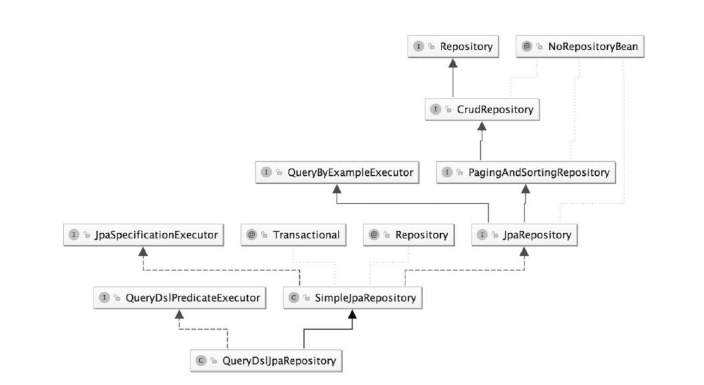

# Spring Data JPA

## 简介

Spring Data项目是从2010年发展起来的的，它提供了一致的、基于Spring的数据访问编程模型，同时仍然保留底层数据存储的特殊特性。它可以轻松地让开发者使用数据访问技术，包括关系数据库、非关系数据库（NoSQL）和基于云的数据服务。

Spring Data Common是Spring Data所有模块的公用部分，该项目提供跨Spring数据项目的共享基础设施。它包含了技术中立的库接口以及一个坚持java类的元数据模型。

Spring Data不仅对传统的数据库访问计数JDBC、Hibernate、JDO、TopLick、JPA、Mybatis做了很好的支持、扩展、抽象、提供方便的API，还对NoSQL等非关系数据库也做了很好的支持，包括MongoDB、Redis、Apache Solr等。

- **Spring Data操作的主要特性**

Spring Data项目旨在提供一种通用的编码模式。数据访问对象实现了对物理数据层的抽象，为编写查询方法提供了方便。通过对象映射，实现域对象和持久化存储之间的转换，而模板提供的是对底层存储实体的访问实现。

操作上主要有如下特征：
- 提供模板操作，如Spring Data Redis和Spring Data Riak
- 强大的Repository和定制的数据存储对象的抽象映射
- 对数据访问对象的支持（Auting等）

Spring Data JPA 是 Spring Data 的核心子项目之一。

Spring Data JPA 可以理解为JPA规范的再次封装抽象，底层还是使用了Hibernate的JPA技术实现，引用JPQL（Java Persistence Query Language）查询语言，属于Spring整个生态体系的一部分。

- **JPA**

JPA是Java Persistence API的简称，中文名为Java持久层API，是JDK 5.0 注解或XML描述对象-关系表的映射关系，并将运行期的实体对象持久化到数据库中。

Sun引入新的JPA ORM规范出于以下两个原因：
- 简化现有Java EE和Java SE应用开发工作
- Sun希望整合ORM技术

JPA包括以下3方面的内容：
1. 一套API标准。在`javax.persistence`的包下面，用来操作实体对象，执行CRUD操作，框架在后台替代我们完成所有的事情，开发者从烦琐的JDBC和SQL代码解脱出来；
2. 面向对象的查询语言：Java Persistence Query Language（JPQL）。这是持久化操作中很重要的一个方面，通过面向对象而非面向数据库的查询语言查询数据，便面程序的SQL语句紧密耦合
3. ORM（object/relational metadata）元数据的映射。JPA支持XML和JDK5.0注解两种元数据的形式，元数据描述对象和表之间的映射关系，框架据此将实体对象持久化到数据库表中。

JPA的宗旨是为POJO提供持久化标准规范。

- **Spring Data JPA的主要类及结构图**

七个Repository接口：
- `Repository` (`org.springframework.data.repository`)
- `CrudRepository` (`org.springframework.data.repository`)
- `PagingAndSortingRepository` (`org.springframework.data.repository`)
- `QueryByExampleExecutor` (`org.springframework.data.repository.query`)
- `JpaRepository` (`org.springframework.data.jpa.repository`)
- `JpaSpecificationExecutor` (`org.springframework.data.jpa.repository`)
- `QueryDslPredicateExecutor` (`org.springframework.data.querydsl`)

两个实现类：
- `SimpleJpaRepository` (`org.springframework.data.jpa.repository.support`)
- `QueryDslJpaRepository` (`org.springframework.data.jpa.repository.support`)

关系结构图下图所示：

真正的JPA的底层封装类：
- `EntityManager` (`javax.persistence`)
- `EntityManagerImpl` (`org.hibernate.jpa.internal`)

## Repository

Repository位于Spring Data Common的lib里面，是Spring Data里面做数据库操作的最底层的抽象接口、最顶级的父类，源码中无任何方法定义，仅仅起到一个标识作用。管理域类以及域类的id类型作为类型参数，此接口主要作为标记接口捕获要使用的类型，并查询到继承此接口的类（接口）。Spring底层做动态代理使用其子类或实现类的都代表储存库操作。 从