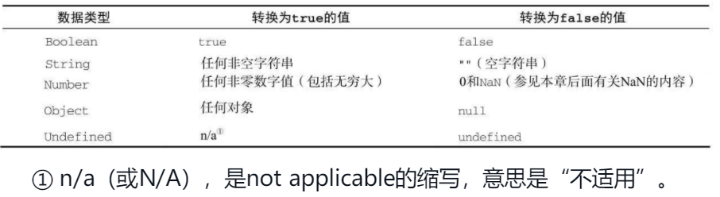

<!--
 * @Github       : https://github.com/superzhc/BigData-A-Question
 * @Author       : SUPERZHC
 * @CreateDate   : 2021-01-27 11:14:52
 * @LastEditTime : 2021-01-28 14:08:12
 * @Copyright 2021 SUPERZHC
-->
# JavaScript

一个完整的 JavaScript 实现应该由下列三个不同的部分组成：

- 核心（ECMAScript）
- 文档对象模型（DOM）
- 浏览器对象模型（BOM）

## 数据类型

ECMAScript 中有 5 种简单数据类型（也称为基本数据类型）：`undefined`、`null`、`boolean`、`number` 和 `string`。还有 1 种复杂数据类型——`object`，`object` 本质上是由一组无序的名值对组成的。ECMAScript 不支持任何创建自定义类型的机制，而所有值最终都将是上述 6 种数据类型之一。

### typeof 操作符

鉴于 ECMAScript 是松散类型的，因此需要有一种手段来检测给定变量的数据类型—— typeof 就是负责提供这方面信息的操作符。对一个值使用 typeof 操作符可能返回下列某个字符串：

- "undefined"——如果这个值未定义；
- "boolean"——如果这个值是布尔值；
- "string"——如果这个值是字符串；
- "number"——如果这个值是数值；
- "object"——如果这个值是对象或null；
- "function"——如果这个值是函数。

typeof 操作符的操作数可以是变量，也可以是数值字面量。注意，typeof 是一个操作符而不是函数，因此圆括号尽管可以使用，但不是必需的。

> 从技术角度讲，函数在 ECMAScript 中是对象，不是一种数据类型。然而，函数也确实有一些特殊的属性，因此通过 typeof 操作符来区分函数和其他对象是有必要的。

### Undefined 类型

Undefined 类型只有一个值，即特殊的 undefined。在使用 var 声明变量但未对其加以初始化时，这个变量的值就是 undefined。

### Null 类型

Null 类型是第二个只有一个值的数据类型，这个特殊的值是 null。从逻辑角度来看，null 值表示一个空对象指针。

### Boolean 类型

Boolean 类型是 ECMAScript 中使用得最多的一种类型，该类型只有两个字面值：true 和 false。

需要注意的是，Boolean 类型的字面值 true 和 false 是区分大小写的。也就是说，True 和 False（以及其他的混合大小写形式）都不是 Boolean 值，只是标识符。

虽然 Boolean 类型的字面值只有两个，但 ECMAScript 中所有类型的值都有与这两个 Boolean 值等价的值。要将一个值转换为其对应的 Boolean 值，可以调用转型函数 `Boolean()`。

可以对任何数据类型的值调用 `Boolean()` 函数，而且总会返回一个 Boolean 值。至于返回的这个值是 true 还是 false，取决于要转换值的数据类型及其实际值。下表给出了各种数据类型及其对应的转换规则。



这些转换规则在进行流控制语句（如if语句）自动执行相应的 Boolean 转换。

### Number 类型

Number 类型应该是 ECMAScript 中最令人关注的数据类型了，这种类型使用 IEEE754 格式来表示整数和浮点数值（浮点数值在某些语言中也被称为双精度数值）。为支持各种数值类型，ECMA-262 定义了不同的数值字面量格式。

#### NaN

NaN，即非数值（Not a Number）是一个特殊的数值，这个数值用于表示一个本来要返回数值的操作数未返回数值的情况（这样就不会抛出错误了）。例如，在其他编程语言中，任何数值除以非数值都会导致错误，从而停止代码执行。但在 ECMAScript 中，任何数值除以非数值会返回 NaN，因此不会影响其他代码的执行。

NaN 本身有两个非同寻常的特点。首先，任何涉及 NaN 的操作（例如 `NaN/10`）都会返回 NaN，这个特点在多步计算中有可能导致问题。其次，NaN 与任何值都不相等，包括 NaN 本身。

针对 NaN 的这两个特点，ECMAScript 定义了 `isNaN()` 函数。这个函数接受一个参数，该参数可以是任何类型，而函数会确定这个参数是否“不是数值”。

**示例**

```js
isNaN(NaN);// true
isNaN(10);//false(10是一个数值)
isNaN("10");//false(可以被转换成数值10)
isNaN("blue");//true(不能转换成数值)
isNaN(true);//false(可以被转换成数值1)
```

### String 类型

String 类型用于表示由零或多个 16 位 Unicode 字符组成的字符序列，即字符串。字符串可以由双引号（`"`）或单引号（`'`）表示。

### Object 类型

ECMAScript 中的对象其实就是一组数据和功能的集合。对象可以通过执行 new 操作符后跟要创建的对象类型的名称来创建。而创建 Object 类型的实例并为其添加属性和（或）方法，就可以创建自定义对象，如下所示：

```js
var o = new Object();
```

这个语法与 Java 中创建对象的语法相似；但在 ECMAScript 中，如果不给构造函数传递参数，则可以省略后面的那一对圆括号。也就是说，在像前面这个示例一样不传递参数的情况下，完全可以省略那对圆括号（但这不是推荐的做法）：

```js
var o = new Object;
```

在 ECMAScript 中，（就像 Java 中的 `java.lang.Object` 对象一样）Object 类型是所有它的实例的基础。换句话说，Object 类型所具有的任何属性和方法也同样存在于更具体的对象中。

Object 的每个实例都具有下列属性和方法：

- `constructor`：保存着用于创建当前对象的函数。对于前面的例子而言，构造函数（constructor）就是 `Object()`。
- `hasOwnProperty(propertyName)`：用于检查给定的属性在当前对象实例中（而不是在实例的原型中）是否存在。其中，作为参数的属性名（propertyName）必须以字符串形式指定（例如：`o.hasOwnProperty("name")`）。
- `isPrototypeOf(object)`：用于检查传入的对象是否是当前对象的原型。
- `propertyIsEnumerable(propertyName)`：用于检查给定的属性是否能够使用 `for-in` 语句来枚举。与 `hasOwnProperty()` 方法一样，作为参数的属性名必须以字符串形式指定。
- `toLocaleString()`：返回对象的字符串表示，该字符串与执行环境的地区对应。
- `toString()`：返回对象的字符串表示。
- `valueOf()`：返回对象的字符串、数值或布尔值表示。通常与 `toString()` 方法的返回值相同。

由于在 ECMAScript 中 Object 是所有对象的基础，因此所有对象都具有这些基本的属性和方法。

## 语句

### if 语句

**语法**

```js
if(condition) statement1 else statement2
```

其中的 condition（条件）可以是任意表达式；而且对这个表达式求值的结果不一定是布尔值。ECMAScript 会自动调用 `Boolean()` 转换函数将这个表达式的结果转换为一个布尔值。

多个条件的语法：

```js
if(condition1) statement1 else if (condition2) statement2 else statement3
```

### do-while 语句

**语法**

```js
do{
    statement
}while (condition)
```

### while 语句

```js
while (condition) {
    statement
}
```

### for 语句

```js
for (initalization;expression; post-loop-expression) {
    statement
}
```

### for-in 语句

for-in 语句是一种精准的迭代语句，可以用来枚举对象的属性。以下是 for-in 语句的语法：

```js
for(property in expression){
    statement
}
```

### label 语句

使用 label 语句可以在代码中添加标签，以便将来使用。以下是 label 语句的语法：

```js
label:statement
```

### break 和 continue 语句

break 和 continue 语句用于在循环中精确地控制代码的执行。其中，break 语句会立即退出循环，强制继续执行循环后面的语句。而 continue 语句虽然也是立即退出循环，但退出循环后会从循环的顶部继续执行。

### switch 语句

switch 语句与 if 语句的关系最为密切，而且也是在其他语言中普遍使用的一种流控制语句。ECMAScript 中 switch 语句的语法与其他基于 C 的语言非常接近，如下所示：

```js
switch(expression){
    case value:statement
        break;
    case value:statement
        break;
    case value:statement
        break;
    default:statement
}
```

## 函数

ECMAScript 中的函数使用 function 关键字来声明，后跟一组参数以及函数体。函数的基本语法如下所示：

```js
function functionName(arg0, arg1, ...,argN){
    statements
}
```

ECMAScript 中的函数在定义时不必指定是否返回值。实际上，任何函数在任何时候都可以通过 return 语句后跟要返回的值来实现返回值。

**参数**

ECMAScript 函数的参数与大多数其他语言中函数的参数有所不同。ECMAScript 函数不介意传递进来多少个参数，也不在乎传进来参数是什么数据类型。也就是说，即便你定义的函数只接收两个参数，在调用这个函数时也未必一定要传递两个参数。可以传递一个、三个甚至不传递参数，而解析器永远不会有什么怨言。之所以会这样，原因是ECMAScript 中的参数在内部是用一个数组来表示的。函数接收到的始终都是这个数组，而不关心数组中包含哪些参数（如果有参数的话）。如果这个数组中不包含任何元素，无所谓；如果包含多个元素，也没有问题。实际上，在函数体内可以通过 arguments 对象来访问这个参数数组，从而获取传递给函数的每一个参数。

## 引用类型

引用类型的值（对象）是引用类型的一个实例。在 ECMAScript 中，引用类型是一种数据结构，用于将数据和功能组织在一起。

### Object 类型

创建Object实例的方式有两种。第一种是使用 new 操作符后跟 Object 构造函数；另一种方式是使用对象字面量表示法。对象字面量是对象定义的一种简写形式，目的在于简化创建包含大量属性的对象的过程。

**示例**

```js
// 第一种方式
var person = new Object();
person.name = "zhangsan";
person.age = 29;

// 第二种方式
var person={
    name:"zhangsan",
    age:29
}
```

> 在使用对象字面量语法时，属性名也可以使用字符串。

一般来说，访问对象属性时使用的都是点表示法，这也是很多面向对象语言中通用的语法。不过，在 JavaScript 也可以使用方括号表示法来访问对象的属性。在使用方括号语法时，应该将要访问的属性以*字符串*的形式放在方括号中，如下所示：

```js
alert(person.name);
alert(person["name"])
```

### Array 类型

在 ECMAScript 中的数组与其他多数语言中的数组有着相当大的区别。虽然 ECMAScript 数组与其他语言中的数组都是数据的有序列表，但与其他语言不同的是，ECMAScript 数组的每一项可以保存任何类型的数据。也就是说，可以用数组的第一个位置来保存字符串，用第二位置来保存数值，用第三个位置来保存对象，以此类推。而且，ECMAScript 数组的大小是可以动态调整的，即可以随着数据的添加自动增长以容纳新增数据。

创建数组的基本方式有两种。第一种是使用Array构造函数；创建数组的第二种基本方式是使用数组字面量表示法。数组字面量由一对包含数组项的方括号表示，多个数组项之间以逗号隔开。

**示例**

```js
/* 第一种方式 */
var colors = new Array();
// 如果预先知道数组要保存的项目数量，也可以给构造函数传递该数量，而该数量会自动变成length属性的值。
var colors = new Array(5);
// 可以向Array构造函数传递数组中应该包含的项。
var colors = new Array("red","blue","green");
// 另外，在使用Array构造函数时也可以省略new操作符
var colors = Array(3);//创建一个包含 3 项的数组
var colors = Array("Greg");//常见一个包含 1 项，即字符串 Greg 的数组

/* 第二种方式 */
var colors = ["red","blue","green"];
var colors = [];
```

在读取和设置数组的值时，要使用方括号并提供相应值的基于 0 的数字索引。

### Function 类型

每个函数都是 Function 类型的实例，而且都与其他引用类型一样具有属性和方法。由于函数是对象，因此函数名实际上也是一个指向函数对象的指针，不会与某个函数绑定。

**函数内部属性**

在函数内部，有两个特殊的对象：arguments 和 this。


## 面向对象

### 构造函数

ECMAScript 中的构造函数可用来创建特定类型的对象。可以创建自定义的构造函数，从而定义自定义对象类型的属性和方法。

```js
function Person(name,age,job){
    this.name=name;
    this.age=age;
    this.job=job;
    this.sayName=fucntion(){
        alert(this.name);
    }
}

// 使用
var person=new Person("zhangsan",29,"Engineer");
```

按照惯例，构造函数始终都应该以一个大写字母开头，而非构造函数则应该以一个小写字母开头。这个做法借鉴自其他 OO 语言，主要是为了区别于 ECMAScript 中的其他函数；因为构造函数本身也是函数，只不过可以用来创建对象而已。

构造函数与其他函数的唯一区别，就在于调用它们的方式不同。不过，构造函数毕竟也是函数，不存在定义构造函数的特殊语法。任何函数，只要通过 new 操作符来调用，那它就可以作为构造函数；而任何函数，如果不通过 new 操作符来调用，那它跟普通函数也不会有什么两样。