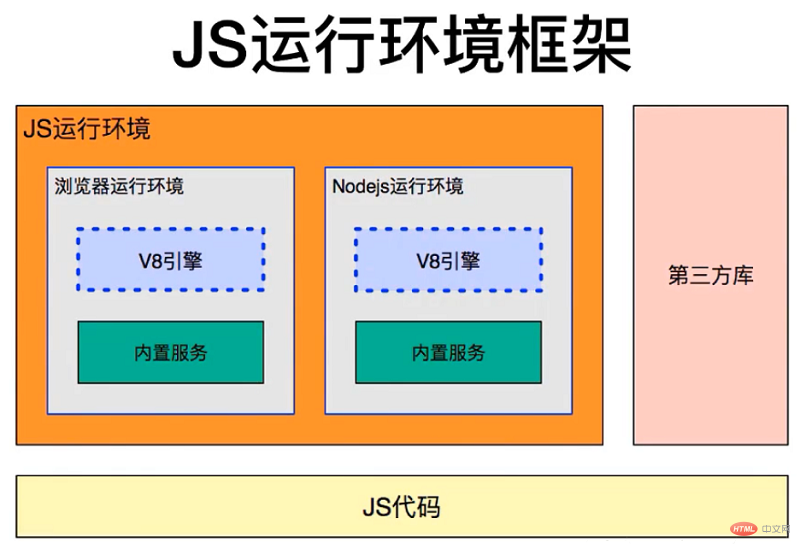
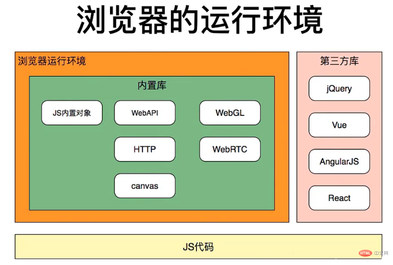
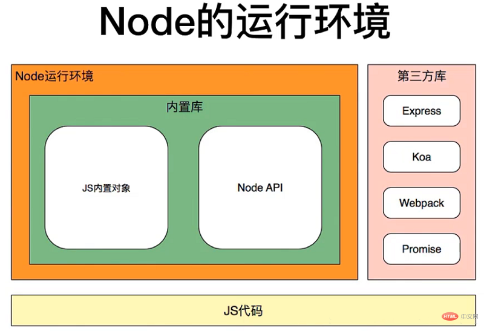

<!--
 * @Github       : https://github.com/superzhc/BigData-A-Question
 * @Author       : SUPERZHC
 * @CreateDate   : 2021-01-28 14:40:24
 * @LastEditTime : 2021-01-28 16:36:02
 * @Copyright 2021 SUPERZHC
-->
# JavaScript 运行环境

JavaScript 运行环境有两种，一个是浏览器运行环境，另一个则是 Node.js 运行环境。

浏览器环境下 JavaScript 主要由三部分组成，分别是 ECMAScript、DOM(文档对象模型) 和 BOM(浏览器对象模型)。

Node.js 中以 ECMAScript 为基础，扩展出了 I/O 操作、文件操作、数据库操作等。

V8 引擎：简单理解就是负责解析和执行代码

内置库：运行环境提供的服务

