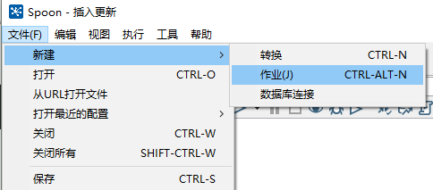
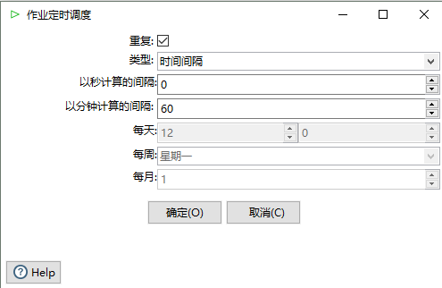
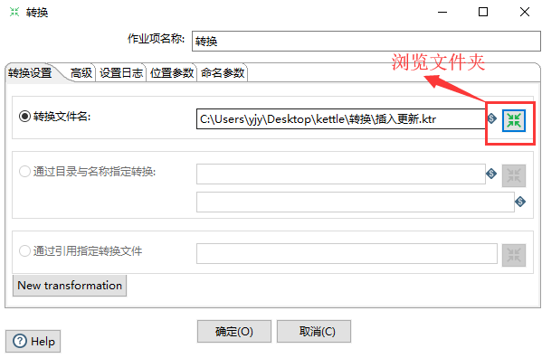
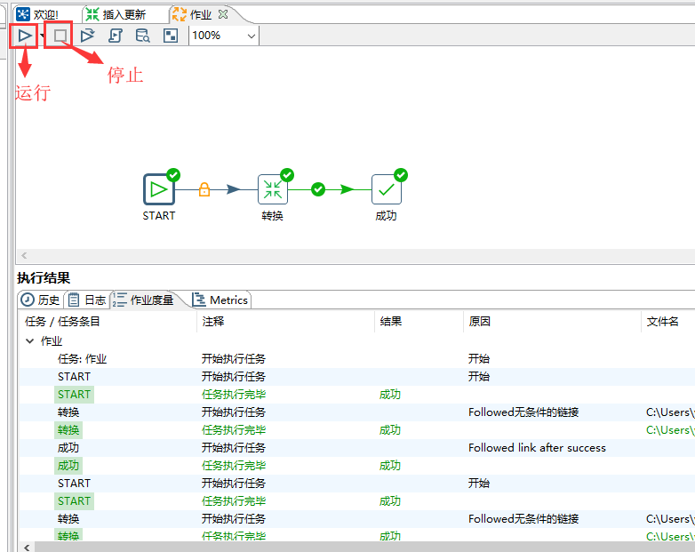

### 1、新建一个作业

### 2、从左侧依次拖动 START、转换、成功到右侧，并用线连接起来

### 3、双击 START，可以配置作业的运行间隔，这边配置了每小时运行一次

### 4、双击转换，选择之前新建的那个转换

### 5、点击运行，就能运行这次作业，点击停止就能停止。在下方执行结果，可以看到运行的日志

这样就完成了一个最简单的作业，每隔 1 小时，将源表的数据迁移到目标表