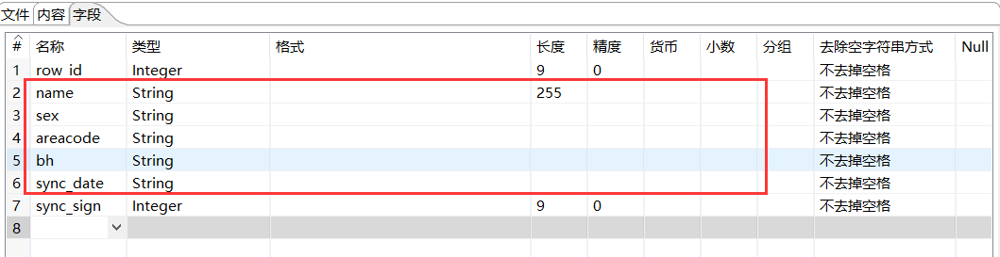
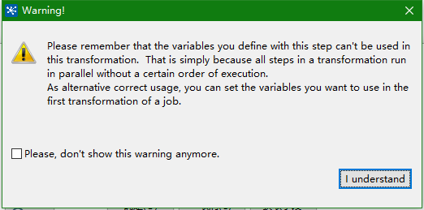

### Kettle大数据组件，输出字段是 `String` 类型，设置了长度，查看输出文件保存的数据有问题，见下图相关配置和现象

**原因分析**：

> 经查询源码 `TextFileOutput` 类的 `formatField()` 方法在处理字符串时调用 `convertStringToBinaryString` ，此类会根据输出字段中设置的长度来进行判定，分为两种情况：
>
> 1. 在字段长度不满足设置的长度后，会使用空格来填充字段来满足设置的长度
> 2. 在字段长度超过设置的长度后，会截断字段，只选取 `0-设置的长度`

**解决办法**：

> String类型的字段，不设置长度或将长度设置为 `-1`

### 在同一个转换中，设置的变量（使用步骤"设置变量"创建）在后续的步骤中无法获取到此变量

根据 Kettle 的自带提示可知，**在当前转换中设置的变量是不能用于当前转换的；如果你需要使用这个变量，可以使用作业在第一个转换中设置变量，后续转换可以使用**

