[TOC]

## 输出

### 插入更新

插入更新包括**插入**和**更新**两种情况，需要先设置一个条件，符合条件时，进行更新操作；否则，进行插入操作。常见的条件就是判断表中的 ID 和流（上一个步骤的结果，可以理解为内存）中的 ID 是否相等，相等则更新；不等则插入。

整体流程为：

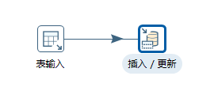

表输入的设置及预览：

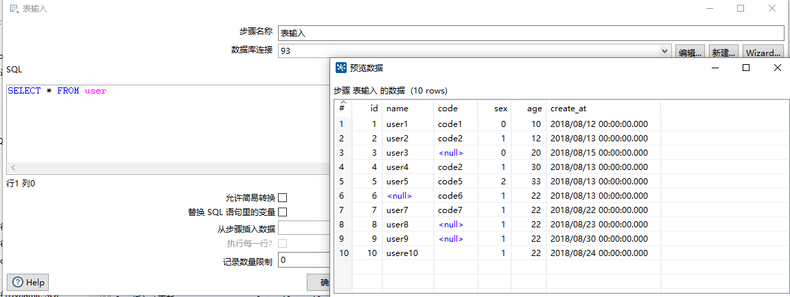

插入更新的设置：

运行结果（user_copy 表数据）：

运行后，user 表的数据被同步到 user_copy 表中，并且不管运行多少次，数据始终是那么多。

这就是插入更新的特点，ID 一样时，只会进行更新，不会再次插入。

### 表输出

表输出就是单纯地将数据输出到另一个表。

整体流程为：

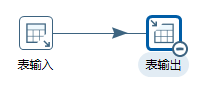

表输出的设置：

运行结果（user_copy 表数据）：

可以看到，运行结果和插入更新的一致；但是当第二次运行后，Kettle 就会报错，说主键已经存在。这就表示表输出只能输出一次，如果目标表中已经存在相应的主键，则不会进行更新，会报错。

如果修改下表输出的设置，指定输出的字段：

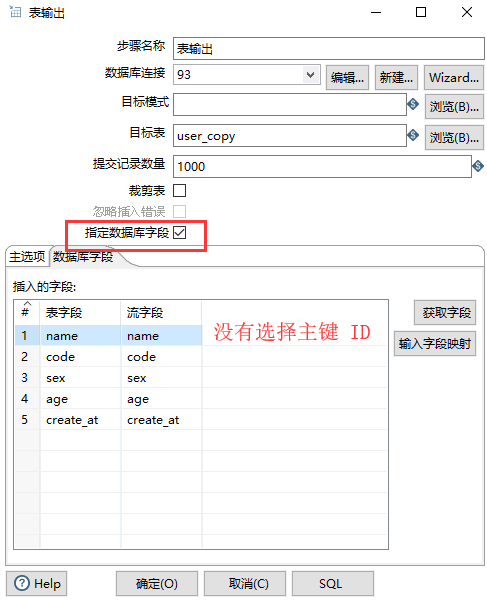

运行结果（user_copy 表数据）：

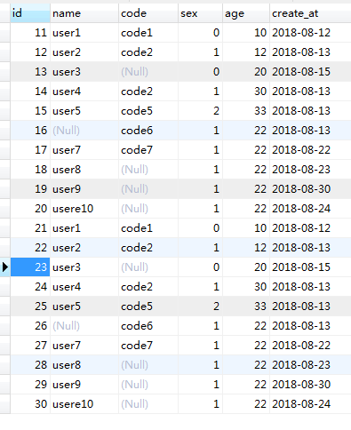

可以看到，运行后 ID 由数据库自动生成，并且可以运行多次不报错，数据库也会重复插入数据。

**因此表输出只是单纯的输出操作**。

### 执行 SQL 脚本

执行 SQL 脚本就是可以自定义一条 SQL 来执行。

整体流程为：

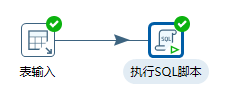

执行 SQL 脚本的设置：

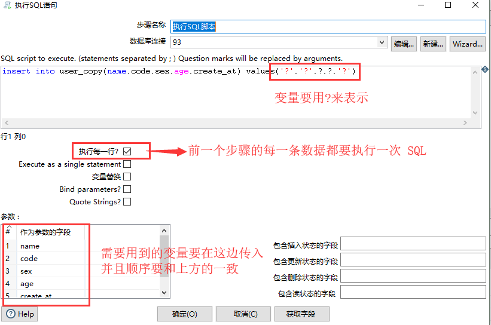

运行结果（user_copy 表数据）：

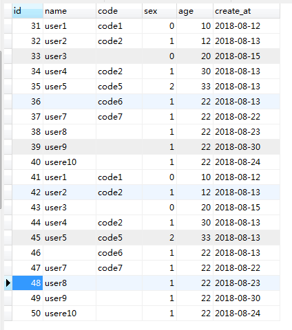

可以看到，每取出一条数据，就执行了一次 SQL，将数据插入目标表。运行多次后，就就会插入多次数据。

==执行 SQL 脚本比较灵活，可以用来处理较为复杂的 SQL==。

## 自定义 Java 代码

假设有这样一个需求，user 表中有 id , code , name 这三个字段。

> 如果 code 为空，我们就取 name 的值来代替；
>
> 如果 code 不为空，那么就在 code 后面拼接上 “123” 。

**流程步骤**：

1. 配置数据源，并且使用一个表输入

   

2. 在 Kettle 工具的左边找到 `Java 代码` 这个组件，拖动到右方，将其与表输入连接起来：

   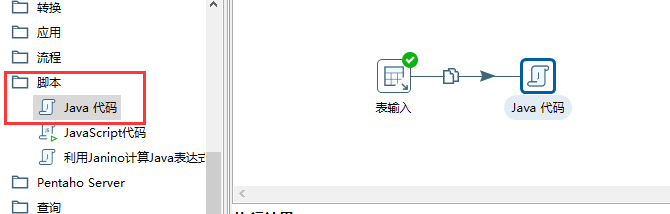

3. 双击 `Java 代码` 控件，在左侧找到 Main 方法并双击，可以看到右侧自动生成了原始代码：

   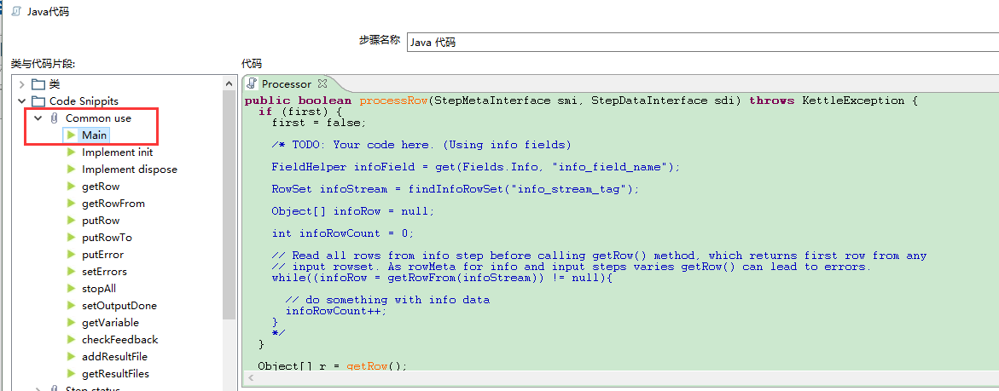

4. 在右侧代码编辑区域，写入自定义代码：

   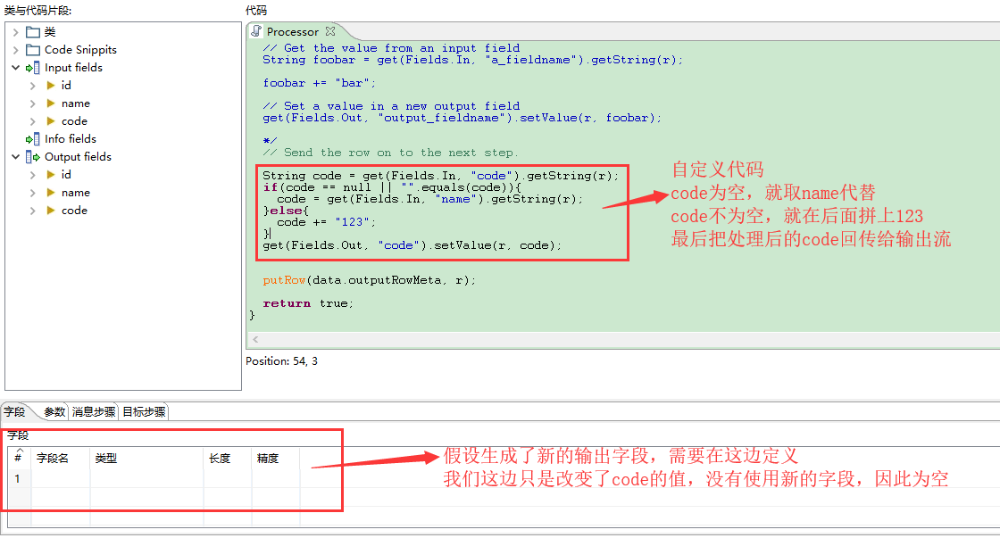

5. 运行一下，可以在下方调试区域看到处理前和处理后的值：

   

通过自定义代码，还能实现计数的功能，如下所示：

