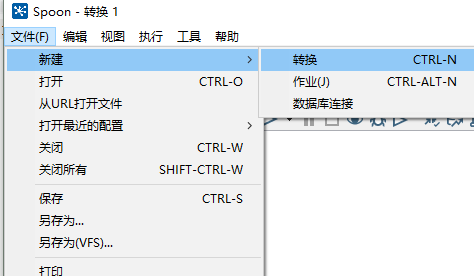
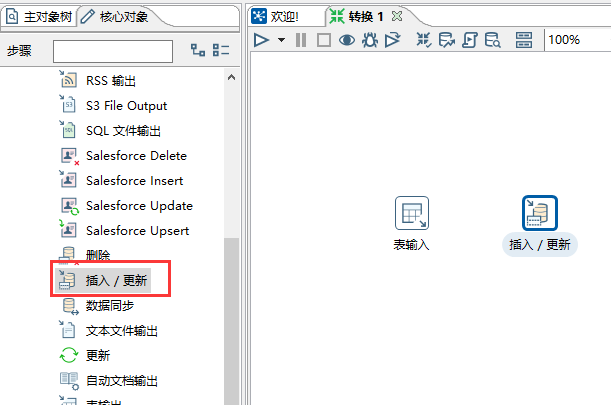
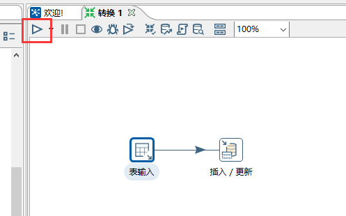
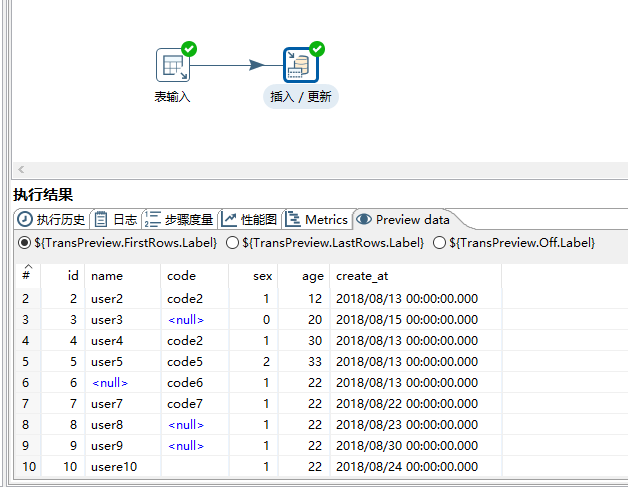

### 1、打开 Kettle，点击 文件 -> 新建 -> 转换

### 2、在左边 DB 连接处点击新建

### 3、根据提示配置数据库，配置完成后可以点击测试进行验证（这边以 MySQL 为例）

### 4、在左侧找到表输入（核心对象 ->  输入 -> 表输入），拖到右方

### 5、双击右侧表输入，进行配置，选择数据源，并输入 SQL。可以点击预览进行预览数据

### 6、在左侧找到插入/更新（核心对象 -> 输入 -> 插入/更新），拖到右方

### 7、按住 Shift 键，把表输入和插入/更新用线连接起来

### 8、双击插入/更新进行配置

### 9、点击运行，就可以运行这一个转换

### 10、运行结束后，我们可以在下方看到运行结果，其中有日志、数据预览等，我们可以看到一共读取了多少条数据，插入更新了多少数据等等

这样就完成了一个最简单的转换，从一个表取数据，插入更新到另一个表

