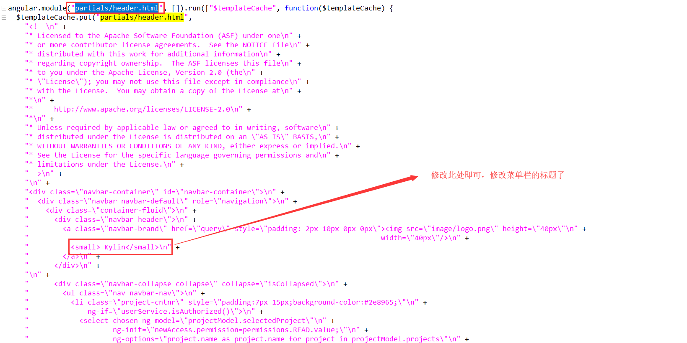

因项目不同，kylin的安装目录不同，此处统一设kylin的目录是 `KYLIN_HOME`，下面所有的kylin安装目录都是用 `KYLIN_HOME`

### 修改图标

进入 `${KYLIN_HOME}/tomcat/webapps/kylin/image`目录下，替换 `logo.png`即可替换图标

### 修改标题

进入 `${KYLIN_HOME}/tomcat/webapps/kylin/js`目录下，该目录下只有一个文件`script.min.xxxx.js`【xxx随版本变化，看前缀就ok了】，打开该文件，搜索`partials/header.html`,定位到如下图的位置，修改即可实现标题的修改。

### Tab标签标题图标修改

打开 `${KYLIN_HOME}/tomcat/webapps/kylin/index.html` 页面，修改`<head>`下的属性：

1. `<link rel="icon" href="image/favicon.ico" type="image/x-icon">`
2. `<link rel="shortcut icon" href="image/favicon.ico" type="image/x-icon">`
3. `<title>Kylin</title>`

