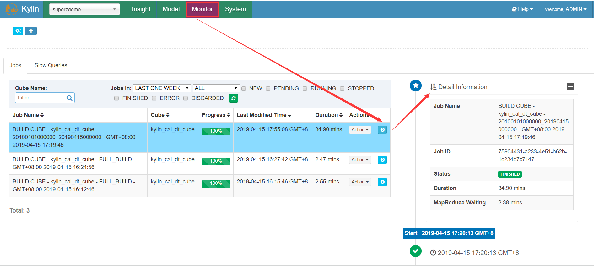
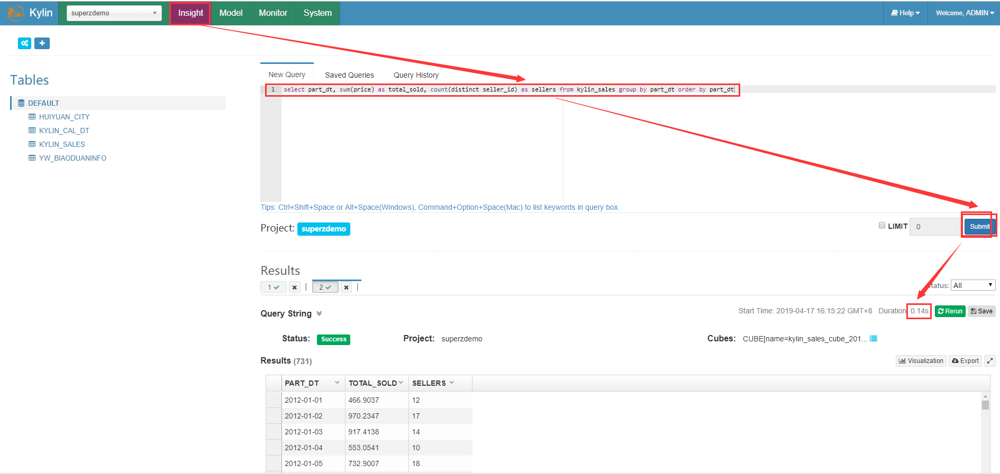
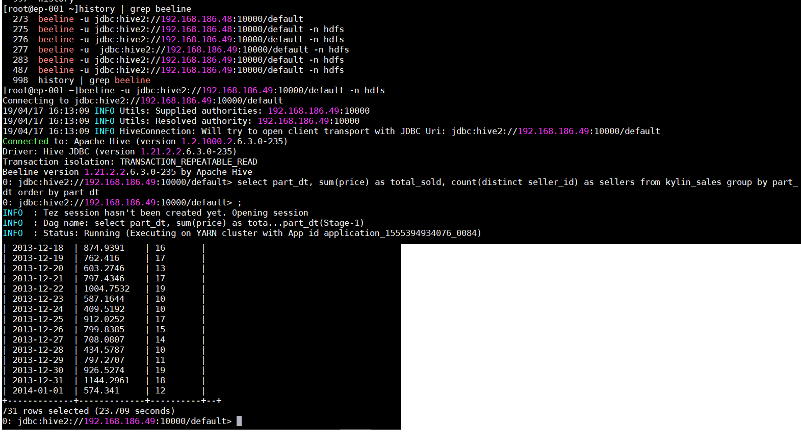

## Apache Kylin™ 概览

Apache Kylin™是一个开源的分布式分析引擎，提供Hadoop/Spark之上的**SQL查询**接口及多维分析（OLAP）能力以支持超大规模数据，最初由eBay Inc. 开发并贡献至开源社区。它能在亚秒内查询巨大的Hive表。

#### [数据仓库概念](../数据仓库/数据仓库.md)

#### [Kylin基本概念](../Kylin/Kylin基本概念.md)

#### [基本原理](../Kylin/原理与架构.md)

核心思想：

> **预计算**，即对多维分析可能用到的度量进行预计算，将计算好的结果保存成**Cube**，供查询时直接访问。

把高复杂度的聚合运算、多表连接等操作转换成对预算结果的查询，这决定了Kylin能够拥有很好的快速查询和高并发能力。

## 安装

[Kylin 安装配置参数详解](../Kylin/Kylin安装配置参数详解.md)

## 使用

### Cube 构建

#### 一、新建项目

#### 二、[同步 Hive 表](../Kylin/加载Hive表.md)

#### 三、[新建 Data Model](../Kylin/新建Model.md)

#### 四、[新建 Cube](../Kylin/新建Cube.md)

#### 五、[构建 Cube](../Kylin/构建Cube.md)

### Job监控

在 `Monitor` 页面，点击job详情按钮查看显示于右侧的详细信息。

job 详细信息为跟踪一个 job 提供了它的每一步记录。你可以将光标停放在一个步骤状态图标上查看基本状态和信息。见[详细流程分析](./构建Cube流程分析.md)

### 查询

- **使用 Kylin 进行查询**

  

- **直接使用 Hive 进行查询数据**

  

查询时间上有对比

## SQL语法

Apache Kylin 使用 Apache Calcite 做 SQL 解析和优化。作为一款 OLAP 引擎, Kylin 支持 `SELECT` 操作，而不支持其它操作例如 `INSERT`，`UPDATE` 和 `DELETE`，因此 Kylin 的 SQL 语法是 Apache Calcite 支持语法的一个子集。

## JDBC 驱动

## 其他

[优化Cube](../Kylin/优化Cube.md)

[Kylin Web UI 样式微调](../Kylin/Kylin样式.md)