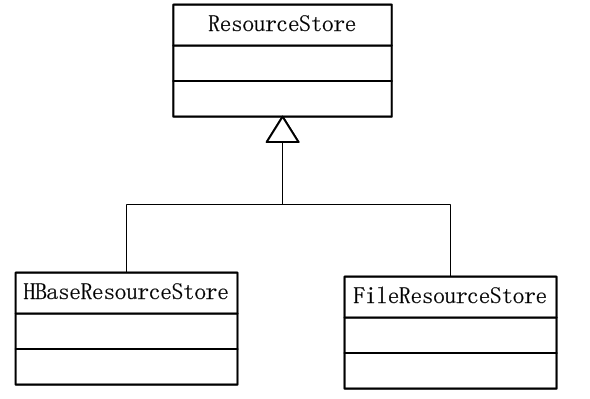
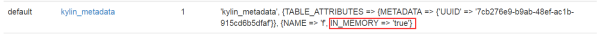

### 元数据的存储

**Apache kylin 的元数据包括如下**：

- 立方体描述（cube description）
- 立方体实例（cube instances）
- 项目（project）
- 作业（job）
- 表（table）
- 字典（dictionary）

**元数据存储的类图**：



由图可见 Kylin 提供了两种方式存储元数据，一般而言，集群模式的元数据都选择存储在**HBase**中。

在`${KYLIN_HOME}/conf/kylin.properties`配置文件中，元数据的默认配置如下：

```sh
kylin.metadata.url=kylin_metadata@hbase 
```

`kylin_metadata@hbase`表示元数据存储在 HBase 中的 **`kylin_metadata`** 表中。

如若存储 kylin 元数据在本地文件系统中，需将 `kylin.metadata.url` 指向本地文件系统的一个**绝对路径**,如：可在 `${KYLIN_HOME}/conf/kylin.properties` 中配置如下:

```sh
kylin.metadata.url=/home/${username}/${kylin_home}/kylin_metada
```

> 注意：一定要是**绝对路径**，否则会报错

当选择元数据存储在 HBase 中时，并非所有的数据都在 HBase 中，当待存储的记录通常是key-value pairs）的value大于一个最大值**kvSizeLimit**时，数据将被保存在HDFS中，默认路径为：`/kylin/kylin_metadata/` ，相关配置项在 `${KYLIN_HOME}/conf/kylin.properties` 中，如下：

> kylin.hdfs.working.dir=/kylin
> kylin.metadata.url=kylin_metadata@hbase

HBaseResourceStore#buildPut的参考代码如下：

```java
private Put buildPut(String resPath, long ts, byte[] row, byte[] content, HTableInterface table) throws IOException {
    int kvSizeLimit = this.kylinConfig.getHBaseKeyValueSize();
    if (content.length > kvSizeLimit) {
        writeLargeCellToHdfs(resPath, content, table);
        content = BytesUtil.EMPTY_BYTE_ARRAY;
    }

    Put put = new Put(row);
    put.add(B_FAMILY, B_COLUMN, content);
    put.add(B_FAMILY, B_COLUMN_TS, Bytes.toBytes(ts));

    return put;
}
```

kvSizeLimit 的获取代码如下：

```java
public int getHBaseKeyValueSize() {
    return Integer.parseInt(this.getOptional("kylin.hbase.client.keyvalue.maxsize", "10485760"));
}
```

默认值为10M，可在在 `${KYLIN_HOME}/conf/kylin.properties` 中配置：

> kylin.hbase.client.keyvalue.maxsize=10485760

注意，该值的大小十分重要，因为kylin为了提高整体性能将hbase中的元数据缓存在hbase内存中，如下图：



随着每天 cube 的增量 build，该表会越来越大。假如不及时清理历史数据，将会使 hbase 的进程发生 OutOfMemoryError错误！这里 kvSizeLimit 需在性能和内存大小之间做一个权衡。

### Apache kylin元数据的运维

当前kylin的元数据只提供了冷备份的方式。

可利用crontab 在 `${KYLIN_HOME}` 下，每天定时执行 `./bin/metastore.sh backup` 命令，kylin会将元数据信息保存如下目录：

> ${KYLIN_HOME}/meta_backups/meta_year_month_day_hour_minute_second

当kylin元数据损坏或不一致，可采用如下命令恢复：

> 1. cd ${KYLIN_HOME}
> 2. sh ./bin/metastore.sh reset
> 3. sh ./bin/metastore.sh restore ./meta_backups/meta_xxxx_xx_xx_xx_xx_xx

### FAQ

#### 元数据存在数据未清理干净的情况

> 进入 HBase Shell，查询表 kylin_metadata 表查询未清理干净的数据，删除数据
>
> 如：
>
> ```sh
> get 'kylin_metadata','/model_desc/YW_BiaoDuaninfo_YiChang_Model.json'
> deleteall 'kylin_metadata','/model_desc/YW_BiaoDuaninfo_YiChang_Model.json'
> ```


