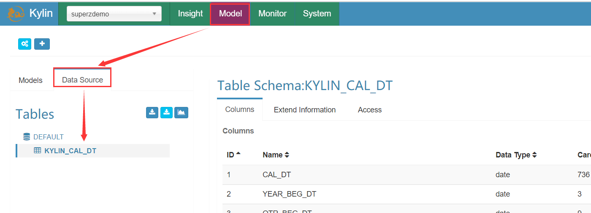
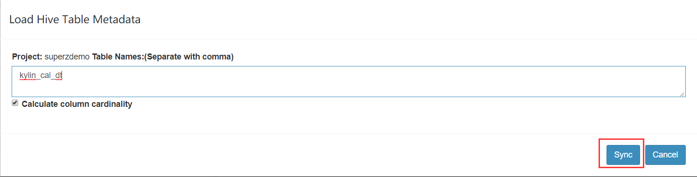
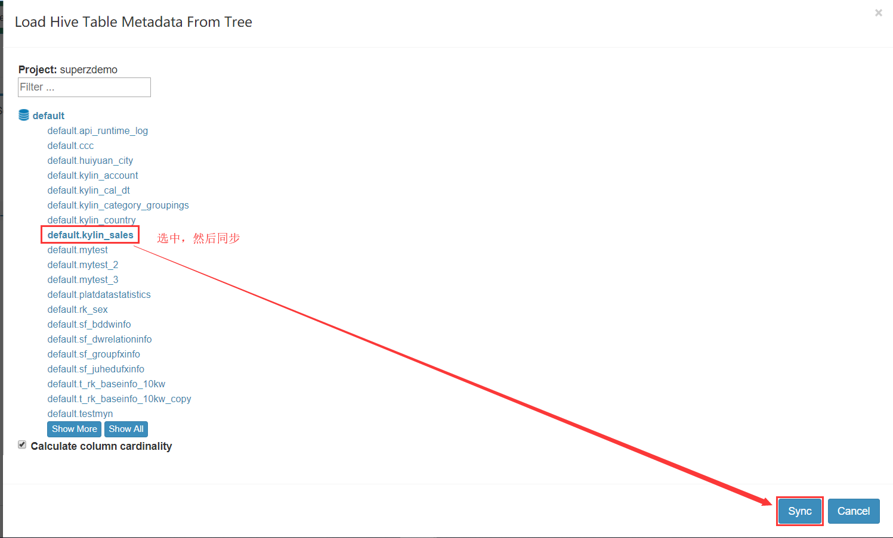
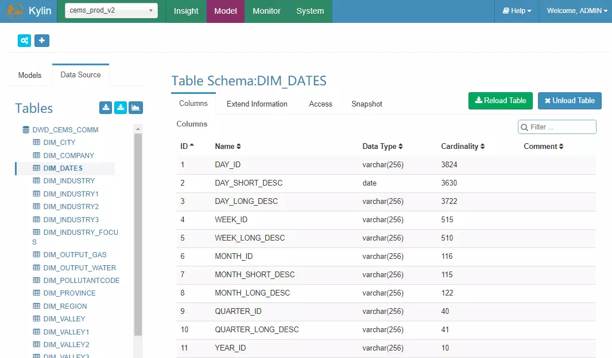

## 从 Hive 中加载表

从 Hive 中导入表定义的具体步骤如下：

1. 登录系统：`http://ip:7070/kylin`；

2. 主界面顶端左侧网站 Logo 下点击加号 “**＋**” 以新建项目；

3. 在弹出的窗口中，输入**项目名称**（必选）和项目描述, 点击“确定”按钮，完成项目创建；

4. 在网站 Logo 的右侧的下拉框中选择创建的项目，点击 “Model” 菜单；

5. 点击“Data Source”选项卡，在 Tables 后面有三个按钮，第一个深蓝色按钮表示根据表名从 Hive 中导入表；第二个浅蓝色按钮点击后可以以可视化的方式从 Hive 选择需要导入的表；

   
   
6. 同步Hive表数据，操作的几种方式：

   1. 点击深蓝色按钮，填写表名从 Hive 中导入表，填写完成后点击 Sync 按钮完成导入

      

   2. 点击浅蓝色按钮，以可视化的方式从 Hive 中选择需要导入的表，选择完毕后点击右下角的“Sync”按钮即可完成 Hive 表的导入。

      

> 导入表定义的界面有一个选择框 **Calculate column cardinality**，勾选后系统会计算 Hive 表每一列的基数，基数是指数据集中出现的不同值的个数，例如“国家”是一个维度，如果有 200 个不同的值，那么此维度的基数就是 200。

