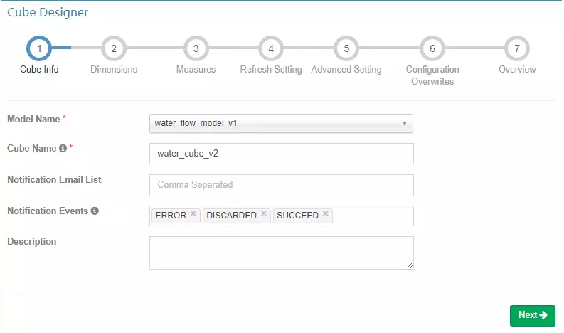
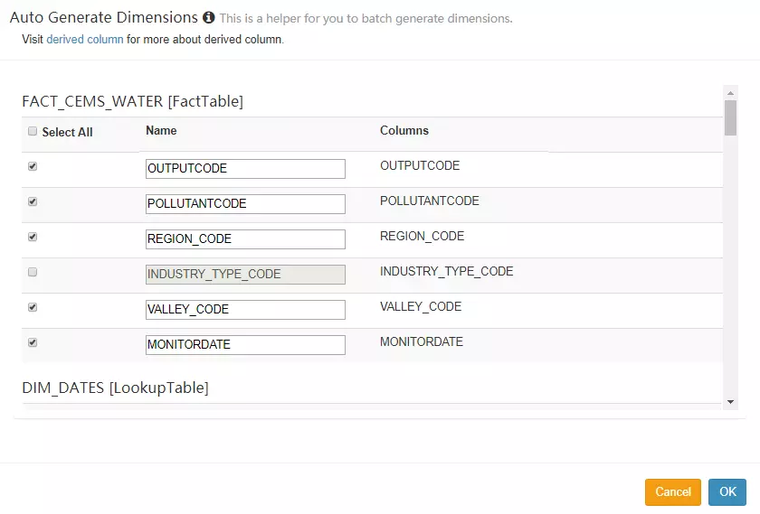
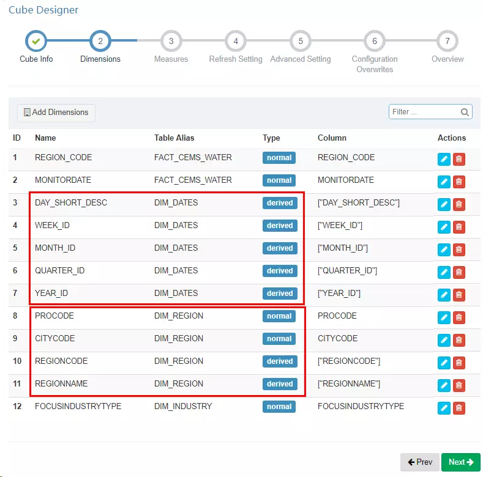
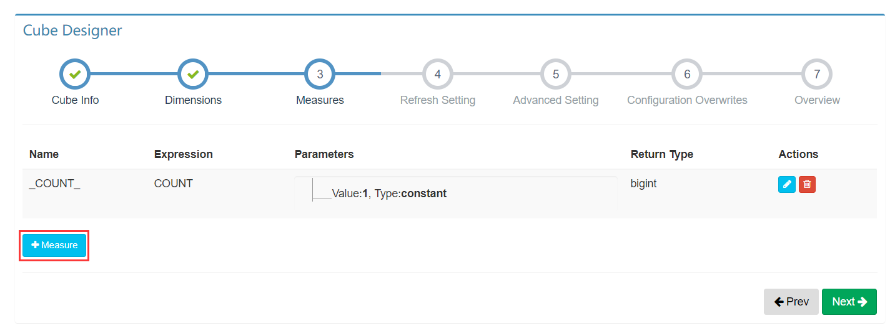
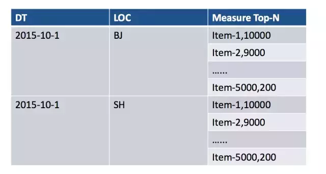
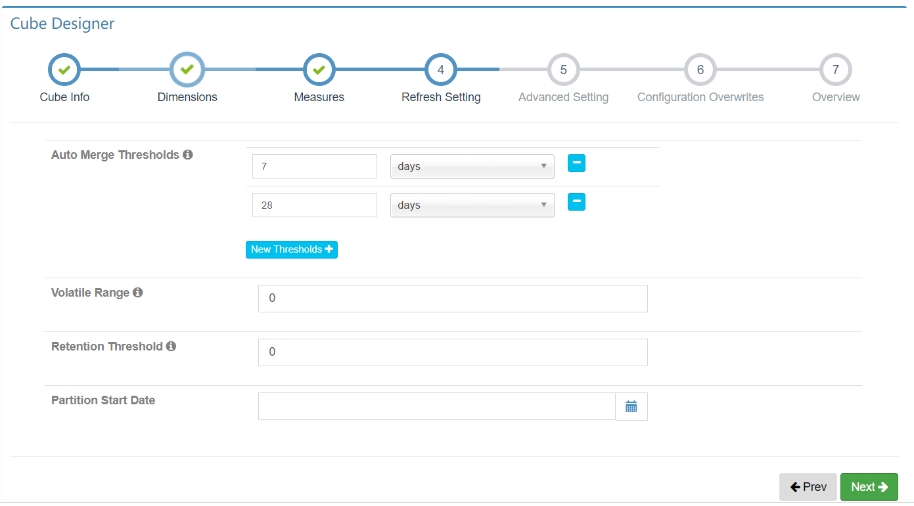
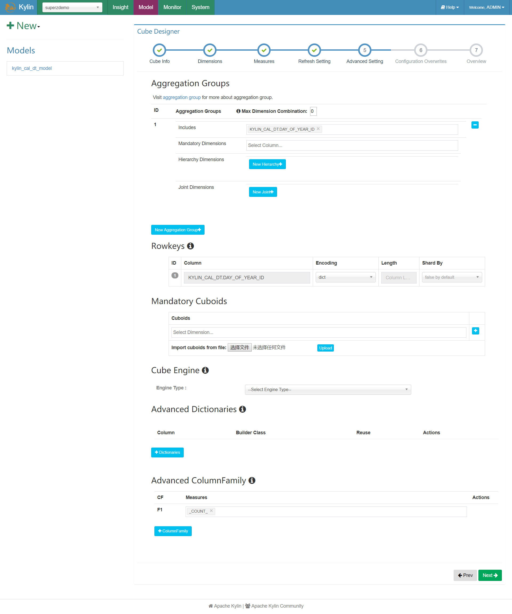
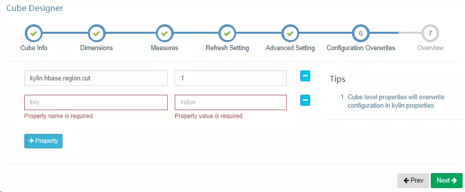
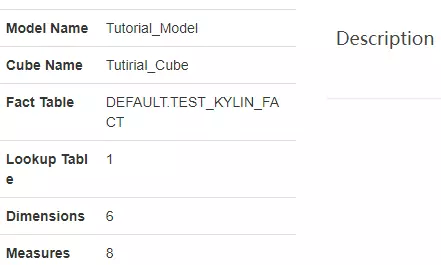
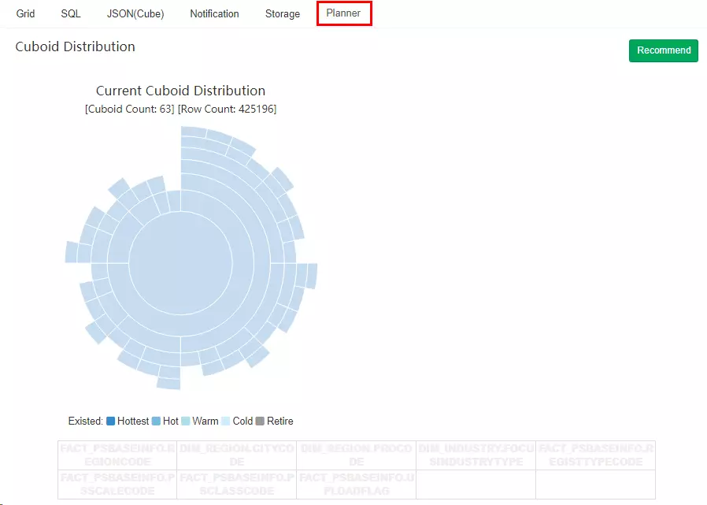

## 一、Cube Info

Cube Info 界面主要填写 Cube 的一些基本信息，首先要选择一个数据模型，然后填写 Cube 名称，Cube 名称全局唯一不能重复；Cube 信息填写完成后点击 “Next” 进入下一步。

## 二、Dimensions

Dimensions 是维度选择界面，从数据模型的维度中选择一些列作为 Cube 的维度，这个算是 Cube 构建过程中第一个比较重要的环节，这里的设置会影响到生成的 Cuboid 数量，进而影响 Cube 的数据量大小。

在选择维度时，每一个维度列可以作为普通维度（Normal），也可以作为衍生维度（Derived）。相对于普通维度来说，**衍生维度并不参与维度的 Cuboid**，衍生维度对应的外键（FK）参与维度 Cuboid，从而降低 Cuboid 数。在查询时，对衍生维度的查询会首先转换为对外键所在维度的查询，因此会牺牲少量性能（大部分情况下可以接受）。

### 1、维度选择的建议：

1. 作为 Cube 的维度需要满足下面的条件：可能存在于 **where** 条件中或者 **groupBy** 中的维度；
2. 事实表（Fact Table）只选择参与查询的字段，**不参与查询的一定不要勾选（即便是外键）**；
3. 维度表（Lookup Table）中的主键与事实表的外键一一对应，推荐勾选事实表的外键，维度表的主键勾选后选择为衍生（Derived）维度；
4. 对于星型模型而言，维度表的字段往往可以全部为衍生字段；
5. 对于雪花模型而言，如果维度表存在子表，则维度表对于子表的外键推荐作为普通（Normal）维度。

### 2、特别注意的事项：

1. 表连接的字段并非一定要参与 Cuboid 计算；
2. 表连接的字段如果**没有被勾选，且其外键表中没有任何字段作为衍生维度**，则该表连接字段是不会参与 Cuboid 的；
3. 一旦被设置为 Normal 类型，则一定会参与 Cuboid 计算；
4. 如果维度表存在层级（例如省市县、日月年等），则推荐分层级的相关字段选择为普通（Normal）维度。

## 三、Measures

维度选择完成后，需要选择度量聚合的方式，比较常规的聚合方式有：COUNT、SUM、MIN、MAX、PERCENTILE，下面将详细介绍其他几种聚合方式。

### 1、TOP_N

Top-N 度量，旨在在 Cube 构建的时候预计算好需要的 Top-N；在查询阶段，就可以迅速的获取并返回 Top-N 记录，这样查询性能就远远高于没有 Top-N 预计算结果的 Cube。

#### 1.1、Top-N 中 Group By 的该如何选择？

例如：全国二氧化碳污染物总和的省份排名，结果是省份排名，需要测量的是污染物的总和，因此 Group By 需要设置为 污染物类型。

#### 1.2、Return Type 中的 Top N 是什么意思？

TOP N 表示最终获取的前 N 名的排序是比较准确的，例如 TOP 10 表示最终的前 10 名是比较准确的（维度的基数非常大时存在误差），但是不代表只能取前 10 个（Limit 10），可以使用其他数字，例如 Limit 500，只是返回更多内容时，精准度没有保证。

#### 1.3、TOP-N 的存储

使用 TOP-N 时，排序度量字段和 Group By 字段会组合在一起，形成一个字段进行存储，用户需要 Top 100 的结果，Kylin 对于每种组合条件值，保留 Top 5000 （50倍）的纪录, 并供以后再次合并。

### 2、Count_Distinct

Count_Distinct 度量有两个实现：

1. 近似实现：基于 HyperLogLog 算法，可选择接受的错误率（从9.75% 到 1.22%），低错误率需要更多存储；
2. 精确实现：基于 Bitmap（位图）算法，对于数据型为 tinyint、smallint 和 int 的数据，将把数据对应的值直接打入位图；对于数据型为 long，string 和其他的数 据，将它们编码成字符串放入字典，然后再将对应的值打入位图。返回的度量结果是已经序列化的位图数据，而不仅是计算的值。这确保了不同的 segment 中，甚至跨越不同的 segment 来上卷，结果也是正确的。

> 越精确消耗的存储空间越大，大多数场景下 HyperLogLog 的近似实现即可满足需求。

### 3、EXTEND_COLUMN

在分析场景中，经常存在对某个 id 进行过滤，但查询结果要展示为 name 的情况，比如`user_id`和`user_name`。这类问题通常有三种解决方式：

1. 将 id 和 name 都设置为维度，查询语句类似`select name, count(*) from table where id = 1 group by id,name`，这种方式的问题是会导致维度增多，导致预计算结果膨胀；
2. 将 id 和 name 都设置为维度，并且将两者设置为联合维度（Joint Dimensions），这种方式的好处是保持维度组合数不会增加，但限制了维度的其它优化，比如 id 不能再被设置为强制维度或者层次维度；
3. 将 id 设置为维度，name 设置为特殊的 Measure，类型为 Extended Column，这种方式既能保证过滤 id 且查询 name 的需求，同时也不影响 id 维度的进一步优化。

## 四、Refresh Setting

- 触发自动合并的时间阈值(Auto Merge Thresholds)：自动合并小的 segments 到中等甚至更大的 segment，如果不想自动合并，删除默认 2 个选项；
- Volatile Range: 默认为 0，‘Auto Merge’ 会自动合并所有可能的 cube segments；设置具体的数值后，‘Auto Merge’ 将不会合并最近 `Volatile Range` 天的 cube segments；假设 Volatile Range 设置为 7，则最近 7 天内生成的 cube segments 不会被自动合并；
- 保留时间阈值（Retention Threshold）：对于时间久远的不需要再被查询的 Segment，Kylin 通过设置保留时间阈值可以自动清除这些 Segment，以节省磁盘空间；每当构建新的 Segment 时，Kylin 会自动检查老的 Segment，当这些 Segment 的结束日期与当前最新 Segment 的结束日期的差值大于保留时间阈值，则会被清除；如果无需自动清理，可以默认设置保留时间阈值为 0。
- 分区起始时间（Partition Start Date）：Cube 构建的起始时间，`1970-01-01 08:00:00` 默认为分区起始时间。

## 五、Advanced Setting

高级设置主要用于 Cuboid 的剪枝优化，通过聚合组（Aggregation Group）、必要维度（Mandatory Dimension）、层级维度（Hierarchy Dimension）、联合维度（Joint Dimension）等方式，可以使得 Cuboid 的组合在预期范围内。

### 1、聚合组（Aggregation Group）

根据查询的维度组合，可以划分出维度组合大类，这些大类在 Kylin 里面被称为聚合组。例如查询需求为：污染物排放量在特定的时间范围内，各个区域（省、市、区县三个级别）的排名以及各个流域（一、二、三级流域）的排名。

上述的查询需求就可以氛围两个聚合组：

1. 根据区域维度、时间维度查询污染物排放量；
2. 根据流域维度、时间维度查询污染物排放量。

> 如果只使用一个聚合组，区域维度和流域维度就很产生很多组合的 Cuboid，然而这些组合对查询毫无用处，此时就可以使用两个聚合组把区域和流域分开，这样便可以大大减少无用的组合。

### 2、必要维度（Mandatory Dimension）

Mandatory 维度指的是那些**总是会出现 在Where 条件或 Group By 语句里的维度**。

当然必须存在不一定是显式出现在查询语句中，例如查询日期是必要字段，月份、季度、年属于它的衍生字段，那么查询的时候出现月份、季度、年这些衍生字段等效于出现查询日期这个必要字段。

### 3、层级维度 （Hierachy Dimension）

Hierarchy 是一组有层级关系的维度，例如：国家->省->市，这里的“国家”是高级别的维度，“省”“市”依次是低级别的维度；用户会按高级别维度进行查询，也会按低级别维度进行查询，但**在查询低级别维度时，往往都会带上高级别维度的条件**，而不会孤立地审视低级别维度的数据。也就是说，用户对于这三个维度的查询可以归类为以下三类:

1. group by country
2. group by country, province（等同于group by province）
3. group by country, province, city（等同于group by country, city 或者group by city）

### 4、联合维度（Joint Dimension）

有些维度往往一起出现，或者它们的基数非常接近（有1:1映射关系），例如 “user_id” 和 “email”。把多个维度定义为组合关系后，所有不符合此关系的 cuboids 会被跳过计算。

就 `Joint Dimension (A, B)` 来说，在 group by 时 **A, B 最好同时出现**，这样不损失性能。但如果只出现 A 或者 B，那么就需要在查询时从 `group by A,B` 的结果做进一步聚合运算，会降低查询的速度。

### 5、Rowkeys

#### 5.1、编码

Kylin 以 Key-Value 的方式将 Cube 存储到 HBase 中，HBase 的 key，也就是 Rowkey，是**由各维度的值拼接而成**的；为了更高效地存储这些值，Kylin 会对它们进行编码和压缩；每个维度均可以选择合适的编码（Encoding）方式，默认采用的是字典（Dictionary）编码技术；字段支持的基本编码类型如下：

- `dict`：适用于大部分字段，默认推荐使用，但在**超高基情况下，可能引起内存不足**的问题；
- `boolean`：适用于字段值为`true, false, TRUE, FALSE, True, False, t, f, T, F, yes, no, YES, NO, Yes, No, y, n, Y, N, 1, 0`；
- `integer`：适用于字段值为**整数字符**，支持的整数区间为`[ -2^(8N-1), 2^(8N-1)]`；
- `date`：适用于字段值为**日期字符**，支持的格式包括`yyyyMMdd、yyyy-MM-dd、yyyy-MM-dd HH:mm:ss、yyyy-MM-dd HH:mm:ss.SSS`，其中如果包含时间戳部分会被截断；
- `time`：适用于字段值为**时间戳字符**，支持范围为`[ 1970-01-01 00:00:00, 2038/01/19 03:14:07]`，毫秒部分会被忽略，time编码适用于 time, datetime, timestamp 等类型；
- `fix_length`：**适用于超高基场景**，将选取字段的前 N 个字节作为编码值，当 N 小于字段长度，会造成字段截断，当 N 较大时，造成 RowKey 过长，查询性能下降，只适用于 varchar 或 nvarchar 类型；
- `fixed_length_hex`：适用于字段值为十六进制字符，比如 1A2BFF 或者 FF00FF，每两个字符需要一个字节，只适用于 varchar 或 nvarchar 类型。

#### 5.2、顺序

各维度在 Rowkeys 中的顺序，对于查询的性能会产生较明显的影响；在这里用户可以根据查询的模式和习惯，**通过拖曳的方式**调整各个维度在Rowkeys上的顺序。推荐的顺序为：Mandatory 维度、where 过滤条件中出现频率较多的维度、高基数维度、低基数维度。这样做的好处是，充分利用过滤条件来缩小在 HBase 中扫描的范围，从而提高查询的效率。

#### 5.3、分片

指定 ShardBy 的列，明细数据将按照该列的值分片；没有指定 ShardBy 的列，则默认将根据所有列中的数据进行分片；选择适当的 ShardBy 列，可以使明细数据较为均匀的分散在多个数据片上，提高并行性，进而获得更理想的查询效率；**建议选择基数较大的列作为 ShardBy 列，以避免数据分散不均匀**。

### 6、其他设置

- `Mandatory Cuboids`: 维度组合白名单，指定需要构建的 cuboid 的维度的组合；
- `Cube Engine`: Cube 构建引擎，有两种：MapReduce 和 Spark；如果你的 Cube 只有简单度量（SUM, MIN, MAX)，建议使用 Spark；如果 Cube 中有复杂类型度量（COUNT DISTINCT, TOP_N），建议使用 MapReduce；
- `Global Dictionary`：用于精确计算 COUNT DISTINCT 的字典, 它会将一个非 integer 的值转成 integer，以便于 bitmap 进行去重；如果你要计算 COUNT DISTINCT 的列本身已经是 integer 类型，那么不需要定义 Global Dictionary； Global Dictionary 会被所有 segment 共享，因此支持在跨 segments 之间做上卷去重操作。
- `Segment Dictionary`：另一个用于精确计算 COUNT DISTINCT 的字典，与 Global Dictionary 不同的是，它是基于一个 segment 的值构建的，因此不支持跨 segments 的汇总计算。如果你的 cube 不是分区的或者能保证你的所有 SQL 按照 partition_column 进行 group by, 那么你应该使用 “Segment Dictionary” 而不是 “Global Dictionary”，这样可以避免单个字典过大的问题。
- `Advanced Snapshot Table`: 为全局 lookup 表而设计，提供不同的存储类型；
- `Advanced ColumnFamily`: 如果有**超过一个的 COUNT DISTINCT 或 TopN 度量**, 你可以将它们放在更多列簇中，以优化与HBase 的I/O。

## 六、Configuration Overwrites

Kylin 使用了很多配置参数以提高灵活性，用户可以根据具体的环境、场景等配置不同的参数进行调优；Kylin 全局的参数值可在 `conf/kylin.properties` 文件中进行配置；如果 Cube 需要覆盖全局设置的话，则需要在此页面中指定，这些配置项将覆盖项目级别和配置文件中的默认值。

## 七、Overview

你可以概览你的 cube 并返回之前的步骤进行修改，点击 `Save` 按钮完成 cube 创建。

## 八、Planner

如果你开启了 Cube Planner，当 Cube 保存后可以到 Planner 标签页查看 Cuboid 的个数以及各个维度的组合情况，这能够很直观的帮助你了解你的维度组合情况，如果与预想的有出入可以随时对 Cube 进行调整。

