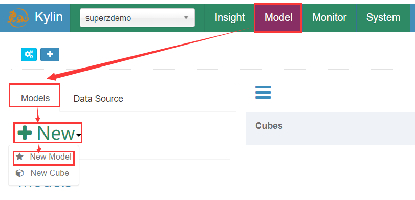
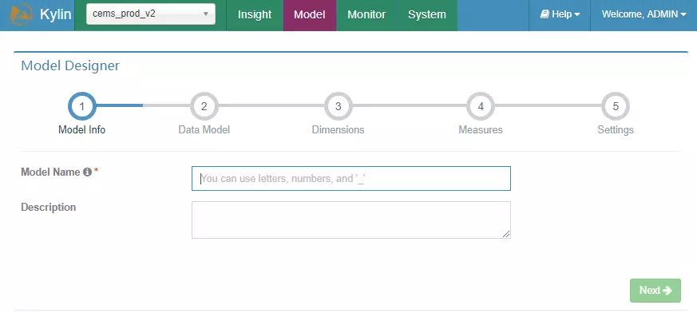
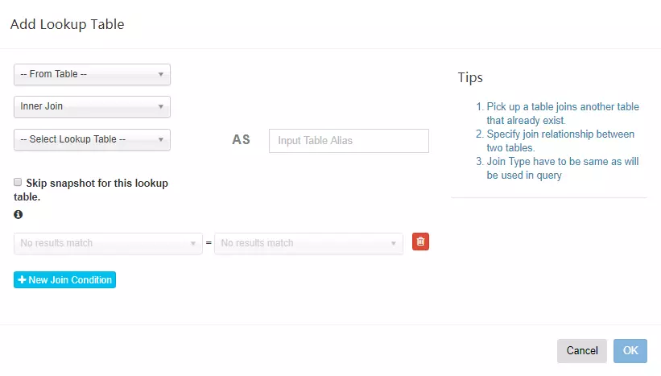
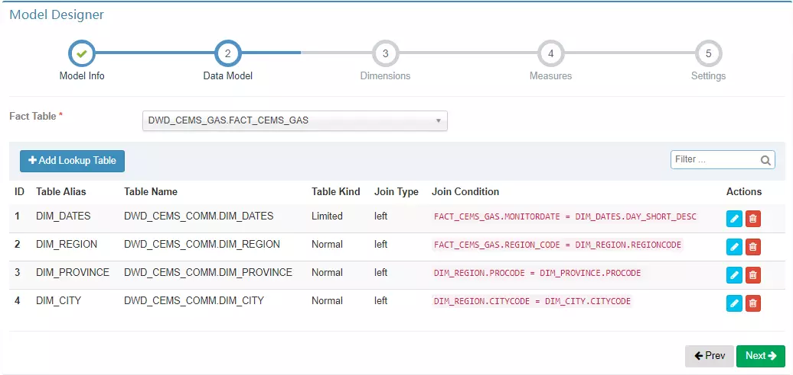
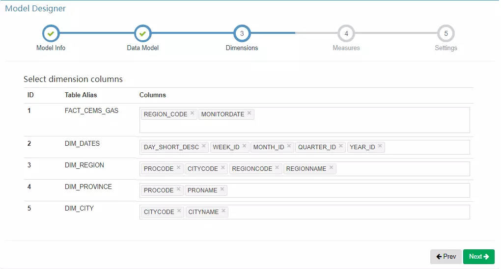
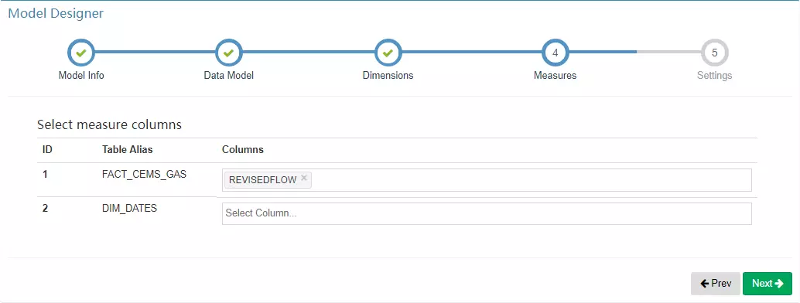
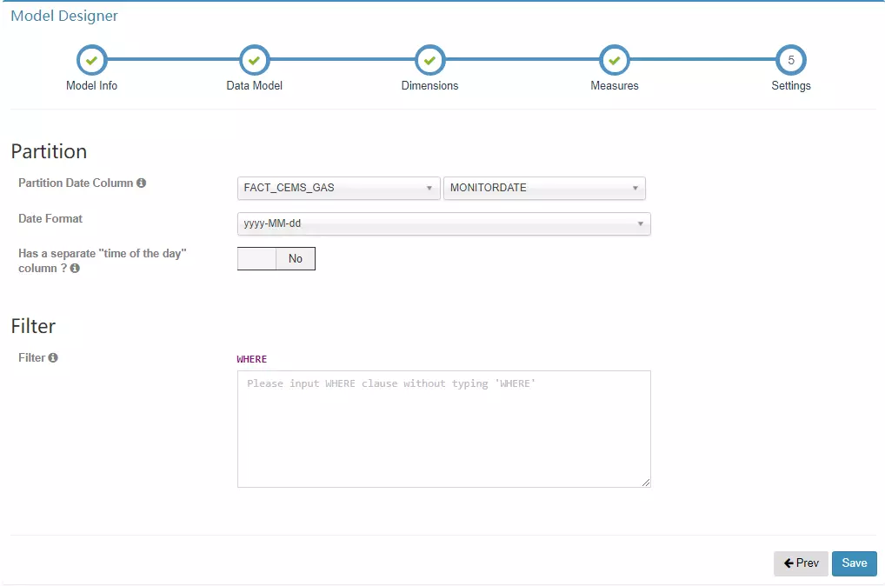
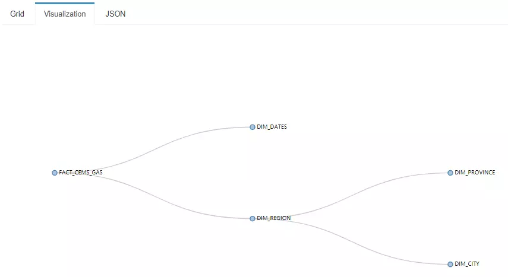

点击 “Models” 选项卡，可以看到项目已创建的 Models 以及 Cubes，点击 “+ New” 按钮，选择 “New Model” 即可打开创建 Model 的窗口。

### 1、Model Info

Model Info 主要是填写 Model 的基本信息，其中 “Model Name” 是必填项，模型名称有两点需要注意：

1. 模型名称是全局唯一的，也就是说即便新建了一个工程，你的模型名称也不能够重复；
2. 模型一旦创建后，模型名称无法被修改。

### 2、Data Model

Data Model 主要是构建整体的数据模型，无论数据是星型模型或者是雪花模型，需要在这个地方建立数据表之间的关系。

#### 2.1、选择事实表

建立数据模型的第一步是选择事实表，选择完成后点击 “Add Lookup Table” 按钮设置事实表与维度表之间的关系。 

#### 2.2、建立数据关系

对 “Add Lookup Table” 页面的几点说明：

1. 数据关系不仅仅是事实表与维度表之间（星型模型），维度表和维度表之间（雪花模型）也可以建立联系；
2. 表与表之间的连接添加有三种：“Left Join”、“Inner Join”、“Right Join”；
3. `Skip snapshot for this lookup table` 选项指的是是否跳过生成 snapshotTable，由于某些 Lookup 表特别大（大于 300M），如果某一个维度的基数比较大 ，可能会导致内存出现 OOM，所以在创建 snapshotTable 的时候会限制原始表的大小不能超过配置的一个上限值（`kylin.snapshot.max-mb`，默认值300）;
4. **跳过构建 snapshot 的 lookup 表将不能搜索，同时不支持设置为衍生维度（Derived）**；
5. 大部分情况下都是使用 “Left Join”，其他两种 Join 方式不是很常用。

#### 2.3、完成表关系构建

通过上述的操作即可将事实表以及维度表联系起来，构成一个数据模型。

### 3、Dimensions

在 Dimensions 页面选择**可能参与计算**的维度，这里被选择的只是在 Cube 构建的时候拥有被选择资格的维度，并不是最后参与 Cube 构建的维度，**推荐将维度表中的字段都选择上**。

> 一般而言，日期、商品种类、区域等会作为维度。

### 4、Measures

在 Measures 页面选择**可能用于计算**的度量。

> 一般而言，销售额、流量、温湿度等会作为度量。

### 5、Settings

在 Settings 页面可以设置分区以及过滤条件，其中分区是为了系统可以**进行增量构建而设计**的，目前 Kylin 支持基于日期的分区，在 “Partition Date Column” 后面选择事实表或者维度表中的日期字段，然后选择日期格式即可；过滤条件设置后，Kylin 在构建的时候会选择符合过滤条件的数据进行构建。

需要注意的几点：

1. 时间分区列可以支持日期或更细粒度的时间分区；
2. 时间分区列支持的数据类型有 `time/date/datetime/integer`等；
3. 过滤条件不需要写 `WHERE`；
4. 过滤条件不能包含日期维度。

### 6、Save

最后保存即可完成 Model 的创建，你可以打开 Model 中的 Visualization 标签页查询模型的表连接情况。

## 三、Snapshot Table

每一个 Snapshot 是和一个 Hive 维度表对应的，生成的过程是：

1. 从原始的hive维度表中顺序得读取每一行每一列的值;
2. 使用 TrieDictionary 方式对这些所有的值进行编码（一个值对应一个 Id）；
3. 再次读取原始表中每一行的值，将每一列的值使用编码之后的 Id 进行替换，得到了一个只有 Id 的新表；
4. 同时保存这个新表和 Dictionary 对象（Id 和值的映射关系）就能够保存整个维度表；
5. Kylin 将这个数据存储到元数据库中。