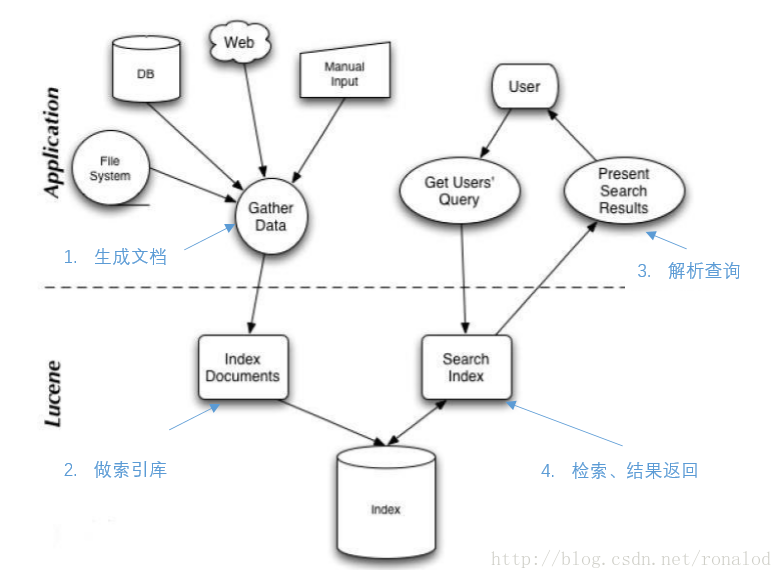
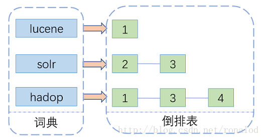
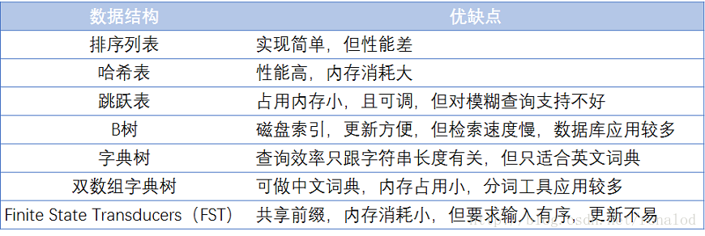
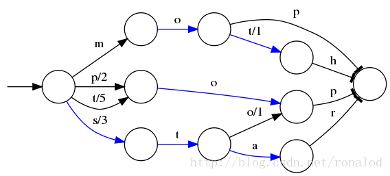
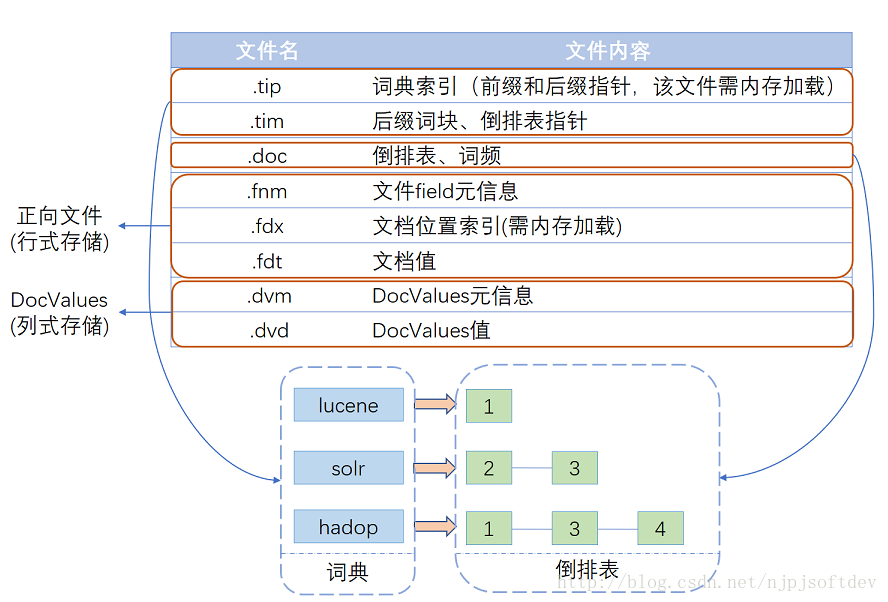

<!--
 * @Github       : https://github.com/superzhc/BigData-A-Question
 * @Author       : SUPERZHC
 * @CreateDate   : 2020-05-09 15:27:31
 * @LastEditTime : 2020-11-30 17:49:42
 * @Copyright 2020 SUPERZHC
-->
# Lucene

## 简介

Lucene 最初由鼎鼎大名 Doug Cutting 开发，2000 年开源，现在也是开源全文检索方案的不二选择，它的特点概述起来就是：全 Java 实现、开源、高性能、功能完整、易拓展，功能完整体现在对分词的支持、各种查询方式（前缀、模糊、正则等）、打分高亮、列式存储（DocValues）等等。

而且 Lucene 一直保持着一个活跃的开发度，以适应着日益增长的数据分析需求，最新的 6.0 版本里引入 block k-d trees，全面提升了数字类型和地理位置信息的检索性能，另基于 Lucene 的 Solr 和 ElasticSearch 分布式检索分析系统也发展地如火如荼。

Lucene 整体使用如图所示：

## 概念

### Index-索引

- 在 Lucene 中一个索引是放在一个文件夹中的，一个索引就是多个 Document 的集合
- 同一个索引目录中的所有文件构成一个 Lucene 索引
- 一个索引其实就是多个 Document 的集合

### Document-文档

- 文档是构建索引的基本单位，索引中的每个 Document 就好比数据库表中的每条记录（虽然不是一个概念，但可以这样类比去理解）
- 新添加的文档是单独保存在一个新生成的段文件中

### Field-域

- 一个 Document 其实就是一个 Field 的集合，每个 Field 就好比数据库表中的每个字段 column
- 不同 Field 可以分别存储不同信息，以及拥有各自不同的存储方式

### Segment-段

- 当添加一个新文档就会生成一个新的段，并且也会触发段文件合并
- 一个索引可以包含多个段文件，段与段之间是相互独立的
- 段文件里记录了索引中包含多少个段，每个段包含多少个文档
- 索引可以由多个子索引构成，这个子索引便叫做段

### Term-词

- 每个 Field 的域值经过分词器处理后得到的每一项称作 Term
- 它是索引中的最小单位
- 在两个不同 Field 中的同一个字符串被认为是不同的 Term
- Field 的域值经过序列化（tokenized）成 Term 集合（Terms）

## 索引原理

全文检索技术由来已久，绝大多数都基于倒排索引来做的。倒排索引相当于一篇文章包含了哪些词，它从词出发，记载了这个词在哪些文档中出现过，由两部分组成——**词典（Term Dictionary）**和**倒排表**。

其中词典结构尤为重要，有很多种词典结构，各有各的优缺点，最简单如排序数组，通过二分查找来检索数据，更快的有哈希表，磁盘查找有 B 树、B+ 树，但一个能支持 TB 级数据的倒排索引结构需要在时间和空间上有个平衡，下图列了一些常见词典的优缺点：

Lucene 现在使用的索引结构是 FST 数据结构。

### FST

## 索引实现

Lucene经多年演进优化，现在的一个索引文件结构如图所示，基本可以分为三个部分：词典、倒排表、正向文件、列式存储DocValues。

### 词典索引结构

TODO

### 倒排表结构

倒排表就是文档号集合，Lucene现使用的倒排表结构叫Frame of reference,它主要有两个特点：

1. 数据压缩
2. 跳跃表加速合并，因为布尔查询时，and 和or 操作都需要合并倒排表，这时就需要快速定位相同文档号，所以利用跳跃表来进行相同文档号查找

### 正向文件

正向文件指的就是原始文档，Lucene对原始文档也提供了存储功能，它存储特点就是分块+压缩。

- fnm中为元信息存放了各列类型、列名、存储方式等信息
- fdt文件就是存放原始文档的文件，它占了索引库90%的磁盘空间
- fdx文件为索引文件，通过文档号（自增数字）快速得到文档位置

### DocValues

虽然倒排索引能够解决从词到文档的快速映射，但需要对检索结果进行分类、排序、数学计算等聚合操作是需要文档号到文档值得快速映射，而原先不管是倒排索引还是行式存储的文档都无法满足要求，因此在4.0后Lucene推出了DocValues来解决这一问题（注：4.0版本之前，用的是一种FieldCache来实现的）。

## 参考

- [Lucene底层原理和优化经验分享(1)-Lucene简介和索引原理](https://blog.csdn.net/njpjsoftdev/article/details/54015485)
- [Lucene底层原理和优化经验分享(2)-Lucene优化经验总结](https://blog.csdn.net/njpjsoftdev/article/details/54133548)