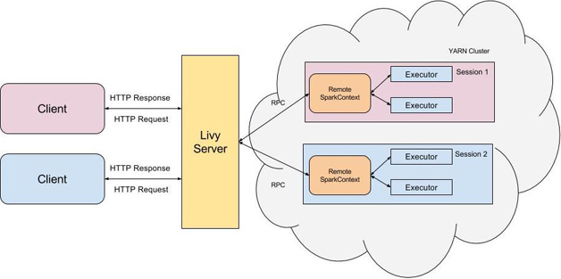

# Livy

`Livy` 是 Apache 的开源项目，目前仍然处于孵化阶段。它提供了一种通过 RESTful 接口执行交互式 spark 任务的机制。

## 简介

提交 spark 任务一般有两种方式：

- 通过 `spark shell` 编写交互式的代码
- 通过 `spark submit` 提交编写好的 jar 包到集群上运行，执行批处理任务

Livy 是一个典型的REST服务架构，一方面接收并解析用户的REST请求，转换成相应的操作；另一方面管理着用户所启动的所有 spark 集群。其架构如下图所示：

用户可以以 RESTful 请求方式通过 Livy 启动一个会话(session)，一个会话是由一个 spark 集群所构成的，并且通过 RPC 协议在 spark 集群和 Livy 服务端之间进行通信。根据处理交互方式不同，Livy 将会话分为两种类型:

1. **交互式会话(interactive session)**:跟spark的交互处理相同，在启动会话后可以接收用户所提交的代码片段,提交至远程的spark集群编译并执行
2. **批处理会话(batch session)**:用户可以通过livy以批处理的方式启动spark应用,这样的一个方式在Livy中称之为批处理会话，与spark中的批处理是相同的