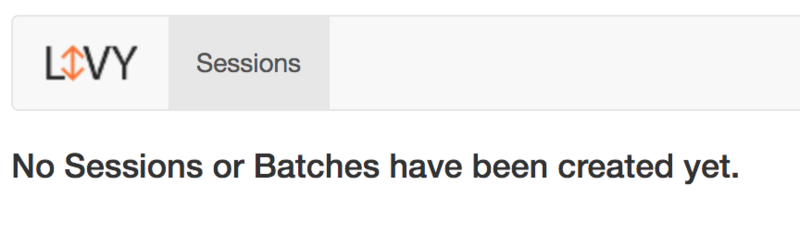

选一台Hadoop集群中的机器，从 [Livy](http://livy.incubator.apache.org/) 官网下载livy：

```bash
wget https://mirrors.tuna.tsinghua.edu.cn/apache/incubator/livy/0.7.0-incubating/apache-livy-0.7.0-incubating-bin.zip
```

> Livy 依赖 spark，所以另外需要下载和解压好 spark

设置好 spark 环境，例如

```bash
export SPARK_HOME=/home/spark-2.4.1-bin-hadoop2.7
```

设置好hadoop环境，例如

```bash
export HADOOP_CONF_DIR=/etc/hadoop/conf
```

运行 livy：

```bash
bin/livy-server start
```

> ***注意***：
>
> 若 Hadoop 开启了kerberos认证，需要配置一下Kerberos，否则会报错：
>
> ```bash
> cp conf/livy.conf.template conf/livy.conf
> vi conf/livy.conf
> # 增加如下两行
> livy.server.launch.kerberos.principal=spark1@xxxxx.COM
> livy.server.launch.kerberos.keytab=/var/keytab/spark1.keytab
> ```

Livy启动后，默认监听端口为8998，通过web访问这个端口：



