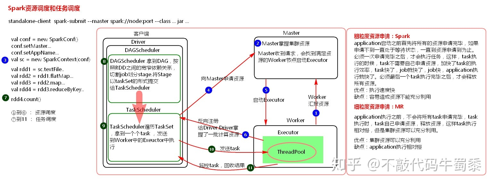

## 概述

Spark 最初由美国加州大学伯克利分校（UC Berkeley）的 AMP 实验室于 2009 年开发，是**基于内存计算的大数据并行计算框架，可用于构建大型的、低延迟的数据分析应用程序**。

Spark 具有如下几个主要特点：

- **运行速度快**：Spark 使用先进的 **有向无环图（Directed Acyclic Graph，DAG）** 执行引擎，以支持循环数据流与内存计算，基于内存计算的执行速度比 MapReduce 快上百倍，基于磁盘的执行速度也能快上十倍【备注:[Spark比MapReduce快的原因](Spark/Spark比MapReduce快的原因.md)】

- **容易使用**：Spark 支持使用 Scala、Java、Python 和 R 语言进行编程，简洁的 API 设计有助于用户轻松构建并行程序，并且可以通过 Spark Shell 进行交互式编程

- **通用性**：Spark 提供了完整而强大的技术栈，包括 SQL 查询、流式计算、机器学习和图算法组件，这些组件可以无缝整合在同一个应用中，足以应对复杂的计算

- **运行模式多样**：Spark 可运行于独立的集群模式中，或者运行于 Hadoop 中，也可运行在云环境中，并且可以访问 HDFS、Cassandra、HBase、Hive 等多种数据源

## Spark 生态系统

Spark 的设计遵循“*一个软件栈满足不同应用场景*” 的理念，逐渐形成了一套完整的生态系统，即能够提供内存计算框架、也可以支持 SQL 即席查询、实时流式计算、机器学习和图计算等。Spark 可以部署在资源管理器 YARN 之上，提供一站式的大数据解决方案。

Spark 的生态系统主要包含了 `Spark Core`、`Spark SQL`、`Spark Streaming`、`MLlib` 和 `GraphX` 等组件，各个组件的具体功能如下：

- `Sprak Core`：Spark Core  包含 Spark 最基础和最核心的功能，如内存计算、任务调度、部署模式、故障恢复、存储管理等，主要面向批数据处理。Spark Core 建立在统一的抽象 RDD 之上，使其可以以基本一致的方式应对不同的大数据处理场景；需要注意的是，Spark Core 通常被简称为 Spark
- `Spark SQL`：Spark SQL 是用于结构化数据处理的组件，允许开发人员直接处理 RDD，同时也可以查询 Hive、HBase 等外部数据源。Spark SQL 的一个重要特点是其能够统一处理关系表和 RDD，使得开发人员不需要自己编写 Spark 应用程序，开发人员可以轻松地使用 SQL 命令进行查询，并进行更复杂的数据分析
- `Spark Streaming`：Spark Streaming 是一种流计算框架，可以支持高吞吐量、可容错处理的实时流数据处理，其核心思路是将流数据分解成一系列短小的批处理作业，每个短小的批处理作业都可以使用 Spark Core 进行快速处理。Spark Streaming 支持多种数据输入源，如 Kafka、Flume 和 TCP 套接字等
- `MLlib`：MLlib 提供了常用机器学习算法的实现，包括聚类、分类、回归、协同过滤等，降低了机器学习的门槛，开发人员只要具备一定的理论知识就能进行机器学习方面的工作
- `GraphX`（图计算）：GraphX 是 Spark 中用于图计算的 API，可认为是 Pregel 在 Spark 上的重写及优化，GraphX 性能良好，拥有丰富的功能和运算符，能在海量数据上自如地运行复杂的图算法

注：无论是 Spark SQL、Spark Streaming、MLlib 还是 GraphX，都可以使用 Spark Core 的 API 处理问题，它们的方法几乎是通用的，处理的数据也可以共享，不同应用之间的数据可以无缝集成。

**Spark 的应用场景**

|         应用场景         |   时间跨度   |       其他框架        | Spark 生态系统中的组件 |
| :----------------------: | :----------: | :-------------------: | :--------------------: |
|    复杂的批量数据处理    |    小时级    |    MapReduce、Hive    |       Spark Core       |
| 基于历史数据的交互式查询 | 分钟级、秒级 | Impala、Dremel、Drill |       Spark SQL        |
| 基于实时数据流的数据处理 | 毫秒级、秒级 |       Storm、S4       |    Spark Streaming     |
|  基于历史数据的数据挖掘  |      -       |        Mahout         |         MLlib          |
|     图结构数据的处理     |      -       |     Pregel、Hama      |         GraphX         |

## Spark 体系架构

**Spark基本概念**

- `Application`： 用户自己写的 Spark 应用程序，批处理作业的集合。Application 的 main 方法为应用程序的入口，用户通过 Spark 的 API，定义了 RDD 和对 RDD 的操作。
- `SparkContext`： Spark 最重要的 API，用户逻辑与 Spark 集群主要的交互接口，它会和 Cluster Master 交互，包括向它申请计算资源等。
- `Driver 和 Executor`：Spark 在执行每个 Application 的过程中会启动 Driver 和 Executor 两种 JVM 进程。Driver 进程为主控进程，负责执行用户 Application 中的 main 方法，提交 Job，并将 Job 转化为 Task，在各个 Executor 进程间协调 Task 的调度。运行在 Worker上 的 Executor 进程负责执行 Task，并将结果返回给 Driver，同时为需要缓存的 RDD 提供存储功能。

**资源管理**

一组计算机的集合，每个计算机节点作为独立的计算资源，又可以虚拟出多个具备计算能力的虚拟机，这些虚拟机是集群中的计算单元。Spark 的核心模块专注于调度和管理虚拟机之上分布式计算任务的执行，集群中的计算资源则交给 Cluster Manager 这个角色来管理，Cluster Manager 可以为自带的Standalone、或第三方的 Yarn和 Mesos。

Cluster Manager 一般采用 Master-Slave 结构。以 Yarn 为例，部署 ResourceManager 服务的节点为 Master，负责集群中所有计算资源的统一管理和分配；部署 NodeManager 服务的节点为Slave，负责在当前节点创建一个或多个具备独立计算能力的 JVM 实例，在 Spark 中，这些节点也叫做 Worker。

另外还有一个 Client 节点的概念，是指用户提交Spark Application 时所在的节点。

**弹性分布式数据集(RDD)**

弹性分布式数据集(RDD)是 Spark 框架中的核心概念。可以将 RDD 视作数据库中的一张表。其中可以保存任何类型的数据。Spark 将数据存储在不同分区上的 RDD 之中。

RDD 可以帮助重新安排计算并优化数据处理过程。

此外，它还具有容错性，因为RDD知道如何重新创建和重新计算数据集。

RDD 是不可变的。你可以用变换（Transformation）修改 RDD，但是这个变换所返回的是一个全新的RDD，而原有的 RDD 仍然保持不变。

RDD 支持两种类型的操作：

- `变换（Transformation）`变换的返回值是一个新的 RDD 集合，而不是单个值。调用一个变换方法，不会有任何求值计算，它只获取一个 RDD 作为参数，然后返回一个新的 RDD。 变换函数包括：map，filter，flatMap，groupByKey，reduceByKey，aggregateByKey，pipe和coalesce。
- `行动（Action）`行动操作计算并返回一个新的值。当在一个 RDD 对象上调用行动函数时，会在这一时刻计算全部的数据处理查询并返回结果值。 行动操作包括：reduce，collect，count，first，take，countByKey 以及 foreach。

## Spark 运行架构

Spark 运行架构指的也就是 Spark Core 的运行架构。

- [Spark运行架构](Spark/Spark运行架构.md) 

## Spark 安装部署

 [Spark安装和使用](Spark/Spark安装和使用.md) 

 [Spark的部署模式](Spark/Spark的部署模式.md) 

 [Spark和Hadoop的统一部署](Spark/Spark和Hadoop的统一部署.md) 

## Spark 开发

> 应用开发者可以用标准的 API 接口创建基于 Spark 的应用，目前 Spark 提供了 [Scala](https://link.juejin.im/?target=http%3A%2F%2Fspark.apache.org%2Fdocs%2Flatest%2Fapi%2Fscala%2Findex.html%23org.apache.spark.package)，[Java](https://link.juejin.im/?target=http%3A%2F%2Fspark.apache.org%2Fdocs%2Flatest%2Fapi%2Fjava%2Findex.html"Java") 和 [Python](https://link.juejin.im/?target=http%3A%2F%2Fspark.apache.org%2Fdocs%2Flatest%2Fapi%2Fpython%2Findex.html"Python") 三种程序设计语言的 API。

 [Spark引入](Spark/Spark引入.md) 

## Spark 解析

### Spark 的资源调度和任务调度

Spark资源调度流程图：

流程详解如下：

集群启动之后，Worker节点会向Master节点汇报资源情况，Master就掌握了集群资源情况。
当Spark提交一个Application后，会根据RDD之间的依赖关系将Application形成一个DAG有向无环图。任务提交之后，Spark会在Driver端创建两个对象：DAGScheduler和TaskScheduler
DAGScheduler是任务调度的高层调度器，是一个对象。DAGScheduler的主要作用就是将DAG根据RDD之间的宽窄依赖关系划分为一个个的Stage，然后将这些Stage以TaskSet的形式提交给TaskScheduler(TaskScheduler是任务调度的低层调度器，这里TaskSet其实就是一个集合，里面封装的就是一个个的task任务,也就是stage中的并行度task任务)
TaskSchedule会遍历TaskSet集合，拿到每个task后会将task发送到计算节点Executor中去执行（其实就是发送到Executor中的线程池ThreadPool去执行）。
task在Executor线程池中的运行情况会向TaskScheduler反馈，当task执行失败时，则由TaskScheduler负责重试，将task重新发送给Executor去执行，默认重试3次。如果重试3次依然失败，那么这个task所在的stage就失败了。stage失败了则由DAGScheduler来负责重试，重新发送TaskSet到TaskSchdeuler，Stage默认重试4次。如果重试4次以后依然失败，那么这个job就失败了。job失败了，Application就失败了。因此一个task默认情况下重试3*4=12次。
TaskScheduler不仅能重试失败的task,还会重试straggling（落后，缓慢）task（也就是执行速度比其他task慢太多的task）。如果有运行缓慢的task那么TaskScheduler会启动一个新的task来与这个运行缓慢的task执行相同的处理逻辑。两个task哪个先执行完，就以哪个task的执行结果为准。这就是Spark的推测执行机制。在Spark中推测执行默认是关闭的。推测执行可以通过spark.speculation属性来配置。
注意：

1.对于ETL类型要入数据库的业务要关闭推测执行机制，这样就不会有重复的数据入库

2.如果遇到数据倾斜的情况，开启推测机制则有可能导致一直会有task重新启动处理相同的逻辑，任务可能一直处于处理不完的状态

二、粗粒度资源申请和细粒度资源申请

粗粒度资源申请（Spark）：

在Applicatioin执行之前，将所有的资源申请完毕，当资源申请成功后，才会进行任务的调度，当所有的task执行完成后，才会释放这部分资源。

优点：在Application执行之前，所有的资源都申请完毕，每一个task直接使用资源就可以了，不需要task在执行前自己去申请资源，task启动就快了，stage执行就快了，job就快了，application执行就快了

缺点：直到最后一个task执行完成才会释放资源，集群的资源无法充分利用

细粒度资源申请（MapReduce）：

Application执行之前不需要先去申请资源，而是直接执行，让job中的每一个task在执行前自己去申请资源，task执行完成后，就释放资源

优点：集群资源可以充分利用

缺点：task自己去申请资源，task启动变慢，Application的运行就相应的变慢了。